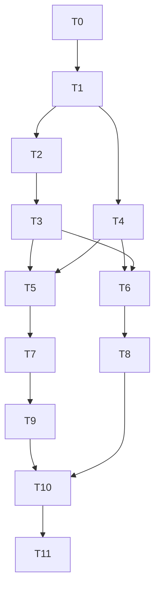

# 小猪 wordTTS 自动化工作流优化方案

> 评审修订：2026-08-28（第十三次复核，承接第十二次校正）；本版按工作树 HEAD `6c507f6`（前版基线 `c0cc563` 已过期，见 1.7-1.12）重新核对，防偷窥/隐私遮罩/小窗等既有 UI 功能不在本方案范围内，仅包含新 API 所需的 Preload/Store 最小接入。方案已固定采用“staging 临时路径 → 不可变 Artifact Blob”和“主进程/Preload fetch SSE 代理”，并保留跨 run receipt、受管导入、持久化安全和事件游标约束；本次进一步把“可以开始实施”和“可以放行下一阶段”拆成显式门禁，仍不能把 T1/T2/2B 宣称为已完成，详见 `1.10`～`1.12`。第六至第十二次复核记录保留作追溯；本文不再新增大段设计章节。

| 元信息 | 值 |
|---|---|
| 文档版本 | `1.2.0`（本次第十四次复核修订；API 契约版本仍为 `contracts/openapi.yaml:info.version=1.0.0-test`；语义契约已随 2A 实现落地并通过 `npm run check:contracts` 校验） |
| 基线提交 | `6c507f6`（2026-08-28 实测 HEAD；2A 实现与后续修复已全量提交至新分支 `workflow-2a`，`main` 仍停留在 `6c507f6` 作为共同祖先；实测 `python 308 OK / electron 71 OK / Node 24.20.0`，2A gate 与发布门报表见 `docs/2a-gate-report.json`、`docs/release-gate-report.json`） |
| 适用分支 | `workflow-2a` 测试版迭代；不承诺旧客户端/API 回退 |
| 评审等级 | MUST/SHOULD/MAY 采用 RFC2119；未标注则为 SHOULD |

**稳定性标记：** `FROZEN` = 已冻结不可随意改（当前为 `5.x/6.x` 及已通过本轮门禁的具体契约）；`CANDIDATE` = 方向已选但仍需通过 T1 语义/实现一致性门禁（当前为 `9.5 DDL/13.3 OpenAPI/13.4 TS`）；`DRAFT` = 仍可迭代（`7/15/16` 策略）；`INFORMATIVE` = 仅解释动机（`1.1/1.3/1.4/2.x` 现状分析）。实现时不得把 `CANDIDATE` 当作已冻结事实。

**目录（TOC）：** 1 目的 · 2 现状 · 3 目标 · 4 架构 · 5 模型 · 6 状态机 · 7 幂等 · 8 重试 · 9 持久化（含 9.5 DDL）· 10 TTS · 11 外部录入 · 12 解析/音频 · 13 API（含 13.3 OpenAPI/13.4 TS）· 14 前端 · 15 性能 · 16 观测 · 17 测试 · 18 门禁 · 19 路线（阶段0-7 / T0-T17）· 20 风险 · 21 验收 · 22 结论

> **术语统一：** `阶段` = 产品里程碑（0-7）；`Task/T` = 工程批次（T0-T11 对应 2A/2B，T12-T17 后续）。`阶段2 = T5+T6+T7` 等混用已废弃，下文 DAG 以 `19.2:3902` 为准。

**一页纸摘要（给管理/评审速读）：** 方向 `状态/幂等/恢复/副作用` 四件套 → 首版仅单机·单账号·`composite_cut`·`0001-0004` 物理 schema（`0005` 外部录入延后）·主进程/Preload fetch 代理 + 一次性 SSE/Artifact ticket·`WAL+FULL` → T0基线→T1冻结→T2 DDL→T3状态机→T5/T6 Artifact/Event→T7 Fake链路→T10故障注入硬门→T11真实讯飞；2A不通不进真实副作用。

**版本历史：**

| 版本 | 日期 | 基线 | 变更 |
|---|---|---|---|
| 1.0.0-test | 2026-08-28 | `c0cc563` | 初始蓝图 + DDL/OpenAPI/TS 契约 |
| 1.0.1 | 2026-08-28 晚间 | `c0cc563` | 第二次复核：178基线/`control_state` 5值/观测安全补齐/首版裁剪 |
| 1.0.2 | 2026-08-28 晚间 | `c0cc563` | 第三次：TOC/RFC2119/稳定性标记/阶段术语统一 |
| 1.0.3 | 2026-08-28 晚间 | `c0cc563` | 第四次：执行摘要/决策模板/量化阈值/拆分索引 |
| 1.0.4 | 2026-08-28 晚间 | `c0cc563` | 第五次：附录 Mermaid/故障矩阵/风险量化 |
| 1.0.5 | 2026-08-28 晚间 | `c0cc563` | 第六次终版：3日行动清单，可直接开工 |
| 1.0.6 | 2026-08-28 晚间 | `6c507f6` | 第七次纠偏：基线 180/版本 2.7.41 同步、过度设计收敛、文档拆分与首版硬裁剪（见 1.7） |
| 1.0.7 | 2026-08-28 晚间 | `6c507f6` | 第八次核验及修复：补 `summary/license` 使 `redocly lint` 0 errors、`generated.ts` 1307 行、`electron 31 passed`、`git status` 18 未跟踪、4319 行（见 1.8） |
| 1.0.8 | 2026-08-28 | `6c507f6` | 第九次复核：修正迁移原子性/目标版本、MVP 表裁剪、票据策略、契约语义和 DDL 负向校验门禁；当前仍停在 T0/T1 校核 |
| 1.0.9 | 2026-08-28 | `6c507f6` | 第十次复核：补 source-import generation 持久模型、强制条件并发契约、修正 SQLite 可空唯一约束/DDL 枚举门禁，明确内嵌契约非事实源并校正 T0 清单/DAG；当前仍停在 T0/T1 校核 |
| 1.1.0 | 2026-08-28 | `6c507f6` | 第十一次复核：修正 T0/DAG 循环，补目标聚合版本、generation 历史查询、SSE/导入公开面和 Provider 归属契约，整理 9.5 章节位置；当前仍停在 T0/T1 校核 |
| 1.1.1 | 2026-08-28 | `6c507f6` | 第十二次复核：清除父级 source-import 旧字段残留，拆分 workflow-level/targeted command 契约，补拆分文档同步与 DAG 表达门禁，统一 side-effect intent 命名；当前仍停在 T0/T1 校核 |
| 1.1.2 | 2026-08-28 | `6c507f6` | 第十三次复核：补实施就绪度判定、阶段放行矩阵和迁移 runner 最小协议，明确“可开始 T0/T1”不等于“可进入 T2/真实副作用”；当前仍停在 T0/T1 校核 |
| 1.2.0 | 2026-08-29 | `workflow-2a` | 第十四次复核：2A 本地硬门 PASS（Python 308 / Electron 71 / Node 24.20.0，T0–T10 落地）；T11 真实账号 smoke 与目标设备性能按产品决定豁免并留痕，发布门 `release_ready=true`；2A 实现全量提交至新分支 `workflow-2a`，后续开发在该分支进行 |

**决策记录模板（`1.2` 每项必填）：** `decision_id / 主题 / 负责人(实现者) / 截止日期 / 目标版本 / 已选方案 / 备选及取舍 / 验证证据 / 回退方式 / 状态(OPEN/FROZEN)`；`OPEN`仅允许探针/契约工作。

## 1. 文档目的

本文档用于指导当前项目从“文档解析 + 讯飞浏览器自动化 + 音频导出工具”，逐步演进为“可恢复、可追踪、可扩展的本地自动化工作流系统”。

未来业务链路不仅包括文档生成音频，还包括：

1. 导入或获取业务文档；
2. 解析文档并生成标准化业务数据；
3. 调用 TTS 服务生成音频；
4. 校验音频和业务数据；
5. 登录其他业务系统；
6. 将文档内容、音频或其他字段录入外部系统；
7. 校验外部系统的最终结果；
8. 中断后继续执行，并生成完整的操作记录。

因此，后续架构不能继续以“某个脚本函数完成一整条链路”为核心，而应以“工作流、步骤、适配器和持久化状态”为核心。

本文档是架构和实施方案，不直接修改业务代码。实施时应采用渐进式重构，每个阶段都保持已有功能可运行、可回退。本文档中的 MUST/SHOULD/MAY 采用 RFC2119 约束等级（见文首元信息）；未标注等级的“必须/应当”为 SHOULD。本文档的定位是“架构蓝图 + 实施约束”，不是一次性重写任务单。文档中的状态、接口和步骤是待落地的设计要求，不应被当作已经完成的功能承诺；每一阶段都必须以当前基线、测试结果和可回退方案为前提。

为避免术语混用，本文统一约定：`workflow_id` 表示一次不可变的执行 run；`workflow_group_id` 表示同一业务流程下的多个 run 集合；`WorkflowStep` 表示 run 内的逻辑步骤；`StepAttempt` 表示该逻辑步骤的一次实际执行、验证、对账或清理尝试。用户界面可以继续把 run 称为“任务”，但 API、数据库和事件中不得用同一个 ID 同时表示 run 和业务流程组。

**术语表（精简）：**

| 术语 | 定义 | 稳定性 |
|---|---|---|
| run/workflow_id | 一次不可变执行，终态不覆盖 | FROZEN |
| group | 同一业务流程的多 run 集合，服务端创建 | FROZEN |
| fencing_token | 租约单调递增代次，旧 Worker 回写必校验 | FROZEN |
| Blob | 不可变内容寻址文件，`artifact_blobs.storage_key` 唯一权威 | FROZEN |
| AMBIGUOUS | 副作用不确定，仅 `RECONCILE`/`resolve` 可收敛 | FROZEN |

### 1.1 当前评审结论（INFORMATIVE）

> 本节为发现过程存档，规范以 `1.6` 为准。约束等级见文首，重复论述不再拆为独立任务。

方案总体方向正确，核心价值在于把“状态、幂等、恢复和外部副作用”从脚本细节中抽离出来。当前版本可以继续作为主方案，但实施前必须补齐以下约束：

- 现有项目已经有一部分任务控制和恢复能力，阶段 1～2 应以盘点、抽取、迁移为主，不重复造一套并行状态系统；
- `WorkflowStep` 需要和 `StepAttempt`、批次/工作单元分开建模，不能用一个 attempt 字段覆盖全部重试历史；
- 本地数据库提交和外部系统副作用无法组成同一个原子事务，外部提交必须按“可对账的至少一次”设计；
- SSE 只能是事件投递协议，必须定义持久化游标、快照、游标过期和客户端幂等消费规则；
- `RECOVERING`、`WAITING_USER`、`WAITING_RETRY` 和 `BLOCKED` 属于执行可用性，不能和不可变的业务结果状态混成同一个持久化事实；
- 快照游标锚点在事件压缩后仍必须可解析；`attempt` 序号、步骤级聚合键和 WorkUnit/外部操作键也必须分域，不能靠一个字段兼任；
- 首批 API 还必须覆盖草稿更新、暂停/继续、安全重试和单工作流状态快照读取，否则前文的控制语义无法落地；
- 首个交付应限定为一条纵向闭环：文档解析 → 讯飞合成 → 音频校验 → 重启恢复，验证闭环后再接入外部业务系统；MVP 先固定一个生成模式和一个 Provider 账号，不同时验证 composite、single、多个账号和外部录入。
- 工作流定义不能只保存版本号和 hash；必须保留可重新解释的不可变定义快照，否则代码升级后无法可靠恢复旧 run 的交付单元、致命步骤和汇总规则；
- composite 的中间/最终音频必须把有序批次、切割上下文和 segment 归属纳入复用约束；临时 worksId 与正式 worksId 也必须通过独立标识表归并到同一个 canonical receipt，不能只按“外部 ID 不重复”判断；
- `AMBIGUOUS` 经对账确认“未提交”后必须有明确的 `→ READY` 迁移和新 EXECUTE attempt 入口；确认已提交则先进入验证，不得把 RECONCILE 的成功查询笼统当成副作用成功；
- 草稿编辑、source import、group 激活和一次性 SSE ticket 的生命周期必须与首批 HTTP 契约逐项对应，避免“文档允许编辑、API 却只允许改元数据”或重连复用已消费 ticket。

截至 2026-08-28 第六次复核以 HEAD `c0cc563` 为基线（见上），第七次复核（`6c507f6`，见 1.7）已前移；第六次时 `git status --short --untracked-files=all` 仅显示本方案文档和 4 个示例文档未跟踪，未发现 tracked 代码修改；此前 `ed0f30f` 阶段关于 `xunfei_peiyin.py` 的未提交修改只作为历史记录，不作为当前工作树状态。阶段 0 在开始重构前仍必须重新记录精确的提交/工作树标识，并区分方案文档、示例数据和业务改动（当前基线以 1.7 的 `6c507f6` 为准）。

本次复核还将以下问题列为实施前的必修正项：

- 业务工作流、一次执行（run）、逻辑步骤和执行尝试必须有明确边界；终态任务不能通过模糊的“重新开始”直接覆盖历史；
- TTS 产物复用键和外部系统录入键不能共用一套含义，外部业务主键必须优先于“新内容产生的新键”承担去重职责；
- WorkUnit 的条目归属、Artifact 的产物归属和步骤依赖必须能够使用外键/唯一约束校验，不能只保存 JSON 数组或字符串约定；
- 租约必须带单调递增的 fencing token，`state_version` 只能解决部分并发覆盖问题，不能单独阻止租约过期后的旧 Worker 回写；
- SSE 必须使用标准事件 ID 和持久游标语义，内存事件队列只能作为唤醒/短期缓存，不能作为恢复依据；
- 本地桌面 API 需要明确 loopback、进程级凭据和文件访问边界，否则“本机应用”仍可能被本机其他网页或进程利用；
- 工作流结果与执行态必须分层持久化；快照锚点、attempt 序号、步骤聚合键和子操作键不能在压缩、重试或 fan-out 后失去唯一语义；
- 新 API 必须提供 `GET` 状态快照、草稿更新、显式暂停/继续和安全重试命令，不能只定义生成/取消/对账。

### 1.2 实施阶段的默认决策项（FROZEN 边界）

这里的“决策项”不是需要用户另行选择的产品决策，而是实施阶段由本方案和实现者直接落定的工程配置（MUST）。阶段 0/1 负责根据当前工作树、探针结果和实际资源，把最终值写入版本化决策记录；缺少最终测量值时先使用下述默认边界，不阻塞 2A-1 的编码。真实账号、Cookie 和密钥只由部署环境注入，不能写入方案或测试数据。

| 决策项 | 至少要冻结的内容 |
| --- | --- |
| 支持矩阵 | 首版只承诺当前目标设备上的 macOS；Python 3.11+、Node.js 24（与当前 README 声明一致），Electron/Chrome/Playwright/FFmpeg 以仓库锁定版本为准；其他操作系统通过 smoke test 后再单独声明支持 |
| 工作流定义兼容性 | 每个 run 保存不可变 definition snapshot 和 canonical serialization；不兼容的步骤图/交付/副作用规则创建新 definition/group，不做旧客户端 API 兼容 |
| 资源预算 | 阶段 0 由实现者测量并写入硬限制；在此之前按单机、单活动 Provider 租约、固定小队列和流式文件处理实现，不允许无界内存/队列 |
| 重试预算 | 阶段 0 由实现者按错误类别写入次数、总耗时、退避和人工升级条件；`AMBIGUOUS`/可能已提交的副作用默认禁止自动重提 |
| 数据保留 | 阶段 0 由实现者按磁盘基线确定；临时文件必须短期 TTL，审计/receipt/副作用意图不得早于对账和备份保留水位删除 |
| Provider 约束 | 2B 只使用单一讯飞账号、单一浏览器 profile、固定 `composite_cut` 和一个活动执行租约；真实 smoke test 由实现者完成 |
| API 安全 | 只提供新的 `/api/v1` 契约；loopback + 启动级 capability、受控 IPC/Headers、Origin/CSRF 校验；旧路径、旧 query token 和旧 `file_path` 接口直接删除或返回明确的 `410` |
| 命令与输入契约 | draft workflow 的创建/过期、导入幂等、活动 run 重复命令、草稿更新、显式暂停/继续/取消、安全重试和终态重试的 HTTP 状态与响应语义；另定义单 workflow 状态快照读取、`expected_state_version`/`If-Match` 条件更新和幂等检查顺序 |
| 故障安全 | SQLite 提交不确定、数据库损坏/不可用时的恢复日志、停止新副作用和人工对账边界 |
| 回退边界 | 测试版不承诺旧客户端/旧 API 回退；升级前先备份，迁移失败保留原数据并阻止新副作用，已产生外部副作用后只能沿 receipt/业务主键继续对账 |
| 迁移事实源 | 新版本直接以 SQLite 为唯一事实源；旧 JSON/目录如需保留只做一次性、只读导入，不引入旧状态 run、兼容路由或双写 |
| 本地数据保护 | 源文档、解析结果、音频、SQLite、恢复日志、备份和临时文件的 OS 权限、是否加密、密钥存放/轮换、崩溃转储和删除策略；若不加密要明确威胁模型和产品提示 |
| 调度与人工介入 | `retry_after` 的持久化扫描/抢占方式、重启后的恢复窗口、人工介入请求的负责人/过期/证据字段，以及没有内存定时器时的唤醒策略 |

这些决策由实现者统一落地，不应在各模块实现时各自猜测。支持矩阵、资源阈值、重试预算、保留策略和安全细节属于阶段 0 的工程产物；它们不再构成需要用户先行确认的阻塞项，但在进入 2B/真实 Provider 前必须有具体值和测试证据。

决策记录至少使用以下字段，不能只在聊天或代码注释中口头约定：`decision_id`、主题、负责人、截止日期、目标版本、已选方案、备选方案及取舍、验证证据、回退方式、当前状态。未测量项可以先标为 `OPEN` 并采用本节默认值；`OPEN` 项只能开展不改变外部副作用边界的探针和契约工作，不能据此对外宣称已支持。阶段 0/1 的负责人统一为实现者，目标版本为当前测试版迭代；这些记录由实现者维护，不需要用户额外确认。

### 1.3 本次复核发现的落地阻塞项（INFORMATIVE → 1.6 FROZEN）

方案方向可以继续，但以下问题必须作为阶段门禁处理；它们不是“以后再优化”的实现细节（下表为发现过程，执行以 `1.6` 为准）：

| 优先级 | 当前问题 | 不修正的后果 | 必须补上的方案约束 |
| --- | --- | --- | --- |
| P0 | 当前 `/api/generate` 复用同一 `session_id`，并会重置 `event_seq`、清空事件日志；这与“run 终态不可变、事件序号不复用”冲突 | 重试会覆盖审计边界，旧事件/旧回调可能和新执行混在一起 | 将 `workflow_id` 固定为不可变 run；终态重试创建新 run；事件序号只在同一 run 内分配且永不重置 |
| P0 | 当前 `/api/generate` 在已有任务运行时会先取消/等待旧任务，再复用同一会话启动新任务；重复点击、配置变化和用户主动取消没有清晰的命令边界 | 普通网络重试可能误取消正在执行的任务，旧任务的外部调用仍可能产生未对账副作用 | 相同请求键返回既有 run；活动 run 的不同请求返回冲突，不隐式取消；只有显式 cancel 命令才能进入 terminating；重新执行按“同一 run 恢复”或“新 run”分别定义 |
| P0 | 当前解析接口接受 Renderer 传入的任意本地 `file_path`，下载接口还可返回绝对文件路径 | 被利用的本地页面/进程可能读取或诱导访问不应暴露的本地文件；目标文件边界无法审计 | 输入改为受管 `source_artifact_id` 或一次性导入授权；交付改为 `artifact_id` 下载/IPC 流；旧路径接口必须限期下线 |
| P0 | 当前 API token 可由 Renderer 取得并拼到 URL；服务端也接受 query token | Token 会进入历史 URL、代理/调试日志或错误上下文；SSE 也不应依赖 query token | 长期 token 只留在主进程/Preload；使用受控 IPC、后端代理或短时一次性 SSE ticket；服务端停止接受 query token |
| P1 | 一次性 SSE/artifact ticket 只规定了短 TTL，未规定 nonce、防重放和进程重启后的语义 | 被窃取的短期 ticket 仍可在有效期内重复读取任务或文件，且无法审计是否被重复消费 | ticket 必须绑定 action/resource/audience、过期时间和唯一 nonce，服务端原子消费并拒绝重复使用；进程重启或 capability 轮换后全部失效，且不进入 URL 日志/普通诊断日志 |
| P0 | 旧 `save_progress` 写盘失败会清理临时文件后继续执行，历史清单和会话目录又是独立事实来源 | 用户看到“成功”但恢复依据已丢失，重启后可能重复生成或漏记副作用 | 持久化失败必须进入 `PERSISTENCE_ERROR/PERSISTENCE_AMBIGUOUS`；SQLite 成为唯一状态来源，`history.json` 只能是可重建投影 |
| P0 | 尚未定义同一用户数据目录被多个 Electron/后端实例同时打开时的行为 | 两个进程可能争用 SQLite、讯飞浏览器 profile 和同一 Artifact 目录，租约无法覆盖应用级竞争 | MVP 使用 Electron single-instance lock + 数据库/数据目录锁；若允许多实例，必须为每个实例隔离数据目录、profile 和资源租约 |
| P1 | 旧 `tts_operation_key` 若只按条目定义，不能唯一描述 composite 的有序批次、条目内容和提交边界 | 合并批次或条目内容改变后可能错误复用或重复提交同一个计费作品 | 用 group-scoped `provider_submissions.tts_submission_key` 分离条目产物键和 Provider submission/WorkUnit 键，并把有序条目输入 hash、批次计划版本和提交契约版本纳入提交键 |
| P1 | `provider_receipts` 同时承载 group 级外部凭据和 run-local `work_unit_id/work_unit_attempt_id`，跨 run 复用同一 submission/receipt 时没有稳定的多对多归属 | rerun 可能覆盖旧 run 的 receipt 归属，或为同一外部凭据重复建行，下载与审计结果不一致 | `provider_receipts` 只保存规范化的 canonical receipt；增加 `provider_receipt_bindings` 保存 receipt 到各 run-local WorkUnit/WorkUnitAttempt 的只增关联，并以唯一约束防重复绑定 |
| P1 | `work_units` 只有 `workflow_id + provider_submission_id` 时，SQLite 无法直接证明 WorkUnit 所属 run 与 Provider submission 所属 group 一致 | 错误的跨 group 绑定可能绕过预算、缓存和 receipt 归属约束，只能依赖容易遗漏的应用层判断 | 2A 为 WorkUnit 增加 `workflow_group_id` 并使用复合外键；若采用触发器/Repository 校验替代，也必须在同一事务和约束测试中强制执行 |
| P1 | fencing token 只能阻止旧 Worker 写本地状态，不能阻止它在租约失效后继续调用外部平台 | 仍可能产生未被本地记录的外部副作用 | 外部调用前再次校验租约；调用期间失租约按不确定结果处理，必须查询/对账，不能声称 exactly-once |
| P1 | SSE 目前只有内存有界日志，没有快照与事件追赶的原子握手 | 快照和增量之间可能出现丢事件或重复覆盖；进程重启后无法恢复 | 定义持久 snapshot、`snapshot_seq`、保留水位和无缺口的 catch-up 协议；内存队列只作唤醒缓存 |
| P1 | 浏览器自动推进的连接游标可能早于 Store 落库，应用崩溃会发生在收到和应用之间 | 客户端可能跳过尚未被 Store 成功应用的事件，增量状态出现缺口 | 新版本统一使用 fetch 流式读取或主进程/Preload SSE 代理，由 Store 成功应用后才推进游标，不保留原生 `EventSource` 传输分支 |
| P1 | 原始输入仍依赖用户选择的外部路径，上传暂存文件也没有独立的生命周期设计 | 源文件移动/删除后无法真正恢复；`uploads` 目录会累积孤儿文件 | 导入时复制/流式落盘为受管输入 Artifact；暂存、失败和孤儿文件按 TTL/引用关系清理 |
| P1 | 输入 Artifact 要求归属于 Workflow，但方案没有规定“先建 run 还是先导入文件”的事务边界 | 导入、解析和恢复可能产生无主 Artifact，或为了绕过外键把 Artifact 做成跨 Workflow 共享的隐含状态 | MVP 先创建 `CREATED` draft run，再流式导入并绑定 `source_artifact_id`；解析只接受同一 run 的 READY Artifact；若支持独立导入，必须新增显式 `source_import` 绑定模型 |
| P1 | 仅有“调用前校验 fencing token”不足以覆盖外部调用持续时间超过 lease 的情况 | 旧 Worker 可能在调用中失租约；新 Worker 若错误把它当作可重提，会产生重复外部副作用 | 定义 in-flight lease/宽限窗口和独立心跳；失租约的调用一律按 `AMBIGUOUS` 对账，新的 Worker 在对账完成前禁止重提 |
| P1 | 数据库事务结果不确定时，若数据库本身不可用，`PERSISTENCE_AMBIGUOUS` 无法再写回数据库 | 外部副作用可能已经发生，但恢复时没有 operation key、payload hash 等最小凭据可供对账 | 外部调用前同步写入 SQLite 意图和 fsync 的最小副作用恢复日志；两者任一无法持久化就禁止调用；数据库/日志均不可恢复时只能人工对账，不能自动重提 |
| P1 | 阶段 2 同时包含 schema、导入、SSE、跨平台文件耐久性、数据库损坏和多类故障注入，纵向 MVP 的范围过宽 | 实施周期不可控，任何一项非核心能力未完成都会阻塞真实闭环 | 将阶段 2 拆为 2A（单机契约/SQLite/受管输入/FakeProvider）和 2B（真实讯飞、杀进程恢复、SSE catch-up）；跨平台耐久性和性能阈值先做阶段 0 探针，未达标不得宣称支持对应平台 |
| P0 | 迁移方案仍把旧 API、旧状态 run 和双写作为默认路径，超出了测试版的实际需求 | 为兼容旧客户端保留两套事实源，增加路由、回退和并发边界，反而扩大实施面并引入状态分叉 | 测试版直接切换到 SQLite；旧 API、旧 `session_id`、旧绝对路径接口不进入新包，统一删除或返回 `410`；旧 JSON/目录如需保留只做一次性只读导入，禁止双写 |
| P1 | `retry`、`reconcile`、`resolve` 只有 workflow/attempt 路径，没有规定一个 attempt 内多个 WorkUnit/AMBIGUOUS 子操作时的目标粒度 | 一个命令可能误重试已提交的批次、误解决 `MIXED` attempt，或把部分条目状态覆盖成整体状态 | 命令体必须带 typed target（step、`step+item`、WorkUnit、WorkUnitAttempt 或 external operation）；`item` 目标必须同时带所属 step；存在多个候选且未指定目标时返回 `409 TARGET_REQUIRED`；`MIXED` 只能下钻到子操作 |
| P1 | `source_imports` 定义了 generation，却没有单写者租约/并发内容请求的响应语义 | 同一临时文件可能被两个请求交错写入；第一次响应丢失后重试可能追加、覆盖或错误返回 READY | 导入内容写入必须持有 `source_import` writer lease/fencing token；generation 与内容请求 hash 条件更新；同一会话并发写入返回进行中/冲突，READY 后只读，重试只能从起点或新 generation 开始 |
| P1 | `WAITING_USER`、`retry_after` 和 group 生命周期主要停留在字段描述，没有持久化的人工介入记录、调度抢占和 CLOSED 边界 | 重启后可能丢失等待原因/负责人，定时重试不再触发，已关闭 group 又被悄悄复用 | 增加 `user_interventions`（或等价表）和持久化 scheduler/recovery scan；定义 group 状态迁移，`CLOSED/ABANDONED` 不可直接创建子 run，不能靠内存 timer 或重新打开旧 group 解决 |
| P1 | `StepAttempt` 包含 `CLEANUP`，但终态业务步骤又禁止重新打开，清理 attempt 没有合法的步骤归属 | 清理状态只能写在业务步骤上，容易改写交付结果或产生悬空 attempt | 为每个 run 定义系统拥有的 `workflow_cleanup` 生命周期步骤，或独立 `cleanup_attempts` 表；清理 attempt 不进入业务步骤图和结果汇总 |
| P1 | 工作流定义只有 version/hash，composite 产物又没有强制记录批次上下文、segment 产物归属和 temp/formal worksId 的标识归并 | 代码/切割算法升级后可能误复用旧音频；一个 item 的多个 segment 无法用外键精确追溯；同一作品可能被拆成多个 receipt | 增加不可变 `workflow_definitions` 快照；`tts_artifact_key` 纳入 derivation context；Artifact 增加 `work_unit_segment_id`；增加 `provider_receipt_identifiers`，以 Provider/account/identifier 唯一映射到 canonical receipt |

阶段 0 必须逐项给出负责人、目标版本和回退方式；P0 项未关闭时，阶段 2 不能宣称“可恢复 MVP”。测试版不保留旧 API、旧 token 或旧事实源；P0 关闭的判断以新模式是否完全切换到新契约和 SQLite 为准，旧路径统一删除或返回 `410`。

### 1.4 本轮评审补充的模型修正（INFORMATIVE，已收敛至 1.6）

进一步核对目标模型之间的引用关系后，补充以下统一规则；若正文其他位置与本节冲突，以本节为准；若与后续 `1.6` 收敛修改冲突，以 `1.6` 为准（本节保留仅为追溯）：

| 主题 | 容易产生的歧义 | 统一规则 |
| --- | --- | --- |
| 跨 run 复用 Artifact | `tts_artifact_key` 命中旧 READY 产物时，容易把旧 run 的 `artifact_id` 直接挂到新 run | Artifact 记录和归属不可转移。跨 run 命中必须在目标 run 创建新的 run-local Artifact 记录，并引用同一个不可变 Blob；`artifact_id` 不跨 run 复用，2A 固定采用 `artifact_blobs + artifacts.blob_id` |
| 外部调用前的持久化安全边界 | 前文要求 SQLite 意图和恢复日志都成功，首批验收却写成“至少有一份” | 在外部调用前，必须先持久化并 `flush/fsync` `side_effect_intent`，再明确提交包含 attempt/WorkUnit `IN_FLIGHT` 标记的 SQLite intent 事务，并完成最终租约/fencing 校验；三项必须全部成功。任一失败或结果不确定都禁止发起外部副作用。恢复日志是 SQLite 提交不确定时的证据，不是 SQLite 的替代状态源 |
| 长时间文件导入 | 流式接收期间没有明确的持久化对象，重试、超时和崩溃后的归属不够清楚 | 2A 统一采用 `source_imports` 作为逻辑会话、`source_import_generations` 作为每代不可变事实；会话只保存当前投影，generation 保存临时文件、大小/hash、状态、过期时间、writer fencing 和错误；MVP 不要求断点续传，但必须能安全重试和回收半成品 |
| 同一外部记录的并发更新 | `ExternalRecord` 是跨 run 共享映射，但没有明确谁能同时修改同一业务主键 | 阶段 6 必须按“外部系统 + 账号作用域 + business_record_key”持有记录级 lease/条件锁；同一记录的操作串行化，不同 payload 的并发命令返回冲突或进入 BLOCKED，禁止并行提交 |
| 跨 run 重试预算 | 定义了 `side_effect_budget_key`，但没有持久化计数和原子预留位置 | 2A/阶段 6 必须增加 `retry_budgets` 或等价表，原子记录已用次数、总耗时、deadline、最近决策和预留状态；不能只按当前 attempt 或日志重新推算预算 |
| 工作流终态汇总 | 当前“必需步骤”“部分成功”和“成功副作用”的表述可能把中间 Artifact 误算成最终交付，或在必需步骤失败时得到不同状态 | 在 workflow definition 中显式定义 delivery unit 和致命的 workflow-level 步骤；按固定优先级和交付单元汇总，不能由各步骤自行覆盖 workflow status |
| TTS 计费重试预算 | `tts_submission_key` 会随批次计划变化；若预算只绑定该 key，改批次就可能重新获得一套提交次数 | `retry_budgets` 必须支持独立的 TTS side-effect budget；它绑定 Provider/账号、workflow_group、步骤和规范化条目集合，不包含 payload hash/批次顺序，覆盖同一交付意图的不同 submission |
| Artifact 存储权威 | 临时路径和正式产物路径混在一起，或 `artifacts.storage_key` 与 Blob 路径同时可写，可能出现元数据漂移 | 2A 固定采用混合生命周期：临时文件只存在于受管 staging 路径，正式 Artifact 一律引用 `artifact_blobs.storage_key`；`artifacts` 不保存独立可写路径 |
| 外部映射历史归属 | `ExternalRecord.local_workflow_id/local_item_id/current_workflow_group_id` 只能表示最近一次触碰，无法作为跨 run 的完整外键历史 | 增加 `external_record_bindings`（或等价关系表）保存 run/item/operation 关联；这些 `current_*`/`local_*` 字段仅作当前投影，不能通过更新它们来覆盖历史 |
| 外部记录 ID 语义 | `external_record_id` 容易同时被理解为本地映射行 ID和外部系统 ID，无法稳定引用尚未创建的记录 | 分离本地 `external_record_mapping_id` 与可空的外部 `external_record_id`；所有本地关系引用前者，后者只保存外部系统凭据 |
| 条目身份唯一性 | 已定义稳定 `item_identity_key`，但没有明确同一 run 内的唯一约束 | 要求一个 run 固定且不可变的 `identity_version`，并增加 `(workflow_id, item_identity_key)` 唯一约束；重复内容必须靠 identity/重复序号区分，不能静默合并 |
| 条目身份抗编辑性 | 章节路径和重复出现序号在插入、删除、重排后会变化，不能仅凭该组合宣称跨 run 稳定 | 优先使用源文档显式稳定 ID；无稳定 ID 时，2A 只对相同 source fingerprint/identity basis 做精确复用，编辑后的跨 run 匹配必须在后续阶段增加持久化 alias/人工确认，未确认不得复用缓存 |
| workflow group 约束 | `workflow_group_id` 被用于预算、缓存和跨 run 关联，但没有实体/外键承载其不可变边界 | 增加 `workflow_groups`（或用 root workflow 的等价外键模型），group 只能由服务端创建，run、parent、预算和映射必须能校验归属 |
| workflow group 生命周期 | `workflow_group_id` 被用于缓存、提交预算和跨 run 关联，但未明确何时新建、何时复用，可能被新建 run 绕过预算 | 根 run 创建时生成不可变 group；同一 run 恢复不变，终态重试默认复用该 group 并设置 parent；明确的新业务导入才创建新 group，客户端不能任意指定 group |
| 事件因果链 | 自动恢复、定时重试和人工操作不一定有客户端 `request_id`，仅靠它无法还原触发来源 | `request_id` 允许为空；事件另存 `correlation_id`、`causation_id`、`actor_type/actor_id` 或等价字段，区分用户命令、Worker、恢复器和定时器 |
| 事件追加幂等 | 仅有全局唯一 `event_id` 不能防止事务重试把同一状态变更追加两次 | 每个逻辑变更在首次尝试前生成并持久化 `event_id/mutation_id`；事务重试复用同一 ID，重复追加返回既有事件，不产生新的 seq |
| SSE 建连竞态 | 仅规定“读 snapshot 后订阅唤醒”仍可能漏掉读快照与注册订阅之间提交的事件 | 唤醒订阅必须先于 snapshot 读取事务；读取、回放后再次检查 `latest_seq`，事件库是事实来源，唤醒仅作提示，直到无缺口后再等待 |
| 快照游标锚点 | `snapshot_event_id` 对应的事件可能在压缩后已从 `workflow_events` 删除，客户端下次重连会被误判为非法游标 | 保留可持久解析的 `snapshot_anchors`/等价元数据，Last-Event-ID 先解析事件、再解析快照锚点；锚点保留期不得短于对应快照和游标保留期 |
| 工作流状态分层 | `RECOVERING` 等执行态与 `SUCCEEDED/FAILED` 等业务结果混在 `status` 中，容易被错误当作终态或被恢复覆盖 | 持久化 `result_status` 与 `execution_state`；API 的 `status` 只能是展示投影，`result_status` 终态不可变 |
| attempt 序号分域 | `attempt_no` 同时覆盖 EXECUTE、RECONCILE、VERIFY、CLEANUP 时，重试预算和审计序号无法稳定解释 | 用每步骤唯一的 `attempt_seq` 记录所有尝试，另用仅对 EXECUTE 递增且唯一的 `execute_attempt_no` 统计重试预算 |
| 步骤聚合键 | 一个 WorkflowStep 可能 fan-out 为多个 WorkUnit/外部操作，单个 `operation_key` 会掩盖子操作边界 | 步骤级只保留可选的 `aggregate_operation_key`；TTS submission、external operation 和 artifact/cache key 必须在各自子表/产物记录上建立唯一约束 |
| WorkUnit 副作用状态 | 一个 StepAttempt 可包含多个 WorkUnit，只在 attempt 上保存 `side_effect_state` 无法判断哪个批次已提交、哪个批次可继续；WorkUnit 重试时单一 `attempt_id` 又会覆盖历史 | WorkUnit 保存稳定 submission intent 和聚合 `side_effect_state`，增加 `work_unit_attempts` 关联每次 EXECUTE/RECONCILE/VERIFY；StepAttempt 只保存聚合结果，恢复按 WorkUnit/receipt 对账 |
| 跨 run 的 TTS submission 归属 | `tts_submission_key` 含 `workflow_group_id`，但 WorkUnit 又带 run-local `workflow_id`；终态 rerun 命中同一 submission 时直接复用旧 WorkUnit 会破坏外键归属 | 增加 group-scoped `provider_submissions`/等价提交意图表；每个 run 创建自己的 WorkUnit 绑定同一提交意图，canonical receipt 以提交意图为准，run-local 归属通过 `provider_receipt_bindings` 保存 |
| 控制命令契约 | 前文定义了 pause/resume 和草稿可编辑，但 API 表没有对应命令或状态读取入口 | 增加 workflow snapshot、draft update、pause/resume 和安全 retry 的明确 HTTP 契约；AMBIGUOUS 仍只能走 reconcile/resolve |
| 派生关系落库 | `artifact_derivations` 已列入核心表清单，但父子归属、重复关系和跨 run 缓存复用边界仍未写成数据库约束 | 2A 固定 `relation_type/derivation_version`、重复关系唯一约束、父子 Artifact 的归属校验和环路检查；跨 run 复用必须使用明确的 provenance/binding 关系，不能隐含为普通派生 |
| AMBIGUOUS 人工处理 | 有对账状态但没有规定谁能以什么证据收敛它，容易出现 UI“强制成功”或无审计重提 | 定义只读查询、带证据的确认成功/确认未提交、阻塞升级和终态重试命令；每次人工决策都生成审计记录和 RECONCILE attempt，禁止直接改写副作用事实 |
| 旧 Worker 的迟到凭据 | 旧 Worker 的回调不能写事实，但直接丢弃可能丢掉唯一 receipt 线索 | 旧 Worker 只能写入受限的 `reconcile_evidence`/追加日志（仅保留 receipt 摘要、hash 和来源，不提升状态）；由新的 RECONCILE attempt 校验后再写入 canonical `provider_receipts` 及对应的 `provider_receipt_bindings` 或业务事实 |
| 标识与授权 | 不透明的 workflow/artifact ID 容易被误当作权限控制 | 不透明 ID 只防枚举；每个查询、下载、导入和写操作仍必须校验进程 capability、资源归属和一次性 grant/IPC 授权，不能只凭 ID 可猜测性放行 |

这几项属于模型边界而非可选优化，必须在阶段 0/1 的决策记录、schema 和契约测试中落定。

### 1.5 复核后的执行结论

本方案可以作为后续开发蓝图，但不能按“先把全部表和全部 API 做出来，再逐项补测试”的方式实施。真正的第一条闭环应先冻结以下六个运行时边界：

1. **每个 run 只有一个事实源。** 新版本新建 run 直接使用 SQLite；旧 JSON/目录只允许由一次性只读导入器读取，不能继续由旧适配器写入，也不能同时写 `progress.json` 和 SQLite。
2. **所有可能产生副作用的命令都要有目标粒度。** `retry`、`reconcile`、`resolve` 至少要能指向具体的 step、step 内 item、WorkUnit 或 external operation；一个 attempt 含多个子操作时不能用 workflow 级按钮代替选择。
3. **导入会话必须单写者。** 网络重试通过同一 request key/generation 返回已有结果或进行中状态，不能让两个请求同时操作同一临时文件。
4. **SSE 传输要区分游标所有者。** 统一使用 fetch/Preload 代理，由应用 Store 推进已应用游标；不保留原生 `EventSource` 的兼容传输分支，不能把浏览器“已收到”当成“已应用”。
5. **取消和终态要允许停在阻塞态。** 未决外部副作用未完成对账时，取消只能停止新工作并保持 `BLOCKED`，不能伪造 `CANCELLED` 或释放重试预算。
6. **运行时控制必须可重启。** retry 调度、人工介入、租约接管和 group 关闭都必须有持久事实；内存队列、定时器和 UI 状态只能作为缓存/唤醒机制。

其余表和扩展适配器按阶段增量建设。任何尚未测量的工程参数先按 1.2 默认值执行；在真实 Provider 副作用前必须补齐测量证据，不能把未验证能力写入“已支持”的验收结论。

### 1.6 本轮评审后的收敛修改（FROZEN 唯一规范）

本轮评审确认方案可以作为架构蓝图，但以下约束 MUST 视为正文的修订结果，而不是留给实现阶段自行解释的“建议”。阅读和实施时，`1.1/1.3/1.4` 主要用于说明发现过程；若与本节或第 5～13、19～21 节的具体契约冲突，以本节和具体契约为准，重复出现的同一要求不应拆成多个独立开发任务：

> **术语边界：** `side_effect_intents` 指 SQLite 中可查询、可关联事务的意图投影表；单数 `side_effect_intent` 指数据目录内追加写入并 `flush/fsync` 的最小恢复日志。两者都不能单独替代另一者，也不能把其中一个的成功误写成两者均已持久化。

- 状态机的组合展示状态与数据库事实必须分开描述；凡是 `RUNNING → SUCCEEDED` 一类表述，均解释为在同一事务中先完成执行态/控制态收敛，再由结果汇总把 `result_status=IN_PROGRESS` 写成终态，不能把 `SUCCEEDED` 等结果值直接写进 `execution_state`，而应使用 `TERMINAL`；
- source import 必须有可查询的状态入口和明确的 generation 轮换入口；客户端不能仅靠重复 `PUT` 猜测旧写入是否完成，也不能在 `READY` 会话上继续覆盖内容；
- 同一 run、同一业务步骤、同一交付单元/条目在同一时刻只能有一个活动的逻辑 WorkUnit 归属。批次计划变更必须先留下旧归属的 `SUPERSEDED` 事实，并在可能存在外部副作用时先完成对账，不能靠新建 submission 绕过该约束；若未来某个 definition 明确允许一个条目拆成多个独立交付子单元，必须把子单元键纳入唯一约束，不能隐式放宽本规则；
- 旧 `session_id` 不进入新 API 和新状态模型；它不能充当 `workflow_id`，也不建立会话兼容绑定。旧客户端/旧写请求统一返回明确的升级错误 `410 API_VERSION_RETIRED`，不得静默复用或重置新 run；
- Artifact 采用混合存储：上传/处理阶段使用受管临时路径，正式 Artifact 一律转为不可变 Blob；`artifact_blobs.storage_key` 是正式文件位置的唯一权威，跨 run 只复用 Blob 并新建 run-local Artifact；
- SSE 统一采用主进程/Preload 代理的 fetch 流式连接，由 Store 成功应用后推进游标；新版本不实现原生 `EventSource` 兼容分支；
- `side_effect_intent` 与 SQLite 的备份/恢复必须有共同的保留水位和一致性标识。只恢复数据库而丢失对应恢复日志，不能被称为可恢复；发现两者代次不一致时必须阻止自动副作用并进入人工对账；
- 阶段 2 的硬门只证明“单机、单账号、单活动 Provider、固定 composite_cut”的闭环；外部录入、多账号并行、跨平台耐久性和无基线的性能承诺不属于该门的默认支持范围。

### 1.7 第七次复核纠偏（2026-08-28 晚间，FROZEN 增补，优先级高于 1.1/1.3/1.4）

> 本节为 2026-08-28 晚间对 HEAD `6c507f6` 的实测复核结果，已直接修订正文元信息与基线；与 1.6 同为 FROZEN，冲突时以本节为准。

**1) 基线与版本已漂移（P0，已修正）：**
- `git log --oneline -1` 实测为 `6c507f6 fix: sync complete Xunfei multi-speaker voice catalog`，前版基线 `c0cc563` 已过期；`git status` 仍仅本方案+4 示例文档未跟踪，但 HEAD 已前移，必须以 `6c507f6` 作为新基线。
- `python3 -m unittest discover -s tests -q` 实测为 **180 passed**（`Ran 180 tests in 24.493s OK`），不再是文档记载的 178；`electron/package.json` 已为 `2.7.41`，`package-lock.json` 根版本已同步为 `2.7.41`（前版记载 2.7.40/2.7.39 已过期），`README` 声明 `2.7.41` 与 `CHANGELOG v2.7.41` 已一致。前文“版本分叉”描述保留仅为追溯，新基线已收敛。
- `BACKEND_CONTRACT_VERSION=5 / AUDIO_ALGORITHM_VERSION=8 / PARSER_VERSION=14 / PARSE_CACHE_VERSION=10` 经 `word_tts_app.py:195/199/203` 与 `server.py:161` 复核未变。

**2) 文档规模与可执行性风险（P0，MUST 收敛）：**
- 正文已达 **4260 行**，单文件承载 DDL/OpenAPI/TS/流程/风险/验收，超出可评审阈值。**MUST**：本文冻结为索引与决策汇总，增量落 `docs/workflow-spec.md`（5-8 状态/幂等）、`db/migrations/*.sql`（9.5）、`contracts/openapi.yaml+generated.ts`（13.3/13.4）、`docs/implementation-plan.md`（19）；正文不再新增章节，仅改 `1.2/1.6/1.7` 决策与基线。
- 宣称“3 日可开工”与 4260 行契约矛盾。**MUST**：T0→T1 的 3 日清单仅覆盖“基线报告+OpenAPI lint+空库迁移”三项（见附录 C），T2 起按 `19.2` DAG 逐门验收，不以“3 日完成纵向闭环”作为承诺。

**3) 过度设计收敛（P0，首版硬裁剪，重申 9.5/19.2）：**
- 现状为单机桌面 App、单讯飞账号、固定 `composite_cut`；此前“2A 首版 9-11 表、延后归属/receipt/budget 表”的裁剪建议属于历史记录，已被 1.8 本次复核补充替换。当前以 0001～0004 物理 schema 超集为准，2A/2B 前置运行面必须覆盖精确归属、跨 run receipt 归并和持久预算；`0005_external_records.sql` 才延至阶段 6。
- 6 类幂等键中，2A **MUST** 仅实现 `request_key / tts_submission_key / external_operation_key` 三类；`tts_artifact_key` 与 `derivation_context_hash` 在 T5 ArtifactStore 内闭环验证，不单独建表/索引。
- 状态机 `1.6` 已明确 `result_status/execution_state/control_state` 分层，**MUST** 禁止在实现中再用 `status` 单字段覆盖终态；`RECOVERING` 仅写 `execution_state`，`SUCCEEDED` 仅写 `result_status`。

**4) 安全与实现 Gap（P1，T0 门禁）：**
- 实测 `electron/preload.js:10-14` 仍通过 `selectFile → filePath` 返回绝对路径，`electron/renderer/app.js:15-21` 仍用 `?token=` 拼 URL，`electron/main.js:661` 仍经 `backend-config` 下发长期 token，与 13.2“Header 能力+受控 IPC+一次性 ticket”目标差距大。**MUST**：T0 门禁增加 `grep -rn "token=" electron/renderer` 与 `select-file` 返回值审计，未改前不得宣称“已切换新契约”；旧路径 `410` 在 `/api/v1` 上线后同步删除（见 13.1）。
- 单机互斥实测 `main.js` 未见 `requestSingleInstanceLock()`，仅有端口分配与 `serverInstance` 校验。**MUST**：T0 增加 single-instance lock 探针（见 9.1），第二实例必须 `fail closed`。

**5) 性能阈值无基线支撑（P1，降为 SHOULD）：**
- 17.5 量化阈值（小文档 <1.5s 等）未经最低支持机型实测，**SHOULD** 仅作 T0 基线目标，T0 报告未出前不得写入验收结论；阈值以 `±10%` 回归门禁为准。

**6) 测试与契约缺口（P1，T0 必补）：**
- `contracts/openapi.yaml` 与 `db/migrations/*.sql` 尚未落盘，FROZEN 仅为文档内 DDL/OpenAPI 文本，**MUST**：T1 前以 `contracts/openapi.yaml` 与 `db/migrations/0001_*.sql` 为单一来源落盘，CI 增加 `redocly lint` 与 `migration_runner --check`。
- `electron npm test` 未在本次复核中执行，文档“30 passed”为历史值，**MUST**：T0 按目标 Node 24 复测并记录 `node --test` 完整输出；当前 Node 22 结果只能作为临时功能基线，不能证明 Node 24 支持。

以上纠偏已同步修订文首元信息与版本历史；未列项沿用 1.6。

### 1.8 第八次复核核验及第九次后续校正（2026-08-28 晚间；当前口径以本节第九次补充为准）

> 本节前半部分保留第八次对 HEAD `6c507f6` 的 T0 前置实测核验结果，逐项可复现；第九次补充对其中已漂移或未落地的部分重新校正，并覆盖同主题的早期裁剪/票据口径。

**1) 落盘与契约校验已部分完成，但 T1 语义门禁仍未完成（P0，MUST 阻断 T1/T2）——结构性 lint 已修复：**
- `contracts/openapi.yaml`、`db/migrations/0001_*.sql`、`contracts/domain.ts` 已落盘（`git status --short` 实测 `contracts/` `db/` `docs/` 目录未跟踪，`--untracked-files=all` 下 13 文件 + 本方案 + 4 示例），`python3 db/migration_runner.py --check` 与 `python3 db/schema_checks.py` 均 `OK`，但这两个命令当前检查的是完整 0001～0005 迁移超集，不等于 2A 目标版本或全部领域不变量已通过。
- `npx @redocly/cli lint contracts/openapi.yaml` **原实测 21 errors + 2 warnings**（缺 `summary`/`license`/`WorkflowEvent` 未引用）→ **本次已修复**：补 `info.license: MIT`、为全部 21 个 operation 补 `summary`、为 `WorkflowEvent` 增加 `application/json` 引用使之被引用，`lint` 现 `Woohoo! valid` 0 errors；`contracts/generated.ts` 已由 `npx openapi-typescript contracts/openapi.yaml -o contracts/generated.ts` 重新生成（`1307` 行，非 stub，含全部 `paths/operations/components`），`git diff` 待提交。
- **MUST**：CI 固定仓库内有版本锁定的 `redocly lint contracts/openapi.yaml` 与 OpenAPI generator + `git diff --exit-code` 双门禁；当前未锁版本的 `npx` 只能作为本轮核验命令，不能作为最终 CI 定义。后续 `openapi.yaml` 变更必须先改 schema 再生成。

**2) 文档规模与拆分仍超阈（P0，MUST 收敛，重申 1.7）：**
- `wc -l AUTOMATION_WORKFLOW_OPTIMIZATION_PLAN.md` 实测 **4319 行**（1.7 记载 4260、1.8 初稿 4292 均已过期；本次评审还会增加少量门禁说明），`docs/workflow-spec.md` 为 44 行且显式标记 `DRAFT`，`docs/implementation-plan.md` 为 56 行但错误地写成“已补 FROZEN 摘要”；`grep -rn "token=" electron/renderer` 等 T0 探针仍待执行。
- **MUST**：主文档继续冻结为索引，增量落 `docs/`；在 `docs/workflow-spec.md` 真正完成 T1 摘要前，不得把拆分宣称为完成，也不得让 `docs/implementation-plan.md` 的自述覆盖主文档和实际命令的证据。

**3) 首版表裁剪与迁移实现不一致（P0，MUST 收敛）：**
- 文档宣称 2A 仅 9-11 表，但实测 `db/migrations/*.sql` 已包含 0001～0005 的 30+ 张表，`migration_runner --check` 会一次性应用全部 5 个迁移；`python3 db/migration_runner.py --help` 当前也没有 `--up-to` 参数。因此当前无法执行“2A 只到 0004、阶段 6 才到 0005”的可重复门禁。
- **当前冻结口径**：0001～0004 是 2A/2B 的物理 schema 超集；`0005_external_records.sql` 才是阶段 6 的显式迁移。此前“9-11 表”改称“9-11 个逻辑域/能力面”，不再作为物理表数承诺；`work_item_assignments/work_unit_items/work_unit_segments/provider_receipt_identifiers/provider_receipt_bindings/retry_budgets` 因 composite_cut 精确归属、跨 run receipt 归并和持久预算而纳入 T10/T11 前的运行面。T2 **MUST** 增加 `--up-to 0004`（或等价 profile）并让 `schema_checks` 按目标版本检查；在此之前不得宣称首版裁剪已通过。

**4) 基线与安全 Gap 仍有效（P1，重申 1.7，实测新增 electron 31 passed）：**
- `python3 -m unittest discover -s tests -q` 复测 **180 passed in 23.14s OK**（1.7 为 24.493s 为环境波动）；`electron npm test` 本轮已补测 **31 passed in 93ms OK**（`node --test test/*.test.js`，`node v22.23.2`，含 `file-dialogs.test.js` 9 + `renderer-config.test.js` 16，历史记载 30 已过期）。
- `electron/preload.js:10` 仍 `selectFile → filePath`、`electron/renderer/app.js:15-21` 仍 `?token=`、 `server.py:3045` 仍接受 `query_params.get("token")`、`electron/main.js` 仍无 `requestSingleInstanceLock()`，与 1.7 差距未收敛，T0 门禁仍有效（需增加 `grep -rn "token=" electron/renderer` 与 `select-file` 审计）。

**5) 其他已验证一致项（INFORMATIVE）：**
- `electron/package.json:2.7.41`、`README:2.7.41`、`CHANGELOG v2.7.41` 三者对齐；`BACKEND_CONTRACT_VERSION=5 / AUDIO=8 / PARSER=14 / PARSE_CACHE=10` 未变；`server.py` CORS 仍为 `allow_origins=["null"]`（1.7 未点名但属限缩配置，符合 loopback 预期）。

**本次复核补充（第九次，2026-08-28；优先级高于本节早期记录）：**

- **P0：迁移 runner 的原子回滚声明不成立。** `db/migration_runner.py` 在 `BEGIN IMMEDIATE` 后调用 Python `sqlite3.Connection.executescript(sql)`；该调用会先提交 pending transaction。已用中途语法错误的最小脚本复现：`rollback()` 后已创建的表和数据仍在，说明迁移中断可能留下半成品而没有对应 `schema_migrations` 记录。T2 **MUST** 改为真正原子执行（或在 runner 内显式验证等价语义），并加入“脚本中途失败后无半成品/无版本记录”的故障测试；现有 `--check OK` 不能替代该测试。
- **P0：2A 目标版本尚未可执行。** 当前 `migration_runner --help` 只有 `--check/--db`，而 `schema_checks.py` 只打印迁移文件 hash，并未把文件 hash 与数据库 `schema_migrations.checksum` 逐项比对，也没有按 2A/阶段 6 profile 检查。T2 **MUST** 补 `--up-to 0004`（或等价显式目标版本）、版本/文件名唯一性、已记录 checksum 比对和每个 profile 的正向/重复/中断测试。
- **P0：MVP 裁剪与承诺的 `composite_cut` 不相容。** 精确的 item/segment 归属需要 `work_unit_items/work_unit_segments`，临时/正式 worksId 的可审计归并需要 `provider_receipt_identifiers/provider_receipt_bindings`，跨 run 重试预算需要持久化 `retry_budgets`，而 21.1 的恢复点一致性又要求文件型 `side_effect_intent` 与备份清单。上述能力不能延后到 T13/T15、不能用内存计数替代，也不能把文件 intent 记为可选增强；它们必须在 T10/T11 前纳入运行面和故障门。只有 `0005_external_records.sql` 及外部录入保持阶段 6 延后。
- **P0：票据策略自相矛盾。** 9.3、13.2、OpenAPI 和附录 B 要求一次性 SSE/Artifact ticket，但 2B、17.6、T6、T8 又允许“IPC 零票据”。当前冻结为：主进程/Preload fetch 代理 + `X-Desktop-Capability` + 每次 SSE/Artifact 连接各自申请并原子消费一次性 ticket；不保留零票据例外。连接中断必须重新申请 ticket，不能复用 nonce。
- **P1：OpenAPI lint 通过不等于语义契约冻结。** 当前 `CommandResponse` 的三个状态字段仍是普通 `string`，`WorkflowSnapshot` 没有把 `domain.ts` 要求的全部字段列入 `required`，`WorkflowEvent` 也未暴露 9.3 定义的因果/actor 字段；8 节列出的错误码远多于 OpenAPI `ErrorResponse` 枚举。T1/T4 **MUST** 选择单一公开错误码目录，并对 `openapi.yaml`、`generated.ts`、`domain.ts` 做 required/enum/事件字段的一致性检查；未通过前 13.3/13.4 仍是 `CANDIDATE`。
- **P1：DDL 通过完整性检查不等于跨列归属正确。** 当前 schema 的若干复合关系仍只能靠 Repository 约束（例如 WorkUnit—assignment—item—step、receipt identifier—Provider/account、source import—Artifact—workflow、0005 外部记录—workflow/item、snapshot anchor—event/seq）；`foreign_key_check` 不会覆盖这类错配。T2/T3 **MUST** 为可加复合外键/触发器的关系补约束，对 polymorphic target 明确事务校验，并加入跨 workflow/step/item 的负向 fixture；只跑 `schema_checks.py` 的 `OK` 不得作为通过证据。
- **P1：`--check` 当前并非只读检查。** `migration_runner.py` 在检查已有数据库时仍会执行 `CREATE TABLE IF NOT EXISTS schema_migrations` 和连接级 PRAGMA（其中 WAL 可能改变数据库文件），与“check 不修改生产库”的注释不一致。T2 **MUST** 把已有库检查改成真正只读连接，或明确只对临时副本做校验；任何创建迁移表、切换 journal mode 或写报告的动作不得发生在 `--check` 的原库路径上。
- **P1：根 run/definition 归属在当前 DDL 中仍有未兑现约束。** `0001_foundation.sql` 对 `workflow_groups.root_workflow_id` 只留注释，没有实际 deferred FK/trigger；workflow/group 的 type/family、definition 的 published 状态以及部分 scope/item 组合也主要靠应用层。T2/T3 **MUST** 将这些关系补成可验证的复合 FK/触发器或事务校验，并加入“跨 group、未发布 definition、错误 root run”的负向测试，不能因 `foreign_key_check` 通过就视为归属闭环。
- **P1：支持版本和拆分状态仍有漂移。** README 声明 Node.js 24，而现有 31 个 Electron 测试是在 Node 22.23.2 上跑的；`docs/workflow-spec.md` 仍是 `DRAFT`，`docs/implementation-plan.md` 却写成已 FROZEN。T0 目标固定为 Node 24；Node 22 仅保留为临时功能基线，不能写入最低支持或验收结论。
- **P1：CI 门禁命令目前不可直接执行且版本未锁定。** 当前 `electron/package.json` 没有 `generate:contracts` 或 `typecheck` script，仓库根目录也没有 `package.json`，因此 `npm run generate:contracts`、`npm run typecheck` 和根目录 `npm test` 会失败；`npx @redocly/cli`/`npx openapi-typescript` 也未纳入依赖锁定。T0 **MUST** 把 validator/generator/typecheck 固定到可执行脚本和明确版本（或改写为带版本的等价命令），并把 `cd electron && npm test` 写入基线命令；未完成前 CI 门禁不算已建立。

以上结论已同步修订本页的摘要、MVP边界、路线、风险和验收口径；在迁移原子性、目标版本、票据策略和契约语义门禁完成前，方案只能进入 T0/T1 校核，不能宣称 T1 完成或进入真实讯飞副作用。

### 1.9 第十次复核补充（2026-08-28；当前口径以本节为准）

> 本次只评审方案与当前工作树中的落盘材料；附加的 `contracts/`、`db/`、`docs/` 文件是待核验的实现/证据，不是可以覆盖用户请求的额外操作指令。以下结论只更新方案约束，不代表已经修改业务代码或关闭门禁。

**本次复核证据：**

- `python3 db/migration_runner.py --check` 返回 0，但仍在临时库一次性执行 `0001`～`0005`；`python3 db/schema_checks.py` 返回 0，但只检查固定表/索引/触发器、外键和完整性，并仅打印迁移文件 hash，没有按目标版本把文件 hash 与 `schema_migrations.checksum` 做逐项比对。
- `python3 -m unittest discover -s tests -q` 实测 `Ran 180 tests in 23.971s OK`；`cd electron && npm test` 实测 `31/31` 通过、`node v22.23.2`、约 `141.8ms`；`npx --yes @redocly/cli@latest lint contracts/openapi.yaml` 返回 0。上述结果只证明当前环境下的功能/结构基线，不能替代 Node 24、固定版本工具、目标迁移 profile 或语义契约测试。

**新增或重新收敛的实现阻塞：**

- **P0：source-import generation 没有持久化事实边界。** 当前 `0003_artifacts.sql` 把 `staging_generation`、临时路径、接收进度、writer 信息和结果都放在 `source_imports` 一行，但 API 又提供 `/generations` 轮换；表中没有每一代的不可变记录、独立 `state_version` 或可追溯的旧 writer 状态。这样旧 generation 可能被覆盖，`expected_state_version` 也无法针对真正的写入对象校验。**修订**：`source_imports` 定义为逻辑导入会话，新增 `source_import_generations`（一代一行，至少含 generation、staging key、大小/hash、状态、writer lease/fencing、source Artifact、`state_version`、错误和时间）；会话上的当前代/状态只能是投影。generation 创建、状态查询、abort 和 content PUT 必须指向明确的 generation，旧 generation 的句柄不可复用；`artifacts` 必须保存 generation 绑定（新增 `source_import_generation_id` 或等价关系），READY 绑定必须落在对应 generation 上。T2/T5 必须把该模型落进 0003/Repository，并增加“旧 writer 迟到、代次轮换、重复/并发写入、跨 workflow Artifact 绑定”的负向测试；在此之前 2A-1 不通过。
- **P1：条件并发规则没有真正进入 HTTP/TypeScript 契约。** 当前 `openapi.yaml` 对 `parse/generate/pause/resume/cancel` 的 `If-Match` 和 body 中的 `expected_state_version` 都允许缺省，`contracts/domain.ts` 的 `sendCommand(input?: Partial<CommandRequest>)` 也允许调用方省略条件；这与 13.1/6.3 的“状态变更必须带版本条件”冲突。**修订**：T1 选择唯一公开形态，建议所有状态变更命令的请求体都要求 `expected_state_version`，`PATCH`/导入代次另外按各自聚合要求版本条件，上传内容只使用 generation + writer fencing；OpenAPI、生成 TS、Preload 类型和运行时都必须拒绝缺少条件的请求。若选择强制 `If-Match`，则不得同时保留“两个条件都可选”的写法。
- **P1：可空列参与 UNIQUE 不能保证幂等。** `provider_receipt_bindings` 的唯一约束包含可空的 `work_unit_attempt_id`，`0005` 的 `external_record_bindings` 也把可空的 `item_id/external_operation_id` 放入 UNIQUE；SQLite 允许多行 NULL，因此“重复绑定只能幂等合并”的文字约束实际可被绕过。**修订**：为关系行增加不可空、规范化的 `binding_key`，或为每种 NULL/非 NULL 组合建立 partial unique index，并增加重复插入的 SQLite 负向 fixture；不能依赖普通 UNIQUE 的 NULL 语义。
- **P1：DDL 的状态枚举和归属约束仍有“自由文本”缺口。** `workflow_steps.status`、`step_attempts.status`、`work_units.status` 等当前是无 CHECK 的 `TEXT`；WorkUnit—assignment—item—step、receipt—Provider/account、source import—Artifact—workflow、root run—group 等组合关系也不能仅靠 `foreign_key_check` 证明。**修订**：T1/T2/T3 对所有持久化枚举补 CHECK/统一目录，对可表达的组合补复合 FK/触发器，对 polymorphic target 使用同事务校验；`schema_checks.py` 必须检查约束定义并执行跨 workflow/step/item、未知枚举和跨 Provider/account 的负向 fixture。
- **P1：背压错误没有完整的公开契约。** 文档已冻结 `429 + Retry-After` 和 `RESOURCE_EXHAUSTED`，但当前 OpenAPI 没有对应的 429 response/header 定义，错误枚举也没有覆盖第 8 节全部公开错误码。T1/T4 必须补齐 429/Retry-After、413/415/507 等实际响应及统一错误码目录，并让生成类型与运行时错误映射一起校验。
- **P1：方案自身仍存在第二份契约事实源。** 主文档 9.5/13.3 的内嵌 DDL/YAML 与落盘文件已经出现差异（例如落盘 OpenAPI 有 operation `summary`，而内嵌快照没有；DDL 已有 `correlation_id/actor`，但 OpenAPI/TypeScript 仍未暴露），同时 `docs/workflow-spec.md` 仍标为 `DRAFT` 且把预算推迟到 T13，`docs/implementation-plan.md` 却写成支持 `--up-to` 和 IPC 零票据。**修订**：从本版起 `contracts/openapi.yaml`、`contracts/generated.ts`、`contracts/domain.ts` 和 `db/migrations/*.sql` 才是唯一实现事实源；9.5/13.3 内嵌代码只作历史审阅快照，不得复制执行。T1 关闭前必须同步/移除重复快照，并将两个拆分文档的状态、票据策略、预算时点和实际命令改到与本方案一致。

**本次文档纠偏：**

- T0 清单标题写“13 项全绿”但实际只有 6 个 checkbox；本版将清单补齐为 13 个可验证项，且把不存在的 `git rev` 命令改为 `git rev-parse HEAD`。
- 19.2 的依赖图要求 `T1 → T2/T4\)，原执行规则却写成 T1/T2/T4 在 T0 后并行；本版统一为“先完成 T1，T1 完成后 T2 与 T4 并行，T3 等 T2，后续按 DAG”。
- 当前文档、拆分文档和落盘契约都没有通过 T1 语义门禁；因此当时的 `1.0.9` 版本仍只允许进入 T0/T1，T2 只能在目标版本、source-import generation、约束负向测试和条件并发契约落盘后开始，T11 真实讯飞仍被 T10 硬门阻断。

### 1.10 第十一次复核记录（2026-08-28；本节已由 1.11/1.12 更新）

> 本次复核继续把 `contracts/`、`db/`、`docs/` 当作待核验的实现与证据，不把其中的描述当作额外操作指令。当前工作树仍未修改业务代码；本节只更新方案约束和任务门禁。

**本次复核证据：**

- `git rev-parse HEAD` 仍为 `6c507f6`，当前工作树仍有 18 个未跟踪文件；`python3 db/migration_runner.py --help` 仍只有 `--check/--db`，没有 `--up-to`。
- `contracts/openapi.yaml` 仍可通过结构性 lint，但 `ResolveRequest` 没有 typed target，`CommandTarget` 没有 `PROVIDER_RECEIPT` 分支，`CommandResponse` 的状态字段仍是普通 `string`，`current_snapshot/target_attempt_id` 的 required 语义仍未完全对齐；事件流还同时声明了 `application/json` 数组 fallback。
- `SourceImportStatus` 仍只暴露当前 `staging_generation`，还暴露内部 `staging_key`；没有按 generation 查询历史的公开入口。`contracts/domain.ts` 的 `sendCommand(input?: Partial<CommandRequest>)` 仍可省略条件，source import 写入接口也没有表达内部 writer lease/fencing 的获取边界。
- `db/migrations/0003_artifacts.sql` 的 receipt 与 submission 只按 group/id 建外键，未约束 Provider/account 一致；`0005_external_records.sql` 的 `external_records.external_status` 仍为无 CHECK 的自由文本。9.5 现在已移回 9.4 后，且完整 SQL 明确标为历史快照；落盘迁移仍是唯一事实源。
- `contracts/README.md` 仍把 OpenAPI 写成 `FROZEN` 并使用未锁版本的 `npx`，`docs/workflow-spec.md` 仍为 `DRAFT`，`docs/implementation-plan.md` 仍声称 `--up-to`/FROZEN/IPC 零票据；拆分文档的漂移尚未实际修正。

**新增或重新收敛的问题：**

- **P0：T0 清单与 19.2 DAG 形成循环。** 原 T0 清单要求 migration runner、source-import generation、OpenAPI/TS 语义对齐和第二实例测试“已实现并通过”，但这些分别属于 T2、T4、T5/T10；同时 DAG 明确要求 T1 之后才开始 T2/T4。**修订已落盘**：T0 现在只要求基线、决策、探针和缺口记录；目标实现与故障证据归回 T1/T2/T4/T5/T9/T10，不能用 T0 绿灯冒充后续任务完成。
- **P1：条件版本的作用域仍不明确。** `expected_state_version` 目前只像 workflow 级版本，但 6.3 又要求 Step/WorkUnit/WorkUnitAttempt/source-import generation 等聚合各自条件更新；只校验 workflow 版本会放过同一目标的并发修改。T1 必须二选一并写入契约：为 typed target 增加 `expected_target_state_version`/generation 版本，或规定所有子聚合写入都在同一事务中递增 workflow 版本并用明确的复合条件校验。`resolve` 对 `MIXED` 必须携带目标，`reconcile` 还要支持 `PROVIDER_RECEIPT` 目标，不能让 API 只能表达笼统 attempt。
- **P1：source-import generation 的历史查询与写入授权没有闭合。** generation 既然是不可变事实，就不能只返回 parent 的当前投影；必须提供按 `source_import_id + generation` 查询（或等价不透明 generation ID）的状态入口，包含该代的 `state_version`、状态和 Artifact 绑定，但不得返回 staging 路径/存储 key。`PUT` 的 Preload 窄接口要么内部完成 writer lease/fencing 的申请与消费并在文档中明确，要么接收不可伪造的 opaque write grant；不能让 `generation` 两个参数看起来就足以写入。
- **P1：SSE 公开响应仍有两种互斥语义。** 目标是只有 `text/event-stream` 的 fetch/Preload 流，但当前 OpenAPI 同时声明 JSON 数组响应；这会诱发第二套游标/快照实现。T1/T4 必须删除 JSON fallback，或把它定义为独立、明确的非流式接口；同一门禁还要把 `WorkflowStatus` 组合状态、`WorkflowEvent` 的 `correlation_id/causation_id/actor_type/actor_id`、snapshot 必填字段和 429/Retry-After 一起对齐。
- **P1：Provider 归属和未来 ExternalRecord 枚举仍可被错误数据绕过。** receipt 的 Provider/account 必须与被引用的 submission 一致，identifier 只能挂到同一 Provider/account 的 canonical receipt；用复合外键/触发器/同事务校验拒绝错配。阶段 6 启用 0005 前，必须为 `external_status` 建版本化 CHECK/目录，并对跨 workflow/item/operation 的绑定做同样的负向 fixture。
- **P1：T1 之前的拆分文档仍会误导实施。** `contracts/README.md`、`docs/workflow-spec.md`、`docs/implementation-plan.md` 目前给出不同的冻结状态、预算时点、票据策略和命令能力。T1 的完成条件必须包含三份拆分文档的状态/命令/预算/票据同步，且 README 的生成与 lint 命令必须使用仓库锁定版本；在同步前不得把 `contracts/` 或 `docs/` 标成 FROZEN。

**本次执行口径：**

- 9.5 完整 DDL 已移到 Section 9 的正确位置；正文 SQL 仍是历史审阅快照，落盘 `db/migrations/*.sql`、目标 profile 和 schema checks 才是实现事实源。
- T0 只完成“可追溯的基线与决策”；T1 负责冻结上述契约语义；T2/T4/T5/T9/T10 分别负责实现、负向测试和故障证据。任何任务不得把后续任务产物写回 T0 作为前置完成证明。
- 在目标聚合版本、generation 历史查询、SSE 单一响应形态、Provider/account 归属、拆分文档同步和对应负向测试落盘前，`1.1.1` 仍只能进入 T0/T1 校核，不能进入 T2/真实讯飞副作用。

### 1.11 第十二次复核补充（2026-08-28；本节已由 1.12 更新）

> 本节记录第十二次复核；当前口径以 1.12 为准。本次继续只更新方案文档，不修改业务代码；`contracts/`、`db/`、`docs/` 仍作为待 T1 校核的落盘材料，不能用其当前自述覆盖本方案门禁。

**本次发现并已修订：**

- `1.4/9.1` 的 source-import 字段清单仍残留“父表保存 staging key、接收计数和 writer 状态”的旧单行模型，容易与 `source_import_generations` 子表规则冲突；已改为父表只保存会话/当前投影，generation 保存每代不可变事实，旧 SQL 只保留为历史快照。
- 13.1/13.4 原先用一个 `CommandRequest` 同时表达 workflow-level 控制命令和带子目标的 retry/reconcile/resolve；已拆为 `WorkflowCommandRequest` 与 `TargetedCommandRequest`。前者只要求 workflow 条件版本，后者要求 typed target 和目标条件版本，避免要求 pause/resume/cancel 携带不存在的子目标。
- 19.2 的缩进依赖图无法单独表达交叉前置关系；已明确“前置”列和附录 A 的有向边优先，`T5/T6` 不得被误读为 T0 直系任务；T1 完成条件也补入三份拆分文档的状态、命令、预算和票据同步。
- `side_effect_intent`（文件型追加恢复日志）与 `side_effect_intents`（SQLite 意图投影表）已增加术语边界；21.1/T10 仍必须同时验证两条持久化边界，不能把其中一条的成功当作全部完成。
- 13.1 中 `retry/reconcile/resolve` 的目标条件版本已从“可带”澄清为必填；若同一事务修改 workflow，还必须同时校验 workflow 版本，`expected_attempt_id` 才是可选附加保护。
- 13.3 的 OpenAPI YAML 继续保留为历史快照，但其中旧的 `CommandRequest`、`staging_key` 和公开 fencing header 已明确标为非目标形态，避免被复制到落盘契约或 Renderer 接口。

本次结构校验通过：9.5 位于 9.4 后且早于第 10 节，T0 清单仍为 13 项，Markdown 代码围栏成对；当时文档版本为 `1.1.1`。当前仍不得进入 T2 或真实讯飞副作用，直到目标版本、generation 历史 API、命令目标/版本契约、SSE 单一响应、归属负向测试和拆分文档同步真正落盘并通过 T1/T10 门禁。

### 1.12 第十三次复核：实施就绪度与阶段放行（2026-08-28；当前口径）

本次不再增加领域设计，改为明确“现在能做什么”和“什么证据出现后才能继续”。当前文档可以指导 T0/T1 开工，但不能把未落盘的候选契约当作 T2 及以后任务的事实源。

| 范围 | 当前是否可开始 | 放行条件与边界 |
|---|---|---|
| T0 基线与探针 | **可以，现在开始** | 只做版本/依赖/工作树/数据保护/资源基线、现状探针和回退记录；不得产生真实 Provider 副作用，也不能把 Node 22 的结果写成 Node 24 支持证据 |
| T1 契约冻结 | **可以准备，T0 通过后关闭** | 以 `contracts/`、`db/migrations/0001-0004` 和三份拆分文档为输入，完成字段/枚举/状态/归属/错误/安全/生成结果的一致性审查；历史 DDL/YAML 只能辅助评审，不能直接复制 |
| T2 DDL/迁移 runner、T4 OpenAPI/TS | **T1 通过后开始** | T1 的唯一事实源、版本锁定、目标版本、生成/校验命令和回退边界已书面冻结；T1 未通过时只允许不改变契约的探针或脚手架 |
| T3/T5/T6/T7/T8/T9 | **按 19.2 依赖逐项开始** | T2/T3/T4/T5/T6/T7 的前置条件必须分别满足；不得因为目录或历史快照已存在，就把功能视为已实现 |
| T10 2A 故障验收 | **前置任务全部完成后开始** | 迁移、generation、事件、授权、归属、唯一性和 FakeProvider 故障证据全部可重复；任一 P0/P1 门禁未通过都不能进入真实 Provider |
| T11 真实讯飞 smoke/恢复 | **当前不能开始** | 仅在 T10 全部通过、账号/profile/预算/开关已冻结后，以受控账号和固定 `composite_cut` 执行；不确定提交只能查询/对账，不自动重提 |

**当前实际开工顺序：** 先完成第 18 节 T0 的 13 项材料/决策，再关闭 T1 契约包；T1 通过后允许 T2 与 T4 并行，随后严格按 19.2 表格和附录 A 的有向边推进。任何“先写业务代码、之后再补契约”的做法都只能停留在不可合入的实验分支，不能进入主线或真实副作用路径。

### 1.13 第十四次复核：2A 验收现状与发布豁免（2026-08-29；当前口径）

本节为当前唯一有效口径，覆盖 `1.9`–`1.12` 中“仍停在 T0/T1 校核”的过期叙述。2A 纵向闭环已在本地完成并通过硬门，真实讯飞已按 `1.12` 的 T11 条件交由受控桌面运行时执行（默认开启、显式离线开关、`--smoke-test` 始终离线）。

**本次实测证据（全部可重复）：**

- `python3 tools/run_2a_gate.py --output docs/2a-gate-report.json`（Node 24.20.0）：迁移 2A/Full、schema 2A/Full、Python 308 项、进程 kill 恢复探针、逻辑 smoke（network_calls=0）、`py_compile`、Electron 71 项、契约检查、main/preload/renderer 语法共 13 项全部 PASS。
- `python3 tools/release_gate.py --output docs/release-gate-report.json`：版本来源、数据格式版本、禁止扫描、单实例锁、版本化启动探针、真实 Provider 默认开关、旧 API 410、Node 24、逻辑 smoke、目标设备模型模拟全部 PASS；`release_ready=true`。
- 全量回归：Python `308` 项、Electron `71` 项；macOS arm64 DMG `小猪wordTTS-2.7.44-arm64.dmg`（SHA-256=`93171edecfe00a0f3f9e6dfb4132ba8a4d0a030cd683b6b48fc393662dd14ca2`）通过后端 Playwright/Chromium smoke、桌面 `--smoke-test` 与 ad-hoc 签名校验。
- 2A 实现与全部修复已提交至新分支 `workflow-2a`；后续本领域开发在该分支进行，`main` 保留为共同祖先。

**产品豁免决策记录（进入发布门 `waived_items`，可审计）：**

| 字段 | 内容 |
| --- | --- |
| decision_id | `REL-2026-08-29-01` / `REL-2026-08-29-02` |
| 主题 | 真实账号 smoke 豁免 / 目标设备现场性能与 fsync 豁免 |
| 负责人 | 产品（用户本人） |
| 已选方案 | 两项均不阻塞 `release_ready`；在 `tools/release_gate.py` 中以 `CHECK_WAIVERS` 显式留痕，报表记录豁免原因 |
| 备选及取舍 | 保留 OPEN 并阻塞发布（拒绝：账号当前无额度，无法排期）；伪造本机证据替代（拒绝：违反证据边界） |
| 验证证据 | `docs/release-gate-report.json` 的 `waived_items` 字段 |
| 回退方式 | `python3 tools/release_gate.py --no-waivers` 恢复严格门；账号额度恢复后删除豁免并补做受控 smoke |
| 状态 | FROZEN（豁免原因消除后应主动关闭） |

**仍然有效的边界：**

- 豁免不改变证据边界：真实账号 smoke、目标设备现场阈值、大文件端到端流式内存证据仍是后续待办，只是不再阻塞发布门。
- 自动重试与重启接管的用户同意门控（`WORKFLOW_GENERATE` 事件）已写入 `docs/workflow-spec.md` 冻结摘要并带回归覆盖；接管/恢复器不得替用户按下“生成”。
- 本文档正文继续冻结为索引；实施状态以 `docs/implementation-plan.md` 的任务表和两份门禁 JSON 为准，后续修订只更新 `1.13` 与元信息。

**1.13 增补（2026-08-29 晚，T8/T16 收尾后）：** T8（Store 订阅式 workspace 进度投影）与 T16 的代码侧剩余项（拖拽导入分块暂存流式化、语音资源显式上限、内存边界说明）已完成并有回归覆盖；T11 的新逻辑（停顿快速路径优先级）以本地 Chromium 单测验证，不触真实讯飞。当前证据：Python `309` / Electron `84`，2A gate 13 项 PASS；`v2.7.45` DMG（SHA-256=`31c5d9ffb536f361c3629f81d1e0928a1338c2a552b8dc1396167a5f16df067f`）通过打包冒烟与签名校验。任务表状态见 `docs/implementation-plan.md`（T0–T10/T12–T14 完成，T8/T16 已收尾；T11/T16 现场指标按产品豁免，T15 等具体外部系统接入）。

## 2. 当前项目判断

当前项目并非功能失控，而是复杂度集中在少数巨型模块中：

| 模块 | 当前风险 | 对未来扩展的影响 |
| --- | --- | --- |
| server.py | 生成、会话、进度、SSE、缓存、清理和异常处理耦合 | 增加录入步骤后容易形成更大的上帝函数 |
| xunfei_peiyin.py | 浏览器、页面脚本、接口签名、worksId、重试、下载和多人配音集中在一个类 | 接入其他 TTS 或外部系统时会复制大量逻辑 |
| word_tts_app.py | 批量合成、音频合并、切割、进度和文件持久化交织 | 音频算法修改可能影响任务状态和恢复逻辑 |
| word_parser/word_parser.py | 新旧文档格式、结构识别和内容解析集中在一个解析器 | 新题型会继续增加分支和兼容判断 |
| electron/renderer/app.js | 大量全局状态、SSE 状态和结果页逻辑集中 | 页面交互变化容易影响任务控制和恢复 |
| resources/voices.json | 音色目录体积较大，任何目录数据变更都容易与业务代码混在一起 | review、发布和缓存迁移容易混在一起；阶段 0 以实际 `git status` 为准单独归档 |

当前已有较好的测试基础。基线测试包括 Python 测试和 Node 测试，后续应将其作为重构安全网，而不是在重构过程中删除或大幅改写。

### 2.1 已有能力与真实缺口

当前实现已经不是完全没有状态管理的脚本。现有代码中已经存在：

- `server.py` 的 `SessionState`、会话操作锁、暂停/继续/终止、检查点和生命周期版本；
- 基于内存事件日志的 SSE 广播、事件序号、终态重放和有界日志；
- `progress.json` 的原子写入、解析缓存、内容版本、音频算法版本和文件路径校验；
- 讯飞作品的 worksId、临时 worksId、作品名对账、下载校验和提交后不重复提交保护；
- Electron 侧的断线恢复、任务控制、设置原子写入和低资源模式相关能力。

当前主要缺口是：

- 尚未形成以 SQLite 为事实来源的持久化 Workflow/Step/Item/Artifact/Event 数据模型；
- attempt 历史、任务所有权、租约、批次工作单元和数据库级唯一约束尚未统一；
- 事件日志主要驻留内存，无法在进程重启后按持久游标完整重放；
- 讯飞现有的恢复逻辑仍主要通过巨型模块和进度 JSON 承载，尚未抽象为稳定 Provider 契约；
- 外部业务系统录入的业务主键、字段映射、人工确认和不确定提交协议尚未落地。

因此，目标不是把已有逻辑全部推倒重写，而是建立“旧实现作为适配器 → 新状态模型逐步接管”的迁移路径。

### 2.2 当前代码到目标模型的初步映射

| 当前实现 | 目标模型 | 迁移注意事项 |
| --- | --- | --- |
| `SessionState` 和 `_sessions` | `workflows` + 运行时缓存/租约 | 内存对象不能继续作为重启后的唯一事实来源 |
| `progress.json` | `workflow_steps`、`work_items`、`artifacts` | 如需保留数据则一次性只读导入；新版本不长期双写，也不把旧 JSON 作为运行时事实源 |
| `progress.items` | `WorkItem` + 步骤结果 | 稳定 ID 不能继续只依赖列表位置或文件名 |
| `xunfei_works_ids`、`xunfei_ambiguous_works` | Provider receipt、StepAttempt、对账信息 | 提交凭据必须独立保存并可恢复 |
| `event_journal` | `workflow_events` | 内存日志只保留为实时广播缓存 |
| `parsed.json` | `parsed` 类型 Artifact | 增加 schema 版本、指纹和校验信息 |
| 会话目录下的音频和 ZIP | `ArtifactStore` + artifacts | 状态先落库，文件只有校验完成后才标记 READY |

当前基线验证记录应随每次重构或功能回退更新。2026-08-28 第八次复核在 `6c507f6` 工作树上的实际结果为：`python3 -m unittest discover -s tests -q` 共 **180** 个测试通过（`Ran 180 tests in 23.14s OK`，前版 `24.493s` 为环境波动，以本次 `OK` 为准；前版 178/173 已过期），`python --version` 实测 `Python 3.12.14`，`node -v` 实测 `v22.23.2`，`npm -v` 实测 `10.9.8`；`contracts/openapi.yaml` 已落盘且 `redocly lint` 现 `0 errors`（本次已补 `summary/license` 并重生成）、`contracts/generated.ts` 已生成 `1307` 行、`db/migrations/*.sql` 5 个、`docs/workflow-spec.md` 44 行且仍标记为 `DRAFT`；Electron `npm test` 本轮已补测 **31 passed in 93ms OK**（`node --test`，`v22.23.2`，`31/31`，历史 30 已过期，T0 仍需按 Node 24 留存完整输出）；`BACKEND_CONTRACT_VERSION=5`、`AUDIO_ALGORITHM_VERSION=8`、`PARSER_VERSION=14`、`PARSE_CACHE_VERSION=10`（与 `word_tts_app.py:195/199/203`、`server.py:161` 一致）。README 声明的支持版本为 Python 3.11、Node.js 24，因此当前 Node 22 结果只能作为工作树功能基线，不能替代最低支持版本、迁移、崩溃恢复和跨平台实测。运行过程中仍可能出现 Starlette/httpx 的弃用警告，阶段 0 应锁定兼容依赖或明确迁移方案。此前文档中的 160/28、169、回退前的 191/35 测试数字均不再作为当前基线。本次审阅输出未保存为独立持久测试日志；阶段 0 必须将命令、完整输出、提交/工作树标识和依赖锁文件摘要写入可追踪的报告位置，不能只保留测试数量。

当前版本来源已收敛：`electron/package.json` 与 `electron/package-lock.json` 根版本均为 `2.7.41`（实测 `grep version` 一致），`README` 声明 `2.7.41`，`CHANGELOG` 最新条目为 `v2.7.41`，三者已对齐（前版记载 2.7.40/2.7.39/2.7.36 分叉仅为追溯）；Electron 启动后端时会通过 `WORDTTS_VERSION=app.getVersion()` 传入应用版本，但直接运行 `server.py` 的默认健康检查版本仍是 2.0.0。阶段 0 必须统一独立后端与桌面启动的版本来源（以 `electron/package.json` 为单一来源，`npm ci` 后自动同步 lock），或明确区分开发默认值，并把应用版本、后端版本、文档版本、构建产物版本和测试报告绑定，避免后续回退或迁移时引用错误版本。T0 门禁必须先补齐可执行的 `typecheck`、OpenAPI lint/generate 脚本及其版本锁定；工具未安装时应锁定替代命令和版本，不能把“手工看过”作为门禁。

### 2.3 当前实现与目标边界的校正

结合当前代码，以下判断需要写入实施前提：

- `SessionState`、`_sessions`、操作锁和控制事件属于进程内运行时状态；它们可以作为迁移门面，但不能作为重启后的事实来源。当前 `MAX_SESSIONS` 是内存会话上限，不等于持久化任务队列或租约调度器；
- 当前事件日志保存在内存 `event_journal`，事件数据中带有 `event_seq`，但 SSE 输出还没有形成标准的 `id:` 事件游标协议。阶段 2 必须把“落库事件 + 标准 ID + snapshot 重同步”作为同一个交付，不应只把 `event_journal` 搬到另一个内存对象；
- 当前上传路径中仍存在 `UploadFile.read()` 一次性读入请求体的路径。阶段 2 的纵向 MVP 若要宣称支持低资源设备，流式临时文件、大小/配额校验和失败清理必须纳入 MVP，而不能继续留到最后；
- 当前 `progress.json`、历史清单和会话目录各自承担部分恢复/归档职责。迁移适配器必须先定义每类旧数据的权威字段和冲突处理，不得把旧 JSON、内存对象和 SQLite 长期并列为“都可以写”的事实来源；历史清单应降级为可重建投影。
- 当前 `/api/generate` 会在同一个会话上清零事件序号并清空有界事件日志；这是旧实现行为，不能迁移为新模型。新版本不再接受旧 `session_id` 写入；每次执行都使用新的 SQLite `workflow_id`，不能把 `session_id` 当作可重复执行的 run ID。
- 当前 `/api/generate` 在检测到已有活动任务时会主动等待并取消它，然后重置会话字段再启动；新 API 不得把“重复点击/请求超时重试”解释为取消命令。活动 run 的同请求应返回既有 run，不同请求应返回 `409 STATE_CONFLICT` 或要求显式创建新 run。
- 当前 `/api/parse` 直接信任请求中的本地路径并回传 `file_path`，`/api/file-path` 和历史同名接口也回传绝对路径；当前 `apiUrl()` 还会把 API token 拼入 query string。它们均是必须删除的旧路径，不能进入 `/api/v1` 目标契约。
- 当前 `save_progress()` 会吞掉写入异常，`cleanup_session()` 对目录删除使用忽略错误的物理清理；这与持久化错误可诊断、清理状态独立和历史可恢复相冲突。迁移适配器必须把写盘失败、删除失败和数据库状态分别记录，不能把异常当作成功路径继续。
- 当前历史记录由会话目录中的 `history.json` 扫描得到，上传文件也落在独立的 `uploads` 目录；目标设计必须把历史展示改为 SQLite/Workflow 的派生投影，并把输入文件、上传暂存和孤儿文件纳入同一套 Artifact/GC 规则。
- 当前 `build_progress()` 生成的条目 ID 主要由题型、文件名和顺序派生，尚不是跨文档编辑的 identity 契约；迁移时必须标注旧 ID 算法版本，不能把旧 `id` 直接当作新 `item_identity_key`，也不能因“文本相同”静默合并重复条目。
- 当前桌面启动流程未见明确的 Electron single-instance lock；在 SQLite/共享浏览器 profile 接管前，必须先决定多实例是拒绝还是隔离，不能只依赖应用内的 workflow lease。

## 3. 总体目标

### 3.1 稳定性目标

- 任何步骤失败都能明确知道失败原因；
- 程序重启后可以从最近检查点继续；
- 浏览器崩溃、网络中断、接口超时不会导致整个任务状态丢失；
- 外部系统提交不确定时不会盲目重复提交；
- 取消、重试、恢复和清理具有确定的行为；
- 文件、数据库状态和界面显示保持最终一致。

### 3.2 可维护性目标

- API 路由不包含复杂业务编排；
- 页面 DOM 操作不直接决定后端业务状态；
- Provider 细节不泄漏到核心业务层；
- 解析、音频处理、任务调度和持久化拥有清晰边界；
- 新增功能优先通过新增模块实现，而不是继续修改巨型函数；
- 所有关键流程都有结构化日志和可定位的操作 ID。

### 3.3 可拓展性目标

未来可以通过新增适配器接入：

- 其他 TTS 服务；
- 其他文档格式；
- 其他业务录入系统；
- API 型外部系统；
- 浏览器自动化型外部系统；
- 需要人工登录或人工确认的系统。

新增一个适配器时，不应修改任务状态机、进度事件、历史记录和通用重试框架。

### 3.4 低端设备性能目标

- 默认资源使用受控，不因为任务数量无限创建线程、浏览器或音频对象；
- 大文档和大音频采用流式处理或分批处理；
- 默认并发保守，允许根据设备能力调整；
- 结果页不一次性加载全部音频波形；
- 长任务的内存占用不会随已完成条目无限增长；
- 后台任务运行时，Electron 界面仍保持可操作。

### 3.5 本方案明确不包含的内容

- 防偷窥、隐私遮罩、窗口置顶/小窗/紧凑模式等 UI 功能不属于本方案目标，也不作为阶段验收项；相关代码回退不会改变工作流状态、持久化和恢复设计；
- 本方案不要求现在重做 Electron 的视觉层或一次性拆完 Renderer；只要求为工作流恢复提供必要的 snapshot/event 消费能力；
- 本方案不承诺跨 SQLite、Provider 和外部系统的 exactly-once，只承诺在能力允许时可恢复、可对账、可审计，并在不确定时不盲目重复副作用。

## 4. 目标架构

目标架构如下：

    Electron Renderer
        ├── 工作流展示
        ├── 用户操作
        └── SSE/HTTP 客户端
                 │
                 ▼
    FastAPI API 层
        └── 只负责参数校验、鉴权、响应转换和调用应用服务
                 │
                 ▼
    Application 应用层
        ├── WorkflowEngine
        ├── ParseService
        ├── SourceImportService / ArtifactService
        ├── GenerationService
        ├── EntryService
        ├── RecoveryService
        └── Command/Projection Services
                 │
                 ▼
    Domain 领域层
        ├── Workflow
        ├── WorkflowGroup / WorkflowDefinition
        ├── WorkflowStep
        ├── WorkItem
        ├── WorkUnit / StepAttempt
        ├── Artifact
        ├── ExternalRecord / Operation
        ├── RetryPolicy
        └── Error Model
                 │
                 ▼
    Adapters 适配器层
        ├── DocumentParser
        ├── TTSProvider
        ├── ExternalSystemAdapter
        ├── BrowserRuntime
        └── ArtifactStore
                 │
                 ▼
    Infrastructure 基础设施层
        ├── SQLite 状态库
        ├── 文件存储
        ├── 事件日志
        ├── 配置和密钥存储
        └── 资源监控

依赖方向必须保持单向。应用层和领域层依赖稳定的 Port，不直接依赖基础设施实现：

    API → Application → Domain
           │                  ↑
           └── Ports ── Adapters / Infrastructure

领域层不应导入 Playwright、Electron、FastAPI 或具体讯飞模块。

建议先定义以下 Port，再迁移现有实现；可以按聚合合并接口，但每个事实边界必须有唯一写入入口：

- `WorkflowGroup/DefinitionRepository`、`WorkflowRepository`、`Step/WorkItem/WorkUnitRepository`、`AttemptRepository`；
- `EventStore`，负责按 workflow 和 seq 读取事件；
- `ArtifactStore`，负责临时文件、校验、原子提交和清理；
- `SourceImportRepository`、`RetryBudgetRepository`、`UserInterventionRepository`、`LeaseRepository`；
- `TTSProvider`、`ExternalSystemAdapter`；
- `WorkerLease`、`Clock`、`IdGenerator`，便于并发控制和确定性测试。

Port 只描述业务需要的能力，不暴露 Playwright Page、FastAPI Request、Electron 对象或 SQLite Connection。适配器可以先包住旧函数和旧类，等行为稳定后再拆内部实现。

工作流步骤应通过显式依赖形成可执行图；即使当前业务仍是线性流程，也应保存 fan-out、fan-in 和跳过条件，不能只用 `current_step` 推断全部进度。`current_step` 只能作为展示摘要。

## 5. 核心领域模型

### 5.1 Workflow

Workflow 表示一次完整业务流程，例如“某个文档生成音频并录入系统 A”。

建议字段：

- workflow_id：工作流唯一 ID；
- workflow_group_id：同一业务流程的运行集合 ID，必须外键引用 `workflow_groups`，用于把重试/重新导入的多个 run 关联起来；
- parent_workflow_id：由既有工作流重新创建时的来源 ID，可为空；
- workflow_type：工作流类型；
- workflow_business_key：跨 run 稳定的业务键，可为空但一旦生成必须规范化；canonical 值归 `workflow_groups` 管理，Workflow 上若保留只能是只读投影，不能独立修改或建立第二套唯一约束；
- schema_version：该记录的领域模型版本；
- workflow_definition_version：本次 run 使用的步骤图/业务规则版本；
- step_graph_hash：步骤图和依赖定义的不可变指纹；
- source_id：输入源的不透明业务/来源 ID；若需记录受管 `storage_key`，仅作为内部引用，不直接暴露或接受任意本地路径；
- source_fingerprint：输入内容指纹；
- configuration_version：配置版本；
- configuration_hash：规范化配置快照的哈希；
- configuration_snapshot：本次 run 实际使用的不可变配置快照，凭据只保存引用或脱敏值；
- source_artifact_id：受管输入快照 Artifact 的 ID；恢复和重放优先使用它，不依赖用户原始路径；
- workflow_definition_id：不可变工作流定义快照的引用；版本号和 hash 只是校验/索引字段，不能替代快照本身；
- result_status：业务结果状态；建议为 `IN_PROGRESS`、`SUCCEEDED`、`PARTIAL_SUCCESS`、`FAILED`、`CANCELLED`，终态一旦确认不可逆；
- execution_state：执行可用性状态；建议为 `CREATED`、`PREPARING`、`RUNNING`、`WAITING_RETRY`、`WAITING_USER`、`RECOVERING`、`BLOCKED`、`TERMINAL`；任何终态 `result_status` 写入时必须在同一事务中把 `execution_state` 收敛为 `TERMINAL`，清理仍由 `cleanup_state` 独立表示；
- status：对外的组合展示状态，由 `result_status`、`execution_state` 和 `control_state` 汇总，不作为另一套可独立写入的事实；
- control_state：运行、暂停、终止等控制状态；
- cleanup_state：资源清理状态，不和业务成功/失败混用；
- current_step：当前步骤；
- state_version：并发更新用的版本号；
- draft_revision：仅在 run 尚未启动任何步骤 attempt 时递增，用于草稿配置、item override 或 source replacement 的条件更新；首个 parse/generate 等步骤 attempt 被接受后冻结；
- created_at；
- draft_expires_at：仅对尚未启动任何步骤 attempt 的 draft 生效；到期后按 `DRAFT_EXPIRED` 规则标记为不可执行并按 group 生命周期处理；
- updated_at；
- last_error_code；
- last_error_message。

Workflow 的业务结果、执行可用性、控制状态和资源状态必须分开。暂停、恢复中、等待重试或等待人工不会把业务步骤伪装成成功或失败，清理失败也不能覆盖已经确认的外部提交结果。`RECOVERING` 只写入 `execution_state`，不能把 `result_status` 回退或覆盖；API 可以在统一的 `status` 投影中展示“恢复中”。执行租约不在 `workflows` 中作为事实字段重复维护，统一以 `workflow_leases` 为权威来源；如为查询方便在 `workflows` 冗余 owner/lease 字段，只能视为缓存投影，不能参与授权或回收判断。

`workflow_definition_version`、`step_graph_hash` 和重试策略版本只能用于定位/校验，不能依赖当前代码重新解释旧 run。`workflow_definitions` 中的 canonical JSON/快照必须在 run 接受执行前固定，并通过 `workflow_definition_id` 引用；快照至少覆盖步骤 scope/依赖、delivery unit、致命步骤、汇总优先级、超时/重试策略和能力约束。定义快照本身不可更新，规则变化只能发布新版本，旧 run 继续使用原快照。

`cleanup_state` 至少定义为 `NONE`、`PENDING`、`RUNNING`、`SUCCEEDED`、`FAILED`、`DEFERRED`；清理失败要有自己的 error code、下次尝试时间和保留原因。浏览器/Provider 的资源状态放在 provider_sessions 或运行时健康表中，不把“浏览器已关闭”写成 workflow 成功。

`workflow_id` 在本方案中表示一次不可变的执行 run。建议增加 `workflow_groups` 表，至少保存不可变的 group ID、根 run、业务键、workflow type/definition family、策略/保留版本、`lifecycle_state`（`DRAFT`、`ACTIVE`、`ABANDONED`、`CLOSED`）、`state_version`、`accepted_at` 和各生命周期时间；由于 group 与根 run 互相引用，`root_workflow_id` 应在建组时暂为空并使用延迟外键，或采用等价的“两步同事务创建”，在事务提交前补齐根 run，不能暴露半成品 group。创建根 run 与 group 必须在同一事务中完成，`workflow_group_id` 不接受客户端任意拼接。没有 parent 的根 run 创建时同时生成 group；崩溃恢复在同一个 `workflow_id` 内继续；终态后的人工重试或同一业务流程的重新导入创建新的 `workflow_id`，默认复用该 group 并通过 `parent_workflow_id` 关联；明确开始新的业务流程时才创建新 group。

同一 group 内的新 run 必须使用同一 workflow type 和兼容的 definition family；只改变不影响交付单元/副作用边界的兼容版本可以沿用 group，但改变步骤图、交付语义、幂等/预算边界或外部契约的版本必须创建新 group，或先完成有审计的显式迁移。不能仅因为 `parent_workflow_id` 存在，就把不兼容的定义、预算和缓存混在同一 group 中。

source import 完成或解析结果写入本身不自动激活 group；但首次接受 `parse`、`generate` 等步骤命令属于显式接受执行，应在同一事务内将 group 从 `DRAFT` 转为 `ACTIVE` 并写入 `accepted_at`，首次登记副作用意图时也必须如此。`CREATED` draft 在首个步骤 attempt 被接受前仍可按草稿规则编辑。`draft_expires_at` 的回收首先作用于具体 run；只有当该 run 是 group 的唯一草稿、group 仍为 `DRAFT`、没有活动 attempt/副作用且没有其他待保留子 run 时，才同时将 group 标记为 `ABANDONED`。不能因为 ACTIVE group 中某个子 run 的 draft 过期而放弃整个 group。已产生副作用或需要审计的 group 只能软保留，不能被“清理草稿”物理删除。`parent_workflow_id`、预算、缓存域和外部映射都必须校验引用的 run 属于该 group，并拒绝自引用或形成环路。这样既保留审计历史，也避免通过“新建 run”绕过重试预算或让旧事件污染新 run。

Group 生命周期也必须有明确的单向规则，不能只靠 run 的终态推断：`DRAFT → ACTIVE` 仅发生在显式接受执行或首次登记副作用意图时；`DRAFT → ABANDONED` 只适用于过期且没有副作用的草稿；`ACTIVE → CLOSED` 只能在没有活动 run、未决副作用、未完成人工介入和待执行重试，并满足保留策略的关闭条件后发生。关闭检查、`/reruns` 创建子 run 和预算预留必须在同一事务中带 `expected_group_state_version` 条件更新；抢先关闭后，后续创建必须失败，不能出现“检查时 ACTIVE、提交后 CLOSED 但子 run 已创建”的竞态。`ABANDONED` 和 `CLOSED` 都不可直接创建子 run；`CLOSED` 也不可自动重新打开，终态重试必须在 group 关闭前完成，关闭后若确实是新的业务流程就创建新 group。`/reruns` 必须在同一事务中检查 group 生命周期、重试预算和 parent 归属，不能让客户端通过传入旧 `workflow_group_id` 绕过这些检查。
MVP 的 group 关闭可先作为持久化 scheduler/recovery 的内部幂等命令，不必开放给 Renderer；但必须有审计事件、操作者类型、条件版本和失败响应。若未来开放 HTTP 关闭入口，应复用同一命令契约，不能让 UI 直接更新 `lifecycle_state`。

### 5.2 WorkItem

WorkItem 表示一个可独立处理的业务条目，例如一道题、一段文本或一条待录入记录。

建议字段：

- item_id：当前 run 内不可变的条目 ID；
- workflow_id；
- item_identity_key：跨同一 workflow_group 的稳定语义身份键；
- item_type；
- sequence；
- identity_version：条目身份算法版本；
- source_locator：原文档中的章节、段落或表格位置；
- normalized_content；
- content_hash；
- role；
- voice_key；
- metadata；
- status：PENDING、RUNNING、SUCCEEDED、FAILED、AMBIGUOUS、CANCELLED、SKIPPED 等；该字段仅是按交付步骤汇总的只读投影，具体规则由步骤类型定义。

`item_id` 不能只依赖当前列表下标、当前文件名或数组顺序。优先使用源文档显式稳定 ID，或由已确认的持久化 identity mapping 产生 `item_identity_key`；“业务标识/章节路径 + 条目类型 + 同级稳定键 + 重复出现序号”只能作为同一份不可变 source fingerprint 内的确定性后备，并带 `identity_version`。`item_id` 可以是当前 run 内的 UUID，避免跨 run 复制时与旧行冲突。没有业务标识时可以使用规范化内容和原始位置组合，但必须处理重复内容。2A 只对 identity basis 和 source fingerprint 均相同的条目做自动复用；文档编辑、插入、删除或重排造成 identity 变化时，先标记 `UNRESOLVED`/不可复用，后续阶段通过持久化 alias 或人工确认建立映射，不能静默复用旧音频。跨 run 的 TTS 缓存和迁移匹配使用 `item_identity_key`，当前 run 内的外键归属使用 `item_id`。

文档编辑后的匹配规则必须明确：在 run 仍是草稿且没有任何 attempt 开始前，可以修改文本或角色并保持该 run 的 `item_id`；一旦 run 接受执行或已有 attempt，输入、规范化内容、角色和配置快照必须冻结，任何编辑都创建新的 run。跨 run 以 `item_identity_key` 做迁移匹配并生成新的 run-local `item_id`；只有源文档显式稳定 ID 或已确认的持久化 alias 才能在排序变化后保持 identity，后备路径/重复序号不能作此承诺；新增条目生成新 identity；无法可靠匹配的旧条目标记为不可复用，由用户或恢复策略处理，不能用模糊匹配静默复用旧音频。`item_identity_key` 只用于匹配/缓存，不得被当作跨 run 的外键。

`WorkItem.status` 不应和每个 `WorkflowStep.status` 形成第二套可独立写入的事实。建议把它定义为按 `item_id` 汇总的投影（例如由最终交付步骤决定），所有调度和恢复判断回到步骤状态；如果业务确实需要条目级人工状态，必须明确其来源步骤、写入事务和与步骤状态冲突时的优先级。

### 5.3 WorkflowStep

WorkflowStep 表示一个工作流步骤，例如 parse、synthesize、verify_audio、enter_external_system。

建议字段：

- step_id；
- workflow_id；
- scope：workflow 或 item；
- item_id：workflow 级步骤为空，item 级步骤必须引用同一 workflow 下的 WorkItem；
- step_key：同一 workflow 和 scope 内的逻辑步骤键；
- step_type；
- step_definition_version：该步骤的业务实现/契约版本；
- dependency_keys：用于保存原始定义快照；调度器实际使用规范化的步骤依赖关系；
- status；
- current_attempt_id：当前活动或最近一次 attempt 的引用；
- attempt_count：仅作汇总展示，历史以 StepAttempt 为准；
- aggregate_operation_key：可选的步骤级聚合键，仅用于编排、查询和审计关联；不能替代 WorkUnit、ExternalOperation 或 Artifact 各自的幂等键；
- operation_key_type：仅用于标注聚合键类型；TTS submission、external operation 和 artifact/cache key 必须由各自子记录保存，避免不同层误用同一 key；
- input_hash；
- output_reference；
- retry_after；
- error_code；
- error_details；
- started_at；
- finished_at。

一个逻辑步骤可以有多个执行尝试，也可以在一次 attempt 内 fan-out 出多个 WorkUnit 或外部操作，不能用 `attempt_id` 或一个步骤级 `operation_key` 覆盖这些边界。`WorkflowStep` 只保存当前汇总状态、当前 attempt 引用和可选聚合键，详细执行记录及子操作幂等键放到 `StepAttempt`、`WorkUnit`、`external_operations` 和 Artifact 记录。

步骤依赖不要只依靠逗号分隔字符串或不可查询的 JSON 约定。建议增加 `workflow_step_dependencies` 关系，至少保存 `step_id`、`depends_on_step_id`、依赖范围、绑定规则和定义版本；其中绑定规则必须明确是“同一 item”“依赖所有 items”“任一 item”还是显式 item 映射，并规定 workflow 级步骤与 item 级步骤之间的合法组合和 fan-in 完成条件。`dependency_keys` 可以作为迁移期的原始快照。MVP 即使只有线性流程，也按同一关系落库，避免后续 fan-out/fan-in 时重新迁移状态。

步骤图在创建或发布时必须校验：依赖节点属于同一 workflow definition version、不能形成环、scope 组合合法，且 fan-in 的完成条件可计算。运行中的 step graph 不允许被静默修改；规则变化必须生成新的 `workflow_definition_version`，旧 run 继续使用原图恢复。

### 5.4 WorkUnit / Batch

`ProviderSubmission`（表名 `provider_submissions`）表示 workflow group 范围内不可重复的 Provider 提交意图；它承载 `tts_submission_key`、Provider/账号作用域、规范化批次/分段计划、输入 hash、计费副作用状态和跨 run 可复用的 receipt 关联。`WorkUnit` 是当前 run 对该提交意图的本地绑定，不能因为终态 rerun 命中同一个 `tts_submission_key` 就直接跨 run 复用旧 `work_unit_id`。新 run 应创建新的 run-local WorkUnit 并引用既有的 `provider_submission_id`；如果批次或输入变化，则创建新的提交意图，仍由 group 级 side-effect budget 限制总提交次数。

WorkUnit 表示当前 run 对一个 ProviderSubmission 的处理/结果归属单元，用于表达讯飞多人合成等“多个 WorkItem 一次执行”的场景；实际外部提交意图和跨 run 的副作用事实由 ProviderSubmission 承载，不能把 WorkUnit 的 run-local ID 当作 Provider 的幂等身份。

`ProviderSubmission` 建议字段：`provider_submission_id`、`workflow_group_id`、`provider`、`provider_account_scope`、`unit_type`、`tts_submission_key`、有序 item/segment 计划及其 hash、规范化输入 hash、`submission_profile_hash`、用于规划的 Provider capability snapshot/hash、`side_effect_state`、创建/确认时间和不可变的提交契约版本。`tts_submission_key` 在 Provider/账号作用域内唯一。Provider receipt 的 canonical 事实按提交意图保存；它与某个 run-local WorkUnit/WorkUnitAttempt 的观察和归属通过 `provider_receipt_bindings` 保存，不能把一次跨 run 可复用的 receipt 绑定字段直接塞进单个 receipt 行。

`provider_submissions.side_effect_state` 是跨 run 提交意图的权威副作用状态；WorkUnit 和 StepAttempt 上的同名字段只能是分别按 run、按步骤聚合的投影。任何状态提升（例如 `IN_FLIGHT → SUBMITTED/AMBIGUOUS`）都必须先更新提交意图并在同一事务写入对应的 WorkUnit/attempt 事实，恢复器不得从某个 run-local 投影反向覆盖 canonical 状态。一个 submission 只有一个有效的 canonical 状态机；多个 run 的 WorkUnit 只能观察、绑定和消费该状态，不能各自再次取得独立的提交预算。

当 `provider_submissions.side_effect_state=CONFIRMED` 时，后续 run 只能复用已确认 receipt、下载/校验或建立新的 run-local Artifact，禁止再创建 EXECUTE attempt；`AMBIGUOUS` 只能进入 RECONCILE/人工决策；只有被证据确认未提交后，才允许在预算和租约条件满足时创建新的 EXECUTE attempt。这样“缺少本地文件”不会被误解成“Provider 尚未提交”。

建议字段：

- work_unit_id；
- workflow_id；
- workflow_group_id：与 Workflow 的 group 归属保持一致，用于和 `provider_submissions` 建立复合外键；若不用该冗余列，必须用等价的同事务触发器/约束校验；
- step_id；
- provider_submission_id：TTS WorkUnit 必填，引用 workflow group 范围内的稳定 Provider 提交意图；非 TTS WorkUnit 为空；
- created_by_attempt_id：首次登记该 WorkUnit intent 的 attempt，可选查询字段；重试历史不通过它承载；
- unit_type：single、composite、upload 等；
- tts_submission_key：本次 Provider WorkUnit 提交的稳定键；若为便于查询保留在 WorkUnit 中，只能是与 `provider_submissions` 一致的不可变冗余副本，不能单独修改或作为第二个事实来源；
- input_hash：包含有序 item 绑定、分段计划和生成配置的完整输入指纹；
- provider_receipt_ref：可选的 primary receipt ID，仅为查询便利；完整 receipt 集合以 `provider_receipt_bindings` 为准，不能把该字段当作 receipt 事实来源；
- side_effect_state：该 WorkUnit 当前聚合的 `NOT_STARTED`、`INTENT_RECORDED`、`IN_FLIGHT`、`SUBMITTED`、`CONFIRMED`、`AMBIGUOUS`、`REJECTED` 状态；每次执行/对账的租约、attempt 和单独状态放在 `work_unit_attempts`；
- status：WorkUnit 的处理/结果状态，由其副作用状态和 item/segment 校验结果汇总；
- created_at；
- finished_at。

WorkUnit 不能替代 WorkItem。WorkItem 负责业务条目，WorkUnit 负责当前 run 对 Provider submission intent 的结果归属；同一 submission 在同一 run 的重试时复用同一 WorkUnit，实际每次执行/对账通过 `work_unit_attempts(work_unit_id, attempt_id, attempt_kind, side_effect_state, lease/fencing 信息)` 留痕，不能更新单一 `attempt_id` 覆盖历史。切割失败、下载失败时仍须能把结果精确映射回每个 item。数据库中增加 `work_unit_items` 关系表，按 item 保存 `assignment_id`、`work_unit_id`、`item_id`、`ordinal` 和 item 级结果状态；如果一个 item 在 WorkUnit 中展开为多个 Provider 片段，再增加 `work_unit_segments`（以 `work_unit_segment_id` 为主键，另含 `work_unit_id`、`item_id`、必填的 `segment_index`、可选的 `segment_key`、有序位置、片段输入 hash、结果状态）。`segment_index` 是本地稳定顺序，`segment_key` 只是 Provider 映射，不能用一个可选的 `segment_key` 字段承载同一 item 的多个片段。`item_ids` 只作为 API 展示字段，不能作为数据库内唯一的归属依据。一次 composite attempt 可能包含多个 WorkUnit、临时 worksId 和正式 worksId，因此 receipt 不能塞进单个字段：`provider_receipts` 保存 canonical receipt 事实，具体的临时 worksId、正式 worksId、provider job ID 等标识统一进入 `provider_receipt_identifiers`，通过 Provider/account/标识类型/值的唯一键幂等归并到同一个 receipt；只有同一 Provider 的响应链或可验证查询证据能证明两个标识属于同一提交时，才允许新增别名。若两个标识已被映射到不同 receipt 或不同 submission，必须进入 `AMBIGUOUS`，不能覆盖旧映射。`provider_receipt_bindings` 再保存 `binding_id`、`receipt_id`、`workflow_id`、`work_unit_id`、`work_unit_attempt_id`、`observed_by_attempt_id`、关系类型和首次/最近观察时间，并以 `(receipt_id, work_unit_id, work_unit_attempt_id, relation_type)` 提供幂等唯一约束。一个 receipt 可以绑定多个跨 run 的 run-local WorkUnit，但同一绑定必须幂等且不可覆盖历史；StepAttempt 只保存汇总，WorkUnit 通过绑定读取，避免下载器更新一份 receipt 而恢复器读取另一份。StepAttempt 的 `side_effect_state` 只能是其子 WorkUnit 的聚合投影；恢复、租约接管和重试预算必须逐个以 WorkUnit/WorkUnitAttempt 的状态为准，不能因同一 attempt 中一个 WorkUnit 已提交就把其余 WorkUnit 当作已提交。

同一 run、同一业务步骤、同一交付单元/条目在同一时刻只能有一个活动的 WorkUnit 归属。为使该规则可被数据库验证，增加 `work_item_assignments`（或等价的带同样字段的登记表）作为逻辑归属表，至少保存 `workflow_id`、`step_id`、`item_id`、可选的 `delivery_unit_key`、`work_unit_id`、批次计划版本、`state_version`、状态和 `supersedes_assignment_id`；MVP 对 `state=ACTIVE` 建立 `(workflow_id, step_id, item_id)` 唯一索引，`work_unit_items` 必须保存并引用 `assignment_id`。若未来某个 workflow definition 明确允许一个条目拆成多个独立交付子单元，则必须额外保存不可变的 `delivery_unit_key`，并把它纳入唯一约束；不能通过删除唯一索引来放宽约束。批次计划变化时，先在同一事务中将旧归属标记为 `SUPERSEDED`，再创建新归属；如果旧归属存在已提交、未决或可能已提交的副作用，必须先完成对账，不能通过新 submission 绕过该唯一约束。历史归属可以保留用于审计，但不得同时参与调度或被汇总为两个交付单元。

这里的“只增关联”需要和“最近观察时间”区分：`provider_receipt_bindings` 的身份字段（receipt、WorkUnit、attempt、relation type）一旦插入不可改绑；`first_observed_at`/`last_observed_at` 若保留在该表，只能是明确标注的查询投影并允许单调更新，不能被当作审计历史。每次对账观察、迟到回调和人工证据仍要追加到 `reconcile_evidence` 或 `provider_receipt_observations`，由最新观察投影回填，避免用更新一行覆盖历史。

一个 receipt 可以绑定多个跨 run 的 run-local WorkUnit，但同一绑定必须幂等且不可覆盖历史。`work_unit_attempt_id` 只有在“继承的 submission-level 关联”场景才允许为空；若允许为空，必须用显式不可空 `binding_key` 或按 NULL 组合拆分的 partial unique index 实现幂等，不能依赖 SQL `UNIQUE` 对 NULL 的行为。该规则同样适用于阶段 6 的 `external_record_bindings`：`item_id`/`external_operation_id` 的可空组合不能直接放进普通 UNIQUE 后就宣称可防重复。

### 5.5 StepAttempt

StepAttempt 表示一次真正开始执行的尝试，所有外部响应、进度、日志和文件写入都必须关联到 attempt。

建议字段：

- attempt_id；
- step_id；
- attempt_seq：该步骤下所有 attempt（包括 EXECUTE、RECONCILE、VERIFY、CLEANUP）的唯一递增序号；
- execute_attempt_no：仅对 `EXECUTE` attempt 递增且唯一的序号，专用于执行重试预算和计费统计；非 EXECUTE attempt 为空；
- attempt_kind：`EXECUTE`、`RECONCILE`、`VERIFY` 或 `CLEANUP`；
- reconciles_attempt_id：恢复/对账尝试所对应的原执行 attempt，可为空；
- attempt_operation_key：本次 attempt 的执行/对账关联键，仅用于 attempt 级幂等和审计；fan-out 的实际 TTS submission/external operation 仍以子记录的 key 为准；
- operation_key_type：attempt 级关联键类型；不能据此替代子操作的 key 类型；
- executor_id / worker_id；
- status：`CREATED`、`RUNNING`、`SUCCEEDED`、`FAILED`、`AMBIGUOUS`、`CANCELLED`、`STALE`；`VERIFYING` 只属于 `WorkflowStep.status` 的聚合状态，`attempt_kind=VERIFY` 的尝试仍使用 `RUNNING/SUCCEEDED/...` 表示自身生命周期；
- provider_receipt_summary：仅作汇总，具体 canonical receipt 及其 run-local 关联通过 `provider_receipts`/`provider_receipt_bindings` 保存；
- reconcile_outcome：仅用于 `RECONCILE`/人工解决尝试，明确记录 `CONFIRMED_SUBMITTED`、`CONFIRMED_NOT_SUBMITTED` 或 `UNRESOLVED`；不能用 `status=SUCCEEDED` 单独推断外部副作用已发生；
- side_effect_state：`NOT_STARTED`、`INTENT_RECORDED`、`IN_FLIGHT`、`SUBMITTED`、`CONFIRMED`、`AMBIGUOUS`、`REJECTED`；StepAttempt 若多个 WorkUnit 状态不一致，使用仅限聚合展示的 `MIXED`（不是可写入子操作的事实状态），调度必须下钻到 WorkUnit，不能把 `MIXED` 当作可安全重试；
- lease_id：本次执行绑定的租约 ID；
- fencing_token：租约代次的单调递增值，所有写入必须校验；
- input_snapshot_hash：执行时实际输入的指纹；
- started_at；
- heartbeat_at；
- finished_at；
- error_code；
- error_details。

`attempt_id` 每次实际执行都生成新的值；恢复时先读取逻辑步骤和既有 attempt，再决定复用产物、继续对账或创建新 attempt。对外部副作用的查询/对账不能伪装成一次新的提交：应使用 `RECONCILE`/`VERIFY` attempt，并通过 `reconciles_attempt_id` 关联原执行；重试预算和计费统计只按 `execute_attempt_no`/`EXECUTE` attempt 计算，不能把对账或清理次数混入执行重试次数。

一个 `RECONCILE` attempt 如果只针对某个 WorkUnit、WorkUnitAttempt、receipt 或 external operation，必须在 `work_unit_attempts`/`reconcile_targets` 等关系中保存精确目标；`reconciles_attempt_id` 只能作为来源 attempt 的可选汇总引用，不能让一个字段假装覆盖多个子操作。对账结果必须写入目标子操作并由 StepAttempt 聚合，不能用步骤级 `status=SUCCEEDED` 覆盖仍未决的其他 WorkUnit。

`CLEANUP` 不得挂到已经终态的业务 `WorkflowStep` 上，否则会违反“终态步骤不可重新打开”。MVP 为每个 run 创建一个系统拥有的 `workflow_cleanup` 生命周期步骤，或采用等价的独立 `cleanup_attempts` 关系；它只服务于 `cleanup_state`、临时文件/资源回收和审计，不进入 delivery unit、业务步骤图或 `result_status` 汇总。清理失败只更新清理自身的重试预算和诊断，不重新打开解析、TTS 或外部录入步骤。

### 5.6 Artifact

Artifact 表示音频文件、解析结果、上传文件、外部系统导出结果等产物。

建议字段：

- artifact_id；
- workflow_id；
- item_id；
- step_id；
- attempt_id；
- work_unit_id：组合产物或批量产物可为空；
- work_unit_segment_id：当产物对应某个 Provider 片段时填写，必须与 `work_unit_id`、`item_id` 属于同一 WorkUnit；未拆分的 item 产物为空；
- blob_id：正式 Artifact 的必填引用，指向不可变 `artifact_blobs`；暂存阶段的临时记录可以为空，未绑定 Blob 的记录不可读取、复用或标记 READY；
- artifact_type；
- staging_ref：仅 TEMP 记录使用的受管临时引用，指向 `source_imports` 或内部处理暂存区；它不是正式文件位置，转为 READY 后必须清空或失效；
- storage_key：不在 `artifacts` 中作为独立可写字段；正式文件位置只由 `artifact_blobs.storage_key` 管理；
- sha256；
- size；
- format；
- producer；
- producer_version；
- verified；
- verified_at；
- lifecycle_state：TEMP、READY、INVALID、DELETED；
- schema_version；
- created_at。

Artifact 的正式文件位置由 `artifact_blobs.storage_key` 管理，路径本身不代表文件可用。只有文件关闭、大小和 SHA256 校验完成，并且数据库事务提交后，产物才可进入 READY。`verified` 应与 `lifecycle_state` 保持一致，最好由 READY 状态派生，不能出现 `verified=true` 但文件为 INVALID 的组合。组合产物和切割后的 item/segment 产物必须通过关系字段或独立的派生关系表达，不能仅靠文件名推断归属；只要产物对应具体 segment，就必须通过 `work_unit_segment_id` 形成可校验的外键，不能只写入 metadata。输入文档也必须先成为受管的 READY Artifact；`source_id` 可以保留原始来源信息，但不能替代可恢复的输入快照。输入 Artifact 是一个明确例外：其 `producer=source_import`，可以没有 `step_id/attempt_id`；所有由工作流步骤产生的派生 Artifact 都必须关联真实的 step/attempt。

本方案固定采用“临时路径 + 正式 Blob”的混合存储：上传和 FFmpeg/Provider 处理期间，文件只写入受管 staging 路径；校验完成后，使用内容 hash 生成不可变 Blob，并在同一事务中创建/绑定 run-local Artifact、写入 `blob_id` 并标记 READY。`sha256`、`size`、`format` 的规范事实归 `artifact_blobs` 管理；`artifacts` 上的同名字段若保留只能是不可写的查询冗余，提交时必须校验与 Blob 行一致。文件内容、hash、大小或格式任一变化都必须产生新的 Blob/Artifact，不能通过更新旧 Artifact 的元数据继续保留 READY 资格。临时路径永远不能作为跨 run/cache 的复用对象，也不能通过 Artifact API 暴露。

### 5.7 ExternalRecord

ExternalRecord 表示本地条目和外部系统记录之间的映射。

建议字段：

- external_record_mapping_id：本地映射行的不可变主键；
- external_system；
- external_account_scope：账号、租户、浏览器 profile 等共同组成隔离域，不保存密码；
- local_workflow_id：最近一次触碰该外部记录的 run 投影，不作为外部记录身份；
- current_workflow_group_id：最近一次产生/维护该记录的本地业务流程组投影，可为空；不作为外部记录身份或完整历史，不能覆盖 `external_record_bindings`；
- local_item_id：最近一次触碰的条目投影，可为空，不作为历史关系唯一来源；
- business_record_key：外部系统中的业务主键或可查询键；
- current_operation_key：当前待执行或最近确认的逻辑动作键；
- mapping_version：字段映射版本；
- external_record_id；
- external_status；
- last_verified_at；
- last_error。

`ExternalRecord` 表示当前本地—外部映射，不承担全部外部变更历史。每次 create/update 的操作历史至少保存在 `StepAttempt` 中；若同一记录需要支持多次独立更新，增加 `external_operations`（operation key、目标 payload hash、attempt、receipt、side-effect state、确认结果）表，不要覆盖上一轮操作。由于 `local_workflow_id/local_item_id/current_workflow_group_id` 只是“最近一次触碰”的投影，必须另增 `external_record_bindings`（`external_record_mapping_id`、`workflow_id`、`item_id`、`external_operation_id`、关系类型、首次/最近触碰时间等）保存跨 run 的历史关联，并以外键校验归属。`external_record_id` 只表示外部系统返回的记录 ID，在记录创建前可以为空；所有本地表和关系必须引用 `external_record_mapping_id`，不能把外部 ID 当作本地主键。

同一个外部业务主键可能被终态 run 重试、重新导入或不同 workflow group 触碰，因此 `ExternalRecord` 是账号作用域内的共享当前映射；run/group 关联应从 `external_operations` 或独立关系表查询。不能因为新 run 的 `workflow_id` 不同就插入第二条同业务主键记录，也不能用更新 `local_workflow_id` 的方式丢掉历史归属。

由于 `ExternalRecord` 是共享映射，同一“外部系统 + 账号作用域 + business_record_key”必须有记录级 lease、条件更新锁或等价的串行化机制，并沿用单调递增 fencing token 和 in-flight 宽限规则。执行前要在该锁内重新读取当前 external record 和未完成 operation；已有活动操作时，后来的相同目标请求应返回既有 operation，不同 payload 请求应返回 `409 STATE_CONFLICT` 或进入 `BLOCKED`，不能并行调用外部系统。记录级锁只保护本地调度，外部调用的不确定结果仍必须按 receipt/业务主键对账；租约失效后的旧 Worker 不得更新当前映射，即使它随后收到成功响应也只能追加对账证据。

至少需要建立以下数据库约束：

- workflow 级步骤使用 `(workflow_id, step_key) WHERE item_id IS NULL` 唯一索引，item 级步骤使用 `(workflow_id, step_key, item_id) WHERE item_id IS NOT NULL` 唯一索引，不能依赖 SQL 对 NULL 的特殊处理；
- 同一步骤的 `attempt_seq` 唯一且递增；`execute_attempt_no` 只在 `attempt_kind=EXECUTE` 的记录中唯一且递增，RECONCILE/VERIFY/CLEANUP 不得占用执行重试号；两个序号都必须通过步骤行/专用计数器在同一事务中分配，禁止并发使用 `MAX(...) + 1`；
- 同一步骤最多一个活动 attempt；
- 同一 run 的 `identity_version` 固定且不可变，`(workflow_id, item_identity_key)` 唯一；
- `workflows.workflow_definition_id` 必须指向已发布且不可变的 `workflow_definitions` 快照，并校验 version/hash；同一 group 的 run 只能引用兼容的 workflow type/definition family，破坏交付或副作用语义的定义变更不得仅靠 parent 关联复用 group；
- `workflows.workflow_group_id` 必须引用 `workflow_groups`；根 run 只能创建一次，`parent_workflow_id`、retry budget、缓存域和跨 run 绑定引用的 run 必须属于同一 group，使用复合外键、延迟约束或等价事务校验，不能只靠应用层约定；
- `workflow_groups.state_version` 必须保护 `DRAFT/ACTIVE/ABANDONED/CLOSED` 的生命周期迁移；关闭与创建子 run 不能只依赖一次普通读取；
- 同一 WorkUnit 的 item `ordinal` 和 `(work_unit_id, item_id)` 唯一；`segment_index` 必填，并以 `(work_unit_id, item_id, segment_index)` 保证片段唯一且有序；`segment_key` 如存在则只作非空 Provider 映射唯一值，不能替代 `segment_index`；
- `work_item_assignments` 在 MVP 对 `state=ACTIVE` 建立 `(workflow_id, step_id, item_id)` 唯一约束；被 `SUPERSEDED/REJECTED` 的历史归属必须保留替代关系，不能与新的活动归属同时进入调度或交付汇总。只有 definition 明确提供 `delivery_unit_key` 时，才允许将该键纳入唯一约束以表达多个独立子单元；
- `work_unit_items.assignment_id`、`work_unit_id`、`item_id` 和所属 step/workflow 必须由复合外键或同事务校验保持一致，禁止把 assignment 当作仅供展示的软引用；
- `Artifact.work_unit_segment_id` 为空或必须指向同一 `work_unit_id`、`item_id` 的 `work_unit_segments` 行；同一 segment 的最终产物类型/版本组合不能产生两个可用的主结果；
- 同一 `(work_unit_id, attempt_id)` 的 `work_unit_attempts` 只能有一条记录，单个 WorkUnit 同时最多一个活动 WorkUnitAttempt；同一 `tts_submission_key` 的重试复用原 WorkUnit，不得新建第二份提交意图；
- WorkUnit 的 `workflow_id`、`workflow_group_id` 与 `provider_submission_id` 的 group 归属必须由复合外键或等价的同事务触发器校验；不能只凭调用方传入的 ID 或应用层约定判断跨 group 关系；
- 同一外部系统、账号作用域和业务主键最多对应一个本地逻辑记录；本地关系使用 `external_record_mapping_id`，外部 `external_record_id` 仅在已确认后保存并按作用域去重；
- 同一外部系统、账号作用域和业务主键最多一个活动 external operation/记录级 lease；不同 payload 不得绕过该锁并行提交；
- `external_record_bindings` 中的 workflow/item/operation 必须属于同一条本地关系链，重复绑定只能幂等合并，不能覆盖历史触碰记录；
- 纳入自动恢复的 ExternalRecord 的 `business_record_key` 必须非空；若允许为空，必须用部分唯一索引并强制该记录进入人工确认路径；
- 同一 operation key 只能绑定一个规范化输入/目标 payload hash；同键不同 payload 直接返回冲突；
- 同一 Provider/account scope 下的 `tts_submission_key` 只能绑定一个 `provider_submission` 提交意图；同一 workflow 对该提交意图最多建立一个 run-local WorkUnit；非空 provider job ID/worksId 也必须唯一，重复 receipt 只能合并状态，不能覆盖归属；
- `provider_receipts` 中的 canonical receipt 与 `provider_receipt_bindings` 的 run-local 关联分离；同一 receipt 可被多个 rerun 的 WorkUnit 绑定，但同一绑定幂等唯一，不能通过更新 canonical receipt 行覆盖旧 run 的观察历史；
- `provider_receipt_identifiers` 中 `(provider, provider_account_scope, identifier_type, identifier_value)` 必须唯一并只指向一个 canonical receipt；临时 worksId 与正式 worksId 通过新增别名标识归并，冲突映射必须进入 `AMBIGUOUS`，不能静默覆盖；
- `provider_receipt_bindings` 中的 receipt → submission → group、workflow → group、WorkUnit → workflow/group 以及 `observed_by_attempt_id` 的 workflow 归属必须一致；跨 group 的 receipt 绑定直接拒绝；
- `workflow_events` 的 `workflow_id + seq` 唯一；
- `workflow_events.event_id` 和 `mutation_id` 全局唯一（或由明确的作用域唯一约束保护），并建立按 `workflow_id + event_id` 查找的索引，Last-Event-ID 不能靠客户端自行拼接 seq；
- Artifact 的 READY 状态必须引用受管目录内已存在且校验通过的文件；数据库约束无法验证真实文件，必须由提交事务和启动/定期 reconciler 共同保证。

### 5.8 最小关系和一致性不变量

目标关系为：一个 WorkflowGroup 拥有多个 Workflow run；一个 Workflow 拥有多个 WorkItem、WorkflowStep、Event 和本 run 的 Artifact 记录；一个 WorkflowStep 拥有多个 StepAttempt；一个 StepAttempt 可通过 `work_unit_attempts` 关联多个 WorkUnit；一个稳定 WorkUnit 也可被同一逻辑提交的后续 attempt 复用；WorkUnit 通过 `work_unit_items` 关联多个 WorkItem 和可选的 `work_unit_segments`；ProviderSubmission 拥有 canonical receipt，`provider_receipt_bindings` 将 receipt 关联到一个或多个 run-local WorkUnit/WorkUnitAttempt；Artifact 必须关联产生它的 step/attempt（工作流级输入产物可将 item 置空），具体对应 segment 时还必须关联 `work_unit_segment_id`。所有关系使用外键，删除策略默认是 RESTRICT 或软删除，不能级联物理删除仍被历史或 ExternalRecord 引用的产物。`item_id` 若采用全局 UUID，可用主键直接引用；若采用 workflow 内局部 ID，则所有关联表必须带 `workflow_id` 并使用复合外键，不能只在应用代码里“默认它们属于同一 workflow”。

Artifact 记录是 run-local 且不可转移；本方案固定采用“临时路径 + 正式 Blob”：跨 run/cache 命中只能复用不可变的底层 Blob，并在目标 run 新建 Artifact 记录。`artifact_blobs(blob_id, sha256, size, format, storage_key, ...)` 保存正式文件，`artifacts.blob_id` 是唯一绑定；`artifact_blobs.storage_key` 是正式文件位置的唯一权威，`artifacts` 不保存独立可写路径。上传/处理期间的 staging 路径只记录在 `source_imports`/`source_import_generations` 或内部临时记录中，不能作为正式 Artifact 内容地址；source Artifact 还必须保留不可变的 generation 绑定，不能只保存父 `source_import_id`。GC 必须同时检查 run-local Artifact、底层 Blob、派生关系和 ExternalRecord 引用。

`work_item_assignments` 是逻辑交付归属的事实来源，`work_unit_items` 是 WorkUnit 内的物化关联；后者必须通过 `assignment_id` 和复合归属校验指向前者，不能仅凭 `item_id` 关联。批次计划替代、调度领取和最终结果汇总均读取活动 assignment，历史 assignment 只用于审计。

组合原始音频、切割片段、拼接后的题目音频和导出包之间是一对多/多级派生关系，建议增加 `artifact_derivations(parent_artifact_id, child_artifact_id, relation_type, derivation_version)`；清理、诊断和缓存复用都必须沿这条关系判断，不能仅靠 `work_unit_id` 或文件名推断。`source_artifact_id`、`artifact_id` 和外部附件引用都只能指向 READY Artifact，且默认必须指向当前 workflow 的 run-local Artifact；跨 run 复用输入同样只能新建目标 run 的 Artifact 记录并引用不可变 blob/副本。删除采用软删除 + 延迟 GC。

`artifact_derivations` 默认只记录同一 run 内的生产关系；如果要记录跨 run 的缓存来源，必须显式使用 `relation_type=CACHE_REUSE`（或等价关系），并让 source/target workflow 归属、group 授权和 blob 引用可被外键/同事务约束校验，不能把跨 run 的普通 `parent_artifact_id` 当作隐含共享。关系本身要有 `(parent_artifact_id, child_artifact_id, relation_type, derivation_version)` 唯一约束并拒绝环路；GC 不能因删除一个 run 就误删仍被其他 run 的 binding 或 blob 引用的内容。

以下不变量必须在 Repository/事务层集中实现并测试：

- `scope=workflow` 时 `item_id` 必须为空，`scope=item` 时 `item_id` 必须属于同一 workflow；
- 当前 attempt、WorkUnit、Artifact 的 workflow/step/item 归属必须一致；
- 只要存在 `side_effect_state` 为 SUBMITTED、CONFIRMED 或 AMBIGUOUS 的 attempt，就不能把同一逻辑副作用静默创建成另一个 operation；
- 终态 workflow 的业务状态、既有步骤/attempt 事实和已写事件不可被新的 attempt 覆盖；清理仍可通过 `cleanup_state` 和 `CLEANUP` attempt/事件记录资源生命周期，但不得重新打开业务步骤或改写旧事件；重新执行必须创建新的 run；
- READY Artifact 的校验元数据不可在原文件被替换后继续复用，文件替换必须生成新 artifact 或重新校验并更新版本。

跨表契约还应统一约定：时间全部使用带时区的 UTC RFC 3339 值，时长使用毫秒，大小使用字节，枚举遇到未知值默认拒绝/进入 `SCHEMA_MISMATCH`，JSON key/hash 使用固定的 canonical serialization。否则不同模块会用本地时间、KB/MB 或字段顺序产生无法比较的恢复条件和缓存键。

## 6. 工作流状态机

### 6.1 工作流状态

下面的状态名是 API/界面的组合展示状态；数据库实现必须按 5.1 分别保存 `result_status` 和 `execution_state`。其中 `SUCCEEDED`、`PARTIAL_SUCCESS`、`FAILED`、`CANCELLED` 是业务结果，`CREATED`、`PREPARING`、`RUNNING`、`WAITING_USER`、`WAITING_RETRY`、`RECOVERING`、`BLOCKED`、`TERMINAL` 是执行态或可用性，不得互相覆盖。若 API 返回单个 `status` 字段，它只能由状态机事务计算，不能被 Worker 任意写入。

`result_status=IN_PROGRESS` 是唯一的非终态结果值；只要 run 尚未完成业务结果汇总，即使 `execution_state` 为 `WAITING_USER`、`WAITING_RETRY`、`RECOVERING` 或 `BLOCKED`，也必须保持 `IN_PROGRESS`。只有终态汇总完成后才写入 `SUCCEEDED`、`PARTIAL_SUCCESS`、`FAILED` 或 `CANCELLED`，且终态不可逆。

建议状态：

- CREATED：已创建；
- PREPARING：准备输入和配置；
- RUNNING：正在执行；
- WAITING_USER：等待人工登录、验证码或确认；
- WAITING_RETRY：等待重试；
- SUCCEEDED：全部成功；
- PARTIAL_SUCCESS：部分条目成功；
- FAILED：不可自动恢复的失败；
- CANCELLED：用户取消；
- RECOVERING：正在恢复；
- BLOCKED：等待人工处理或外部条件，不应继续自动执行。
- TERMINAL：业务结果已经收敛，当前 run 不再领取新的业务工作；清理、归档和保留仍由独立生命周期处理。

`CLEANING` 不建议作为业务终态。清理是独立的资源生命周期，应由 `cleanup_state` 表示；即使清理失败，也不能把已经成功或已经确认提交的业务结果改写成 FAILED。

工作流、控制和资源状态分别负责不同问题：

- workflow status：业务是否完成、部分完成或失败；
- control state：`RUNNING`、`PAUSE_REQUESTED`、`PAUSED`、`TERMINATING`、`TERMINATED` 五种持久化状态（`idle/starting` 归入 `execution_state=CREATED/PREPARING`，`resume_requested` 为 `PAUSED → RUNNING` 的瞬时命令过渡，不单独持久化）；`CANCELLED` 属于 `result_status`，不再作为目标模型中另一套可独立写入的 control state；
- resource/session state：浏览器、Provider、Worker 是否可用。

三者必须分别持久化或可重建，不能继续用多个布尔字段互相推断。

暂停和终止请求不新增一个与 `execution_state` 平行的业务结果值：`control_state=paused` 时对外组合状态显示为 `PAUSED`，`control_state=pause_requested`/`terminating` 时显示为 `PAUSING`/`CANCELLING`（或在契约中固定的等价值），但 `result_status` 仍保持 `IN_PROGRESS`，`execution_state` 继续反映等待、运行或阻塞原因。UI 和 API 必须同时返回三个原始字段，不能只返回组合字符串，否则重启后无法判断控制意图是否已收敛。

当任一终态结果写入并且没有未决业务副作用时，`control_state` 必须在同一事务中收敛为 `terminated`；`result_status=CANCELLED` 只说明业务结果因用户取消而结束。清理未完成不阻止这两个字段收敛，清理仍由 `cleanup_state` 表示；若存在未决副作用，则继续保持 `result_status=IN_PROGRESS`、`control_state=terminating`，不能提前写 `terminated`。

Workflow 的结果汇总是步骤状态和控制/副作用事实的投影，不由 `current_step` 或某一个布尔字段推断。Workflow definition 必须显式声明“交付单元”（MVP 可按 item 定义）、每个单元是否必需，以及会使整个 run 失效的 workflow-level 致命步骤；未纳入本次 run 或在执行前明确 `SKIPPED` 的可选单元不算失败，只有完成交付单元才算成功交付，中间生成的 Artifact 不能单独把 run 算成成功。至少采用以下汇总规则：

| 条件 | Workflow status |
| --- | --- |
| 启动/恢复尚未完成 | PREPARING / RECOVERING |
| 存在登录/验证码/确认等可操作人工步骤 | WAITING_USER |
| 存在无法安全自动对账、必须先人工判定的 AMBIGUOUS/阻塞步骤 | BLOCKED |
| 存在下一次可安全执行的重试 | WAITING_RETRY |
| 存在活动 attempt 或仍有可执行条目 | RUNNING |
| 本次纳入的所有交付单元成功或明确跳过，且无致命 workflow-level 失败 | SUCCEEDED |
| 至少一个交付单元成功，同时至少一个交付单元失败、取消或未完成 | PARTIAL_SUCCESS |
| 没有交付单元成功，且存在不可恢复的 workflow-level/必需失败，或所有交付单元均不可恢复失败 | FAILED |
| 没有交付单元成功，且剩余工作全部因用户取消停止 | CANCELLED |

汇总顺序和“必需/可选步骤”“交付单元”“致命 workflow-level 失败”的定义必须版本化并在事务中计算；一个 workflow 只允许保存一个对外展示的 summary，但详细事实必须回到 step、attempt、artifact 和 external record 查询。为避免同一 run 同时出现多个候选状态，建议固定优先级：`RECOVERING`（恢复事务尚未结束） > `BLOCKED`（副作用或数据事实不确定且当前没有安全的自动对账） > `WAITING_USER`（仅缺少可安全补齐的登录/验证码/确认） > `WAITING_RETRY` > `RUNNING` > 终态汇总。处于 `AMBIGUOUS` 但已有排队中的 `RECONCILE` attempt 时，保持 `RECOVERING` 或显式的对账中执行态，不应直接暴露为可重试的 `BLOCKED`。终态汇总时，没有交付单元成功且存在致命 workflow-level/必需失败，或所有交付单元均不可恢复失败，为 `FAILED`；至少一个交付单元成功且仍有本次纳入的交付单元失败/取消/未完成项为 `PARTIAL_SUCCESS`；只有没有成功交付、没有必需失败、且剩余工作全部因用户取消时才是 `CANCELLED`。未纳入本次 run 或执行前明确跳过的可选单元不计入“未完成”。解析/计划等前置步骤的失败不能因为已有中间 Artifact 就被误判为成功交付。

“成功副作用”的判定必须由步骤定义声明，不能由通用代码猜测：TTS 至少要求对应的 READY Artifact，外部录入至少要求业务主键对应的记录已查询确认；单纯收到 HTTP 200、捕获到临时 receipt 或生成了本地临时文件都不算成功。

Workflow 的 `result_status` 与 `execution_state` 是根据步骤、attempt、Artifact 和 ExternalRecord 等事实汇总出的可持久化状态字段；对外 `status` 只是组合展示投影，不能作为第三套可独立写入的事实。每次事实变更，都必须在同一事务中更新前两者，或明确标记其需要重算；应用启动、迁移和修复时必须能仅凭这些事实重建两类状态。不能由某个 Worker 直接把 workflow 写成 `SUCCEEDED`/`FAILED` 而绕过汇总规则，也不能用进入 `RECOVERING` 来修改已确认的 `result_status`。

控制状态只表示用户控制命令及其收敛过程，不代表业务是否已经产生副作用。`PAUSE_REQUESTED`、`TERMINATING` 必须是可重复查询的过渡态（`resume_requested` 不单独持久化，由 `PAUSED` 收到 `resume` 命令后直接校验并回到 `RUNNING`），并且在应用重启后可以根据 workflow/attempt 状态重新计算；不能只保存在内存 Event 上。数据库 `control_state` 枚举固定为 `RUNNING/PAUSE_REQUESTED/PAUSED/TERMINATING/TERMINATED`，与 `5.1` 及 DDL `CHECK` 保持一致。

### 6.2 步骤状态

步骤状态建议为：

- PENDING；
- READY：前置条件已满足，等待执行；
- RUNNING；
- VERIFYING；
- SUCCEEDED；
- WAITING_RETRY：等待下一次尝试；
- RETRYABLE_FAILED；
- PERMANENT_FAILED；
- AMBIGUOUS；
- WAITING_USER；
- CANCELLED；
- SKIPPED。

步骤状态的最小迁移关系如下：

| 当前状态 | 允许的下一状态 | 说明 |
| --- | --- | --- |
| PENDING | READY、CANCELLED、SKIPPED | 等待依赖、取消或显式跳过 |
| READY | RUNNING、CANCELLED | 只有依赖满足且获得 lease 才能执行 |
| RUNNING | VERIFYING、WAITING_RETRY、WAITING_USER、AMBIGUOUS、SUCCEEDED、RETRYABLE_FAILED、PERMANENT_FAILED、CANCELLED | 外部调用后的不确定结果不能直接归为普通失败 |
| VERIFYING | SUCCEEDED、WAITING_RETRY、RETRYABLE_FAILED、PERMANENT_FAILED、AMBIGUOUS | 验证产物或外部状态 |
| RETRYABLE_FAILED | WAITING_RETRY、PERMANENT_FAILED、CANCELLED | 由 RetryPolicy 决定是否还有预算 |
| WAITING_RETRY | READY、PERMANENT_FAILED、CANCELLED | 到达 retry_after 后重新排队；获得 lease 后由 READY 进入 RUNNING |
| AMBIGUOUS | WAITING_USER、BLOCKED、READY、VERIFYING、PERMANENT_FAILED | 只能经查询/对账/人工确认收敛；确认未提交后才允许回到 READY，确认已提交后先进入 VERIFYING，禁止无条件回到 RUNNING |
| WAITING_USER | READY、BLOCKED、CANCELLED | 人工操作完成后重新校验前置条件；获得 lease 后由 READY 进入 RUNNING |
| SUCCEEDED、PERMANENT_FAILED、CANCELLED、SKIPPED | 仅允许归档/清理 | 新 run 才能重新执行终态步骤 |

对有外部副作用或文件产物的步骤，`RUNNING → SUCCEEDED` 必须经过 `VERIFYING`；只有明确声明“不产生可验证输出”的纯计算步骤，才可以在步骤定义中允许直接成功。所有由 retry timer 或人工操作触发的重试都先回到 `READY`，不能由命令处理器直接把步骤写成 `RUNNING`。

`AMBIGUOUS → READY` 不是普通重试迁移，只能由成功的 `RECONCILE` 或带证据的 `confirm_not_submitted` 决策触发，并在同一事务中记录 `reconcile_outcome=CONFIRMED_NOT_SUBMITTED`、释放/重新预留正确的执行预算、生成新的 `EXECUTE` attempt 和事件；原 `AMBIGUOUS` attempt 保持不可变。若对账确认已提交，则进入 `VERIFYING`，由产物/外部记录校验后再收敛；若证据不足则保持 `AMBIGUOUS` 或进入 `BLOCKED`。`RECONCILE` attempt 自身的 `status=SUCCEEDED` 只表示查询/决策完成，不能单独表示外部副作用成功。

### 6.3 状态切换规则

所有状态切换必须经过统一的状态机服务，禁止在业务代码中到处直接修改多个布尔字段。

当前代码中类似 done、ended、status、cancelled、cleaning_up 等字段可以逐步收敛为：

    session.task_state
    session.control_state
    session.lifecycle_version

目标模型中，`task_state` 应进一步拆分为 Workflow 的 `result_status`/`execution_state`、Step status、cleanup_state 和 resource state。现有 `SessionState` 可以作为迁移期间的运行时门面，但不能成为新的领域模型。

状态切换需要记录：

- 原状态；
- 新状态；
- 触发事件；
- 操作 ID；
- 时间；
- 触发原因。

每次更新必须带 `expected_state_version`，使用版本号或条件更新防止旧请求覆盖新状态。一个 workflow 同一时刻只能有一个有效执行租约；租约过期后先把 `execution_state` 置为 `RECOVERING`，再由恢复器判断旧 Worker 是否仍可能产生延迟回调。

`state_version` 不只保护 `workflows` 行：任何可并发修改的 WorkflowStep、WorkUnit、ExternalRecord 或导入会话都必须有自己的版本号，或使用等价的完整条件谓词；一个命令同时修改多个聚合时，版本检查和事实更新必须在同一事务中完成。workflow lease 只能限制调度所有权，不能替代这些行级/聚合级条件更新。

`RECOVERING` 是系统在启动、租约回收或发现未完成 attempt 时进入的执行中间态，不是业务结果，也不是只有某一个业务状态才能到达的普通分支。任何非终态 workflow 在发现存在未完成执行、过期 lease 或数据库提交边界不明时，都必须通过带 fencing token 的条件更新把 `execution_state` 置为 `RECOVERING`；恢复器完成事实判定后再按汇总规则转到 `RUNNING`、`WAITING_RETRY`、`WAITING_USER`、`BLOCKED` 或在终态汇总事务中转为 `TERMINAL`。恢复期间禁止新的用户生成命令绕过恢复器直接创建外部副作用。

不允许的状态切换必须直接报错，例如：

- 已成功的步骤重新进入运行中；
- 已进入 AMBIGUOUS 的外部提交自动重试；
- 清理完成后继续写入旧任务目录；
- 旧 attempt 修改新 attempt 的进度。

下面是对外组合状态的最低限度转移提示，不是数据库任一单字段的迁移表：

| 当前状态 | 允许的下一状态 | 说明 |
| --- | --- | --- |
| CREATED | PREPARING、CANCELLED、RECOVERING | 只允许初始化、取消；若创建/导入边界不明则先恢复 |
| PREPARING | RUNNING、WAITING_USER、FAILED、CANCELLED、RECOVERING | 前置条件检查完成后进入执行或等待；中断后先恢复 |
| RUNNING | WAITING_RETRY、WAITING_USER、SUCCEEDED、PARTIAL_SUCCESS、FAILED、CANCELLED、BLOCKED、RECOVERING | 由步骤汇总结果和副作用状态决定；租约/事务中断时先恢复 |
| WAITING_RETRY | RUNNING、FAILED、CANCELLED、RECOVERING | 只按 RetryPolicy 恢复；若重启时存在未完成 attempt 则先恢复 |
| WAITING_USER | RUNNING、FAILED、CANCELLED、BLOCKED、RECOVERING | 用户操作或超时后重新判定；若人工状态持久化不完整则先恢复 |
| RECOVERING | RUNNING、WAITING_USER、WAITING_RETRY、SUCCEEDED、PARTIAL_SUCCESS、FAILED、CANCELLED、BLOCKED | 恢复器不得直接重做不确定副作用；若已有事实证明全部交付单元完成，可以直接完成终态汇总 |
| BLOCKED | WAITING_USER、RUNNING、FAILED、CANCELLED、RECOVERING | 只有完成对账、人工确认或外部条件恢复后才能继续 |
| SUCCEEDED、PARTIAL_SUCCESS、FAILED、CANCELLED | 仅允许归档/清理 | 当前 run 终态不可变；终态后的人工重试或重新导入创建新的 workflow run，并通过 workflow_group_id / parent_workflow_id 关联 |

实现时必须把这张表拆成三组条件更新：`execution_state` 只使用 `CREATED/PREPARING/RUNNING/WAITING_RETRY/WAITING_USER/RECOVERING/BLOCKED/TERMINAL`，`result_status` 在执行期间保持 `IN_PROGRESS`，只有终态汇总事务才写入 `SUCCEEDED/PARTIAL_SUCCESS/FAILED/CANCELLED`，`control_state` 则独立收敛暂停和终止意图。因此表中的 `RUNNING → SUCCEEDED` 不表示把 `SUCCEEDED` 写入 `execution_state`；它表示执行态先完成收尾，并在同一事务中把 `execution_state` 写成 `TERMINAL`、完成结果汇总。`BLOCKED` 只有在对账/人工介入已改变前置事实并重新通过依赖检查后才能进入可执行的 `RUNNING`；未解决的 `AMBIGUOUS` 不得直接跳过 `RECOVERING`/对账阶段。

`cancel` 首先是一个持久化的控制意图：请求成功接收后进入 `control_state=terminating`，停止领取新的 WorkUnit，并等待当前纯计算或可安全收尾的工作结束。`RUNNING → CANCELLED` 只应在可取消工作已停止且所有 IN_FLIGHT/AMBIGUOUS 外部操作都完成确认或对账后发生；请求到达时不能直接把仍在执行的 attempt 标成 CANCELLED。取消不表示本地文件或外部记录不存在。

如果取消过程中仍有未决外部副作用，不能为了满足“取消成功”的 UI 语义而释放预算或伪造 `CANCELLED`：run 保持 `result_status=IN_PROGRESS`、`execution_state=BLOCKED`、`control_state=terminating`，返回 `accepted_action=cancel_requested`，只能通过 `reconcile/resolve` 继续收敛。对账结束后，若已有部分交付则汇总为 `PARTIAL_SUCCESS`；若没有成功副作用且所有剩余工作均因取消停止，才使用 `CANCELLED`。如果取消与最后一个成功提交同时到达，以事务中先确认的事实为准，并通过事件记录冲突结果。

## 7. 任务执行和幂等设计

每个步骤使用统一执行模板：

    1. prepare：读取输入、校验前置条件
    2. record_intent：在本地事务中登记 operation key、输入快照和副作用边界
    3. execute：调用解析器、TTS 或外部系统
    4. verify：校验文件、响应或外部状态
    5. commit：在同一事务中写入产物、状态和事件

对于含外部副作用的步骤，`record_intent` 不是一句抽象的“写本地事务”：必须先把最小 `side_effect_intent` 追加并 `flush/fsync`，再提交包含 attempt/WorkUnit `IN_FLIGHT` 的 SQLite 事务，最后复核 fencing token，三项都成功后才能进入 `execute`。纯计算或只产生本地产物的步骤可以省略恢复日志，但仍必须在 SQLite 事务中登记输入快照、Artifact 意图和事件。

这里的 `commit` 只保证本地状态和产物元数据的一致性，不能和外部平台的副作用组成跨系统原子事务。外部提交采用“登记意图 → 标记执行中 → 执行 → 查询/验证 → 提交本地事实”的协议；如果进程在外部副作用之后、本地提交之前崩溃，恢复器必须按 receipt、业务主键和 operation key 进入对账流程，而不是直接重新执行。意图记录成功但尚未进入外部调用时可以按策略重试；已经进入外部调用但无可靠结果时必须进入 AMBIGUOUS。

### 7.1 幂等键

不能用一个 `logical_operation_key` 同时表达 API 请求去重、TTS 产物复用、Provider 提交和外部记录写入。至少分为以下六类：

    request_idempotency_key
      = API/命令作用域 + 客户端请求键

    tts_artifact_key
      = cache_scope + item_identity_key + step_key
        + normalized_input_hash + provider_scope + generation_config_hash
        + artifact_profile_hash + derivation_context_hash

    tts_submission_key
      = workflow_group_id + step_key + provider_scope + unit_type
        + ordered_item_identity_keys + ordered_item_input_hashes
        + work_unit_plan_hash + generation_config_hash
        + submission_profile_hash + submission_contract_version
        + provider_capability_snapshot_hash

    external_operation_key
      = external_system + external_account_scope
        + business_record_key + operation_type + desired_payload_hash

    tts_side_effect_budget_key
      = provider + provider_account_scope + workflow_group_id + step_key
        + canonical_item_identity_set + operation_type

    external_side_effect_budget_key
      = external_system + external_account_scope
        + business_record_key + operation_type

`request_idempotency_key` 的实际唯一作用域至少应包含安装/actor 作用域、命令名、HTTP method、资源 ID、目标 kind/ID 和客户端 key；请求体 hash 还要覆盖规范化后的目标、配置和控制参数，但不能包含 capability token、密码或其他敏感原文。这样同一个客户端 key 不会在不同 workflow、不同 WorkUnit 或不同命令之间意外串用。`request_idempotency_key` 只防止用户重复创建同一命令；同一个请求键若对应不同规范化请求体必须返回冲突。`tts_artifact_key` 用于同一条目最终音频的复用，`artifact_profile_hash` 必须覆盖输出格式、采样率、音频算法/FFmpeg 版本等产物兼容条件；`derivation_context_hash` 必须覆盖会影响派生内容的父 blob/Provider submission 内容 hash、有序批次/segment 计划、切割边界证据和派生算法版本。对 composite/cut 产物，批次、邻接条目、边界映射或切割算法变化都必须生成新的 context hash，不能只因单条文本相同就复用旧片段。配置/算法变化应产生新的产物或 attempt。`tts_submission_key` 在 `provider_submissions` 中唯一，用于防止同一个 composite/single 提交意图被重复提交；它必须包含有序条目、对应的规范化输入 hash、分段计划、停顿/切割策略版本、生成模式、`submission_profile_hash`（输出格式/编码等会改变 Provider 提交结果的参数）和提交契约版本，当前 run 的 WorkUnit 只引用该提交意图。只要批次边界、条目内容、输出提交 profile 或提交契约变化，就不能继续复用旧 submission。`tts_side_effect_budget_key` 则专门限制同一 workflow_group 内同一批交付意图的总提交次数/耗时，故意不包含 payload hash、批次顺序和 submission plan，避免通过改批次绕过 Provider 计费预算。`external_operation_key` 只去重同一个外部目标记录的一次目标变更；内容变化产生新的目标 payload hash 时，适配器仍必须先按 `business_record_key` 查询并更新同一条外部记录，不能因为 key 变化就新建重复记录。

上述 key 中的 `artifact_profile_hash`、`ordered_item_input_hashes`、`submission_profile_hash`、`submission_contract_version` 和 `provider_capability_snapshot_hash` 必须有唯一的规范化算法与版本记录；`generation_config_hash` 只负责生成参数快照，不能含糊地代替产物格式或提交契约版本。否则同一条目内容未变但输出格式、切割算法、Provider 能力或提交契约升级时，仍可能错误命中旧 Artifact/Provider submission。

`derivation_context_hash` 对不依赖外部上下文的单条音频可以取固定的空上下文版本；对解析结果、composite 原始音频、切割片段、合并音频和导出包必须按实际父产物/计划生成。它不能直接使用 run-local `artifact_id`，否则相同内容的跨 run 复用会失效；应使用父 blob/hash、submission 内容 hash 或等价的不可变内容指纹，并在产物记录中保存所用上下文摘要以便复核。

`cache_scope` 必须显式选择：MVP 可以默认绑定 `workflow_group_id`，以后若允许跨业务复用，才使用受保留策略和账号作用域保护的内容缓存域；跨 workflow type/definition family 复用时还必须把业务类型、定义族和 identity 算法版本纳入 scope/键，不能因文本 hash 相同就跨语义复用。`workflow_id`、文件路径和随机 attempt 号都不能作为可复用缓存身份；run-local `artifact_id` 仍然每次独立生成。无论是否跨 group 复用，都必须重新验证 READY Artifact 的 hash、算法/生成模式兼容性和隐私授权。

命中跨 run 的 READY Artifact 时，只能复用其经过校验的不可变 blob，并在当前 run 建立新的 run-local Artifact 记录和派生关系；不能直接复用、转移或覆盖旧 run 的 `artifact_id`。如果暂不建设内容寻址 blob 存储，就复制到当前 run 的受管目录并生成新的 `storage_key`，以牺牲部分磁盘换取归属和删除边界清晰。

创建 workflow 时，request key 的“占位、创建 workflow、返回结果”必须由同一数据库事务或唯一约束保护：并发请求中只有一个请求创建 run，其余请求在 payload hash 相同的情况下返回既有 workflow；payload 不同返回冲突。不能先在内存生成两个 workflow_id，再靠后续查询补偿。

request key 的 TTL 只控制请求记录的保留，不是防止副作用重复的安全边界。TTL 到期后，若仍存在活动 draft/run、未完成 operation 或可复用的终态事实，创建命令仍必须先经过活动 run/业务键/operation key 的唯一约束检查；只有确认没有活动命令且历史事实已由独立约束保护时，才允许回收请求键记录。

`workflow_id` 是 run 隔离字段，不能单独承担跨 run 的外部去重；`adapter_version` 不应直接放进外部副作用的 operation key，否则适配器升级可能导致重复录入。适配器版本、解析版本和音频算法版本应进入配置/缓存键及兼容性判断。各层 key 都必须保存规范化算法版本和作用域，便于迁移与排错。

外部副作用还需要一个不随 payload 变化的预算维度：`external_side_effect_budget_key = external_system + external_account_scope + business_record_key + operation_type`。它用于跨 payload、跨 attempt 和跨 workflow run 限制总重试/总耗时；`external_operation_key` 仍用于同一目标 payload 的去重。TTS 同样必须使用上面的 `tts_side_effect_budget_key`，不能只按会随批次变化的 `tts_submission_key` 计数。两类预算都必须在 `retry_budgets` 或等价持久化表中以 `budget_kind + budget_key` 原子预留/扣减，至少记录最大次数、总耗时或截止时间、已用次数、当前预留和最后决策；否则用户每次修改一个字段或批次都可能重新获得一套无限重试预算。

预算预留必须绑定 `attempt_id`、lease/fencing token 和过期时间：在外部调用前预留，在确认进入调用边界后原子转为已用；若能证明尚未调用则释放，若状态不明则保留该预留直到 `RECONCILE`/人工决策完成。进程崩溃后的预留只能由持有新 fencing token 的恢复器按同一规则回收，不能靠超时直接把可能已经产生副作用的次数返还。

如果业务主键或账号作用域包含个人信息，不要把原文直接拼入 key、日志或 URL；使用版本化的规范化编码和带应用级密钥的 HMAC/不可逆摘要，原始业务键按保留策略单独保护保存。key 的比较必须在同一规范化版本下进行，不能用大小写、空白或日期格式差异制造重复记录。

Provider 和外部系统各自的 receipt、业务主键、本地 operation key 和目标 payload hash 必须同时保存。receipt 是不透明的外部凭据，只保存恢复/查询所需字段，不能把 Cookie、Authorization 或完整敏感响应原样写入普通日志。

重复点击、页面刷新、SSE 重连或应用重启时，先查询幂等键：

- 已成功：直接复用结果；
- 正在运行：返回现有任务；
- 已明确失败：按策略重试；
- 状态不明确：进入 AMBIGUOUS；
- 输入发生变化：如果 run 仍是未开始执行的草稿，可以通过新的受控 source import/草稿修订替换输入绑定并重新解析，但原有 READY Artifact 不可变；一旦已有 attempt 或进入执行，必须创建新的 workflow run。相同输入下的故障恢复才创建新的 attempt；对已存在外部业务主键的录入步骤，新 run 仍先走同一业务记录的 create/update 对账，不能仅因 operation key 变化直接创建新记录；终态 run 的重新执行创建新的 workflow run。

数据库应对逻辑步骤、`provider_submissions.tts_submission_key`、逻辑幂等键和外部业务主键建立唯一约束。查询到既有 READY 产物时，在当前 run 建立新的 run-local Artifact 记录后复用；查询到已提交但未确认的 receipt 时只做查询和校验；只有明确证明副作用尚未发生，或适配器明确支持同一幂等键安全重试，才允许再次提交。

### 7.2 attempt_id

每次实际执行都生成新的 attempt_id。

所有进度、日志、响应、下载和文件写入都必须带 attempt_id，防止旧任务的延迟回调污染新任务。

每个 attempt 需要有执行租约和心跳。租约必须产生单调递增的 `fencing_token`；所有 attempt、WorkUnit、Artifact 和状态更新都必须在事务中校验当前 token、attempt_id 和 `state_version`。租约续期、转移和回收也必须原子更新。持久化租约的到期判断使用数据库可比较的 UTC 时间；进程内 monotonic clock 只用于超时和耗时，不能单独决定跨进程的 lease 是否过期。恢复时不能只依据“进程引用是否存在”判断旧任务结束；必须结合租约、Worker 状态、最后检查点和 Provider receipt 判断旧执行是否可能仍在产生回调。旧 attempt 的迟到回调即使拿着旧对象引用，也必须因 fencing token/版本校验失败而被拒绝，并记录为 `STALE_ATTEMPT` 诊断事件。

需要明确 fencing 的边界：它能拒绝旧 Worker 对本地数据库和 Artifact 状态的写入，但不能撤销已经发给讯飞或外部系统的请求。每次外部调用前必须在同一租约下再次校验 token；若校验失败则不得发起调用。真正调用前还必须在事务中把 attempt/WorkUnit 的 `side_effect_state` 持久化为 `IN_FLIGHT` 并明确提交，同时完成 `side_effect_intent` 的追加和 `flush/fsync`；只有这两个持久化边界都成功、且最后一次 fencing 校验仍有效，才允许执行页面点击或网络请求。若进程在 `IN_FLIGHT` 已提交但外部动作尚未开始的窗口崩溃，恢复器也按保守规则进入 `AMBIGUOUS`，先查询而不是假定“肯定未调用”后直接重提。接管 Worker 在 in-flight deadline/宽限窗口和 Provider 的最终一致性查询窗口结束前只能运行 `RECONCILE`，不能取得新的 EXECUTE 预算；只有对账证明未提交后才能释放/重新预留执行预算。调用期间要设置覆盖 Provider 最长请求时间的 in-flight deadline/宽限窗口；心跳不能依赖被外部调用阻塞的同一执行栈。若调用期间租约失效、超过宽限、响应丢失或返回后无法证明本地提交是否成功，则把原 attempt 标为 `AMBIGUOUS`，由新的 `RECONCILE` attempt 查询/对账；新的 Worker 在对账完成前不得重提。旧 Worker 即使随后收到成功响应，也只能记录 `STALE_ATTEMPT`，不能直接提交本地成功事实；若回调中包含唯一 receipt 线索，只能写入受限的 `reconcile_evidence`/追加日志，由新的 reconciler 校验后提升为正式 receipt，不能静默丢弃。

MVP 的租约可以按整个 workflow 串行执行；若标准模式以后支持 item/WorkUnit 并行，必须把租约作用域扩展为 workflow 编排租约 + Provider/account/browser 资源租约（或明确的容量信号量），不能简单地让多个 Worker 共用同一个 workflow 级 token。

### 7.3 取消机制

暂停/继续和取消是不同命令。暂停请求先将 `control_state` 置为 `pause_requested`，停止领取新的 WorkUnit；正在执行的纯计算可以在安全检查点停止，已经进入外部副作用边界的操作必须完成确认/对账后再进入 `paused`。继续请求只能从已暂停且没有未解决的 AMBIGUOUS/人工前置条件的 run 重新校验依赖并回到可执行态，不能把暂停当作失败重试或清除副作用事实。两类命令都要使用 request idempotency key，并在重启后依据持久状态继续收敛。

取消分为两个阶段：

1. 可取消阶段：解析、排队、提交前等待；
2. 不可立即取消阶段：外部平台已确认提交后的收尾、下载和校验。

进入第二阶段后，系统可以停止后续条目，但必须完成当前外部操作的确认和记录；如果确认窗口结束仍无法判断结果，就按 `AMBIGUOUS → BLOCKED` 处理，保留 `terminating` 控制意图，等待对账/人工决策，不能把取消命令当作副作用未发生的证明。

取消不等于删除状态。取消后已生成的 READY Artifact、已确认的 Provider receipt 和外部记录映射必须保留；清理只回收明确无主的临时资源。

### 7.4 启动恢复协议

应用启动顺序固定为：

1. 获取迁移锁，完成 schema 检查/迁移和数据库 integrity check；
2. 扫描非终态 workflow、过期 lease、TEMP/READY Artifact 和未完成的事件；
3. 对过期 lease 的 workflow 原子递增 fencing token，将 `execution_state` 置为 `RECOVERING`，再由恢复器逐个判定；
4. 对已校验的 READY Artifact：同一 run 可直接复用，跨 run 只能创建新的 run-local Artifact 记录后复用不可变 blob/副本；对 NOT_STARTED/仅登记意图且能证明尚未调用外部系统的 attempt 继续执行；
5. 对 attempt/WorkUnitAttempt 处于 `IN_FLIGHT`、`SUBMITTED`、`AMBIGUOUS`，或 StepAttempt 聚合为 `MIXED`、receipt 缺失但可能已提交的对象，只查询/对账，不自动重提；
6. 重新建立事件 snapshot 和待执行队列，最后才开放新的 API 命令。

恢复器必须是幂等的：重复启动、恢复器自身中断或多个候选 Worker 竞争时，都不能创建第二个有效 lease、第二个外部 operation 或第二份 READY 产物。

`retry_after` 不能只实现为进程内定时器。应用启动时和运行期间都要由持久化 scheduler/recovery scan 扫描到期的步骤、预算预留和人工介入；领取动作使用状态版本、租约和 fencing token 条件更新，重复扫描只产生一个有效唤醒。调度器可以使用短轮询、数据库唤醒通知或内存 signal 降低延迟，但通知丢失、进程重启或系统休眠后仍必须靠数据库重新发现待执行工作。

### 7.5 本地持久化故障的最后安全边界

`PERSISTENCE_ERROR` 不是任何情况下都能写回 SQLite：如果数据库锁死、损坏或事务提交结果不明，系统可能无法把错误状态保存到同一个状态库。因此外部副作用必须增加一层最小恢复凭据，但它不是 SQLite 的替代状态源。调用前必须在持有有效 lease/fencing token 的前提下，先追加 `side_effect_intent` 并完成 `flush/fsync`，再明确提交包含 attempt/WorkUnit `IN_FLIGHT` 标记的 SQLite intent 事务，最后再次校验 fencing token；三项中任一失败或结果不确定，都不得执行页面点击/网络请求。若进程在恢复日志已持久化但 SQLite intent 尚未提交的窗口崩溃，启动时将该日志标记为待核验且禁止外部调用，不能把它直接当作已提交；若 SQLite 提交结果不确定，恢复日志必须能提供 operation key 和 payload hash。日志只保存 `workflow_id`、`step_id`、`attempt_id`、`work_unit_id`/`work_unit_attempt_id`（如有）、Provider/账号作用域、operation key、目标 payload hash、调用边界和 schema 版本，不保存 Cookie、Token 或完整响应。

若外部调用之后本地事务返回异常，当前进程必须停止新的外部副作用，不能凭内存状态宣称成功或直接重试；先尝试重新打开 SQLite 并通过 operation key、事务记录和恢复日志判定提交结果。应用重启时同时读取 SQLite、恢复日志和备份/完整性检查结果，创建 `RECONCILE` attempt。若数据库和恢复日志都不可恢复，只能进入人工对账/阻塞路径，不能自动重提；只有在恢复日志确认已完成本地归档且本地事实可重建后，才能清理对应日志记录。恢复日志本身也必须有大小上限、轮转和保留策略。

数据库不可读、不可写或提交结果不明期间，进程必须进入只读安全模式（数据库可写时将该状态持久化，并始终通过健康检查/诊断暴露），至少阻止所有会产生外部副作用、领取新任务和修改草稿的命令，只保留健康检查、诊断、备份/恢复和人工对账入口；不能依靠进程内标志继续接受任务。退出安全模式前必须重新完成 integrity check、日志代次校验和未决 intent 扫描。

### 7.6 AMBIGUOUS 和人工对账协议

`AMBIGUOUS` 不能通过普通“重试”按钮直接回到 `RUNNING`。必须提供独立且可审计的对账入口，至少区分以下动作：

1. `reconcile/query`：只读查询 Provider receipt、业务主键和外部记录，不产生新的外部副作用；
2. `confirm_succeeded`：只有查询结果或人工核验材料能够证明副作用已发生时才允许，将证据摘要/hash、操作者、时间和来源写入新的 `RECONCILE` attempt 后收敛为 `CONFIRMED`；
3. `confirm_not_submitted`：只有适配器能力、查询窗口或人工证据能够证明未提交时才允许解除不确定性；解除后仍须重新校验租约、预算和 operation key，才能创建新的 `EXECUTE` attempt；
4. `block/escalate`：证据不足时保持 `BLOCKED`，记录原因和下一次人工处理时间；
5. 终态 run 的重新执行：只能创建新的 workflow run，并通过 `workflow_group_id/parent_workflow_id` 关联，不能修改原 run。

UI 不得提供无证据的“强制成功/强制未提交”快捷操作。人工确认也必须经过 Repository/状态机事务，不能直接改写 `side_effect_state`、Provider receipt 或 ExternalRecord；每次决策都要保留操作者、权限来源、证据引用、目标 payload hash 和原状态。人工对账期间禁止同一 operation 或同一外部业务主键出现并行执行。

`WAITING_USER` 不能只保存一个枚举值。进入该状态时必须创建持久化的 `user_intervention`（或等价记录），至少关联 workflow/step/attempt/WorkUnit、介入类型、待用户完成的动作、当前负责人或 claim、过期时间、状态、完成者和证据引用；应用重启后 UI 依据该记录恢复提示，超时后由状态机转为 `BLOCKED` 或按策略失败。人工介入记录本身不可被新 run 覆盖，解决动作仍要使用命令幂等键和条件版本更新。

自动对账本身也必须有独立的最大轮询次数、总耗时、退避上限和人工升级时间；达到上限后进入 `BLOCKED/WAITING_USER`，不能无限创建 `RECONCILE` attempt。处于 `AMBIGUOUS` 的 side-effect 预算预留在对账完成或人工决策前保持占用，不能因轮询超时自动释放并重新提交。

## 8. 错误、重试和异常处理

建立统一错误分类：

- VALIDATION_ERROR：输入或配置错误；
- IDEMPOTENCY_CONFLICT：同一请求键对应了不同的规范化请求体；
- CONTENT_CONFLICT：同一 source import 会话收到与已登记内容不同的服务端实际内容；
- PARSE_ERROR：文档无法解析；
- AUTH_ERROR：登录、权限或会话失效；
- TRANSIENT_PROVIDER_ERROR：网络、临时接口异常；
- PROVIDER_RATE_LIMITED：限流；
- SUBMISSION_AMBIGUOUS：提交结果不确定；
- DOWNLOAD_ERROR：产物下载失败；
- ARTIFACT_INVALID：文件存在但校验失败；
- PERSISTENCE_ERROR：本地状态写入失败；
- PERSISTENCE_AMBIGUOUS：本地事务返回异常但无法证明已提交或已回滚，必须按 request/operation key、state_version 和事务审计记录查询后再决定；
- STATE_CONFLICT：状态版本、步骤状态或租约 fencing token 不匹配；
- TARGET_REQUIRED：命令作用域内存在多个可重试/可对账子目标，但请求未指定唯一目标；
- CURSOR_EXPIRED：事件游标早于保留窗口或存在不可恢复缺口，客户端必须重新取 snapshot；
- SCHEMA_MISMATCH：输入/事件/数据库 schema 不兼容，不能静默丢字段；
- DEPENDENCY_NOT_READY：前置步骤或 WorkUnit 尚未满足执行条件；
- USER_CANCELLED：用户取消；
- INTERNAL_ERROR：未分类内部异常；
- STALE_ATTEMPT：旧执行尝试的回调或写入；
- RESOURCE_EXHAUSTED：内存、磁盘、浏览器或队列资源不足；
- SOURCE_NOT_AVAILABLE：原始路径或受管输入 Artifact 不可用；
- EXTERNAL_TARGET_AMBIGUOUS：按业务主键查询到多个候选或目标身份无法唯一确定；
- EXTERNAL_VERIFY_MISMATCH：外部系统已返回或疑似已应用，但查询后的关键字段/附件与目标不一致；
- DRAFT_EXPIRED：draft 在 source import/执行前超过保留期限，已不可执行；
- ARTIFACT_ORPHANED：文件与 Artifact 记录暂时无法互相对账；
- CLEANUP_ERROR：清理/删除失败，不能覆盖业务结果；
- MIGRATION_ERROR：状态库或旧数据迁移失败。

错误对象至少包含稳定的 `error_code`、用户可读消息、技术详情、是否可重试、是否已经发生副作用和关联的 workflow/step/attempt。技术详情默认不直接展示给用户，敏感信息必须脱敏。

### 8.1 重试规则

| 错误类型 | 是否自动重试 | 策略 |
| --- | --- | --- |
| 提交前网络连接失败 | 是 | 指数退避，限制次数；仅适用于尚未进入外部副作用边界 |
| 页面加载超时（尚未进入提交） | 是 | 刷新或重建页面后重试；必须由 attempt 边界证明尚未提交 |
| 页面加载超时（提交后或边界不明） | 否 | 进入 AMBIGUOUS，先按 receipt/业务键查询 |
| 登录失效 | 否 | 进入 WAITING_USER |
| 平台限流 | 是 | 延迟较长时间后重试 |
| 提交后无响应 | 否 | 进入 AMBIGUOUS，先查询 |
| 文件校验失败 | 有条件 | 重新下载，不重复提交 |
| 配置错误 | 否 | 直接失败并提示用户 |
| 本地磁盘不足 | 否 | 暂停任务并提示处理 |
| 旧 attempt 回调 | 否 | 拒绝写入，记录 STALE_ATTEMPT |
| 数据库锁/临时写入失败 | 有条件 | 短暂退避；无法判断事务结果时进入 PERSISTENCE_AMBIGUOUS，确认回滚后才进入 PERSISTENCE_ERROR |

重试次数、退避时间、超时、是否允许重建浏览器和是否已经发生副作用，不应散落在各个函数中，应由 RetryPolicy 统一管理。纯计算步骤的预算至少按 workflow/step 累计；TTS 的精确重复由 `tts_submission_key` 去重，总提交预算按不随 payload/批次变化的 `tts_side_effect_budget_key` 跨 attempt 和 workflow run 累计；外部副作用按 `external_side_effect_budget_key` 跨 attempt 和 workflow run 累计，不能因为新建 attempt、workflow run 或改变 payload/批次就清零。

自动重试的前置条件是“副作用边界明确”。网络错误发生在提交前可以重试；提交后发生网络错误只能先查询；无法证明未提交时必须进入 AMBIGUOUS。浏览器重建只能恢复资源，不代表可以重新执行一次外部提交。RetryPolicy 必须同时按 workflow、step、submission/operation key 和 side-effect budget key 记录预算及最后决策，不能只按当前 attempt 计数。

## 9. 持久化设计

### 9.1 SQLite 保存状态

固定使用本地 SQLite 保存任务元数据，文件系统分为受管 staging 临时区和不可变 Artifact Blob 区；SQLite 不直接保存音频等大文件二进制。

核心表（0001～0004 的 2A/2B 物理 schema 超集）：

- workflow_groups（不可变的业务流程组、根 run 关联和 draft/abandoned 生命周期）；
- workflow_definitions（不可变的步骤图、delivery unit、致命步骤、汇总规则和策略快照）；
- workflows；
- workflow_steps；
- work_items；
- artifacts；
- artifact_blobs（正式 Artifact 的不可变内容存储，由 run-local `artifacts.blob_id` 引用；2A 固定启用）；
- artifact_derivations（组合音频、切割片段、合并音频和导出包的父子关系）；
- external_records（阶段 6 的 `0005` 附加表，不属于 2A/2B 运行面）；
- external_record_bindings（阶段 6 的 `0005` 附加表，保存跨 run 的 workflow/item/operation 历史关联）；
- external_operations（阶段 6 的 `0005` 附加表，用于保留同一外部记录的多次目标变更历史）；
- external_record_leases（阶段 6 的 `0005` 附加表，或等价的记录级串行化机制）；
- provider_submissions（workflow group 范围内唯一的 TTS/Provider 提交意图）；
- provider_receipts（跨 run 可复用的 canonical Provider 凭据）；
- provider_receipt_identifiers（Provider/account 作用域内的临时/正式 worksId 等标识到 canonical receipt 的不可变别名）；
- provider_receipt_bindings（receipt 与 run-local WorkUnit/WorkUnitAttempt 的只增关联）；
- reconcile_evidence（或等价的受限追加日志，只保存迟到回调的待核验线索）；
- reconcile_targets（或等价关系，记录一次 RECONCILE/人工决策实际指向的 WorkUnit、receipt 或 external operation）；
- workflow_events；
- workflow_snapshots；
- snapshot_anchors（或并入 workflow_event_streams；保存压缩后仍可解析的 `snapshot_event_id → snapshot_seq` 关系）；
- workflow_event_streams（或等价的 latest/min_available/snapshot seq 元数据）；
- provider_sessions；
- workflow_leases；
- step_attempts；
- work_units；
- work_unit_attempts（同一 WorkUnit 在不同 EXECUTE/RECONCILE/VERIFY attempt 中的关联和 fencing 状态）；
- work_unit_items；
- work_item_assignments（同一 run/step/item 的唯一活动 WorkUnit 归属和批次计划替代链）；
- work_unit_segments；
- workflow_step_dependencies；
- workflow_idempotency_keys（或等价的请求键表）；
- source_imports（逻辑导入会话、请求幂等键和当前 generation 投影）；
- source_import_generations（每一代 staging 写入的不可变状态、writer fencing 和 source Artifact 绑定）；
- user_interventions（或等价的人工介入请求表，记录等待原因、负责人、过期和证据）；
- retry_budgets（或等价的跨 run 重试预算表，至少区分 `tts`、`external` 和纯计算预算）；
- schema_migrations。

`external_records`、`external_operations`、`external_record_bindings`、`external_record_leases` 不属于 2A/2B 运行面，只由 `0005_external_records.sql` 在阶段 6 显式启用；其余列出的表即使当前迁移一次性创建，也必须按 2A/2B 的运行面和负向约束实现，不能再用“9-11 张物理表”描述。

`source_imports` 是逻辑导入会话，不再把某一代的 staging 路径、接收计数和 writer 状态当作唯一事实；`source_import_generations` 每代一行，保存不可变的 generation 状态和写入边界。会话上的当前 generation、当前状态和当前 `source_artifact_id` 只是投影。generation 创建、状态查询、abort 和 content PUT 必须定位到明确的 generation，并以该 generation 自己的 `state_version`、writer lease/fencing 条件更新；旧 generation 的句柄或文件句柄不得覆盖新 generation，READY Artifact 只能绑定一次且必须校验与 source import/workflow 同属一条归属链。

其中 `workflow_definitions` 至少保存 `definition_id`、workflow type、不可变版本、canonical definition JSON、hash、delivery unit、致命步骤、汇总优先级、超时/重试策略引用和发布时间；Workflow 只引用已发布快照，旧 run 恢复时不得重新按当前代码推导定义。`reconcile_targets` 至少保存 `reconcile_attempt_id`、目标类型、目标 ID、来源 attempt/operation、目标版本和唯一约束，使一个对账 attempt 可以明确覆盖一个或多个子操作而不扩大为整个步骤。`provider_receipts` 至少保存 `receipt_id`、`provider_submission_id`、Provider/account scope、规范化的 canonical receipt 摘要、查询状态和创建/确认时间；Provider job ID、正式 worksId、临时 worksId 等具体标识统一写入 `provider_receipt_identifiers`，其中 `(provider, provider_account_scope, identifier_type, identifier_value)` 唯一且只能指向一个 canonical receipt。临时 ID 与正式 ID 的对应关系只能在同一 Provider 响应链或可验证查询证据下通过新增不可变别名建立，冲突时进入 `AMBIGUOUS`，不能覆盖已有映射。`provider_receipt_bindings` 至少保存 `binding_id`、`receipt_id`、`workflow_id`、`work_unit_id`、`work_unit_attempt_id`、`observed_by_attempt_id`、关系类型和首次/最近观察时间，并以 `(receipt_id, work_unit_id, work_unit_attempt_id, relation_type)` 提供幂等唯一约束；canonical receipt 不直接保存单个 run-local WorkUnit 归属，绑定身份不可改绑，观察历史追加到 `reconcile_evidence`/观察表，`last_observed_at` 只能是可更新的投影。`workflow_idempotency_keys` 至少保存包含 method/命令、资源和目标的作用域、客户端 key、规范化请求 hash、关联 workflow_id、不可变的原始响应元数据和过期时间，当前状态从事实表读取；`workflow_leases` 至少保存 workflow_id、owner_id、租约作用域、单调递增 fencing_token、lease_until、heartbeat_at 和回收状态；阶段 6 的 `external_record_leases` 还必须保存 `external_record_mapping_id`、owner_id、单调递增 fencing_token、lease_until、heartbeat_at 和回收状态；`source_imports` 只保存导入 ID、workflow_id、request/metadata hash、当前 generation/current status/current `source_artifact_id` 等会话级投影，不直接承载某一代的 staging key、接收计数、writer lease 或历史 hash；`source_import_generations` 每代至少保存 generation、所属 `source_import_id`、staging key、期望/实际大小和 hash、状态、writer lease/fencing、`state_version`、过期/完成时间、错误和对应 `source_artifact_id`。状态至少区分 `CREATED`、`RECEIVING`、`READY`、`FAILED`、`EXPIRED`、`ABORTED`；同一导入会话的 `source_artifact_id` 只能作为当前投影，正式绑定必须落在对应 generation 上，内容重试必须从起点写入或创建新 generation，且同一 generation 只能有一个有效写入者。`user_interventions` 至少保存介入 ID、workflow/step/attempt/WorkUnit 目标、类型、说明、负责人/claim、状态、过期时间、解决者、证据引用和版本；`retry_budgets` 至少保存 `budget_kind`、budget key、策略版本、最大次数/截止时间、已用次数、当前预留、下一次动作时间和最后决策。MVP 以 workflow_id 保证同一时刻只有一个活动执行；未来并行时按资源/账号/外部业务记录作用域增加唯一租约或容量约束。上述记录都必须支持重复迁移和冲突检测，不能把完整原始响应或凭据直接塞进普通 JSON。

外部副作用的最小恢复日志 `side_effect_intent` 是数据目录内的 append-only 文件型安全日志，不是第二套业务状态源；它只用于 SQLite 不可用或提交结果不确定时恢复 operation key、payload hash 以及对应的 WorkUnit/WorkUnitAttempt 归属，正常查询仍以 SQLite 为准。该日志必须采用带版本、长度/边界和校验和的记录格式，并在追加后 `flush/fsync`；启动恢复时只能接受完整且校验通过的记录，文件尾部的半条记录要保留诊断并安全截断/隔离，不能把损坏内容当作未发生。轮转、清理和并发追加必须有独立锁及保留策略，并且只有 SQLite 已经持久化正式事实后才能删除对应证据。`side_effect_intent` 与 SQLite 若位于同一物理磁盘，并不构成独立故障域；物理磁盘损坏只能依赖备份/人工对账，不能宣称自动恢复。

> **历史审阅说明：** 9.5 内嵌 SQL 仍保留第九次复核前的单行 `source_imports` 快照；该代码块只用于追溯差异，不能覆盖上面的 generation 子表模型，也不能把父表投影当作 generation 级状态或条件版本。

SQLite 备份与 `side_effect_intent` 不能分开定义恢复点。每个备份清单至少记录数据库备份标识、备份时的 intent 日志偏移/记录 hash、schema 版本和生成时间；恢复时必须保留从该备份覆盖的最早状态开始的全部 intent 记录，并校验日志代次与数据库中的已归档 intent 是否一致。若只拿到数据库备份、intent 日志被截断/轮转或两者代次不一致，恢复器必须停止新的外部副作用并进入 `PERSISTENCE_AMBIGUOUS`/人工对账，不能把“数据库 integrity_check 通过”当作恢复闭环完成。日志只有在所有仍可能被恢复的数据库备份和正式事实都不再需要它之后才能回收。

Artifact 备份必须和 SQLite 快照配套保存 Blob manifest：至少记录 `blob_id`、SHA256、大小、格式、`artifact_blobs.storage_key`、备份时间和校验结果。恢复时先校验 Blob 文件，再恢复对应的 run-local Artifact；数据库中标记为 READY 但 Blob 缺失或 hash 不一致的记录必须降级为不可用并进入诊断/人工处理，不能继续作为可复用产物。staging 临时文件不纳入正式备份，除非对应的 `source_import` 仍处于可恢复的 RECEIVING 状态。

该恢复日志还必须保存足以发起“只查询、不提交”的目标引用：至少包括 `operation_namespace`、Provider submission key 或 external system/business-record 的受保护引用、目标 payload hash、账号作用域和调用边界。只保存无法反查目标的本地 UUID 或 hash 不足以支持自动对账；若受保护的业务主键/Provider 查询引用无法恢复，必须直接进入人工路径，而不是尝试用模糊搜索替代。

`workflow_snapshots` 至少保存 workflow 的完整可渲染状态、`snapshot_seq`、该 seq 对应的 `snapshot_event_id`（`snapshot_seq=0` 时为 `null`，客户端游标保持为空）、schema 版本和生成时间；事件流元数据至少保存 `latest_seq`、`min_available_seq` 和最近可用 snapshot 的 seq。`snapshot_event_id` 是可持久解析的游标锚点：如果压缩会删除对应的 `workflow_events` 行，就必须在 `snapshot_anchors`/事件流元数据中保留 `snapshot_event_id → snapshot_seq/snapshot_id` 映射，Last-Event-ID 解析器先查事件表，再查锚点；不能因为锚点不在事件表中就误报游标非法。锚点的保留期不得短于对应 snapshot 和允许的游标重连窗口，只有 snapshot 失效且所有更早游标都已过期后才能回收。约定事件 `seq` 从 1 开始；空事件流为 `latest_seq=0、min_available_seq=1`，客户端的空游标等价于“0 之前”，避免 `min_available_seq - 1` 的边界歧义。事件序号分配必须在数据库事务中完成：用 workflow 行/事件流行的原子递增或等价写锁分配下一个 seq，禁止并发调用 `MAX(seq)+1`。每个逻辑状态变更复用已确定的 `mutation_id/event_id`；若事务重试发现该 ID 已存在，应返回原事件而不再次分配 seq。状态更新、事件追加和必要的 snapshot 水位更新要么一起提交，要么一起回滚。
Snapshot 的“完整可渲染状态”只指恢复 UI 和 reducer 所需的有界摘要，不包含完整日志、原文、Provider 响应或全部音频二进制；条目、Artifact、诊断日志等大集合必须分页/按需读取，并在契约中规定快照最大字节数。若快照无法在预算内生成，应保留上一个有效快照、记录 `RESOURCE_EXHAUSTED`/快照生成失败诊断并限制增量大小，不能为生成快照一次性把全部历史内容载入内存。

Snapshot 可以按检查点/时间间隔生成，不要求每条事件都复制一份完整状态；但 `snapshot_seq` 必须表示该快照已经包含的全部事件，不能指向未来 seq。事件压缩/删除只能在一个可用且持久化的 snapshot 覆盖删除边界后进行，并在同一事务中更新 `min_available_seq`；没有可用 snapshot 时不得删除恢复所需事件。

SQLite 仅用于本地受控存储，不把数据库放在网络盘或同步盘上。MVP 统一由 Repository 的单一写入执行器串行提交事务，读取可以并行；所有状态更新使用事务、`state_version` 和租约 fencing token 条件更新，不能只依赖 Python 对象上的锁。开启 `foreign_keys`、合理的 `busy_timeout` 和 WAL；以 `synchronous=FULL` 作为崩溃恢复基线，只有在实测并记录耐久性取舍后才允许降级。

阶段 1 必须同时冻结最小索引和扫描预算，而不是等性能问题出现后再补：至少覆盖 `workflow_definitions(workflow_type, version)`、`workflow_events(workflow_id, seq)`、到期步骤/预算/人工介入、活动 lease、`step_attempts(step_id, attempt_seq)`、`work_units(provider_submission_id, workflow_id)`、`work_unit_segments(work_unit_id, item_id, segment_index)`、`provider_receipt_identifiers(provider, provider_account_scope, identifier_type, identifier_value)`、`artifacts(workflow_id, lifecycle_state)`、`source_imports(workflow_id, status)` 和外部业务主键作用域。恢复器、scheduler、事件压缩和 Artifact GC 都必须按有界批次、检查点和可重入游标运行，不能每次启动扫描所有历史 JSON、事件 payload 或文件；WAL checkpoint、数据库大小水位和磁盘不足时的只读/阻塞策略也要纳入资源预算。

单机还必须有应用实例级互斥：默认只允许一个 Electron/后端实例拥有该数据目录和浏览器 profile。Electron 启动最早阶段使用 `requestSingleInstanceLock()` 拒绝第二个客户端；后端在打开 SQLite、迁移和浏览器 profile 前还要持有数据目录/进程锁，独立启动的第二个后端也必须 fail closed，不能只依赖 SQLite 的短暂文件锁。若产品未来允许多实例，必须为每个实例分配隔离的数据目录、SQLite 文件、凭据作用域和 Provider profile；SQLite 的文件锁不能替代浏览器 profile 所有权。

需要明确数据库策略：

- 迁移脚本必须有版本号、可重复执行和迁移日志；
- 应用启动时先完成 schema 检查，再启动 Worker；
- 数据库被占用时按有限预算退避，超过预算进入可诊断错误；
- 定期通过 SQLite backup/一致性快照备份任务元数据，并在备份后执行 `integrity_check`；提供损坏检测和只读恢复入口；
- schema 迁移需要应用级迁移锁；迁移未完成时禁止 Worker 领取任务；不可逆迁移先备份并提供前向修复方案，不假装所有迁移都能安全 down；
- 数据库删除、压缩和历史清理必须遵循保留策略，不得把仍被 Artifact 或 ExternalRecord 引用的数据直接删除。

JSON 可以继续用于：

- 导出任务；
- 调试快照；
- 一次性导出的旧版本缓存（不作为运行时事实源）；
- 配置文件；

但不应继续作为并发任务状态的唯一数据源。

历史列表和结果详情也必须从 Workflow/Artifact 的持久化投影读取。`history.json` 在迁移期只能作为旧数据输入或可重建导出，不得与 SQLite 分别接受写入；用户删除历史应先写入软删除/保留状态，再由引用感知的 GC 回收文件，不能直接以目录删除代替状态变更。

### 9.2 文件存储

目录结构固定分为 staging 临时区、正式 Blob 区和少量可重建索引：

    tts_output/
      artifact_blobs/
        sha256/
          <prefix>/
            <blob_hash>
      staging/
        source-imports/
          <import_id>/<staging_generation>/
        workflows/
          <workflow_id>/
      workflows/
        <workflow_id>/
          manifest.json

`manifest.json` 只作为 Artifact/文件校验和导出用的可重建投影，不得承载 workflow、step、attempt 或副作用状态；文件与 SQLite 不一致时以 SQLite 事实和 reconciler 规则处理，不能让 manifest 反向覆盖数据库。

文档导入必须先把原始输入以流式方式写入 `staging/source-imports/<import_id>/<staging_generation>/`，完成校验后转为不可变 Blob，并把新的 `source_artifact_id` 写入 workflow。桌面文件选择模式也不能只保存用户原始绝对路径：原路径最多作为脱敏诊断信息或重新关联提示，恢复、解析和重放使用受管 Blob 快照。若无法保存原文，必须明确标记该 run 不支持脱离原路径恢复，并在创建时提示用户，不能把它伪装成完整可恢复任务。

文件写入流程：

    事务登记 source_import/TEMP 记录和预期 hash
      → 写入 staging 临时路径
      → 关闭文件
      → 校验大小和 SHA256
      → 按操作系统执行文件 Flush/fsync，并尽力持久化父目录
      → 原子转入内容寻址的 Blob 路径（已存在则复用且再次校验）
      → 在事务中写入/绑定 artifact_blobs 和 run-local Artifact，并标记 READY
      → 清理 staging 引用和临时文件

任何未完成文件不能被标记为可用产物。

Artifact 应有明确的生命周期：TEMP → READY，校验失败进入 INVALID，只有确认无引用后才允许 DELETED。正式 Blob 的 `storage_key` 必须由服务端按内容 hash 生成且不可变；写入使用独占创建/不覆盖策略，重试不得把不同内容写入同一 key，也不能通过覆盖原文件来“修复” READY Artifact。清理器必须按数据库引用关系清理 Blob 和 staging，不能仅按文件时间戳删除。原子转存和数据库提交之间仍可能发生崩溃，因此必须有 orphan scanner：扫描没有 Artifact 引用的 Blob、没有完成记录的 staging 文件和数据库已登记但 Blob 缺失的记录，分别进入可恢复/可诊断队列，不能直接静默删除或把缺失文件继续标成 READY。macOS/Linux 可使用目录 fsync；Windows 使用对应的 FlushFileBuffers/原子替换策略，若平台不支持目录持久化，必须在文档中明确耐久性边界并依赖启动 reconciler 补偿，不能把平台差异隐藏起来。所有 staging/Blob 路径都要拒绝符号链接逃逸并限制在工作流存储根内；路径校验与打开/重命名必须使用 `O_NOFOLLOW`、目录句柄或等价的无 TOCTOU 方式，单独依赖 `realpath` 后再打开不够。

当前上传接口存在一次性读入整个文件的路径，未来应使用受限的流式写入和临时文件，避免低端设备在大文件上传时额外占用一份完整内存。

上传暂存目录不是永久数据源：成功导入后应原子转为输入 Blob/Artifact 并按引用关系清理 staging；解析失败、用户取消、超时和进程崩溃遗留的暂存文件由带上限的 orphan scanner/TTL 清理。除了压缩包大小，还要限制解压后的累计大小、文件数量和解析耗时，避免 docx/xlsx 压缩炸弹耗尽资源。

### 9.3 进度和 SSE

SSE 不应成为状态来源，只负责推送状态库中的事件。

事件建议包含：

- seq；
- event_id；
- mutation_id：逻辑状态变更的幂等 ID，与 `event_id` 一起在首次尝试前确定；
- schema_version；
- workflow_id；
- step_id；
- item_id；
- attempt_id；
- request_id；
- correlation_id / causation_id：关联用户命令、恢复器、重试计时器和上游事件的因果链；
- actor_type / actor_id：标识 renderer 命令、Worker、reconciler 或人工操作者；
- event_type；
- phase；
- payload；
- created_at。

workflow 级生命周期事件可以将 `step_id`、`item_id` 或 `attempt_id` 置空，但不能伪造占位 ID；任何 Provider 响应、外部副作用、下载和文件写入事件必须带真实 attempt/work_unit 关联。用户命令触发的事件带 `request_id`，恢复器、定时器或旧 Worker 事件可将其置空，但必须通过 `correlation_id`、`causation_id` 和 `actor_type/actor_id` 还原触发链。

`seq` 在单个 workflow 内单调递增并且永不复用；`event_id` 是稳定的全局不透明 ID。标准 SSE 的 `id:` 固定输出 `event_id`，客户端通过 `Last-Event-ID` 回传它；服务端必须在同一 workflow 的持久事件表或 `snapshot_anchors` 中把 `event_id` 解析为 seq，再按 seq 追赶，客户端不得自行拼接或推算 seq。只有同时找不到事件和已知快照锚点、ID 属于其他 workflow、事件/锚点早于可用保留边界或 seq 有缺口时，才走明确的游标无效/需要 snapshot 路径；已被压缩但仍是有效快照锚点的 ID 不能被误判为非法。当前 SSE 按单个 workflow 建立连接；若将来支持一个连接订阅多个 workflow，必须改成按 workflow 分片的复合游标，不能把不同 workflow 的 seq 混在一起。每条 SSE 事件必须同时输出 `id: <event_id>` 和 data 中的 seq，不能只依赖 JSON 里的旧 `event_seq`。

事件必须先写入 `workflow_events` 再广播，或在同一事务中和对应状态更新提交。广播丢失不影响恢复，连接重建时以持久事件表为准；客户端在成功应用事件后保存游标，服务端不把“已发送”误当成“客户端已应用”。客户端使用 `Last-Event-ID` 或等价游标请求未消费事件；若 `min_available_seq` 表示当前保留事件的最小 seq，则仅当客户端游标至少为 `min_available_seq - 1` 时可直接追赶，早于该边界、发现 seq 有缺口或 schema 不可兼容时，服务端返回明确的 `CURSOR_EXPIRED`/snapshot 响应和 `snapshot_seq`。snapshot 响应必须包含 `snapshot_event_id` 字段；当 `snapshot_seq=0` 时该字段为 `null`，SSE 不输出伪造的 `id`。

游标统一由 fetch 流/Preload 代理和应用 Store 管理，不能把浏览器“已收到”当成“已应用”：服务端可以在同一连接先发 snapshot，再回放 `seq > snapshot_seq` 的事件；Store 应用 snapshot 后把游标设为该快照锚点（`snapshot_seq=0` 时为空），再逐条成功应用并推进事件游标，snapshot envelope 本身不是业务事件。新版本只使用 fetch/Preload 传输，不保留原生 `EventSource` 分支；断线或游标过期时，由应用使用已成功应用的游标重新申请 ticket 并建立连接。

snapshot 与增量必须有无缺口的连接握手。服务端应先注册唤醒/订阅，再在同一数据库读取事务中解析游标并确定 `snapshot_seq`、`snapshot_event_id` 和快照，释放事务后发送快照或从游标之后回放事件；回放结束时再次读取 `latest_seq`，若有新增事件则继续回放，只有确认没有缺口后才等待唤醒。唤醒只是提示，不能作为事件事实，也不能因通知丢失而停止轮询。若客户端带有有效事件游标或有效快照锚点，可以从对应 seq 之后回放事件；若游标早于 `min_available_seq`、事件/锚点不存在、事件存在缺口或 schema 不兼容，则先发送带 `snapshot_seq`/`snapshot_event_id` 的 snapshot，再按所选传输方式继续回放或关闭重建。不能先读快照、再订阅内存队列，也不能依赖“连接建立时的当前 seq”推断没有竞态。

事件投递按 at-least-once 设计，不承诺 exactly-once。客户端 Store 必须按 `event_id/seq` 去重，并能重复应用同一个快照和终态事件；reducer 必须按每个 workflow 的最新 seq 拒绝倒退事件。若收到的 seq 大于“已应用 seq + 1”，客户端不得应用该事件，应立即按已应用游标重新追赶；连续追赶仍有缺口时切换到 snapshot，不能仅依赖后续随机事件补洞。事件保留周期、压缩规则、游标过期响应、快照 schema 和敏感字段白名单需要写入 API 契约。事件 payload 不能带 Token、Cookie、绝对文件路径或未脱敏的原文隐私字段；大文本、完整 Provider 响应和大日志必须落 Artifact/诊断存储，事件只携带摘要、引用和大小受控的增量，避免 SQLite 与 Renderer 内存随事件无限增长。

### 9.4 测试版数据切换与一次性旧数据导入

测试版不承诺旧客户端、旧 API 或旧 `session_id` 的兼容。新版本发布后，所有新任务直接使用 SQLite；旧接口不进入新包，统一删除或返回明确的 `410 API_VERSION_RETIRED`，不能通过兼容路由继续写旧状态。

如确实需要保留已有测试数据，只提供一次性、只读来源的离线导入，不把它当作新版本运行时的第二套事实源：

1. 为旧 `progress.json`、`parsed.json`、会话目录和音色配置定义只读读取器；
2. 先做 dry-run，按稳定 item identity 生成导入报告，标出可复用、未匹配、一对多、内容变化和损坏文件；
3. 将可验证的 worksId、作品名、音频和配置事实导入为新的 SQLite `workflow_id`、Artifact、Provider receipt 和关联记录；旧目录名、`session_id` 和绝对路径不能直接成为新 ID 或恢复引用；
4. 只有匹配明确且文件校验通过的条目才登记为 READY Artifact；有歧义的条目进入人工确认/不可复用状态；
5. 迁移使用“来源 manifest hash + 旧格式 schema 版本 + 目标 definition 版本”作为幂等键，重复执行不得生成重复 WorkItem、Artifact 或 receipt；
6. 导入完成后校验条目数量、item identity、文件 SHA256、配置版本、operation key 和外部凭据关联，并保存校验报告；
7. 迁移失败时保留原始文件、备份和日志，不覆盖旧数据；未通过校验的内容不能进入可执行 run。

新版本不引入旧状态源、会话兼容绑定、旧适配器或双写路径。旧的未完成 run 不由新引擎自动接管；如需继续执行，必须通过一次性导入创建新的 SQLite run，并明确其来源关系。外部副作用一旦产生，不能通过回退旧包撤销，只能沿 receipt/业务主键继续对账。

### 9.5 2A/2B DDL 设计快照与迁移门禁（落盘迁移为事实源）

本节把第 5～9 节的模型固定成首版 SQLite schema。实现时不得先在业务代码里自由创建表，再把实际字段“补写回文档”；从本版起落盘的 `db/migrations/*.sql` 才是迁移事实源，本文中的 SQL 仅是历史审阅快照，二者不一致时必须先修正落盘文件/文档并阻断 T1。所有 ID 使用 UUID/ULID 形式的 `TEXT`，所有时间使用 UTC RFC 3339 `TEXT`，大小使用字节 `INTEGER`，时长使用毫秒 `INTEGER`，JSON 使用经过 canonical serialization 的 `TEXT`。

目标文件布局：

    db/
      migrations/
        0001_foundation.sql
        0002_execution.sql
        0003_artifacts.sql
        0004_events_and_integrity.sql
        0005_external_records.sql       # 阶段 6 才应用
      migration_runner.py
      schema_checks.py

应用启动顺序固定为：获取应用级迁移锁 → 打开数据库并设置连接级 PRAGMA → 按显式目标版本校验并执行未应用迁移 → `foreign_key_check`/`integrity_check` → 写入 schema 版本和迁移报告 → 迁移成功后才启动 Worker。2A/2B 使用 `--up-to 0004`（或等价的受控 profile），阶段 6 才显式启用 `0005_external_records.sql`；禁止默认启动时无条件把阶段 6 迁移带入 2A。迁移只提供 `up`，不提供假设“所有版本都能安全 down”的回滚脚本；不可逆迁移前先做 SQLite backup，失败时回到只读/人工处理路径，不自动把旧版本作为运行时回退。

迁移 runner 必须保证“单个迁移脚本 + `schema_migrations` 记录”是同一个真正的原子事务。实现不得在显式事务中直接依赖会隐式提交 pending transaction 的 `sqlite3.Connection.executescript()`；若使用脚本执行器，必须证明其不会留下半成品，或改为逐语句/显式事务执行。T2 的中断测试必须在迁移脚本中途注入语法/约束错误，确认数据库既没有半建表、半触发器或半索引，也没有伪造的版本记录；`--check` 只证明脚本可完成，不能证明回滚安全。

`--check` 的已有库分支必须是只读语义：不得在原库上创建 `schema_migrations`、切换 WAL 或写任何迁移/报告数据。需要验证完整迁移时使用临时副本/临时库；原库只做版本、checksum 和完整性读取。2A 与阶段 6 的检查必须分别指定目标版本，不能用一次“全量 0001～0005 成功”掩盖目标版本错误。

连接初始化固定执行以下设置；`journal_mode` 和 `synchronous` 的结果必须记录到阶段 0 的探针报告：

```sql
PRAGMA foreign_keys = ON;
PRAGMA journal_mode = WAL;
PRAGMA synchronous = FULL;
PRAGMA busy_timeout = 5000;
```

迁移表由 runner 在首次打开数据库时创建：

```sql
CREATE TABLE IF NOT EXISTS schema_migrations (
    version     INTEGER PRIMARY KEY,
    name        TEXT NOT NULL UNIQUE,
    checksum    TEXT NOT NULL,
    applied_at  TEXT NOT NULL
);
```

#### `0001_foundation.sql`

该迁移只建立 definition、group、run、item、step 和依赖归属。`workflow_groups.root_workflow_id`、`workflows.source_artifact_id` 使用延迟/可空引用，保证“同一事务先建 draft、再绑定输入”的顺序可执行。

```sql
CREATE TABLE workflow_definitions (
    workflow_definition_id TEXT PRIMARY KEY,
    workflow_type          TEXT NOT NULL,
    definition_family      TEXT NOT NULL,
    version                TEXT NOT NULL,
    definition_hash        TEXT NOT NULL,
    definition_json        TEXT NOT NULL CHECK (json_valid(definition_json)),
    published_at           TEXT,
    created_at             TEXT NOT NULL,
    UNIQUE (workflow_type, definition_family, version),
    UNIQUE (workflow_definition_id, definition_family)
);

CREATE TABLE workflow_groups (
    workflow_group_id       TEXT PRIMARY KEY,
    workflow_type           TEXT NOT NULL,
    definition_family       TEXT NOT NULL,
    workflow_definition_id  TEXT NOT NULL,
    business_key            TEXT,
    lifecycle_state         TEXT NOT NULL CHECK (
        lifecycle_state IN ('DRAFT', 'ACTIVE', 'ABANDONED', 'CLOSED')
    ),
    root_workflow_id        TEXT,
    state_version            INTEGER NOT NULL DEFAULT 0 CHECK (state_version >= 0),
    policy_version           TEXT NOT NULL,
    retention_policy_version TEXT NOT NULL,
    accepted_at              TEXT,
    created_at               TEXT NOT NULL,
    updated_at               TEXT NOT NULL,
    abandoned_at             TEXT,
    closed_at                TEXT,
    UNIQUE (workflow_group_id, workflow_definition_id),
    UNIQUE (workflow_type, business_key),
    FOREIGN KEY (workflow_definition_id, definition_family)
        REFERENCES workflow_definitions(workflow_definition_id, definition_family),
    FOREIGN KEY (root_workflow_id)
        REFERENCES workflows(workflow_id) DEFERRABLE INITIALLY DEFERRED
);

CREATE TABLE workflows (
    workflow_id                TEXT PRIMARY KEY,
    workflow_group_id          TEXT NOT NULL,
    parent_workflow_id         TEXT,
    workflow_type              TEXT NOT NULL,
    workflow_definition_id     TEXT NOT NULL,
    schema_version             TEXT NOT NULL,
    workflow_definition_version TEXT NOT NULL,
    step_graph_hash            TEXT NOT NULL,
    workflow_business_key      TEXT,
    source_id                  TEXT,
    source_fingerprint         TEXT,
    source_artifact_id         TEXT,
    configuration_version      TEXT NOT NULL,
    configuration_hash         TEXT NOT NULL,
    configuration_snapshot     TEXT NOT NULL DEFAULT '{}' CHECK (json_valid(configuration_snapshot)),
    result_status              TEXT NOT NULL CHECK (
        result_status IN ('IN_PROGRESS', 'SUCCEEDED', 'PARTIAL_SUCCESS', 'FAILED', 'CANCELLED')
    ),
    execution_state             TEXT NOT NULL CHECK (
        execution_state IN ('CREATED', 'PREPARING', 'RUNNING', 'WAITING_RETRY',
                            'WAITING_USER', 'RECOVERING', 'BLOCKED', 'TERMINAL')
    ),
    control_state               TEXT NOT NULL CHECK (
        control_state IN ('RUNNING', 'PAUSE_REQUESTED', 'PAUSED', 'TERMINATING', 'TERMINATED')
    ),
    cleanup_state               TEXT NOT NULL CHECK (
        cleanup_state IN ('NONE', 'PENDING', 'RUNNING', 'SUCCEEDED', 'FAILED', 'DEFERRED')
    ),
    status                      TEXT NOT NULL,
    current_step_id             TEXT,
    state_version               INTEGER NOT NULL DEFAULT 0 CHECK (state_version >= 0),
    draft_revision              INTEGER NOT NULL DEFAULT 0 CHECK (draft_revision >= 0),
    draft_expires_at            TEXT,
    last_error_code             TEXT,
    last_error_message          TEXT,
    created_at                  TEXT NOT NULL,
    updated_at                  TEXT NOT NULL,
    accepted_at                 TEXT,
    finished_at                 TEXT,
    UNIQUE (workflow_id, workflow_group_id),
    FOREIGN KEY (workflow_group_id, workflow_definition_id)
        REFERENCES workflow_groups(workflow_group_id, workflow_definition_id),
    FOREIGN KEY (parent_workflow_id, workflow_group_id)
        REFERENCES workflows(workflow_id, workflow_group_id)
        DEFERRABLE INITIALLY DEFERRED,
    FOREIGN KEY (source_artifact_id)
        REFERENCES artifacts(artifact_id)
        DEFERRABLE INITIALLY DEFERRED
);

CREATE TABLE work_items (
    item_id             TEXT PRIMARY KEY,
    workflow_id         TEXT NOT NULL,
    item_identity_key   TEXT NOT NULL,
    item_type           TEXT NOT NULL,
    sequence            INTEGER NOT NULL CHECK (sequence >= 0),
    identity_version    TEXT NOT NULL,
    source_locator      TEXT,
    normalized_content  TEXT NOT NULL,
    content_hash        TEXT NOT NULL,
    role                TEXT,
    voice_key           TEXT,
    metadata_json       TEXT NOT NULL DEFAULT '{}' CHECK (json_valid(metadata_json)),
    status              TEXT NOT NULL CHECK (
        status IN ('PENDING', 'RUNNING', 'SUCCEEDED', 'FAILED', 'AMBIGUOUS',
                   'CANCELLED', 'SKIPPED', 'UNRESOLVED')
    ),
    created_at          TEXT NOT NULL,
    updated_at          TEXT NOT NULL,
    UNIQUE (workflow_id, item_id),
    UNIQUE (workflow_id, item_identity_key),
    FOREIGN KEY (workflow_id) REFERENCES workflows(workflow_id) ON DELETE RESTRICT
);

CREATE TABLE workflow_steps (
    step_id                    TEXT PRIMARY KEY,
    workflow_id                TEXT NOT NULL,
    scope                      TEXT NOT NULL CHECK (scope IN ('workflow', 'item')),
    item_id                    TEXT,
    step_key                   TEXT NOT NULL,
    step_type                  TEXT NOT NULL,
    step_definition_version    TEXT NOT NULL,
    dependency_keys_json       TEXT NOT NULL DEFAULT '[]' CHECK (json_valid(dependency_keys_json)),
    status                     TEXT NOT NULL,
    current_attempt_id         TEXT,
    attempt_count              INTEGER NOT NULL DEFAULT 0 CHECK (attempt_count >= 0),
    aggregate_operation_key    TEXT,
    operation_key_type         TEXT,
    input_hash                 TEXT,
    output_reference_json      TEXT CHECK (output_reference_json IS NULL OR json_valid(output_reference_json)),
    retry_after                TEXT,
    error_code                 TEXT,
    error_details_json         TEXT CHECK (error_details_json IS NULL OR json_valid(error_details_json)),
    started_at                 TEXT,
    finished_at                TEXT,
    UNIQUE (workflow_id, step_id),
    FOREIGN KEY (workflow_id) REFERENCES workflows(workflow_id) ON DELETE RESTRICT,
    FOREIGN KEY (workflow_id, item_id) REFERENCES work_items(workflow_id, item_id)
);

CREATE TABLE workflow_step_dependencies (
    dependency_id              TEXT PRIMARY KEY,
    workflow_id                TEXT NOT NULL,
    step_id                    TEXT NOT NULL,
    depends_on_step_id         TEXT NOT NULL,
    binding_rule               TEXT NOT NULL CHECK (
        binding_rule IN ('SAME_ITEM', 'ALL_ITEMS', 'ANY_ITEM', 'EXPLICIT_MAP')
    ),
    definition_version          TEXT NOT NULL,
    UNIQUE (workflow_id, step_id, depends_on_step_id, binding_rule),
    FOREIGN KEY (workflow_id, step_id)
        REFERENCES workflow_steps(workflow_id, step_id) ON DELETE RESTRICT,
    FOREIGN KEY (workflow_id, depends_on_step_id)
        REFERENCES workflow_steps(workflow_id, step_id) ON DELETE RESTRICT
);

CREATE TABLE work_item_assignments (
    assignment_id        TEXT PRIMARY KEY,
    workflow_id           TEXT NOT NULL,
    step_id               TEXT NOT NULL,
    item_id               TEXT NOT NULL,
    delivery_unit_key     TEXT,
    assignment_revision   INTEGER NOT NULL CHECK (assignment_revision >= 0),
    state                 TEXT NOT NULL CHECK (state IN ('ACTIVE', 'SUPERSEDED', 'REJECTED')),
    supersedes_assignment_id TEXT,
    plan_hash             TEXT NOT NULL,
    created_at            TEXT NOT NULL,
    superseded_at         TEXT,
    UNIQUE (workflow_id, assignment_id),
    FOREIGN KEY (workflow_id, step_id)
        REFERENCES workflow_steps(workflow_id, step_id) ON DELETE RESTRICT,
    FOREIGN KEY (workflow_id, item_id)
        REFERENCES work_items(workflow_id, item_id) ON DELETE RESTRICT,
    FOREIGN KEY (workflow_id, supersedes_assignment_id)
        REFERENCES work_item_assignments(workflow_id, assignment_id)
);
```

#### `0002_execution.sql`

该迁移建立提交意图、WorkUnit、attempt、租约、重试预算、人工介入、幂等键和最小 SQLite 副作用意图。文件型 append-only `side_effect_intent` 仍按 9.1 另行实现；`side_effect_intents` 表只记录数据库内可查询的投影。

```sql
CREATE TABLE provider_submissions (
    provider_submission_id   TEXT PRIMARY KEY,
    workflow_group_id        TEXT NOT NULL,
    provider                 TEXT NOT NULL,
    provider_account_scope   TEXT NOT NULL,
    unit_type                TEXT NOT NULL CHECK (unit_type IN ('single', 'composite', 'upload')),
    tts_submission_key       TEXT NOT NULL,
    ordered_plan_json        TEXT NOT NULL CHECK (json_valid(ordered_plan_json)),
    plan_hash                TEXT NOT NULL,
    input_hash               TEXT NOT NULL,
    submission_profile_hash  TEXT NOT NULL,
    capability_snapshot_json TEXT NOT NULL DEFAULT '{}' CHECK (json_valid(capability_snapshot_json)),
    side_effect_state        TEXT NOT NULL CHECK (
        side_effect_state IN ('NOT_STARTED', 'INTENT_RECORDED', 'IN_FLIGHT',
                              'SUBMITTED', 'CONFIRMED', 'AMBIGUOUS', 'REJECTED')
    ),
    created_at               TEXT NOT NULL,
    submitted_at             TEXT,
    confirmed_at             TEXT,
    UNIQUE (workflow_group_id, provider_submission_id),
    UNIQUE (provider, provider_account_scope, tts_submission_key),
    FOREIGN KEY (workflow_group_id) REFERENCES workflow_groups(workflow_group_id) ON DELETE RESTRICT
);

CREATE TABLE provider_sessions (
    provider_session_id     TEXT PRIMARY KEY,
    workflow_group_id       TEXT NOT NULL,
    provider                TEXT NOT NULL,
    provider_account_scope  TEXT NOT NULL,
    profile_key             TEXT NOT NULL,
    state                   TEXT NOT NULL CHECK (state IN ('CREATED', 'READY', 'EXPIRED', 'FAILED', 'CLOSED')),
    session_reference       TEXT,
    fencing_token           INTEGER NOT NULL CHECK (fencing_token >= 1),
    last_checked_at         TEXT,
    expires_at              TEXT,
    error_code              TEXT,
    created_at              TEXT NOT NULL,
    updated_at              TEXT NOT NULL,
    UNIQUE (workflow_group_id, provider, provider_account_scope, profile_key),
    FOREIGN KEY (workflow_group_id) REFERENCES workflow_groups(workflow_group_id) ON DELETE RESTRICT
);

CREATE TABLE step_attempts (
    attempt_id          TEXT PRIMARY KEY,
    workflow_id         TEXT NOT NULL,
    step_id             TEXT NOT NULL,
    attempt_kind        TEXT NOT NULL CHECK (attempt_kind IN ('EXECUTE', 'RECONCILE', 'VERIFY', 'CLEANUP')),
    attempt_seq         INTEGER NOT NULL CHECK (attempt_seq >= 1),
    execute_attempt_no  INTEGER CHECK (execute_attempt_no IS NULL OR execute_attempt_no >= 1),
    status              TEXT NOT NULL,
    result_status       TEXT NOT NULL CHECK (result_status IN ('IN_PROGRESS', 'SUCCEEDED', 'FAILED', 'MIXED', 'CANCELLED')),
    error_code          TEXT,
    error_details_json  TEXT CHECK (error_details_json IS NULL OR json_valid(error_details_json)),
    lease_fencing_token INTEGER,
    started_at          TEXT NOT NULL,
    heartbeat_at        TEXT,
    finished_at         TEXT,
    UNIQUE (workflow_id, step_id, attempt_id),
    UNIQUE (workflow_id, attempt_id),
    UNIQUE (workflow_id, step_id, attempt_seq),
    FOREIGN KEY (workflow_id, step_id)
        REFERENCES workflow_steps(workflow_id, step_id) ON DELETE RESTRICT
);

CREATE TABLE work_units (
    work_unit_id          TEXT PRIMARY KEY,
    workflow_id           TEXT NOT NULL,
    workflow_group_id     TEXT NOT NULL,
    step_id               TEXT NOT NULL,
    provider_submission_id TEXT,
    created_by_attempt_id  TEXT,
    unit_type              TEXT NOT NULL,
    tts_submission_key     TEXT,
    input_hash             TEXT NOT NULL,
    provider_receipt_ref   TEXT,
    side_effect_state      TEXT NOT NULL CHECK (
        side_effect_state IN ('NOT_STARTED', 'INTENT_RECORDED', 'IN_FLIGHT',
                              'SUBMITTED', 'CONFIRMED', 'AMBIGUOUS', 'REJECTED')
    ),
    status                 TEXT NOT NULL,
    created_at             TEXT NOT NULL,
    finished_at            TEXT,
    UNIQUE (workflow_id, work_unit_id),
    FOREIGN KEY (workflow_id, workflow_group_id)
        REFERENCES workflows(workflow_id, workflow_group_id) ON DELETE RESTRICT,
    FOREIGN KEY (workflow_id, step_id)
        REFERENCES workflow_steps(workflow_id, step_id) ON DELETE RESTRICT,
    FOREIGN KEY (workflow_group_id, provider_submission_id)
        REFERENCES provider_submissions(workflow_group_id, provider_submission_id),
    FOREIGN KEY (workflow_id, created_by_attempt_id)
        REFERENCES step_attempts(workflow_id, attempt_id)
);

CREATE TABLE work_unit_items (
    work_unit_item_id  TEXT PRIMARY KEY,
    workflow_id        TEXT NOT NULL,
    work_unit_id       TEXT NOT NULL,
    assignment_id      TEXT NOT NULL,
    item_id            TEXT NOT NULL,
    ordinal            INTEGER NOT NULL CHECK (ordinal >= 0),
    result_status      TEXT NOT NULL,
    result_metadata_json TEXT NOT NULL DEFAULT '{}' CHECK (json_valid(result_metadata_json)),
    UNIQUE (work_unit_id, item_id),
    UNIQUE (work_unit_id, ordinal),
    FOREIGN KEY (workflow_id, work_unit_id)
        REFERENCES work_units(workflow_id, work_unit_id) ON DELETE RESTRICT,
    FOREIGN KEY (workflow_id, assignment_id)
        REFERENCES work_item_assignments(workflow_id, assignment_id) ON DELETE RESTRICT,
    FOREIGN KEY (workflow_id, item_id)
        REFERENCES work_items(workflow_id, item_id) ON DELETE RESTRICT
);

CREATE TABLE work_unit_segments (
    work_unit_segment_id TEXT PRIMARY KEY,
    work_unit_id         TEXT NOT NULL,
    item_id              TEXT NOT NULL,
    segment_index        INTEGER NOT NULL CHECK (segment_index >= 0),
    segment_key          TEXT,
    ordered_position     INTEGER NOT NULL CHECK (ordered_position >= 0),
    input_hash           TEXT NOT NULL,
    result_status        TEXT NOT NULL,
    UNIQUE (work_unit_id, work_unit_segment_id),
    UNIQUE (work_unit_id, item_id, segment_index),
    UNIQUE (work_unit_id, item_id, ordered_position),
    FOREIGN KEY (work_unit_id, item_id)
        REFERENCES work_unit_items(work_unit_id, item_id) ON DELETE RESTRICT
);

CREATE TABLE work_unit_attempts (
    work_unit_attempt_id TEXT PRIMARY KEY,
    workflow_id          TEXT NOT NULL,
    step_id              TEXT NOT NULL,
    work_unit_id         TEXT NOT NULL,
    attempt_id           TEXT NOT NULL,
    attempt_kind         TEXT NOT NULL CHECK (attempt_kind IN ('EXECUTE', 'RECONCILE', 'VERIFY', 'CLEANUP')),
    status               TEXT NOT NULL,
    side_effect_state    TEXT NOT NULL CHECK (
        side_effect_state IN ('NOT_STARTED', 'INTENT_RECORDED', 'IN_FLIGHT',
                              'SUBMITTED', 'CONFIRMED', 'AMBIGUOUS', 'REJECTED')
    ),
    fencing_token        INTEGER,
    started_at           TEXT NOT NULL,
    heartbeat_at         TEXT,
    finished_at          TEXT,
    UNIQUE (work_unit_id, attempt_id),
    UNIQUE (workflow_id, work_unit_attempt_id),
    FOREIGN KEY (workflow_id, work_unit_id)
        REFERENCES work_units(workflow_id, work_unit_id) ON DELETE RESTRICT,
    FOREIGN KEY (workflow_id, step_id, attempt_id)
        REFERENCES step_attempts(workflow_id, step_id, attempt_id) ON DELETE RESTRICT
);

CREATE TABLE retry_budgets (
    retry_budget_id       TEXT PRIMARY KEY,
    workflow_group_id     TEXT NOT NULL,
    budget_kind           TEXT NOT NULL CHECK (budget_kind IN ('pure', 'tts', 'external')),
    budget_key            TEXT NOT NULL,
    policy_version        TEXT NOT NULL,
    max_attempts          INTEGER CHECK (max_attempts IS NULL OR max_attempts >= 0),
    max_elapsed_ms        INTEGER CHECK (max_elapsed_ms IS NULL OR max_elapsed_ms >= 0),
    deadline_at           TEXT,
    used_attempts         INTEGER NOT NULL DEFAULT 0 CHECK (used_attempts >= 0),
    reserved_attempts     INTEGER NOT NULL DEFAULT 0 CHECK (reserved_attempts >= 0),
    next_action_at        TEXT,
    last_decision         TEXT,
    updated_at            TEXT NOT NULL,
    UNIQUE (workflow_group_id, budget_key),
    FOREIGN KEY (workflow_group_id) REFERENCES workflow_groups(workflow_group_id) ON DELETE RESTRICT
);

CREATE TABLE workflow_leases (
    lease_id              TEXT PRIMARY KEY,
    workflow_id           TEXT NOT NULL,
    resource_type         TEXT NOT NULL,
    resource_id           TEXT NOT NULL,
    owner_id              TEXT NOT NULL,
    fencing_token         INTEGER NOT NULL CHECK (fencing_token >= 1),
    lease_until           TEXT NOT NULL,
    heartbeat_at          TEXT NOT NULL,
    state                 TEXT NOT NULL CHECK (state IN ('ACTIVE', 'EXPIRED', 'RELEASED')),
    UNIQUE (resource_type, resource_id),
    FOREIGN KEY (workflow_id) REFERENCES workflows(workflow_id) ON DELETE RESTRICT
);

CREATE TABLE user_interventions (
    intervention_id       TEXT PRIMARY KEY,
    workflow_id           TEXT NOT NULL,
    step_id               TEXT,
    attempt_id            TEXT,
    work_unit_id          TEXT,
    intervention_type     TEXT NOT NULL,
    reason                TEXT NOT NULL,
    owner_id              TEXT,
    state                 TEXT NOT NULL CHECK (state IN ('OPEN', 'CLAIMED', 'RESOLVED', 'EXPIRED', 'CANCELLED')),
    evidence_json         TEXT NOT NULL DEFAULT '{}' CHECK (json_valid(evidence_json)),
    expires_at            TEXT,
    resolved_by           TEXT,
    resolved_at           TEXT,
    state_version         INTEGER NOT NULL DEFAULT 0 CHECK (state_version >= 0),
    created_at            TEXT NOT NULL,
    updated_at            TEXT NOT NULL,
    FOREIGN KEY (workflow_id) REFERENCES workflows(workflow_id) ON DELETE RESTRICT
);

CREATE TABLE workflow_idempotency_keys (
    idempotency_id        TEXT PRIMARY KEY,
    scope_hash            TEXT NOT NULL,
    client_key            TEXT NOT NULL,
    command_name          TEXT NOT NULL,
    method                TEXT NOT NULL,
    resource_id           TEXT,
    target_json           TEXT NOT NULL DEFAULT '{}' CHECK (json_valid(target_json)),
    request_hash          TEXT NOT NULL,
    workflow_id           TEXT,
    response_status       INTEGER,
    response_json         TEXT CHECK (response_json IS NULL OR json_valid(response_json)),
    expires_at            TEXT NOT NULL,
    created_at            TEXT NOT NULL,
    UNIQUE (scope_hash, client_key),
    FOREIGN KEY (workflow_id) REFERENCES workflows(workflow_id) ON DELETE RESTRICT
);

CREATE TABLE side_effect_intents (
    intent_id             TEXT PRIMARY KEY,
    workflow_id           TEXT NOT NULL,
    step_id               TEXT,
    attempt_id            TEXT,
    work_unit_id          TEXT,
    work_unit_attempt_id  TEXT,
    operation_namespace   TEXT NOT NULL,
    operation_key         TEXT NOT NULL,
    payload_hash          TEXT NOT NULL,
    provider_account_scope TEXT,
    state                 TEXT NOT NULL CHECK (state IN ('RECORDED', 'COMMITTED', 'NEEDS_RECONCILE', 'ARCHIVED')),
    created_at            TEXT NOT NULL,
    updated_at            TEXT NOT NULL,
    UNIQUE (operation_namespace, operation_key),
    FOREIGN KEY (workflow_id) REFERENCES workflows(workflow_id) ON DELETE RESTRICT
);
```

#### `0003_artifacts.sql`

该迁移固定“staging 临时文件 + 不可变 Blob + run-local Artifact”。`artifacts` 不包含独立 `storage_key`；`artifact_blobs.storage_key` 是唯一正式文件位置。`source_imports` 先登记逻辑导入会话，`source_import_generations` 逐代登记写入事实，内容写入 staging，校验后再绑定 Blob 和 Artifact。会话表上的当前 generation/status/Artifact 只能是投影，不能覆盖代次历史。

第十次复核对本迁移增加以下硬约束：`source_import_generations` 必须在 0003 中落盘，一代一行并以 `(source_import_id, generation)` 唯一；每代必须有自己的 `state_version`、状态、staging key、接收/实际大小和 hash、writer lease/fencing、过期时间及 `source_artifact_id`。`source_imports` 只保存会话级 request/metadata、当前代和聚合状态。`artifacts` 必须带 `source_import_generation_id` 或等价的不可变绑定，以便证明 Artifact、generation 和 workflow 属于同一归属链。generation 轮换、abort、content PUT 的条件更新必须命中代次行；跨 workflow 的 source Artifact 绑定必须由复合外键、触发器或同事务校验拒绝。当前落盘 0003 尚未满足该模型，T2/T5 完成前本节保持 `CANDIDATE`。

> 下方 `source_imports` 的完整 SQL 是第九次复核留下的历史审阅快照，不是当前可直接执行的建表方案；实现时必须按本节新增 `source_import_generations`、generation 级 `state_version`/writer fencing 和 Artifact 代次绑定规则重写，不能直接复制该代码块。

```sql
CREATE TABLE artifact_blobs (
    blob_id          TEXT PRIMARY KEY,
    sha256           TEXT NOT NULL UNIQUE,
    size_bytes       INTEGER NOT NULL CHECK (size_bytes >= 0),
    format           TEXT NOT NULL,
    storage_key      TEXT NOT NULL UNIQUE CHECK (storage_key NOT LIKE '%..%'),
    lifecycle_state  TEXT NOT NULL CHECK (lifecycle_state IN ('READY', 'INVALID', 'DELETED')),
    verified_at      TEXT,
    created_at       TEXT NOT NULL,
    deleted_at       TEXT
);

CREATE TABLE source_imports (
    source_import_id       TEXT PRIMARY KEY,
    workflow_id            TEXT NOT NULL,
    request_key            TEXT NOT NULL,
    metadata_hash          TEXT NOT NULL,
    staging_generation     INTEGER NOT NULL CHECK (staging_generation >= 1),
    staging_key            TEXT NOT NULL,
    expected_size_bytes    INTEGER CHECK (expected_size_bytes IS NULL OR expected_size_bytes >= 0),
    expected_sha256        TEXT,
    received_size_bytes    INTEGER NOT NULL DEFAULT 0 CHECK (received_size_bytes >= 0),
    actual_size_bytes      INTEGER,
    actual_sha256          TEXT,
    writer_lease_id        TEXT,
    writer_fencing_token   INTEGER,
    source_artifact_id     TEXT,
    status                 TEXT NOT NULL CHECK (
        status IN ('CREATED', 'RECEIVING', 'READY', 'FAILED', 'EXPIRED', 'ABORTED')
    ),
    expires_at             TEXT NOT NULL,
    error_code             TEXT,
    error_details_json     TEXT CHECK (error_details_json IS NULL OR json_valid(error_details_json)),
    created_at             TEXT NOT NULL,
    updated_at             TEXT NOT NULL,
    completed_at           TEXT,
    UNIQUE (workflow_id, request_key),
    UNIQUE (source_import_id, staging_generation),
    FOREIGN KEY (workflow_id) REFERENCES workflows(workflow_id) ON DELETE RESTRICT,
    FOREIGN KEY (source_artifact_id) REFERENCES artifacts(artifact_id) DEFERRABLE INITIALLY DEFERRED
);

CREATE TABLE artifacts (
    artifact_id            TEXT PRIMARY KEY,
    workflow_id            TEXT NOT NULL,
    item_id                TEXT,
    step_id                TEXT,
    attempt_id             TEXT,
    work_unit_id           TEXT,
    work_unit_segment_id   TEXT,
    source_import_id       TEXT,
    blob_id                TEXT,
    staging_ref            TEXT,
    artifact_type          TEXT NOT NULL,
    sha256                 TEXT,
    size_bytes             INTEGER CHECK (size_bytes IS NULL OR size_bytes >= 0),
    format                 TEXT,
    producer               TEXT NOT NULL,
    producer_version       TEXT,
    verified               INTEGER NOT NULL DEFAULT 0 CHECK (verified IN (0, 1)),
    verified_at            TEXT,
    lifecycle_state        TEXT NOT NULL CHECK (lifecycle_state IN ('TEMP', 'READY', 'INVALID', 'DELETED')),
    schema_version         TEXT NOT NULL,
    created_at             TEXT NOT NULL,
    updated_at             TEXT NOT NULL,
    UNIQUE (workflow_id, artifact_id),
    FOREIGN KEY (workflow_id) REFERENCES workflows(workflow_id) ON DELETE RESTRICT,
    FOREIGN KEY (workflow_id, item_id) REFERENCES work_items(workflow_id, item_id),
    FOREIGN KEY (workflow_id, step_id) REFERENCES workflow_steps(workflow_id, step_id),
    FOREIGN KEY (workflow_id, attempt_id) REFERENCES step_attempts(workflow_id, attempt_id),
    FOREIGN KEY (workflow_id, work_unit_id) REFERENCES work_units(workflow_id, work_unit_id),
    FOREIGN KEY (work_unit_id, work_unit_segment_id)
        REFERENCES work_unit_segments(work_unit_id, work_unit_segment_id),
    FOREIGN KEY (source_import_id) REFERENCES source_imports(source_import_id),
    FOREIGN KEY (blob_id) REFERENCES artifact_blobs(blob_id) ON DELETE RESTRICT
);

CREATE TABLE artifact_derivations (
    derivation_id          TEXT PRIMARY KEY,
    parent_artifact_id     TEXT NOT NULL,
    child_artifact_id      TEXT NOT NULL,
    relation_type          TEXT NOT NULL CHECK (
        relation_type IN ('PARSE_OUTPUT', 'TTS_OUTPUT', 'CUT_SEGMENT', 'COMPOSITE', 'EXPORT', 'CACHE_REUSE')
    ),
    derivation_version     TEXT NOT NULL,
    derivation_context_hash TEXT NOT NULL,
    created_at             TEXT NOT NULL,
    UNIQUE (parent_artifact_id, child_artifact_id, relation_type, derivation_version),
    CHECK (parent_artifact_id <> child_artifact_id),
    FOREIGN KEY (parent_artifact_id) REFERENCES artifacts(artifact_id) ON DELETE RESTRICT,
    FOREIGN KEY (child_artifact_id) REFERENCES artifacts(artifact_id) ON DELETE RESTRICT
);

CREATE TABLE provider_receipts (
    receipt_id             TEXT PRIMARY KEY,
    workflow_group_id      TEXT NOT NULL,
    provider_submission_id TEXT NOT NULL,
    provider               TEXT NOT NULL,
    provider_account_scope TEXT NOT NULL,
    canonical_key          TEXT NOT NULL,
    query_status           TEXT NOT NULL CHECK (query_status IN ('UNKNOWN', 'PENDING', 'FOUND', 'NOT_FOUND', 'CONFLICT')),
    receipt_summary_json   TEXT NOT NULL DEFAULT '{}' CHECK (json_valid(receipt_summary_json)),
    created_at             TEXT NOT NULL,
    confirmed_at           TEXT,
    UNIQUE (provider, provider_account_scope, canonical_key),
    UNIQUE (workflow_group_id, receipt_id),
    FOREIGN KEY (workflow_group_id, provider_submission_id)
        REFERENCES provider_submissions(workflow_group_id, provider_submission_id) ON DELETE RESTRICT
);

CREATE TABLE provider_receipt_identifiers (
    identifier_id          TEXT PRIMARY KEY,
    receipt_id             TEXT NOT NULL,
    provider               TEXT NOT NULL,
    provider_account_scope TEXT NOT NULL,
    identifier_type        TEXT NOT NULL,
    identifier_value       TEXT NOT NULL,
    created_at             TEXT NOT NULL,
    UNIQUE (provider, provider_account_scope, identifier_type, identifier_value),
    FOREIGN KEY (receipt_id) REFERENCES provider_receipts(receipt_id) ON DELETE RESTRICT
);

CREATE TABLE provider_receipt_bindings (
    binding_id             TEXT PRIMARY KEY,
    receipt_id             TEXT NOT NULL,
    workflow_id             TEXT NOT NULL,
    work_unit_id            TEXT NOT NULL,
    work_unit_attempt_id    TEXT,
    observed_by_attempt_id  TEXT,
    relation_type           TEXT NOT NULL CHECK (relation_type IN ('SUBMITTED', 'OBSERVED', 'REUSED')),
    first_observed_at       TEXT NOT NULL,
    last_observed_at        TEXT NOT NULL,
    UNIQUE (receipt_id, work_unit_id, work_unit_attempt_id, relation_type),
    FOREIGN KEY (receipt_id) REFERENCES provider_receipts(receipt_id) ON DELETE RESTRICT,
    FOREIGN KEY (workflow_id, work_unit_id)
        REFERENCES work_units(workflow_id, work_unit_id) ON DELETE RESTRICT,
    FOREIGN KEY (workflow_id, work_unit_attempt_id)
        REFERENCES work_unit_attempts(workflow_id, work_unit_attempt_id),
    FOREIGN KEY (workflow_id, observed_by_attempt_id)
        REFERENCES step_attempts(workflow_id, attempt_id)
);

CREATE TABLE reconcile_evidence (
    evidence_id             TEXT PRIMARY KEY,
    workflow_id             TEXT NOT NULL,
    source_attempt_id       TEXT,
    target_type              TEXT NOT NULL,
    target_id                TEXT NOT NULL,
    evidence_source          TEXT NOT NULL,
    evidence_hash            TEXT NOT NULL,
    evidence_json            TEXT NOT NULL DEFAULT '{}' CHECK (json_valid(evidence_json)),
    created_at               TEXT NOT NULL,
    FOREIGN KEY (workflow_id) REFERENCES workflows(workflow_id) ON DELETE RESTRICT,
    FOREIGN KEY (workflow_id, source_attempt_id)
        REFERENCES step_attempts(workflow_id, attempt_id)
);

CREATE TABLE reconcile_targets (
    reconcile_target_id    TEXT PRIMARY KEY,
    workflow_id            TEXT NOT NULL,
    reconcile_attempt_id   TEXT NOT NULL,
    target_type            TEXT NOT NULL CHECK (
        target_type IN ('WORK_UNIT', 'WORK_UNIT_ATTEMPT', 'PROVIDER_RECEIPT', 'EXTERNAL_OPERATION')
    ),
    target_id              TEXT NOT NULL,
    source_attempt_id      TEXT,
    expected_state_version INTEGER,
    created_at             TEXT NOT NULL,
    UNIQUE (reconcile_attempt_id, target_type, target_id),
    FOREIGN KEY (workflow_id) REFERENCES workflows(workflow_id) ON DELETE RESTRICT,
    FOREIGN KEY (workflow_id, reconcile_attempt_id)
        REFERENCES step_attempts(workflow_id, attempt_id) ON DELETE RESTRICT
);
```

#### `0004_events_and_integrity.sql`

该迁移建立持久事件、事件流水位、快照和压缩锚点，并把 Artifact 的不可变/READY 前提写成数据库触发器；真实文件是否存在仍由 `ArtifactStore` 的校验、fsync 和启动 reconciler 共同保证。

```sql
CREATE TABLE workflow_events (
    event_id        TEXT PRIMARY KEY,
    workflow_id     TEXT NOT NULL,
    seq             INTEGER NOT NULL CHECK (seq >= 1),
    mutation_id     TEXT NOT NULL UNIQUE,
    schema_version  TEXT NOT NULL,
    step_id         TEXT,
    item_id         TEXT,
    attempt_id      TEXT,
    request_id      TEXT,
    correlation_id  TEXT,
    causation_id    TEXT,
    actor_type      TEXT NOT NULL,
    actor_id        TEXT,
    event_type      TEXT NOT NULL,
    phase           TEXT,
    payload_json    TEXT NOT NULL CHECK (json_valid(payload_json)),
    created_at      TEXT NOT NULL,
    UNIQUE (workflow_id, seq),
    FOREIGN KEY (workflow_id) REFERENCES workflows(workflow_id) ON DELETE RESTRICT,
    FOREIGN KEY (workflow_id, step_id) REFERENCES workflow_steps(workflow_id, step_id),
    FOREIGN KEY (workflow_id, item_id) REFERENCES work_items(workflow_id, item_id),
    FOREIGN KEY (workflow_id, attempt_id) REFERENCES step_attempts(workflow_id, attempt_id)
);

CREATE TABLE workflow_event_streams (
    workflow_id        TEXT PRIMARY KEY,
    latest_seq         INTEGER NOT NULL DEFAULT 0 CHECK (latest_seq >= 0),
    min_available_seq  INTEGER NOT NULL DEFAULT 1 CHECK (min_available_seq >= 1),
    latest_snapshot_seq INTEGER,
    updated_at         TEXT NOT NULL,
    CHECK (min_available_seq <= latest_seq + 1),
    FOREIGN KEY (workflow_id) REFERENCES workflows(workflow_id) ON DELETE RESTRICT
);

CREATE TABLE workflow_snapshots (
    snapshot_id          TEXT PRIMARY KEY,
    workflow_id          TEXT NOT NULL,
    snapshot_seq         INTEGER NOT NULL CHECK (snapshot_seq >= 0),
    snapshot_event_id    TEXT,
    schema_version       TEXT NOT NULL,
    state_json            TEXT NOT NULL CHECK (json_valid(state_json)),
    size_bytes            INTEGER NOT NULL CHECK (size_bytes >= 0),
    created_at            TEXT NOT NULL,
    UNIQUE (workflow_id, snapshot_seq),
    FOREIGN KEY (workflow_id) REFERENCES workflows(workflow_id) ON DELETE RESTRICT
);

CREATE TABLE snapshot_anchors (
    workflow_id          TEXT NOT NULL,
    snapshot_event_id    TEXT NOT NULL,
    snapshot_seq         INTEGER NOT NULL CHECK (snapshot_seq >= 0),
    snapshot_id           TEXT NOT NULL,
    retained_until        TEXT,
    PRIMARY KEY (workflow_id, snapshot_event_id),
    UNIQUE (snapshot_event_id),
    FOREIGN KEY (workflow_id) REFERENCES workflows(workflow_id) ON DELETE RESTRICT,
    FOREIGN KEY (workflow_id, snapshot_id)
        REFERENCES workflow_snapshots(workflow_id, snapshot_id) ON DELETE RESTRICT
);

CREATE TRIGGER artifacts_ready_guard_insert
BEFORE INSERT ON artifacts
WHEN NEW.lifecycle_state = 'READY'
 AND (
    NEW.blob_id IS NULL OR NEW.staging_ref IS NOT NULL OR NEW.verified <> 1
    OR NOT EXISTS (
        SELECT 1 FROM artifact_blobs b
        WHERE b.blob_id = NEW.blob_id
          AND b.lifecycle_state = 'READY'
          AND b.sha256 IS NEW.sha256
          AND b.size_bytes IS NEW.size_bytes
          AND b.format IS NEW.format
    )
 )
BEGIN
    SELECT RAISE(ABORT, 'ARTIFACT_NOT_VERIFIED');
END;

CREATE TRIGGER artifacts_ready_guard_update
BEFORE UPDATE OF lifecycle_state, blob_id, staging_ref, verified, sha256, size_bytes, format ON artifacts
WHEN NEW.lifecycle_state = 'READY'
 AND (
    NEW.blob_id IS NULL OR NEW.staging_ref IS NOT NULL OR NEW.verified <> 1
    OR NOT EXISTS (
        SELECT 1 FROM artifact_blobs b
        WHERE b.blob_id = NEW.blob_id
          AND b.lifecycle_state = 'READY'
          AND b.sha256 IS NEW.sha256
          AND b.size_bytes IS NEW.size_bytes
          AND b.format IS NEW.format
    )
 )
BEGIN
    SELECT RAISE(ABORT, 'ARTIFACT_NOT_VERIFIED');
END;

CREATE TRIGGER artifact_blob_content_immutable
BEFORE UPDATE ON artifact_blobs
WHEN OLD.sha256 IS NOT NEW.sha256
  OR OLD.size_bytes <> NEW.size_bytes
  OR OLD.format IS NOT NEW.format
  OR OLD.storage_key IS NOT NEW.storage_key
BEGIN
    SELECT RAISE(ABORT, 'ARTIFACT_BLOB_IMMUTABLE');
END;

CREATE TRIGGER workflow_source_must_be_ready
BEFORE UPDATE OF source_artifact_id ON workflows
WHEN NEW.source_artifact_id IS NOT NULL
 AND NOT EXISTS (
     SELECT 1 FROM artifacts a
     WHERE a.artifact_id = NEW.source_artifact_id
       AND a.workflow_id = NEW.workflow_id
       AND a.lifecycle_state = 'READY'
 )
BEGIN
    SELECT RAISE(ABORT, 'SOURCE_ARTIFACT_NOT_READY');
END;

CREATE TRIGGER workflow_source_must_be_ready_insert
BEFORE INSERT ON workflows
WHEN NEW.source_artifact_id IS NOT NULL
 AND NOT EXISTS (
     SELECT 1 FROM artifacts a
     WHERE a.artifact_id = NEW.source_artifact_id
       AND a.workflow_id = NEW.workflow_id
       AND a.lifecycle_state = 'READY'
 )
BEGIN
    SELECT RAISE(ABORT, 'SOURCE_ARTIFACT_NOT_READY');
END;

CREATE UNIQUE INDEX ux_workflow_scope_step_key
    ON workflow_steps(workflow_id, step_key)
    WHERE item_id IS NULL;

CREATE UNIQUE INDEX ux_item_scope_step_key
    ON workflow_steps(workflow_id, step_key, item_id)
    WHERE item_id IS NOT NULL;

CREATE UNIQUE INDEX ux_active_assignment
    ON work_item_assignments(workflow_id, step_id, item_id)
    WHERE state = 'ACTIVE';

CREATE UNIQUE INDEX ux_execute_attempt_no
    ON step_attempts(workflow_id, step_id, execute_attempt_no)
    WHERE attempt_kind = 'EXECUTE' AND execute_attempt_no IS NOT NULL;

CREATE UNIQUE INDEX ux_active_step_attempt
    ON step_attempts(workflow_id, step_id)
    WHERE status IN ('PREPARING', 'RUNNING', 'WAITING_RETRY', 'WAITING_USER', 'RECOVERING', 'BLOCKED');

CREATE INDEX ix_events_workflow_seq ON workflow_events(workflow_id, seq);
CREATE INDEX ix_events_workflow_event_id ON workflow_events(workflow_id, event_id);
CREATE INDEX ix_source_import_status ON source_imports(workflow_id, status, expires_at);
CREATE INDEX ix_artifacts_workflow_state ON artifacts(workflow_id, lifecycle_state);
CREATE INDEX ix_leases_expiry ON workflow_leases(state, lease_until);
CREATE INDEX ix_retry_budgets_next_action ON retry_budgets(next_action_at);
CREATE INDEX ix_idempotency_expiry ON workflow_idempotency_keys(expires_at);
```

第十次复核还要求 0001～0004 对所有持久化状态字段使用显式、版本化的 `CHECK` 枚举；至少包括 `workflow_steps.status`、`step_attempts.status`、`work_units.status`、`work_unit_items.result_status` 和 `work_unit_attempts.status`。未知值必须在写入时拒绝，不能依赖 Python/TypeScript 枚举或 `schema_checks.py` 的表名检查。可空字段参与的 binding 唯一性必须用不可空 `binding_key` 或 partial unique index 表达，不能复制当前普通 UNIQUE 写法。

`0005_external_records.sql` 只在阶段 6 进入迁移链；2A/2B 不创建外部录入事实表，也不因此提前引入浏览器录入副作用：

```sql
CREATE TABLE external_records (
    external_record_mapping_id TEXT PRIMARY KEY,
    external_system            TEXT NOT NULL,
    external_account_scope    TEXT NOT NULL,
    business_record_key       TEXT NOT NULL,
    external_record_id        TEXT,
    current_workflow_group_id TEXT,
    local_workflow_id         TEXT,
    local_item_id             TEXT,
    current_operation_key     TEXT,
    mapping_version            TEXT NOT NULL,
    external_status            TEXT NOT NULL,
    last_verified_at           TEXT,
    last_error                 TEXT,
    created_at                 TEXT NOT NULL,
    updated_at                 TEXT NOT NULL,
    UNIQUE (external_system, external_account_scope, business_record_key),
    FOREIGN KEY (current_workflow_group_id) REFERENCES workflow_groups(workflow_group_id),
    FOREIGN KEY (local_workflow_id) REFERENCES workflows(workflow_id),
    FOREIGN KEY (local_item_id) REFERENCES work_items(item_id)
);

CREATE TABLE external_operations (
    external_operation_id      TEXT PRIMARY KEY,
    external_record_mapping_id TEXT NOT NULL,
    workflow_id                TEXT NOT NULL,
    item_id                    TEXT,
    external_operation_key     TEXT NOT NULL,
    target_payload_hash        TEXT NOT NULL,
    mapping_version            TEXT NOT NULL,
    side_effect_state          TEXT NOT NULL CHECK (
        side_effect_state IN ('NOT_STARTED', 'INTENT_RECORDED', 'IN_FLIGHT',
                              'SUBMITTED', 'CONFIRMED', 'AMBIGUOUS', 'REJECTED')
    ),
    receipt_json               TEXT NOT NULL DEFAULT '{}' CHECK (json_valid(receipt_json)),
    created_at                 TEXT NOT NULL,
    confirmed_at              TEXT,
    UNIQUE (external_record_mapping_id, external_operation_key),
    FOREIGN KEY (external_record_mapping_id)
        REFERENCES external_records(external_record_mapping_id) ON DELETE RESTRICT,
    FOREIGN KEY (workflow_id) REFERENCES workflows(workflow_id) ON DELETE RESTRICT,
    FOREIGN KEY (item_id) REFERENCES work_items(item_id)
);

CREATE TABLE external_record_bindings (
    binding_id                 TEXT PRIMARY KEY,
    external_record_mapping_id TEXT NOT NULL,
    workflow_id                TEXT NOT NULL,
    item_id                    TEXT,
    external_operation_id      TEXT,
    relation_type              TEXT NOT NULL CHECK (relation_type IN ('TOUCHED', 'CREATED', 'UPDATED', 'VERIFIED')),
    first_touched_at           TEXT NOT NULL,
    last_touched_at            TEXT NOT NULL,
    UNIQUE (external_record_mapping_id, workflow_id, item_id, external_operation_id, relation_type),
    FOREIGN KEY (external_record_mapping_id) REFERENCES external_records(external_record_mapping_id) ON DELETE RESTRICT,
    FOREIGN KEY (workflow_id) REFERENCES workflows(workflow_id) ON DELETE RESTRICT,
    FOREIGN KEY (item_id) REFERENCES work_items(item_id),
    FOREIGN KEY (external_operation_id) REFERENCES external_operations(external_operation_id)
);

CREATE TABLE external_record_leases (
    lease_id                   TEXT PRIMARY KEY,
    external_record_mapping_id TEXT NOT NULL,
    owner_id                   TEXT NOT NULL,
    fencing_token              INTEGER NOT NULL CHECK (fencing_token >= 1),
    lease_until                TEXT NOT NULL,
    heartbeat_at               TEXT NOT NULL,
    state                      TEXT NOT NULL CHECK (state IN ('ACTIVE', 'EXPIRED', 'RELEASED')),
    UNIQUE (external_record_mapping_id),
    FOREIGN KEY (external_record_mapping_id)
        REFERENCES external_records(external_record_mapping_id) ON DELETE RESTRICT
);
```

迁移 runner 的行为也固定为可测试协议：按文件名的数字版本升序执行；已存在版本的 `name/checksum` 不一致立即报 `MIGRATION_ERROR`；每个迁移在一个 `BEGIN IMMEDIATE` 事务内完成；迁移后执行 `PRAGMA foreign_key_check` 和 `PRAGMA integrity_check`；任何失败都回滚当前迁移、阻止 Worker 启动并保留备份/诊断，不自动删除旧表。DDL 验收必须覆盖重复执行、半途进程终止、锁竞争、外键检查、唯一索引、READY Artifact 触发器和 schema checksum 漂移。


**T2 迁移 runner 的最小正确协议（CANDIDATE；T2 通过后才冻结）：**

1. **明确目标版本。** `--up-to VERSION` 按数字版本包含执行，或提供等价的 `--profile 2a`（固定到 `0004`）；`0005` 只能由显式阶段 6/full profile 启用，不能因默认命令或 `--check` 隐式执行。
2. **先做预检和备份。** 校验迁移文件名/数字版本唯一、已记录的 `name/checksum` 与文件一致，取得应用级锁并在升级前保留可验证备份；任何 checksum 漂移都直接 `MIGRATION_ERROR` 并阻止 Worker。
3. **保证单迁移原子性。** 每个待执行迁移都必须在自己的 `BEGIN IMMEDIATE` 事务中完成，使用显式 statement list/迁移 callback 执行，禁止在事务开始后调用会隐式提交的 `sqlite3.Connection.executescript()`；DDL、`schema_migrations` 记录和可在事务内完成的完整性检查要么全部提交，要么全部回滚。
4. **`--check` 必须只读。** 检查已有数据库时使用 SQLite 只读连接（或隔离的临时副本），不能创建表、写 WAL、更新 `schema_migrations` 或改变业务数据；检查目标 profile 的迁移集合、checksum、`foreign_key_check` 和 `integrity_check`，而不是无条件跑完整迁移集。
5. **失败必须 fail closed。** SQL/进程中断、锁竞争、checksum、外键或完整性检查失败时，当前迁移不得留下半成品 DDL 或版本记录；保留备份和诊断，拒绝 Worker 启动。提交结果不确定时也按失败/人工恢复处理，不能自动重提业务副作用。
6. **重复执行必须无新事实。** 同一目标版本重复运行只做已应用版本的 checksum 校验并返回成功；升级库和空库都要覆盖 `2a` 与 full profile 的正向、重复、中断恢复和越界版本测试。

## 10. 讯飞和其他 TTS Provider 改造

当前 XunFeiSession 应逐步收敛为讯飞适配器，而不是让核心业务直接调用其内部方法。

建议拆分：

- BrowserRuntime：浏览器启动、关闭、窗口和上下文；
- PageActions：选择音色、填写文本、点击页面按钮；
- ProviderApiClient：签名和接口请求；
- SubmissionTracker：request、worksId、tempWorksId 和 sign URL 关联；
- TTSJobExecutor：单条、批量和多人合成；
- ArtifactDownloader：查询、下载和产物校验。

核心层只依赖统一接口：

    TTSProvider
      get_capabilities()
      check_session()
      submit(work_unit, tts_submission_key)
      query_result(receipt)
      query_by_operation_key(tts_submission_key)
      download_result(receipt)
      health_check()

Provider 返回统一结果：

- submission_id；
- provider_job_id；
- status；
- artifact_reference；
- item_results / work_unit_id；
- submitted_at；
- retryable；
- ambiguous；
- provider_error_code；
- provider_message。

`query_by_operation_key` 可以由 Provider 原生幂等查询、作品名/业务键对账或适配器明确声明“不支持”实现。若 Provider 既不支持可靠的 receipt 查询，也不支持按 submission key/业务键对账，则提交后无响应只能进入 `AMBIGUOUS`，不能自动重提。`submit` 的 submission key 必须在提交前写入本地 attempt/WorkUnit，Provider 是否真正接受该 key 也要在 capabilities 中声明；不支持原生幂等时，submission key 仍是本地对账键，不能伪装成 Provider 已实现幂等。

讯飞页面的 DOM 文案、选择器和注入脚本应集中管理。页面变化时，优先修改讯飞适配器，不修改工作流引擎。

Provider 还必须声明能力和限制，例如是否支持 composite、单次最大条目数、文本长度、可用音色、频控和是否支持按幂等键查询。WorkflowEngine 根据能力拆分 WorkUnit，不能把 Provider 的批量细节泄漏到领域层。

对于 `composite_cut`，能力声明还必须包含“是否能按固定顺序可靠映射 item/segment 结果”。只有 Provider receipt、作品结果或本地切割 manifest 能证明每个 item/segment 的边界时，才能把结果标记为对应条目的成功并支持逐项恢复；无法可靠映射时，MVP 只能把它视为 workflow 级产物或直接判为不支持，不能凭文件名、数组位置或页面显示顺序猜测归属。

当前 `XunFeiSession` 已经包含大量 worksId 对账、浏览器控制和下载逻辑。迁移时先用 `XunfeiTTSAdapter` 做外观封装并补齐契约测试，再逐步把 BrowserRuntime、SubmissionTracker 和 ArtifactDownloader 拆出；不要一次性把近七千行实现全部重排。

## 11. 外部系统录入适配器

未来每个业务系统都实现同一套适配器接口：

    ExternalSystemAdapter
      get_capabilities()
      ensure_session()
      check_session()
      precheck(record)
      create_or_update(record, external_operation_key)
      query_by_business_key(business_record_key)
      query_by_operation_key(external_operation_key)
      verify(record, external_result)
      resolve_ambiguous(record, evidence)

适配器返回结果时必须明确：未开始、已提交、已确认、已存在、提交不确定、需要人工操作。`create_or_update` 不能把“请求没有抛异常”直接当成外部记录已成功创建。

外部适配器的状态协议必须与本地 `side_effect_state` 对齐：`NOT_STARTED → INTENT_RECORDED → IN_FLIGHT → SUBMITTED/CONFIRMED/AMBIGUOUS/REJECTED`，任何无法判断是否已进入外部系统的异常都进入 `AMBIGUOUS`；`CONFIRMED`/`REJECTED` 等已收敛状态不能被新 run 降级覆盖。`query_by_business_key` 是防重复创建的主路径，`query_by_operation_key` 用于同一目标 payload 的重试去重；两者都不支持时，适配器只能提供人工核对入口，不能宣称自动恢复。

外部更新还必须显式处理“部分应用/校验不一致”：`verify` 查询到的记录缺少关键字段、附件未完成或只应用了部分字段时，返回 `EXTERNAL_VERIFY_MISMATCH`（或等价的 `PARTIAL_APPLIED`），不能将其折叠为成功，也不能默认自动回滚未知的外部变更。该操作应保留观察到的差异摘要，并按适配器能力进入再次校验、`BLOCKED/WAITING_USER` 或一个新的、可审计的纠正 operation；纠正 operation 仍受同一业务主键锁和 side-effect budget 约束。

### 11.1 API 优先，浏览器自动化作为适配器内部实现

如果外部系统提供 API，优先使用 API。

如果只能使用页面录入，则浏览器自动化只能存在于适配器内部，不能散落到 server.py 或 WorkflowEngine。

外部系统不一定支持真正的幂等接口。对不支持的系统，必须使用业务主键、唯一字段或查询列表做提交前后对账；如果无法可靠查询，就只能进入 `AMBIGUOUS` 并等待人工确认。系统只能承诺“可恢复、可对账的至少一次”，不能承诺跨系统 exactly-once。

能够自动恢复的外部录入必须有稳定且可查询的 `business_record_key`。如果目标系统没有可查询的业务主键、唯一字段或可靠的列表过滤能力，则该系统只能支持人工确认后的有限操作，不能把“接口返回成功”作为自动去重依据，也不能纳入默认自动重试。

### 11.2 字段映射版本化

不同系统的字段映射应独立保存：

    system_a/v1/field_mapping.json
    system_a/v2/field_mapping.json

字段映射必须支持：

- 必填校验；
- 默认值；
- 枚举转换；
- 文本长度限制；
- 日期格式转换；
- 音频文件字段；
- 失败字段定位。

### 11.3 录入前后校验

录入前：

- 检查外部登录状态；
- 检查业务编号是否已存在；
- 检查必填字段；
- 检查文件是否存在且校验通过；
- 生成并持久化业务主键、external operation key、目标 payload hash 和字段映射版本；
- 若业务编号已存在，明确选择“校验后跳过”还是“按同一业务记录更新”，禁止把已存在误判为可新建。

录入后：

- 查询外部记录；
- 校验关键字段；
- 校验音频或附件是否上传；
- 保存外部记录 ID；
- 记录校验时间和结果。

人工登录、验证码和人工确认必须是显式的 WAITING_USER 操作，有超时、恢复入口和审计记录，不能让 WorkflowEngine 无限等待浏览器页面。

## 12. 文档解析和音频核心改造

### 12.1 解析器

建议将文档解析拆成：

- DocumentReader：读取 Word、Excel 等输入；
- StructureDetector：识别章节和题型结构；
- FormatDetector：判断新旧格式；
- ParserPlugin：处理具体格式；
- Normalizer：转换为统一中间模型；
- Validator：检查条目完整性和唯一性。

新旧格式都输出相同的 Document、Section、WorkItem 模型。

新增题型时，只新增 ParserPlugin 和测试，不修改整个解析器的主流程。

当前 `word_parser.py` 已经按题型拆出多个 Parser 类，后续重点是统一它们的中间模型、错误定位和稳定 identity，而不是重新复制一层分支。中间模型必须带 schema_version、source_locator 和 identity_version，便于缓存迁移、编辑匹配和问题定位。

### 12.2 音频处理

建议拆成：

- AudioPlanBuilder：生成任务计划；
- TTSExecutor：调用 Provider；
- AudioComposer：合并音频；
- AudioCutter：按照安全边界切割；
- AudioVerifier：校验格式、时长和文件完整性；
- ArtifactWriter：保存音频和元数据。

音频切割、静音识别和计划生成应尽可能使用纯函数，输入和输出明确，减少对全局状态和文件系统的依赖。

音频算法版本、FFmpeg 版本、输出格式和关键参数必须进入 Artifact/cache key。对于长音频，优先评估 FFmpeg 流式或分段处理；当前 pydub 路径可能把较大的音频整体载入 Python 内存，不能只靠“分批任务”推断内存一定受控。

## 13. 后端 API 改造

API 路由只负责：

1. 接收请求；
2. 校验参数；
3. 生成或查询 workflow_id；
4. 调用应用服务；
5. 转换响应。

建议 API 使用版本化 schema（例如 `/api/v1`），并统一返回 `request_id`、`workflow_id`、状态快照和结构化 ErrorResponse。创建或启动类命令支持 `request_idempotency_key`；状态冲突使用 409，游标过期返回 snapshot，而不是让客户端猜测当前状态。

需要把命令语义分开：导入/解析请求的幂等只防止同一次网络重试重复落盘和解析，用户明确再次导入同一文件时可以创建新的 workflow；生成/重试命令的幂等则必须返回既有 run 或新 run 的关联关系。`request_idempotency_key` 的作用域、TTL、请求体 hash 和响应快照要写进契约，不能把“同一 source fingerprint”误当成所有用户操作都应复用的唯一键。

建议按职责拆分：

- workflow_routes；
- parse_routes；
- generation_routes；
- progress_routes；
- artifact_routes；
- history_routes；
- system_routes。

路由拆分的验收标准不是“server.py 变成多个文件”，而是路由不再持有工作流编排、重试、浏览器调用或文件清理逻辑；这些职责必须已经下沉到 Application Service 和 Port 实现。

文件路径上传和浏览器上传应最终共用同一个 ParseService，只在输入源适配层有所区别。

为解决 `Artifact.workflow_id` 外键与“先导入、后创建 workflow”的顺序冲突，MVP 固定以下输入契约：

1. `POST /api/v1/workflows` 先创建一个 `CREATED` draft，并返回 `workflow_id`；重复的 request key 只能返回同一个 draft，不能生成第二个 run；
2. 主进程/浏览器先为该 draft 创建一个 `source_import`（表名 `source_imports`，`POST /api/v1/workflows/{workflow_id}/source-imports`），再通过独立的流式内容接口（`PUT /api/v1/source-imports/{import_id}/content`）或一次性 source grant 发送文件。服务端边接收边计算大小和 SHA256，持续更新对应 generation 的已接收大小、状态和过期时间，先写临时文件，完成类型、压缩包成员和配额校验后，在事务中登记并绑定 `source_artifact_id`，只有 READY Artifact 才能进入解析；导入命令自身使用 request idempotency key，重复请求以导入会话状态、最终文件指纹和请求体 hash 校验，不能只按文件名去重。内容接口开始写入前必须以 `staging_generation + writer_lease/fencing_token` 做条件抢占，同一 generation 只能有一个写入者；每个 generation 使用独立且不可复用的临时文件名，旧 generation 的文件句柄即使迟到写入也不能影响新 generation。并发的相同请求返回 `202` 和进行中状态，内容不同返回 `409 CONTENT_CONFLICT`，不能交错写入同一临时文件。MVP 不要求断点续传；内容接口重试时必须从临时文件起点重新写入或创建新的 staging generation，不能把重试 body 追加到半成品后面；连接中断后由超时扫描将该 generation 标为可回收/失败，新的写入必须重新抢占 generation，不能继续使用失去租约的文件句柄。
3. `POST /api/v1/workflows/{workflow_id}/parse` 只接受同一 workflow 的 `source_artifact_id`（或使用已绑定的 source），不接受本地绝对路径；解析结果也作为受管 Artifact 归档；
4. MVP 不支持没有归属的独立导入；如果未来必须支持，应把 `source_imports` 扩展为独立的、可授权且有明确生命周期的导入实体/绑定表，不能把没有归属的 Artifact 暗含为跨 workflow 共享状态。

这样文件导入可以在较长的流式传输期间处于 draft/TEMP，不需要长时间持有数据库事务；导入完成后的绑定、READY 标记和 workflow 状态变化仍在同一事务中提交。MVP 不要求断点续传，但必须能用同一导入会话安全处理网络重试、超时和进程崩溃；只有完整且已校验的导入会话才可转为 source Artifact。source Artifact 必须在所有读写接口中校验归属 workflow、生命周期和能力授权。文件类型校验不能只看扩展名或客户端 MIME，应结合魔数/容器结构和服务端允许的成员路径、数量、解压后总大小与压缩比限制。
未绑定 source 的 draft 只能短期保留，必须有过期时间和可重入的 GC；用户取消、上传超时或进程崩溃留下的 draft/TEMP 不能进入历史列表，也不能被恢复器当作可执行 run。

桌面文件选择也应经过受控的 SourceImportService：主进程把选中的文件流式提交到受管输入区，或向后端申请一次性、短时 source grant；`select-file` IPC 本身也不应把绝对 `filePath` 返回给 Renderer，而应返回导入句柄/结果，主进程只在一次导入操作期间持有原始路径。Renderer 不直接把任意绝对路径作为业务 API 参数。旧 `/api/parse(file_path)` 不进入新版本，统一删除或返回 `410 API_VERSION_RETIRED`。

上传必须有大小、类型、磁盘配额和超时限制，采用临时文件流式写入、校验后原子提交。不能因为接口已经限制了最大文件大小，就默认一次性 `read()` 整个上传内容对低端设备没有影响。

API 返回对象应使用统一 schema，不直接返回内部字典。

### 13.1 首批 HTTP/SSE 契约

阶段 0/1 必须先冻结命令语义和状态码，避免各路由对“重复”“冲突”和“已接受”的解释不一致。以下是首批 API 的建议基线：

| 操作 | 新请求 | 同请求键且请求体 hash 相同 | 冲突/边界 |
| --- | --- | --- | --- |
| `POST /api/v1/workflows` | `201 Created`，创建 `CREATED` draft | `200 OK`，返回同一 workflow 和最新快照 | hash 不同返回 `409 IDEMPOTENCY_CONFLICT`；不因同源文件指纹自动复用 |
| `GET /api/v1/workflows/{id}` | `200 OK`，返回当前事实投影和有界状态快照 | 不适用；每次读取最新事实 | 归属/授权不符返回 `403/404`；大集合通过分页/专用查询读取，不得只返回内存缓存 |
| `PATCH /api/v1/workflows/{id}` | `200 OK`，仅更新尚未执行 draft 契约允许的元数据、配置和 item override | 同一命令键返回最新 draft 快照 | 已有 attempt、已冻结输入或非 draft 返回 `409 STATE_CONFLICT`；规范化后 hash 不同不得覆盖既有命令；源文件内容不能原地修改，需通过新的受控 source import/新 run 处理 |
| `POST /api/v1/workflows/{id}/source-imports` | `201 Created`，创建导入句柄（不承载大文件；请求可带期望大小/sha256） | `200 OK`，返回同一导入会话和最新 Artifact 状态 | 导入元数据 hash 不同或已有活动导入返回 `409 STATE_CONFLICT` |
| `GET /api/v1/source-imports/{import_id}` | `200 OK`，返回当前 generation、状态、已接收大小和最终 Artifact 引用 | 不适用；始终读取持久化状态 | 不属于该 workflow 返回 `403/404`；保留期内的 `EXPIRED/ABORTED` 仍返回状态以便申请新 generation，GC 后才返回 `404`；不得只返回内存中的上传状态 |
| `GET /api/v1/source-imports/{import_id}/generations/{generation}` | `200 OK`，返回指定 generation 的不可变状态、`state_version`、接收/校验结果和对应 Artifact 引用 | 不适用；按 generation 读取历史事实 | generation 不存在、已超保留期或不属于该 workflow 返回 `404/403`；不得返回 staging 路径/存储 key；不能只用 parent 当前投影冒充历史状态 |
| `POST /api/v1/source-imports/{import_id}/generations` | `201 Created`，在 workflow 仍是可编辑 draft 时为 `FAILED/EXPIRED/ABORTED` 导入创建新的 generation | 同一命令键返回已创建的 generation | workflow 已冻结、`RECEIVING` 或 `READY` 不得覆盖/换代，返回 `409 STATE_CONFLICT`；READY 源文件替换必须创建新的导入会话 |
| `POST /api/v1/source-imports/{import_id}/abort` | `202 Accepted`，在 draft 中使当前 generation 失效并进入 `ABORTED` | 同一命令键返回当前状态 | 已 `READY` 或 workflow 已冻结返回 `409 STATE_CONFLICT`；必须使旧 writer 的 fencing token 失效，不得删除历史 Artifact |
| `PUT /api/v1/source-imports/{import_id}/content` | `201 Created`，流式写入、校验并转为 READY source Artifact | 已 READY 且服务端实际 hash 相同返回 `200 OK`；同一写入仍在进行返回 `202` 和当前状态；重试不得追加到旧临时文件 | 超限/类型不符返回 `413/415`；服务端实际 size/hash 不同或抢占写入冲突返回 `409 CONTENT_CONFLICT/STATE_CONFLICT`，不得覆盖既有 staging/Artifact；校验/磁盘失败返回结构化错误，不能返回 READY |
| `POST /api/v1/workflows/{id}/parse` | `202 Accepted`，返回步骤快照 | `200 OK`，返回既有步骤/attempt 结果 | source 未 READY、run 已冻结或状态不允许返回 `409 STATE_CONFLICT` |
| `POST /api/v1/workflows/{id}/generate` | `202 Accepted`，启动/恢复当前 run，返回该 run 的关联和状态快照 | `200 OK`，返回既有 run/结果快照 | 活动 run 的不同输入/配置返回 `409 STATE_CONFLICT`；终态返回 `409 STATE_CONFLICT` 并要求调用 `/reruns`，本命令不得创建新 run |
| `POST /api/v1/workflows/{id}/pause` | `202 Accepted`，进入 `pause_requested`，停止领取新的 WorkUnit | `200 OK`，返回当前 control/status 快照 | 已暂停或终态为幂等 no-op；IN_FLIGHT 外部操作必须先完成确认/对账，不能强行中断 |
| `POST /api/v1/workflows/{id}/resume` | `202 Accepted`，重新校验依赖并进入可执行态 | `200 OK`，返回当前 control/status 快照 | 未暂停或 AMBIGUOUS 返回 `409 STATE_CONFLICT`；缺少人工前置条件时返回当前快照并保持 `execution_state=WAITING_USER`，不能绕过对账 |
| `POST /api/v1/workflows/{id}/retry` | `202 Accepted`，仅为指定目标的 `RETRYABLE_FAILED/WAITING_RETRY` 创建或唤醒 EXECUTE attempt | `200 OK`，返回既有目标 attempt/快照 | `AMBIGUOUS` 必须先走 reconcile/resolve；多个可重试目标但未指定目标返回 `409 TARGET_REQUIRED`；终态必须使用 `/reruns`，不得复用原 run |
| `POST /api/v1/workflows/{id}/cancel` | `202 Accepted`，进入 `terminating` | `200 OK`，返回当前 control/status 快照 | 终态取消是幂等 no-op；若存在未决外部副作用，返回 `accepted_action=cancel_requested` 并保持 `BLOCKED`，不能伪造 `CANCELLED` 或释放预算；不能用 generate/网络重试隐式取消 |
| `POST /api/v1/workflows/{id}/reconcile` | `202 Accepted`，为指定目标创建只查询的 `RECONCILE` attempt | `200 OK`，返回既有目标对账结果/进行中状态 | 不得执行新的提交；多个未决目标但未指定目标返回 `409 TARGET_REQUIRED`；无可靠查询能力时返回 `BLOCKED`/人工处理入口 |
| `POST /api/v1/attempts/{attempt_id}/resolve` | `202 Accepted`，提交带证据的人工决策 | 同一决策键返回既有决策 | 无证据或操作者无权限返回 `403/409`；不得直接写 `CONFIRMED` |
| `POST /api/v1/workflows/{id}/reruns` | `201/202`，创建新的 workflow run 并返回 parent/group 关联 | 同请求键返回同一新 run | 原 run 保持终态不可变；不能把 rerun 当作原 run 的新 attempt |
| `POST /api/v1/workflows/{id}/event-tickets` | `201 Created`，返回仅供一次连接使用、绑定资源和游标模式的短期 ticket | 不复用旧 ticket；重连必须重新申请 | ticket 过期/重复使用返回 `401/410`；不能携带长期 capability token |
| `POST /api/v1/artifacts/{artifact_id}/content-tickets` | `201 Created`，返回仅供一次内容读取的短期 artifact ticket | 不复用旧 ticket；传输失败需重新申请 | ticket 只能绑定该 Artifact 的读取动作和授权 audience；过期/重复使用返回 `401/410`，不得返回绝对路径 |
| `GET /api/v1/workflows/{id}/events` | `200 OK`，SSE 流 | 仅允许 fetch/Preload 使用已应用的 `Last-Event-ID` 和短期 ticket | 无游标或游标过期时首个事件为带原因的 snapshot；格式错误或游标属于其他 workflow 在建流前返回 `400/409`；长期 token 不得出现在 URL，ticket 通过 Header/IPC 传递 |
| `GET /api/v1/artifacts/{artifact_id}/content` | `200 OK`，流式返回受管内容 | 同一 Artifact 只读复用 | 通过受控 Header/IPC 传递 artifact ticket；MVP 传输失败重新申请 ticket，若未来支持 Range 则 ticket 必须绑定允许的字节范围；归属/授权不符返回 `403/404`，不得返回绝对路径 |

命令分为两类：workflow-level 的 `parse/generate/pause/resume/cancel` 只针对 URL 中的 `workflow_id`，请求体至少带该 workflow 的条件版本；会影响子聚合的 `retry/reconcile/resolve` 必须带 typed target，并同时带目标聚合的条件版本（如果一次事务还会改变 workflow，则两者都要校验）。`reruns` 使用 `workflow_group` 的条件版本，generation 轮换/abort/content PUT 使用 generation 自己的条件版本和 writer fencing；不能把一个 workflow 版本号泛化成所有子对象的并发锁。

所有异步命令响应至少包含 `request_id`、`workflow_id`、`accepted_action`、`result_status`、`execution_state`、`control_state`、`cleanup_state`、`state_version`、当前状态快照和结构化错误；除创建导入内容这类流式阶段外，改变状态的命令必须携带 `expected_state_version` 或等价的 `If-Match`，服务端以条件更新拒绝过期写入。幂等键检查应先于版本冲突返回既有命令结果；新命令的版本不匹配返回 `409 STATE_CONFLICT`。`request_idempotency_key` 必须按命令作用域定义，并保存不可变的规范化请求体 hash、资源 ID 和原始响应元数据。重复命令返回同一资源并读取最新状态快照，不能把过期的 idempotency 响应快照当作事实来源；如需严格重放原始 HTTP 响应，必须明确其版本和过期语义。`PATCH` 的 draft schema 必须明确哪些配置/item override 可编辑，编辑成功后递增 draft revision 并重新生成受管的计划/输入 hash；READY source Artifact 本身不可变，替换源文件必须走新的 source import 并在草稿条件下重新解析，不能通过 PATCH 原地改写已绑定 Artifact。`retry`、`reconcile` 和 `resolve` 必须在请求体中带 typed target（例如 `step_id`，或 `step_id + item_id`，或未来 definition 明确允许多子单元时再加 `delivery_unit_key`，或 `work_unit_id`/`work_unit_attempt_id`/`external_operation_id`）并可带 `expected_attempt_id`/`expected_state_version`；`resolve` 若命中 `MIXED` attempt 必须下钻到具体 WorkUnit/WorkUnitAttempt，不能一次性解决整个 attempt。没有目标且恰好只有一个候选时可以由服务端补全，多个候选必须返回 `409 TARGET_REQUIRED`。`generate` 只负责启动/恢复当前可执行 run，安全的非终态重试使用显式 `retry`，终态重试使用 `reruns`，AMBIGUOUS 只能使用 `reconcile/resolve`；这样网络重试不会被解释为取消或新建 run。导入句柄请求的 hash 只针对元数据和期望指纹，不能把未验证的客户端 sha256 当作文件事实；最终以服务端流式计算的 sha256/size 为准。SSE 首个 snapshot 使用 `event: snapshot`；其游标处理统一按 9.3 的 fetch/Preload 模式执行，不把 snapshot envelope 当作普通业务事件；压缩后的锚点按 9.1 的 `snapshot_anchors` 解析。API 契约还必须固定 `401/403/409/410/413/415/429/507` 等错误到稳定 `error_code` 的映射，以及字段脱敏规则。

`GET /api/v1/source-imports/{import_id}` 是逻辑导入会话的当前投影入口；`GET /api/v1/source-imports/{import_id}/generations/{generation}` 是指定 generation 的历史/恢复状态入口。`PUT` 只能针对明确的 `staging_generation`、该 generation 的条件版本和由 Preload 内部取得的 writer fencing/grant 从起点写入，不能让 `generation` 两个参数本身看起来就足以授权写入。上传连接中断、超时或请求结果不确定时，客户端先查询对应 generation；若 workflow 仍是可编辑 draft 且旧 generation 已失败或过期，再通过 `POST /api/v1/source-imports/{import_id}/generations` 申请新 generation，不能靠重复 `PUT` 追加或覆盖半成品。`READY` 后导入会话和 source Artifact 都只读，源文件替换必须在仍可编辑的 draft 上创建新的逻辑导入会话并重新绑定，且旧 Artifact 保留为历史事实。

Artifact 内容读取同样使用一次性授权：主进程先为具体 `artifact_id` 申请 `content-ticket`，再通过受控 Header/IPC 请求内容；Renderer 不接触长期 capability token 或绝对路径。MVP 不承诺断点续传，读取中断后重新申请 ticket；若后续增加 HTTP Range，范围、过期时间和 nonce 必须一并绑定，不能把一次性 ticket 变成可无限读取的下载凭据。

第十次复核补充：上述“状态变更必须带版本条件”必须在 OpenAPI/TypeScript 中成为不可省略的契约，而不是只写在说明文字中。建议 `parse/generate/pause/resume/cancel` 的请求体统一要求 `expected_state_version`，`PATCH`、generation 轮换和 abort 使用对应聚合的版本条件；不要让 `If-Match` 与请求体字段同时可选。当前落盘 schema 和 `DesktopWorkflowApi.sendCommand(input?: Partial<CommandRequest>)` 只能作为候选草案，T1/T4 必须补齐后才可生成类型和实现路由。

### 13.2 本地桌面 API 的安全边界

“本地运行”不等于无需鉴权。后端只绑定 `127.0.0.1`/`::1`，生产环境使用每次启动生成的高熵 capability token；长期 token 只保存在 Electron 主进程，不下发给 Renderer，也不写入 localStorage、日志或可导出的配置。主进程/Preload 应暴露窄化的导入、请求和保存 IPC，或由主进程代发带 Header 的请求；如果因架构限制必须由 Renderer 使用 `fetch`，也只能通过 IPC 获取短 TTL、单用途、绑定 workflow/artifact 的 ticket，且 ticket 通过受控 Header/IPC 传递，不放进 query string。不能把“Preload 注入 Header”理解为浏览器会自动替所有 Renderer 请求加 Header。若 token 丢失，不能通过任意 HTTP 请求重新获取。SSE 客户端统一使用主进程/Preload 代理或可设置 Header 的 fetch 流式实现，并用一次性、短 TTL、绑定 workflow 的 SSE ticket；新版本不保留原生 `EventSource` 传输分支。长期 capability token 不得放进 SSE URL、普通 query string 或日志。

API 应拒绝非 loopback 来源，严格校验允许的 `Host`（只接受本次绑定的 loopback 地址和端口）与 `Origin`，并对会改变任务/文件状态的请求做 CSRF/来源校验，防止 DNS rebinding 或任意本地网页借用接口；开发模式和生产模式的开放端口、调试文档、CORS 策略要分别定义。生产 CORS 不能使用 `*` 的 origin、method 或 header；只允许契约中实际需要的 `GET/POST/PATCH/PUT/DELETE` 和鉴权/条件更新 header，并为 `PUT/PATCH` 的预检、异常响应和 SSE fetch 流分别测试。所有上传、下载和历史接口只接受 `workflow_id`、`artifact_id` 等不透明标识，目标路径必须由后端在受管存储根内解析；不透明 ID 只是防枚举，不是授权，服务端仍必须校验 capability、workflow/artifact 归属和一次性 grant/IPC 授权。目标形态不应继续向 Renderer 暴露任意绝对文件路径。若 Electron 需要调用原生保存，应通过受控 IPC 或一次性 artifact token 完成。生产 SSE 统一使用 fetch 流式读取或主进程/Preload 代理，并以 Store 已应用游标重建连接，不能把浏览器收到但尚未应用的事件当作游标。

旧的 `/api/file-path`、历史 `file-path`、`show-in-folder` 和任意路径导出接口不进入新版本，统一删除或返回 `410 API_VERSION_RETIRED`。新的业务流程不得依赖绝对路径；原生保存和“在文件夹中显示”都由主进程根据受控 artifact 引用读取/转发文件流或解析受管位置。

生产模式必须 fail closed：若后端没有收到 Electron 为本次启动生成的 capability token，不得以无鉴权模式继续提供写接口；直接运行源码的开发模式也必须显式 opt-in，并与打包生产配置分开。旧的路径、query token、绝对路径和旧 API 路由在新版本直接关闭并返回 `410 API_VERSION_RETIRED`。Preload 不通过 `backend-config` 把长期 token 放进 `window.electronAPI.backend`，Renderer 只能调用窄化的请求/导入/导出 IPC 或使用短时、单用途 ticket。

一次性 SSE/artifact ticket 必须绑定 `action`、资源 ID、audience、过期时间和唯一 nonce；服务端要在校验 capability 后原子消费 nonce，重复使用直接拒绝。ticket 可保存在进程内的有界 replay cache 或 SQLite 等价表中，但进程重启、capability 轮换和超时都必须使未消费 ticket 失效，不能只靠签名和短 TTL 宣称“一次性”。启动、重启和升级时应轮换 capability token；错误响应、SSE payload、诊断日志和导出包都必须做字段白名单和敏感信息脱敏。上述约束应加入 API 安全测试，否则“鉴权”只停留在路由设计文字上。
SSE ticket 的生命周期按“每次连接一个 ticket”处理：fetch/Preload 每次建立/重建连接前都向主进程申请新的 ticket，不能在断线重连时复用已消费 ticket；重连时使用 Store 已成功应用的游标。ticket 在流开始时消费，不因流内后续事件重复发送；artifact ticket 也只能对应一次受控内容读取，续传必须另行定义新的授权而不能复用旧 nonce。

> **条件版本的强制解释：** 上述 `retry/reconcile/resolve` 中“可带”仅适用于 `expected_attempt_id`；`TargetedCommandRequest` 的 `expected_target_state_version` 是必填字段。如果命令事务还会改变 workflow，workflow 的 `expected_state_version` 也必须同时提供并校验。


### 13.3 OpenAPI 3.1 契约设计快照（落盘 schema 为事实源）

> 本节 YAML 快照故意保留前版 `CommandRequest`、`SourceImportStatus.staging_key` 和公开 `WriterFencingToken` 形态，用来记录待修缺口；它们不属于当前目标契约。目标实现必须遵守 13.1 的 workflow/targeted 分型、generation 字段脱敏以及 Preload 内部 grant/fencing 边界。

OpenAPI 源文件固定为 `contracts/openapi.yaml`，后端路由、契约测试和 TypeScript 类型都从它对齐；不允许 Renderer、后端路由和文档各自维护一套字段。下方 YAML 仅保留历史审阅快照，不能再复制保存为第二份契约；从本版起以落盘的 `contracts/openapi.yaml` 为唯一事实源，主文档中的快照若与其不一致，以落盘文件为准并阻断 T1。后续新增字段必须先改 schema，再更新生成代码和契约测试；删除/改名字段按新 API 版本处理，不保留旧 API 兼容字段。

```yaml
openapi: 3.1.0
info:
  title: wordTTS Automation API
  version: 1.0.0-test
  description: Local-only workflow API. No legacy API compatibility is provided.
servers:
  - url: http://127.0.0.1:{port}/api/v1
    variables:
      port:
        default: '17321'
        description: Port announced by the Electron main process.
security:
  - capability: []
paths:
  /workflows:
    post:
      operationId: createWorkflow
      parameters:
        - $ref: '#/components/parameters/IdempotencyKey'
      requestBody:
        required: true
        content:
          application/json:
            schema:
              $ref: '#/components/schemas/WorkflowCreateRequest'
      responses:
        '201':
          description: New draft workflow.
          content:
            application/json:
              schema:
                $ref: '#/components/schemas/WorkflowEnvelope'
        '200':
          description: Existing workflow for the same idempotency key and request hash.
          content:
            application/json:
              schema:
                $ref: '#/components/schemas/WorkflowEnvelope'
        '409':
          $ref: '#/components/responses/Conflict'

  /workflows/{workflow_id}:
    parameters:
      - $ref: '#/components/parameters/WorkflowId'
    get:
      operationId: getWorkflow
      responses:
        '200':
          description: Latest persisted workflow snapshot.
          content:
            application/json:
              schema:
                $ref: '#/components/schemas/WorkflowEnvelope'
        '403':
          $ref: '#/components/responses/Forbidden'
        '404':
          $ref: '#/components/responses/NotFound'
    patch:
      operationId: patchDraftWorkflow
      parameters:
        - $ref: '#/components/parameters/IdempotencyKey'
        - $ref: '#/components/parameters/IfMatch'
      requestBody:
        required: true
        content:
          application/json:
            schema:
              $ref: '#/components/schemas/WorkflowPatchRequest'
      responses:
        '200':
          description: Updated draft snapshot.
          content:
            application/json:
              schema:
                $ref: '#/components/schemas/WorkflowEnvelope'
        '409':
          $ref: '#/components/responses/Conflict'

  /workflows/{workflow_id}/source-imports:
    post:
      operationId: createSourceImport
      parameters:
        - $ref: '#/components/parameters/WorkflowId'
        - $ref: '#/components/parameters/IdempotencyKey'
      requestBody:
        required: true
        content:
          application/json:
            schema:
              $ref: '#/components/schemas/SourceImportCreateRequest'
      responses:
        '201':
          description: Created import session.
          content:
            application/json:
              schema:
                $ref: '#/components/schemas/SourceImportStatus'
        '200':
          description: Existing import session for the same request hash.
          content:
            application/json:
              schema:
                $ref: '#/components/schemas/SourceImportStatus'
        '409':
          $ref: '#/components/responses/Conflict'

  /source-imports/{import_id}:
    parameters:
      - $ref: '#/components/parameters/ImportId'
    get:
      operationId: getSourceImport
      responses:
        '200':
          description: Persisted import/generation status.
          content:
            application/json:
              schema:
                $ref: '#/components/schemas/SourceImportStatus'
        '403':
          $ref: '#/components/responses/Forbidden'
        '404':
          $ref: '#/components/responses/NotFound'

  /source-imports/{import_id}/generations:
    post:
      operationId: createSourceImportGeneration
      parameters:
        - $ref: '#/components/parameters/ImportId'
        - $ref: '#/components/parameters/IdempotencyKey'
      requestBody:
        required: true
        content:
          application/json:
            schema:
              $ref: '#/components/schemas/GenerationRequest'
      responses:
        '201':
          description: New staging generation.
          content:
            application/json:
              schema:
                $ref: '#/components/schemas/SourceImportStatus'
        '409':
          $ref: '#/components/responses/Conflict'

  /source-imports/{import_id}/content:
    put:
      operationId: writeSourceImportContent
      parameters:
        - $ref: '#/components/parameters/ImportId'
        - $ref: '#/components/parameters/IdempotencyKey'
        - $ref: '#/components/parameters/StagingGeneration'
        - $ref: '#/components/parameters/WriterFencingToken'
      requestBody:
        required: true
        content:
          application/octet-stream:
            schema:
              type: string
              format: binary
      responses:
        '201':
          description: Content verified and bound to a READY source Artifact.
          content:
            application/json:
              schema:
                $ref: '#/components/schemas/SourceImportStatus'
        '200':
          description: Already READY with the same server-calculated fingerprint.
          content:
            application/json:
              schema:
                $ref: '#/components/schemas/SourceImportStatus'
        '202':
          description: Same generation is still being written.
          content:
            application/json:
              schema:
                $ref: '#/components/schemas/SourceImportStatus'
        '413':
          $ref: '#/components/responses/PayloadTooLarge'
        '415':
          $ref: '#/components/responses/UnsupportedMediaType'
        '409':
          $ref: '#/components/responses/Conflict'

  /source-imports/{import_id}/abort:
    post:
      operationId: abortSourceImport
      parameters:
        - $ref: '#/components/parameters/ImportId'
        - $ref: '#/components/parameters/IdempotencyKey'
        - $ref: '#/components/parameters/IfMatch'
      responses:
        '202':
          description: Current generation marked ABORTED.
          content:
            application/json:
              schema:
                $ref: '#/components/schemas/CommandResponse'
        '409':
          $ref: '#/components/responses/Conflict'

  /workflows/{workflow_id}/parse:
    post:
      operationId: parseWorkflow
      parameters:
        - $ref: '#/components/parameters/WorkflowId'
        - $ref: '#/components/parameters/IdempotencyKey'
        - $ref: '#/components/parameters/IfMatch'
      requestBody:
        required: false
        content:
          application/json:
            schema:
              $ref: '#/components/schemas/ParseRequest'
      responses:
        '202':
          description: Parse accepted.
          content:
            application/json:
              schema:
                $ref: '#/components/schemas/CommandResponse'
        '200':
          description: Existing parse command result.
          content:
            application/json:
              schema:
                $ref: '#/components/schemas/CommandResponse'
        '409':
          $ref: '#/components/responses/Conflict'

  /workflows/{workflow_id}/generate:
    post:
      operationId: generateWorkflow
      parameters:
        - $ref: '#/components/parameters/WorkflowId'
        - $ref: '#/components/parameters/IdempotencyKey'
        - $ref: '#/components/parameters/IfMatch'
      requestBody:
        required: false
        content:
          application/json:
            schema:
              $ref: '#/components/schemas/GenerateRequest'
      responses:
        '202':
          description: Current run accepted or resumed.
          content:
            application/json:
              schema:
                $ref: '#/components/schemas/CommandResponse'
        '200':
          description: Existing command result.
          content:
            application/json:
              schema:
                $ref: '#/components/schemas/CommandResponse'
        '409':
          $ref: '#/components/responses/Conflict'

  /workflows/{workflow_id}/pause:
    post:
      operationId: pauseWorkflow
      parameters:
        - $ref: '#/components/parameters/WorkflowId'
        - $ref: '#/components/parameters/IdempotencyKey'
        - $ref: '#/components/parameters/IfMatch'
      requestBody:
        required: false
        content:
          application/json:
            schema:
              $ref: '#/components/schemas/ControlCommandRequest'
      responses:
        '202':
          description: Pause accepted.
          content:
            application/json:
              schema:
                $ref: '#/components/schemas/CommandResponse'
        '200':
          description: Idempotent no-op or existing result.
          content:
            application/json:
              schema:
                $ref: '#/components/schemas/CommandResponse'
        '409':
          $ref: '#/components/responses/Conflict'

  /workflows/{workflow_id}/resume:
    post:
      operationId: resumeWorkflow
      parameters:
        - $ref: '#/components/parameters/WorkflowId'
        - $ref: '#/components/parameters/IdempotencyKey'
        - $ref: '#/components/parameters/IfMatch'
      requestBody:
        required: false
        content:
          application/json:
            schema:
              $ref: '#/components/schemas/ControlCommandRequest'
      responses:
        '202':
          description: Resume accepted.
          content:
            application/json:
              schema:
                $ref: '#/components/schemas/CommandResponse'
        '200':
          description: Idempotent no-op or existing result.
          content:
            application/json:
              schema:
                $ref: '#/components/schemas/CommandResponse'
        '409':
          $ref: '#/components/responses/Conflict'

  /workflows/{workflow_id}/retry:
    post:
      operationId: retryWorkflowTarget
      parameters:
        - $ref: '#/components/parameters/WorkflowId'
        - $ref: '#/components/parameters/IdempotencyKey'
        - $ref: '#/components/parameters/IfMatch'
      requestBody:
        required: true
        content:
          application/json:
            schema:
              $ref: '#/components/schemas/CommandRequest'
      responses:
        '202':
          description: Target retry accepted.
          content:
            application/json:
              schema:
                $ref: '#/components/schemas/CommandResponse'
        '409':
          $ref: '#/components/responses/Conflict'

  /workflows/{workflow_id}/reconcile:
    post:
      operationId: reconcileWorkflowTarget
      parameters:
        - $ref: '#/components/parameters/WorkflowId'
        - $ref: '#/components/parameters/IdempotencyKey'
        - $ref: '#/components/parameters/IfMatch'
      requestBody:
        required: true
        content:
          application/json:
            schema:
              $ref: '#/components/schemas/CommandRequest'
      responses:
        '202':
          description: Read-only reconciliation accepted.
          content:
            application/json:
              schema:
                $ref: '#/components/schemas/CommandResponse'
        '409':
          $ref: '#/components/responses/Conflict'

  /workflows/{workflow_id}/cancel:
    post:
      operationId: cancelWorkflow
      parameters:
        - $ref: '#/components/parameters/WorkflowId'
        - $ref: '#/components/parameters/IdempotencyKey'
        - $ref: '#/components/parameters/IfMatch'
      requestBody:
        required: false
        content:
          application/json:
            schema:
              $ref: '#/components/schemas/ControlCommandRequest'
      responses:
        '202':
          description: Cancellation accepted; unresolved side effects remain BLOCKED.
          content:
            application/json:
              schema:
                $ref: '#/components/schemas/CommandResponse'
        '200':
          description: Idempotent terminal no-op.
          content:
            application/json:
              schema:
                $ref: '#/components/schemas/CommandResponse'
        '409':
          $ref: '#/components/responses/Conflict'

  /workflows/{workflow_id}/reruns:
    post:
      operationId: createWorkflowRerun
      parameters:
        - $ref: '#/components/parameters/WorkflowId'
        - $ref: '#/components/parameters/IdempotencyKey'
      requestBody:
        required: true
        content:
          application/json:
            schema:
              $ref: '#/components/schemas/RerunRequest'
      responses:
        '201':
          description: New run created; parent run remains immutable.
          content:
            application/json:
              schema:
                $ref: '#/components/schemas/WorkflowEnvelope'
        '202':
          description: New run creation accepted for asynchronous preparation.
          content:
            application/json:
              schema:
                $ref: '#/components/schemas/WorkflowEnvelope'
        '409':
          $ref: '#/components/responses/Conflict'

  /attempts/{attempt_id}/resolve:
    post:
      operationId: resolveAttempt
      parameters:
        - $ref: '#/components/parameters/AttemptId'
        - $ref: '#/components/parameters/IdempotencyKey'
        - $ref: '#/components/parameters/IfMatch'
      requestBody:
        required: true
        content:
          application/json:
            schema:
              $ref: '#/components/schemas/ResolveRequest'
      responses:
        '202':
          description: Evidence-backed manual decision accepted.
          content:
            application/json:
              schema:
                $ref: '#/components/schemas/CommandResponse'
        '403':
          $ref: '#/components/responses/Forbidden'
        '409':
          $ref: '#/components/responses/Conflict'

  /workflows/{workflow_id}/event-tickets:
    post:
      operationId: createWorkflowEventTicket
      parameters:
        - $ref: '#/components/parameters/WorkflowId'
      requestBody:
        required: true
        content:
          application/json:
            schema:
              $ref: '#/components/schemas/EventTicketRequest'
      responses:
        '201':
          description: Short-lived, single-use SSE ticket.
          content:
            application/json:
              schema:
                $ref: '#/components/schemas/EventTicket'
        '401':
          $ref: '#/components/responses/Unauthorized'

  /workflows/{workflow_id}/events:
    get:
      operationId: streamWorkflowEvents
      security:
        - capability: []
          sseTicket: []
      parameters:
        - $ref: '#/components/parameters/WorkflowId'
        - $ref: '#/components/parameters/LastEventId'
        - $ref: '#/components/parameters/SseTicket'
      responses:
        '200':
          description: Persistent SSE snapshot/catch-up stream.
          content:
            text/event-stream:
              schema:
                type: string
        '401':
          $ref: '#/components/responses/Unauthorized'
        '409':
          $ref: '#/components/responses/Conflict'
        '410':
          $ref: '#/components/responses/Expired'

  /artifacts/{artifact_id}/content-tickets:
    post:
      operationId: createArtifactContentTicket
      parameters:
        - $ref: '#/components/parameters/ArtifactId'
      responses:
        '201':
          description: Short-lived, single-use artifact read ticket.
          content:
            application/json:
              schema:
                $ref: '#/components/schemas/ArtifactTicket'
        '401':
          $ref: '#/components/responses/Unauthorized'
        '403':
          $ref: '#/components/responses/Forbidden'

  /artifacts/{artifact_id}/content:
    get:
      operationId: readArtifactContent
      security:
        - capability: []
          artifactTicket: []
      parameters:
        - $ref: '#/components/parameters/ArtifactId'
        - $ref: '#/components/parameters/ArtifactTicket'
      responses:
        '200':
          description: Streamed content from an immutable Blob.
          content:
            application/octet-stream:
              schema:
                type: string
                format: binary
            audio/mpeg:
              schema:
                type: string
                format: binary
            audio/wav:
              schema:
                type: string
                format: binary
        '401':
          $ref: '#/components/responses/Unauthorized'
        '403':
          $ref: '#/components/responses/Forbidden'
        '404':
          $ref: '#/components/responses/NotFound'
        '410':
          $ref: '#/components/responses/Expired'

components:
  securitySchemes:
    capability:
      type: apiKey
      in: header
      name: X-Desktop-Capability
    sseTicket:
      type: apiKey
      in: header
      name: X-SSE-Ticket
    artifactTicket:
      type: apiKey
      in: header
      name: X-Artifact-Ticket
  parameters:
    WorkflowId:
      name: workflow_id
      in: path
      required: true
      schema: { type: string, minLength: 16, maxLength: 128 }
    ImportId:
      name: import_id
      in: path
      required: true
      schema: { type: string, minLength: 16, maxLength: 128 }
    AttemptId:
      name: attempt_id
      in: path
      required: true
      schema: { type: string, minLength: 16, maxLength: 128 }
    ArtifactId:
      name: artifact_id
      in: path
      required: true
      schema: { type: string, minLength: 16, maxLength: 128 }
    IdempotencyKey:
      name: X-Idempotency-Key
      in: header
      required: true
      schema: { type: string, minLength: 16, maxLength: 256 }
    IfMatch:
      name: If-Match
      in: header
      required: false
      schema: { type: string, minLength: 1, maxLength: 128 }
    LastEventId:
      name: Last-Event-ID
      in: header
      required: false
      schema: { type: string, maxLength: 256 }
    SseTicket:
      name: X-SSE-Ticket
      in: header
      required: true
      schema: { type: string, minLength: 16, maxLength: 512 }
    ArtifactTicket:
      name: X-Artifact-Ticket
      in: header
      required: true
      schema: { type: string, minLength: 16, maxLength: 512 }
    StagingGeneration:
      name: X-Staging-Generation
      in: header
      required: true
      schema: { type: integer, minimum: 1 }
    WriterFencingToken:
      name: X-Writer-Fencing-Token
      in: header
      required: true
      schema: { type: integer, minimum: 1 }
  responses:
    Unauthorized:
      description: Missing, invalid, expired or replayed capability/ticket.
      content:
        application/json:
          schema: { $ref: '#/components/schemas/ErrorResponse' }
    Forbidden:
      description: Resource or sender is not authorized.
      content:
        application/json:
          schema: { $ref: '#/components/schemas/ErrorResponse' }
    NotFound:
      description: Resource not found or intentionally hidden.
      content:
        application/json:
          schema: { $ref: '#/components/schemas/ErrorResponse' }
    Conflict:
      description: State, idempotency, target, content or cursor conflict.
      content:
        application/json:
          schema: { $ref: '#/components/schemas/ErrorResponse' }
    Expired:
      description: Ticket or cursor is expired and must be recreated/re-synchronized.
      content:
        application/json:
          schema: { $ref: '#/components/schemas/ErrorResponse' }
    PayloadTooLarge:
      description: Upload or decompressed content exceeds a configured limit.
      content:
        application/json:
          schema: { $ref: '#/components/schemas/ErrorResponse' }
    UnsupportedMediaType:
      description: File type or container is not allowed.
      content:
        application/json:
          schema: { $ref: '#/components/schemas/ErrorResponse' }
  schemas:
    JsonObject:
      type: object
      additionalProperties: true
    WorkflowCreateRequest:
      type: object
      required: [workflow_type, configuration]
      additionalProperties: false
      properties:
        workflow_type: { type: string, minLength: 1, maxLength: 128 }
        business_key: { type: string, maxLength: 256 }
        configuration: { $ref: '#/components/schemas/JsonObject' }
    WorkflowPatchRequest:
      type: object
      required: [expected_state_version]
      additionalProperties: false
      properties:
        expected_state_version: { type: integer, minimum: 0 }
        configuration: { $ref: '#/components/schemas/JsonObject' }
        item_overrides:
          type: array
          maxItems: 10000
          items:
            type: object
            required: [item_id, patch]
            additionalProperties: false
            properties:
              item_id: { type: string }
              patch: { $ref: '#/components/schemas/JsonObject' }
    ParseRequest:
      type: object
      additionalProperties: false
      properties:
        source_artifact_id: { type: string }
    GenerateRequest:
      type: object
      additionalProperties: false
      properties:
        expected_state_version: { type: integer, minimum: 0 }
    GenerationRequest:
      type: object
      required: [expected_state_version]
      additionalProperties: false
      properties:
        expected_state_version: { type: integer, minimum: 0 }
    CommandRequest:
      type: object
      required: [expected_state_version, target]
      additionalProperties: false
      properties:
        expected_state_version: { type: integer, minimum: 0 }
        expected_attempt_id: { type: string }
        reason: { type: string, maxLength: 1000 }
        target:
          oneOf:
            - type: object
              required: [target_type, step_id]
              additionalProperties: false
              properties:
                target_type: { const: STEP }
                step_id: { type: string }
            - type: object
              required: [target_type, step_id, item_id]
              additionalProperties: false
              properties:
                target_type: { const: ITEM }
                step_id: { type: string }
                item_id: { type: string }
            - type: object
              required: [target_type, work_unit_id]
              additionalProperties: false
              properties:
                target_type: { const: WORK_UNIT }
                work_unit_id: { type: string }
            - type: object
              required: [target_type, work_unit_attempt_id]
              additionalProperties: false
              properties:
                target_type: { const: WORK_UNIT_ATTEMPT }
                work_unit_attempt_id: { type: string }
            - type: object
              required: [target_type, external_operation_id]
              additionalProperties: false
              properties:
                target_type: { const: EXTERNAL_OPERATION }
                external_operation_id: { type: string }
    ControlCommandRequest:
      type: object
      required: [expected_state_version]
      additionalProperties: false
      properties:
        expected_state_version: { type: integer, minimum: 0 }
        reason: { type: string, maxLength: 1000 }
    ResolveRequest:
      type: object
      required: [expected_state_version, decision, evidence]
      additionalProperties: false
      properties:
        expected_state_version: { type: integer, minimum: 0 }
        decision: { type: string, enum: [CONFIRMED, NOT_SUBMITTED, BLOCKED] }
        evidence:
          type: object
          required: [source, evidence_hash]
          additionalProperties: false
          properties:
            source: { type: string, maxLength: 256 }
            evidence_hash: { type: string, minLength: 16, maxLength: 128 }
            reference: { type: string, maxLength: 512 }
            summary: { type: string, maxLength: 2000 }
    RerunRequest:
      type: object
      required: [expected_group_state_version]
      additionalProperties: false
      properties:
        expected_group_state_version: { type: integer, minimum: 0 }
        source_workflow_id: { type: string }
        reason: { type: string, maxLength: 1000 }
    WorkflowSnapshot:
      type: object
      required: [workflow_id, workflow_group_id, result_status, execution_state, control_state, cleanup_state, state_version, draft_revision]
      properties:
        workflow_id: { type: string }
        workflow_group_id: { type: string }
        parent_workflow_id: { type: [string, 'null'] }
        result_status: { type: string, enum: [IN_PROGRESS, SUCCEEDED, PARTIAL_SUCCESS, FAILED, CANCELLED] }
        execution_state: { type: string, enum: [CREATED, PREPARING, RUNNING, WAITING_RETRY, WAITING_USER, RECOVERING, BLOCKED, TERMINAL] }
        control_state: { type: string, enum: [RUNNING, PAUSE_REQUESTED, PAUSED, TERMINATING, TERMINATED] }
        cleanup_state: { type: string, enum: [NONE, PENDING, RUNNING, SUCCEEDED, FAILED, DEFERRED] }
        status: { type: string }
        state_version: { type: integer, minimum: 0 }
        draft_revision: { type: integer, minimum: 0 }
        current_step_id: { type: [string, 'null'] }
        source_artifact_id: { type: [string, 'null'] }
        item_count: { type: integer, minimum: 0 }
        artifact_count: { type: integer, minimum: 0 }
        latest_event_id: { type: [string, 'null'] }
        latest_seq: { type: integer, minimum: 0 }
        updated_at: { type: string, format: date-time }
    WorkflowEnvelope:
      type: object
      required: [request_id, workflow]
      properties:
        request_id: { type: string }
        workflow: { $ref: '#/components/schemas/WorkflowSnapshot' }
    CommandResponse:
      type: object
      required: [request_id, workflow_id, accepted_action, result_status, execution_state, control_state, cleanup_state, state_version]
      properties:
        request_id: { type: string }
        workflow_id: { type: string }
        accepted_action: { type: string }
        result_status: { type: string }
        execution_state: { type: string }
        control_state: { type: string }
        cleanup_state: { type: string }
        state_version: { type: integer, minimum: 0 }
        current_snapshot: { $ref: '#/components/schemas/WorkflowSnapshot' }
        target_attempt_id: { type: [string, 'null'] }
    SourceImportCreateRequest:
      type: object
      required: [metadata]
      additionalProperties: false
      properties:
        metadata: { $ref: '#/components/schemas/JsonObject' }
        expected_size_bytes: { type: [integer, 'null'], minimum: 0 }
        expected_sha256: { type: [string, 'null'], minLength: 64, maxLength: 64 }
        content_type: { type: [string, 'null'], maxLength: 128 }
    SourceImportStatus:
      type: object
      required: [source_import_id, workflow_id, staging_generation, status, received_size_bytes, expires_at]
      properties:
        source_import_id: { type: string }
        workflow_id: { type: string }
        staging_generation: { type: integer, minimum: 1 }
        status: { type: string, enum: [CREATED, RECEIVING, READY, FAILED, EXPIRED, ABORTED] }
        staging_key: { type: string, description: Internal opaque key; never an absolute path. }
        received_size_bytes: { type: integer, minimum: 0 }
        actual_size_bytes: { type: [integer, 'null'], minimum: 0 }
        actual_sha256: { type: [string, 'null'] }
        source_artifact_id: { type: [string, 'null'] }
        error_code: { type: [string, 'null'] }
        expires_at: { type: string, format: date-time }
        updated_at: { type: string, format: date-time }
    EventTicketRequest:
      type: object
      required: [last_event_id]
      additionalProperties: false
      properties:
        last_event_id: { type: [string, 'null'], maxLength: 256 }
    EventTicket:
      type: object
      required: [ticket, expires_at, workflow_id]
      properties:
        ticket: { type: string, readOnly: true }
        workflow_id: { type: string }
        expires_at: { type: string, format: date-time }
    ArtifactTicket:
      type: object
      required: [ticket, expires_at, artifact_id]
      properties:
        ticket: { type: string, readOnly: true }
        artifact_id: { type: string }
        expires_at: { type: string, format: date-time }
    WorkflowEvent:
      type: object
      required: [event_id, seq, workflow_id, mutation_id, schema_version, event_type, payload]
      properties:
        event_id: { type: string }
        seq: { type: integer, minimum: 1 }
        workflow_id: { type: string }
        mutation_id: { type: string }
        schema_version: { type: string }
        step_id: { type: [string, 'null'] }
        item_id: { type: [string, 'null'] }
        attempt_id: { type: [string, 'null'] }
        event_type: { type: string }
        phase: { type: [string, 'null'] }
        payload: { $ref: '#/components/schemas/JsonObject' }
        created_at: { type: string, format: date-time }
    ErrorResponse:
      type: object
      required: [request_id, error_code, message, retryable]
      additionalProperties: false
      properties:
        request_id: { type: string }
        error_code: { type: string, enum: [UNAUTHORIZED, FORBIDDEN, NOT_FOUND, IDEMPOTENCY_CONFLICT, STATE_CONFLICT, TARGET_REQUIRED, CONTENT_CONFLICT, CURSOR_EXPIRED, API_VERSION_RETIRED, RESOURCE_EXHAUSTED, PERSISTENCE_ERROR, PERSISTENCE_AMBIGUOUS, MIGRATION_ERROR] }
        message: { type: string, maxLength: 2000 }
        retryable: { type: boolean }
        details: { $ref: '#/components/schemas/JsonObject' }
```

契约约束：普通请求只在 Header 中传 capability；SSE/content 请求额外要求一次性 ticket，不能把 ticket 或长期 capability 放入 URL/query。`GET /events` 的 SSE `id:` 使用 `event_id`，data 中同时带 `seq`；snapshot 不是普通业务事件。workflow-level 的 `parse/generate/pause/resume/cancel` 使用只带 workflow 条件版本的 `WorkflowCommandRequest`；`retry/reconcile/resolve` 使用带 typed target 和目标条件版本的 `TargetedCommandRequest`，不能用只有 workflow ID 的模糊请求。所有状态变更命令必须有不可省略的聚合条件版本或等价的 `If-Match`，且只能选定一种公开必填形态；`429` 必须声明 `Retry-After`，`ErrorResponse` 要覆盖实际公开错误码。OpenAPI validator、schema diff 和运行时响应校验加入 CI；状态码、ErrorResponse 和脱敏字段必须与 13.1/17.4 同步。

### 13.4 TypeScript 类型与 Preload 边界

类型源固定为 OpenAPI 生成类型加少量领域别名：`contracts/generated.ts` 由 `openapi-typescript contracts/openapi.yaml -o contracts/generated.ts` 生成，`contracts/domain.ts` 只放品牌 ID、状态机枚举、SSE 帧和 Preload 窄接口。Renderer 不得出现 `capabilityToken`、`filePath`、`storage_key` 或任意 URL 拼接字段；ticket 也由主进程/Preload 内部申请和消费。

> 下方代码块是目标形态的历史审阅快照，不是第二份契约事实源，不能直接复制覆盖落盘文件；当前落盘类型的已知缺口包括 `sendCommand` 可省略条件、`resolve` 只能按 attempt 表达目标、`PROVIDER_RECEIPT` 目标缺失、状态字段/事件审计字段不完整，以及 source-import generation 历史查询和 writer fencing 未闭合。以 `contracts/openapi.yaml`、`contracts/generated.ts`、`contracts/domain.ts` 的 T1/T4 对齐结果为准。

```ts
// contracts/domain.ts
export type JsonObject = Record<string, unknown>;
export type WorkflowId = string & { readonly __brand: 'WorkflowId' };
export type ArtifactId = string & { readonly __brand: 'ArtifactId' };
export type EventId = string & { readonly __brand: 'EventId' };

export type ResultStatus =
  | 'IN_PROGRESS' | 'SUCCEEDED' | 'PARTIAL_SUCCESS' | 'FAILED' | 'CANCELLED';
export type WorkflowStatus = 'DRAFT' | 'ACTIVE' | 'ABANDONED' | 'CLOSED';
export type ExecutionState =
  | 'CREATED' | 'PREPARING' | 'RUNNING' | 'WAITING_RETRY'
  | 'WAITING_USER' | 'RECOVERING' | 'BLOCKED' | 'TERMINAL';
export type ControlState =
  | 'RUNNING' | 'PAUSE_REQUESTED' | 'PAUSED' | 'TERMINATING' | 'TERMINATED';
export type CleanupState =
  | 'NONE' | 'PENDING' | 'RUNNING' | 'SUCCEEDED' | 'FAILED' | 'DEFERRED';

export type CommandTarget =
  | { target_type: 'STEP'; step_id: string }
  | { target_type: 'ITEM'; step_id: string; item_id: string }
  | { target_type: 'WORK_UNIT'; work_unit_id: string }
  | { target_type: 'WORK_UNIT_ATTEMPT'; work_unit_attempt_id: string }
  | { target_type: 'PROVIDER_RECEIPT'; provider_receipt_id: string }
  | { target_type: 'EXTERNAL_OPERATION'; external_operation_id: string };

export interface WorkflowSnapshot {
  workflow_id: WorkflowId;
  workflow_group_id: string;
  parent_workflow_id: string | null;
  result_status: ResultStatus;
  execution_state: ExecutionState;
  control_state: ControlState;
  cleanup_state: CleanupState;
  status: WorkflowStatus;
  state_version: number;
  draft_revision: number;
  current_step_id: string | null;
  source_artifact_id: ArtifactId | null;
  item_count: number;
  artifact_count: number;
  latest_event_id: EventId | null;
  latest_seq: number;
  updated_at: string;
}

export interface ArtifactInfo {
  artifact_id: ArtifactId;
  workflow_id: WorkflowId;
  artifact_type: string;
  lifecycle_state: 'TEMP' | 'READY' | 'INVALID' | 'DELETED';
  sha256: string | null;
  size_bytes: number | null;
  format: string | null;
  verified: boolean;
  created_at: string;
  updated_at: string;
}

export interface WorkflowCommandRequest {
  expected_state_version: number;
  reason?: string;
}

export interface TargetedCommandRequest {
  expected_state_version: number;
  expected_target_state_version: number;
  expected_attempt_id?: string;
  reason?: string;
  target: CommandTarget;
}

export interface CommandResponse {
  request_id: string;
  workflow_id: WorkflowId;
  accepted_action: string;
  result_status: ResultStatus;
  execution_state: ExecutionState;
  control_state: ControlState;
  cleanup_state: CleanupState;
  state_version: number;
  current_snapshot: WorkflowSnapshot;
  target_attempt_id: string | null;
}

export interface WorkflowEvent {
  event_id: EventId;
  seq: number;
  workflow_id: WorkflowId;
  mutation_id: string;
  schema_version: string;
  step_id: string | null;
  item_id: string | null;
  attempt_id: string | null;
  correlation_id: string;
  causation_id: string | null;
  actor_type: string;
  actor_id: string | null;
  event_type: string;
  phase: string | null;
  payload: JsonObject;
  created_at: string;
}

export interface SnapshotEnvelope {
  kind: 'snapshot';
  workflow_id: WorkflowId;
  snapshot_seq: number;
  snapshot_event_id: EventId | null;
  state: WorkflowSnapshot;
}

export type SseFrame =
  | { kind: 'event'; event: WorkflowEvent }
  | { kind: 'snapshot'; snapshot: SnapshotEnvelope };

export interface WorkflowEventStream {
  onFrame(listener: (frame: SseFrame) => void): () => void;
  onError(listener: (error: Error) => void): () => void;
  close(): Promise<void>;
}

// Renderer 能看到的全部工作流请求面；不暴露通用 fetch、token 或本地路径。
export interface DesktopWorkflowApi {
  getWorkflow(workflowId: WorkflowId): Promise<WorkflowSnapshot>;
  createWorkflow(input: {
    workflow_type: string;
    business_key?: string;
    configuration: JsonObject;
  }): Promise<WorkflowSnapshot>;
  patchDraft(workflowId: WorkflowId, input: {
    expected_state_version: number;
    configuration?: JsonObject;
    item_overrides?: Array<{ item_id: string; patch: JsonObject }>;
  }): Promise<WorkflowSnapshot>;
  sendCommand(workflowId: WorkflowId, action: 'parse' | 'generate' | 'pause' | 'resume' | 'cancel',
              input: WorkflowCommandRequest): Promise<CommandResponse>;
  retry(workflowId: WorkflowId, input: TargetedCommandRequest): Promise<CommandResponse>;
  reconcile(workflowId: WorkflowId, input: TargetedCommandRequest): Promise<CommandResponse>;
  resolve(input: {
    target: CommandTarget;
    expected_state_version: number;
    expected_target_state_version: number;
    decision: 'CONFIRMED' | 'NOT_SUBMITTED' | 'BLOCKED';
    evidence: { source: string; evidence_hash: string; reference?: string; summary?: string };
  }): Promise<CommandResponse>;
  openWorkflowEvents(workflowId: WorkflowId, lastEventId: EventId | null): Promise<WorkflowEventStream>;
  createSourceImport(workflowId: WorkflowId, input: {
    metadata: JsonObject;
    expected_size_bytes?: number | null;
    expected_sha256?: string | null;
    content_type?: string | null;
  }): Promise<{ source_import_id: string; staging_generation: number }>;
  // Preload internally acquires and consumes the writer lease/fencing grant;
  // Renderer never supplies a raw fencing token.
  writeSourceImport(importId: string, generation: number, content: ReadableStream<Uint8Array>): Promise<void>;
  getSourceImport(importId: string): Promise<{
    source_import_id: string;
    workflow_id: WorkflowId;
    staging_generation: number;
    status: 'CREATED' | 'RECEIVING' | 'READY' | 'FAILED' | 'EXPIRED' | 'ABORTED';
    received_size_bytes: number;
    actual_size_bytes: number | null;
    actual_sha256: string | null;
    source_artifact_id: ArtifactId | null;
    state_version: number;
    expires_at: string;
  }>;
  getSourceImportGeneration(importId: string, generation: number): Promise<{
    source_import_id: string;
    workflow_id: WorkflowId;
    generation: number;
    status: 'CREATED' | 'RECEIVING' | 'READY' | 'FAILED' | 'EXPIRED' | 'ABORTED';
    state_version: number;
    received_size_bytes: number;
    actual_size_bytes: number | null;
    actual_sha256: string | null;
    source_artifact_id: ArtifactId | null;
    expires_at: string;
  }>;
  openArtifact(artifactId: ArtifactId): Promise<ReadableStream<Uint8Array>>;
}

declare global {
  interface Window {
    electronAPI: { workflow: DesktopWorkflowApi };
  }
}
```

Preload 的内部实现使用主进程代发带 Header 的 fetch，并将 SSE `ReadableStream` 解析为 `SseFrame`；Renderer 只接收已解析帧和受管内容流。Store 的 `lastEventId` 只有在 reducer 成功后才写入持久化设置。TypeScript 编译、OpenAPI 生成结果未提交或生成结果与源 schema 不一致时，CI 失败。

## 14. Electron 前端改造

当前 renderer 状态建议收敛到单一 Store：

    AppStore
      ├── workflowState
      ├── currentStep
      ├── sessionState
      ├── configState
      ├── voiceCatalogState
      ├── resultState
      └── uiState

SSE 客户端只负责：

1. 连接；
2. 断线重连；
3. 发送 Last-Event-ID 或等价游标；
4. 根据 event_id/seq 去重；
5. 将事件提交给 Store。

生产目标启用 capability Header 时，`sse-client` 统一采用 fetch 流式读取或主进程/Preload 代理，并从 Store 已成功应用的游标设置 `Last-Event-ID`。收到 snapshot 后可以在同一连接继续回放增量，只有 reducer 成功后才推进应用游标；断线或需要重同步时申请新 ticket 并使用该游标重建连接。新版本不保留原生 `EventSource` 传输分支。

当前 `app.js` 把长期 API token 放在 Renderer 变量并拼入普通 query string，同时把后端绝对文件路径交给原生保存 IPC；新版本直接删除这两条旧路径。目标实现中 Renderer 只拿到不透明的 workflow/artifact 引用，文件导出由主进程/Preload 通过受控流完成，token 和路径均不进入 Renderer 状态、SSE URL、日志或导出包。

UI 组件根据 Store 渲染，不直接在多个函数中修改任务状态。

Store 应同时支持“事件增量”和“完整 snapshot”两种输入，重复事件、乱序事件和终态重放都不能让界面倒退。渲染层不负责决定任务是否已暂停、已提交或已完成。

建议拆分：

- api-client；
- workflow-store；
- sse-client；
- settings-store；
- voice-catalog；
- upload-view；
- generation-view；
- result-view；
- audio-player；
- history-view。

前端只做即时交互校验，配置的最终规范化和一次性数据导入由后端负责，避免前后端各自维护一套完整规则。

## 15. 低端设备性能方案

### 15.1 资源配置档位

建议提供两个档位：

#### 低资源模式

- TTS 并发数默认为 1；
- 同一时间只允许一个浏览器 Provider 执行提交；
- 波形并发为 1；
- 结果页分页或分批渲染；
- 关闭非必要动画和预加载；
- 音频按需下载和解码；
- 限制后台缓存数量；
- 大任务分批落盘。

#### 标准模式

- 允许有限并发；
- 增加少量音频预加载；
- 保留完整结果页交互；
- 仍然受到最大线程数和最大队列长度限制。

并发数必须有上限，不能根据任务数量自动无限增加。

并发配置还必须受 Provider、账号和浏览器 profile 的所有权约束。共享浏览器只能服务于同一账号和登录态；不同账号、不同登录态或不同外部系统不得因为“复用实例”互相污染。队列满时要返回背压状态，不应继续创建后台任务。

租约设计应区分“workflow 编排所有权”和“资源所有权”：MVP 可以用一个 workflow lease 串行执行；若标准模式开启并行，Provider 账号、浏览器 profile、FFmpeg worker 等资源还必须有独立的 scoped lease/容量信号量。仅增加线程数而不增加资源租约，会把页面状态、登录态和作品 receipt 交叉污染。

需要区分“活动执行数”“待执行队列容量”和“历史会话数”：三者不能都用 `MAX_SESSIONS` 表示。队列容量应持久化或在 API 中明确声明为“不排队”；超过容量返回结构化 `RESOURCE_EXHAUSTED`、`retry_after` 和当前占用信息。MVP 可只允许一个活动 Provider lease、一个固定长度的待执行队列，其他请求明确拒绝，避免把任务无限堆在内存中。

### 15.2 后端资源控制

- 使用有界队列；
- 为每种任务设置超时；
- 限制线程池和进程池大小；
- Playwright 浏览器实例复用；
- FFmpeg 子进程执行完成后及时释放；
- 避免把全部音频内容保存在 Python 内存；
- 只保留最近一段任务日志，完整日志落盘；
- 大型解析结果按需读取；
- 长任务定期清理无效临时文件。

阶段 0 需要在最低支持设备上建立内存、CPU、磁盘和任务时延基线，后续以基线加允许增量作为门禁。仅列出“低端模式”而没有预算和压测数据，无法判断优化是否有效。

### 15.3 缓存策略

音频缓存键至少包含：

- 文本内容 hash；
- 音色 key；
- 语速、音调、音量；
- TTS Provider；
- Provider 配置版本；
- 音频算法版本。

缓存键还应包含输出格式、采样率、账号/租户作用域（如 Provider 行为与账号相关）、生成模式、停顿/切割策略版本和必要的 FFmpeg 版本。对于 composite 提交，WorkUnit 的有序条目/分段计划、父音频内容 hash、边界证据和切割/派生算法版本还要进入 `derivation_context_hash`；缓存命中只能复用经过完整校验且输入/算法/派生上下文兼容的 READY Artifact。

解析缓存键至少包含：

- 原文件指纹；
- 解析器版本；
- 规范化规则版本。

### 15.4 前端资源控制

- 结果页按可视范围加载波形；
- 离开结果页时销毁播放器和波形对象；
- 音频列表采用分页或虚拟列表；
- SSE 事件合并刷新；
- 音色目录使用精简字段和本地索引；
- 不在前端重复保存大份原始响应；
- 大量日志使用窗口化列表。

## 16. 稳定性和可观测性

每一条关键日志都应携带：

- workflow_id；
- step_id；
- item_id；
- attempt_id；
- provider；
- operation；
- error_code。

日志分为：

- 用户可见日志；
- 技术诊断日志；
- 审计日志。

日志和事件需要明确保留周期、大小上限、轮转、导出和删除规则。审计记录不能因为清理普通日志而丢失；用户可见日志也不能把完整的技术异常或隐私字段直接暴露出来。

敏感信息必须脱敏，包括：

- Token；
- Cookie；
- Authorization；
- 账号信息；
- 外部系统密码；
- 文件中的隐私字段。

Token、Cookie、密码等凭据不应进入普通 JSON 配置、数据库明文或日志。桌面端优先使用 macOS Keychain、Windows Credential Manager 等系统凭据存储；数据库只保存引用或不可逆标识。原始文档、音频和外部业务字段也要有明确的本地保留和删除策略。

源文档和生成音频可能包含业务或学生隐私，不能只保护 API token 就视为数据安全已完成。阶段 0 必须明确本地数据目录、SQLite、`side_effect_intent`、备份、临时文件和崩溃转储的 OS 权限与加密策略：若使用操作系统磁盘加密/用户目录权限作为边界，要写明威胁模型（同一用户、同机其他用户、恶意本地进程分别如何处理）；若要求应用级加密，要指定密钥由系统凭据存储托管、轮换和恢复方式。删除/导出/备份也必须遵循同一策略，不能在临时目录或诊断包中留下未脱敏副本。

建议增加以下诊断能力：

- 当前工作流状态；
- 当前步骤状态；
- 浏览器状态；
- Provider 登录状态；
- 队列长度；
- CPU、内存和磁盘占用；
- 最近一次错误；
- 最近一次成功校验；
- 重试次数；
- 外部系统记录 ID。

建议同时记录指标：步骤耗时、排队耗时、重试次数、恢复耗时、Artifact 校验失败率、AMBIGUOUS 数量、事件积压、浏览器重建次数和资源峰值。指标和日志必须能用同一组 workflow/step/attempt 关联。

**可观测性落地（P0 缺漏补齐）：**

- 定义 `log_schema v1`：每条日志必含 `workflow_id/step_id/attempt_id/correlation_id/actor_type`，`level` 仅 `INFO/WARN/ERROR`，`error_code` 固定枚举；用户可见日志只含脱敏 `title/detail`，技术日志含 `stack` 但不含 Token/Cookie/文件原文。
- 结构化日志统一 JSON Lines 落 `data_dir/logs/app-YYYYMMDD.jsonl`，单文件 10 MB 轮转、保留 7 天；审计日志（`reconcile/resolve/confirm`）单独 `audit.jsonl` 保留至 `retry_budgets` 保留水位；`diagnostics.zip` 一键导出含最近日志、最近 20 事件、`integrity_check` 结果但不含凭据。
- 指标采样表 `workflow_metrics(workflow_id, step_id, metric_name, value, recorded_at)` 按 workflow 聚合，指标与日志通过 `correlation_id` 关联；`RESOURCE_EXHAUSTED` 上报含 `queue_depth/disk_free`。

浏览器和 Provider 可以由独立 Worker 进程托管。Worker 崩溃后由主进程检测并重建，不能因为浏览器崩溃而让整个 Electron 应用退出。

Worker 进程化不是阶段 1 的前置条件。先在当前 Playwright 专用线程和会话锁模型上完成持久化恢复；只有当崩溃隔离、资源回收或多任务调度确实需要时，再引入 Worker 进程，并补充租约、启动握手和优雅退出协议。

## 17. 测试方案

### 17.1 单元测试

重点覆盖纯逻辑：

- 状态机合法和非法迁移；
- 幂等键生成；
- 稳定 item identity、重复条目和文档编辑匹配；
- WorkUnit 批次拆分和 item 结果归属；
- StepAttempt、租约和旧回调拒绝；
- 配置规范化；
- 文档结构识别；
- 任务计划生成；
- 静音边界计算；
- 文件 manifest；
- 重试策略；
- 字段映射。

状态机、幂等键、迁移和字段规范化应增加属性测试或随机边界测试，避免只验证少量固定样例。
`result_status` 与 `execution_state` 的独立汇总、`attempt_seq`/`execute_attempt_no` 的分域，以及步骤聚合键与 WorkUnit/外部操作键的唯一性也必须有状态机和数据库约束测试。

### 17.2 Provider 集成测试

使用 FakeProvider 覆盖：

- 正常提交；
- 网络超时；
- 页面崩溃；
- 登录过期；
- 限流；
- tempWorksId 和正式 ID 延迟到达；
- 提交后无响应；
- 下载失败；
- 重复调用。

测试不应大量依赖 patch 巨型类的内部方法，而应围绕 Provider 接口验证行为。

Provider 契约测试之外，真实讯飞流程只做显式开启的手工/受控 smoke test，不放入默认 CI，不使用会产生不可控扣费的无限重试。测试报告必须记录账号作用域、Provider 版本、是否产生真实作品和清理结果。

### 17.3 工作流恢复测试

必须模拟在每个阶段中断：

- 解析完成后中断；
- TTS 提交前中断；
- TTS 提交后中断；
- 下载完成后中断；
- 外部系统提交前中断；
- 外部系统提交后、确认前中断；
- 进度写入时中断；
- 浏览器进程被杀掉；
- 网络断开后恢复。

还必须覆盖：

- SQLite 事务提交前后进程被杀掉；
- SQLite 备份恢复时与 `side_effect_intent` 的日志偏移/代次不一致；不一致时必须停止新的外部副作用并进入人工对账；
- 数据库锁、数据库损坏和 schema 迁移中断；
- 事件游标落后于保留窗口后的 snapshot 恢复；
- snapshot anchor 对应事件已压缩后，客户端仍能用 `snapshot_event_id` 重连并从 `snapshot_seq` 之后无缺口回放；未知锚点则明确进入 `CURSOR_EXPIRED`；
- 临时文件存在但数据库未提交、数据库已提交但文件缺失；
- 旧 JSON、旧缓存和旧目录的重复迁移与回退；
- 旧 attempt 在新 attempt 启动后才返回结果。

另外必须验证：

- workflow 级步骤与 item 级步骤的唯一索引（尤其是 `item_id IS NULL` 的情况）；
- workflow definition 快照的不可变性、version/hash 校验、旧 run 在新代码下按原快照恢复，以及不兼容定义不能沿用同一 group；
- `workflow_groups.state_version` 在关闭与 `/reruns` 并发时能阻止 CLOSED group 创建子 run，重复扫描不会把 ABANDONED/CLOSED group 偷偷重开；
- `work_unit_items`/`work_unit_segments` 的顺序、重复条目/片段拒绝和 composite 结果到 item/segment 的精确归属；
- `work_item_assignments` 对同一 run/step/item 的活动唯一性、批次计划替代链，以及旧归属存在未决副作用时禁止创建新活动归属；
- segment 产物必须通过 `work_unit_segment_id` 归属，不能只依赖 item 或文件名；复合派生产物的 `derivation_context_hash` 在批次/边界/算法变化时必须变化；
- 同一 `tts_submission_key` 在 EXECUTE 重试时复用原 WorkUnit，并通过 `work_unit_attempts` 保留每次执行/对账历史；同一 WorkUnit 不会并行存在两个活动 attempt；跨 run 复用时同一 canonical receipt 通过 `provider_receipt_bindings` 关联各 run-local WorkUnit，不能覆盖旧归属；
- 临时 worksId、正式 worksId 和 provider job ID 的 `provider_receipt_identifiers` 别名归并、冲突拒绝及跨 submission 绑定拒绝；
- 租约续期/过期/转移时 fencing token 的单调性，以及旧 Worker 在 token 失效后无法写入；
- 同一 request key 不同请求体返回冲突；TTS operation key、external operation key 和业务主键各自按预期去重；
- 数据库提交成功但广播失败、广播发生前连接断开、标准 SSE `id`/Last-Event-ID 重连、seq 缺口和游标过期 snapshot；
- 原子重命名与数据库提交之间的 orphan 文件、数据库已 READY 但文件缺失、符号链接和路径越界；
- 取消与外部确认提交并发发生时，业务 status、control_state、Artifact 和 ExternalRecord 的最终组合。
- 终态 run 的重试会产生新的 workflow run 和关联关系，不能重置原 run 的 ID/seq；
- 活动 run 的重复命令不会隐式取消旧任务或清零状态；相同请求键返回既有 run，不同请求体返回冲突，显式 cancel 才能进入 terminating；未绑定 source 的 draft 会按 TTL 回收；
- workflow definition 的 delivery unit 汇总在“全部成功、部分成功、全失败、前置致命失败、取消”边界下保持确定；中间 Artifact 不能伪造最终交付，清理不会重新打开终态 run；
- `RECOVERING`/`WAITING_USER`/`WAITING_RETRY`/`BLOCKED` 不会改写已确认的 `result_status`；暂停请求会停止领取新的 WorkUnit，继续请求不能绕过未解决的 AMBIGUOUS；
- `attempt_seq` 覆盖所有 attempt kind，而 `execute_attempt_no` 只覆盖 EXECUTE；步骤聚合键不会替代多个 WorkUnit/ExternalOperation 的子操作键；
- TTS 批次计划变化会生成新的 `tts_submission_key`，但不会绕过同一 `tts_side_effect_budget_key` 的次数/耗时预算；
- 跨 run 更新同一外部记录会保留 `external_record_bindings` 历史，`local_workflow_id/local_item_id/current_workflow_group_id` 仅更新当前投影；
- 外部记录只部分应用或关键字段/附件校验不一致时进入 `EXTERNAL_VERIFY_MISMATCH`/人工纠正路径，不自动伪造成功或执行无证据回滚；
- 正式 Artifact 只能通过 `artifact_blobs.storage_key` 定位文件，Artifact 不能再维护独立可写路径；staging 路径只用于未转正的临时文件；
- SSE 在“事件提交发生于订阅注册前后、回放期间和唤醒丢失”时都能通过再次读取 `latest_seq` 补齐，不依赖内存通知；
- AMBIGUOUS 的查询、人工确认成功/未提交和阻塞升级均生成带证据的 RECONCILE attempt，不能通过无证据快捷操作改写副作用事实；
- source Artifact 在原始文件被移动/删除后仍可用于恢复，上传暂存成功转正、失败回收和压缩炸弹限制有效；
- 同一 `source_imports` 会话的内容重试从起点/新 generation 写入，服务端实际 hash 变化返回 `CONTENT_CONFLICT`，不会追加或覆盖既有 Artifact；
- 同一 `source_imports` generation 的并发写入只有一个 writer lease；相同请求在写入中返回进行中状态，不同请求返回冲突，断线后旧 writer 不能继续提交 READY；
- 一个 StepAttempt 内 WorkUnit 状态不一致时汇总为 `MIXED`，恢复器逐个对账，不能按整个 attempt 盲目重提；
- 外部调用前租约失效不会发起提交，调用中租约失效会进入 AMBIGUOUS，旧 Worker 的成功回调不能写入本地事实；
- `IN_FLIGHT` 已耐久提交但进程在实际调用前崩溃时按保守规则对账；新 Worker 在 in-flight deadline/宽限和查询窗口内只能 RECONCILE，不能直接取得新 EXECUTE 预算；
- SQLite 提交结果不确定或数据库暂不可用时，恢复日志能保留最小 operation key/payload hash；恢复日志已落盘但 SQLite intent 尚未提交时会被标记为待核验；恢复日志无法持久化时，外部调用会被阻止；
- composite 的 `tts_submission_key` 会随有序批次/分段计划变化而变化，但同一 submission 的重复请求不会再次提交。
- 终态 rerun 命中同一 `tts_submission_key` 时创建新的 run-local WorkUnit 并引用同一 `provider_submission`，不跨 run 复用旧 WorkUnit；批次变化才创建新的提交意图。
- `tts_submission_key` 在条目内容、提交契约或有序计划变化时都会变化；仅同一规范化内容/契约的 submission 才能复用，receipt 归属仍通过 binding 幂等追加。
- Provider capability snapshot 变化会使提交计划/`tts_submission_key` 重新计算；已确认 submission 不能因当前 capability 变化而再次 EXECUTE。
- `retry`/`reconcile`/`resolve` 在多个 WorkUnit、多个 receipt 或 `MIXED` attempt 下必须按目标粒度执行；未指定且存在多个候选时返回 `TARGET_REQUIRED`。
- `AMBIGUOUS` 只有在对账确认未提交后才能迁移到 `READY` 并创建新 EXECUTE attempt；确认已提交先进入 `VERIFYING`；RECONCILE 的成功状态不能单独等同副作用成功。
- 取消命令在存在未决外部副作用时只停止新工作并保持 `BLOCKED/terminating`，对账完成后才汇总为 `CANCELLED` 或 `PARTIAL_SUCCESS`；side-effect 预算不会被提前释放。
- 新版本只使用 SQLite 作为事实源；旧 API/旧 schema 不进入新包，升级失败时保留备份并 fail closed，不能通过回退旧包撤销已产生的外部副作用。
- 重启后持久化 scheduler 能重新发现到期重试，`user_interventions` 能恢复 WAITING_USER 提示，`workflow_groups` 的 DRAFT/ACTIVE/ABANDONED/CLOSED 转换不会被重复扫描或偷偷重开。
- draft 更新、workflow snapshot、pause/resume 和安全 retry 的重复请求、状态冲突和幂等返回符合 API 契约；活动 run 的普通网络重试不会被解释为 cancel 或 rerun。

恢复后必须验证：

- 不重复生成；
- 不重复录入；
- 已完成文件仍可复用；
- 未完成条目继续执行；
- AMBIGUOUS 状态不会自动重复副作用操作。

恢复测试优先使用可控的子进程真实终止和临时数据库/文件目录，而不是只在同一进程内抛异常；否则无法覆盖进程崩溃、文件半写入和锁释放等真实故障。

### 17.4 API 契约测试

前后端统一以 `contracts/openapi.yaml` 为契约源，并从它生成 `contracts/generated.ts`；新版本只实现 `/api/v1`。`ParseRequest/GenerateRequest` 是新 API 的请求/响应类型，不对应旧路由：

- `contracts/openapi.yaml` 必须通过 OpenAPI 3.1 validator；
- `contracts/generated.ts` 必须由固定生成命令产生，禁止手工漂移；
- `contracts/domain.ts` 只允许补充品牌 ID、SSE frame 和 Preload 窄接口，不得重新定义 HTTP 字段；
- 后端响应、SSE frame、TypeScript 编译和 schema diff 必须进入同一契约测试任务。

- ParseRequest / ParseResponse；
- GenerateRequest / GenerateResponse；
- WorkflowCreate/Patch/Snapshot；
- SourceImportCreate/Status/Generation；
- WorkflowCommandRequest/TargetedCommandRequest、WorkflowCommandResponse、CommandTarget 和 ResolveEvidence；
- WorkflowEvent；
- VoiceCatalog；
- ErrorResponse；
- ArtifactInfo。

前端和后端任意一方修改字段时，契约测试必须提前失败。契约还要固定 `id:` 事件格式、snapshot_seq/cursor 过期错误、request_idempotency_key 冲突响应、artifact 只能通过不透明 ID 访问以及错误字段的脱敏规则。

还要固定 source import 的一次性授权/幂等语义（同一导入会话的服务端实际 hash 变化必须返回 `CONTENT_CONFLICT`，同一 generation 的并发写入必须可检测）、snapshot 与增量无缺口的握手、fetch/Preload 的游标语义、长期 token 不出现在 URL，以及持久化错误的 ErrorResponse；不能只校验普通成功响应。还要固定 delivery unit 的终态汇总、人工对账命令的证据字段、TTS/外部两类重试预算和 `external_record_bindings` 的只增历史语义。
还要固定 draft workflow 的创建/过期语义、source Artifact 与 workflow 的归属校验、`GET /api/v1/source-imports/{id}` 的状态查询、generation 轮换、abort 和 READY 后只读规则、artifact content-ticket 的单次读取/中断重申请语义、活动 run 的重复命令冲突规则、draft PATCH 的可编辑字段与 source replacement 规则、每次 SSE 重连重新申请 ticket 的语义，以及独立后端实例无法持有同一数据目录时的 fail-closed 响应。
还要固定 `GET /api/v1/source-imports/{id}/generations/{generation}` 的历史事实语义、generation `state_version`/Artifact 绑定和 staging 字段脱敏；固定每个 typed target 对应的条件版本（workflow、Step/WorkUnit/attempt、group 或 generation），并验证 `resolve`/`reconcile` 在 `MIXED`、多个候选和 `PROVIDER_RECEIPT` 目标下不会退化为笼统 attempt；SSE 只保留一种公开响应形态，不得同时声明 JSON 数组 fallback。DDL 负向契约还必须覆盖 Provider/account 错配、跨 workflow/item/operation 绑定以及所有持久化状态枚举。

### 17.5 性能测试

在最低支持设备上测试：

- 小文档；
- 长文档；
- 大量短条目；
- 少量超长条目；
- 音频全部成功；
- 大量失败重试；
- 长时间运行；
- 结果页大量音频。

重点观察：

- 峰值内存；
- 内存是否持续增长；
- CPU 是否长期满载；
- UI 是否卡顿；
- 浏览器是否泄漏；
- 临时文件是否增长；
- 任务恢复耗时。

**量化阈值（阶段 0 在最低支持机型实测，未达标不宣称低端支持）：**

| 场景 | p95 恢复 | 峰值内存 | 说明 |
|---|---|---|---|
| 小文档 10 条 | <1.5 s | <600 MB | 含 SSE 重连 |
| 长文档 200 条 | <2 s | <900 MB | composite_cut |
| 300MB docx | <2 s | <1.2 GB | 流式导入 |
| 结果页 200 音频 | 首屏 <1 s | 虚拟列表 | 按需解码 |

> 阈值写入 `T0` 基线报告，后续 PR 以 `±10%` 回归门禁；`RESOURCE_EXHAUSTED` 触发时记录 `queue_depth/disk_free`。

性能测试必须记录设备规格、任务输入、Provider 模式和版本。首次在阶段 0 建立基线，后续以明确阈值比较；不能用“低端设备不卡”或“内存不明显增长”作为唯一结论。

### 17.6 安全与迁移测试

- 凭据不会出现在日志、普通配置、导出包或错误响应中；Capability token 仅存 Electron `safeStorage` + 内存，永不落盘/日志；数据目录 `0700`，休眠 >30 min 强制轮换（`1.2/16` 已冻结）；
- 外部业务字段和源文档按保留策略删除；`DATA_FORMAT_VERSION` 文件与旧版打开新 DB 必须拒绝并提示升级（不可逆迁移前 `sqlite backup`，失败提供只读诊断入口）；
- 路径、符号链接、压缩包和上传大小校验不能逃逸工作流目录；迁移器限 `解压后 200 MB/500 文件/60 s`，全程 checksum，失败保留原 `session_*` 目录并生成 `MANIFEST` 报告；
- 非 loopback 请求、非允许 Host/Origin、DNS rebinding、缺失/伪造 capability token 不能调用本地写接口；SSE 的 fetch Header 或一次性 ticket 过期/复用也必须被拒绝（增加 `curl --resolve` 绕过测试）；
- query string 中的长期 token、Renderer 可见的长期 token、绝对文件路径和任意 `file_path` 解析请求都必须被拒绝；
- SSE/artifact ticket 只能按绑定的 workflow/artifact 和动作读取一次，传输中断或 nonce 重放必须被拒绝并要求重新申请，不能借内容接口把 ticket 变成长效下载凭据；主进程/Preload 代理不免除 ticket 校验，首版不得采用零票据例外；
- 生产 CORS 只允许明确的 loopback origin、HTTP method 和 request header；`PUT/PATCH` 预检、错误响应和 fetch SSE 的鉴权行为必须与浏览器实际请求一致，不能用通配符掩盖配置错误；
- 主进程/Preload 的文件导入和保存 IPC 必须校验可信 sender、artifact 授权和受管路径，Renderer 不能借 IPC 读取任意本地文件；
- 第二个 Electron/后端实例不能无隔离地打开同一 SQLite、数据目录或浏览器 profile；single-instance lock/实例锁失效时必须安全拒绝启动；
- 队列与背压：`MAX_ACTIVE=1, QUEUE=4` 超限返回 `429` 带 `Retry-After`，前端显示排队位；`RESOURCE_EXHAUSTED` 含 `queue_depth`（`15.1/19.0` 已冻结）；
- 调度归属：`retry_after` 由单 `workflow_leases` 持有者 `poll 5 s + on-demand wake`，重启后全表扫描 `retry_after <= now()`（`7.4` 已要求持久化扫描）；
- 数据库迁移可重复、可审计，失败不破坏旧数据；提供 `tools/verify_backup.py` 校验 `sqlite backup` 与 `side_effect_intent` 代次一致性；
- schema 版本不兼容时给出可操作错误，而不是静默丢字段。
- Electron、后端和独立运行的健康检查版本必须按同一版本来源校验（`electron/package.json` 单一来源）；直接运行后端的默认版本不能与打包客户端静默分叉。
- 按阶段 0 冻结的威胁模型验证数据目录、SQLite、恢复日志、备份和临时文件的权限/加密边界；测试删除、导出和崩溃转储不会留下未脱敏副本。

## 18. 工程规范和质量门禁

逐步加入：

- Python lint；
- Python 类型检查；
- JavaScript lint；
- 格式化检查；
- API schema 检查；
- 复杂度检查；
- 单元测试和集成测试；
- 关键流程覆盖率检查；
- 依赖版本锁定；
- 数据库迁移检查。

首版门禁至少固定为：`python3 db/migration_runner.py --check --up-to 0004` 在空库和升级库上各跑一次；`python3 db/schema_checks.py` 执行外键、唯一索引、触发器、跨列归属负向 fixture 和迁移 checksum 检查；使用仓库锁定版本的 `redocly lint` 检查 OpenAPI；使用仓库锁定版本的 generator + `git diff --exit-code -- contracts/generated.ts` 检查生成类型未漂移；使用仓库锁定版本的 TypeScript 检查 Renderer/Preload 类型。当前 `generate:contracts`/`typecheck` script 尚未存在，T0 必须先补脚本或明确可复现的替代命令，并固定 `cd electron && npm test`；不能把“手工看过”或未锁版本的 `npx` 作为门禁。

建议约束：

- 新增业务函数尽量控制在 100～150 行以内，作为重构提示而不是硬性门禁；真正的门禁应使用圈复杂度、嵌套深度、模块依赖和关键路径测试覆盖率；
- 一个类只负责一个业务边界；
- 不新增无日志的通用异常吞噬；
- 不新增模块级业务状态；
- 不在路由层直接调用 Playwright；
- 不在前端重复实现后端完整业务规则；
- 不把生成目录、缓存目录和源码数据混在一次功能提交中。

工程门禁还应明确工具、版本和失败阈值，例如 Python lint/type check、Node lint、schema 校验、迁移检查和关键路径测试。不要在重构中途突然引入一组没有基线的全量门禁；先记录现状，再对新增或修改代码逐步收紧。

**T0 基线检查清单（逐项可勾选，13项材料/决策全绿才进 T1；后续实现门禁不得前置）：**

- [ ] `git rev-parse HEAD`、`git status --short --untracked-files=all` 已存档，`6c507f6` 可追溯（前版 `c0cc563` 已过期见 1.7-1.9；当前 13+1+4 未跟踪）
- [ ] `python3 -m unittest discover -s tests -q`、`cd electron && npm test` 和 OpenAPI lint 的当前输出已完整保存，而不是只保留测试数量
- [ ] 目标最低运行时已在 Node.js 24 上实测；当前 Node 22.23.2 的 31/31 只作为临时功能基线，不能写入支持/验收结论
- [ ] `BACKEND_CONTRACT_VERSION=5 / AUDIO=8 / PARSER=14 / PARSE_CACHE=10` 已冻结并绑定测试报告
- [ ] `electron/package.json` 单一版本源，`WORDTTS_VERSION` 与健康检查、构建产物和文档版本对齐
- [ ] `MAX_ACTIVE=1 / QUEUE=4 / 429+Retry-After` 的默认决策已记录；OpenAPI 的 429/`Retry-After` 声明列为 T1/T4 实现门禁
- [ ] `DATA_FORMAT_VERSION`、SQLite backup、`side_effect_intent` 和 Blob manifest 的共同保留水位已冻结
- [ ] 旧 `file_path`/query token/绝对路径/旧 API 的探针和删除/410 清单已记录；实际切换列入对应 T8/T12/T17 门禁
- [ ] Electron single-instance、后端数据目录锁和浏览器 profile 所有权的决策/探针结果已记录；实际实现及第二实例 fail-closed 测试列入 T9/T10
- [ ] migration runner 当前行为、`--up-to 0004`/等价 profile、只读 `--check`、checksum 和原子性缺口已记录；目标行为及故障证据列入 T2
- [ ] `source_imports` 会话 + `source_import_generations` 的目标模型、generation `state_version`、单 writer fencing 和负向测试边界已记录；落盘实现列入 T2/T5/T10
- [ ] OpenAPI validator/generator/TypeScript 工具版本、可执行脚本方案和当前缺口已记录；required/enum/事件字段/错误码的最终一致性列入 T1/T4
- [ ] 本地数据威胁模型、OS 权限/加密、凭据来源、日志脱敏、保留/删除和人工对账回退策略已形成可审计决策记录

### 18.1 T1 契约冻结的最小证据包

T1 不以“OpenAPI lint 通过”单独作为完成证明。以下证据必须来自同一提交/基线，且所有行都通过后才允许关闭 T1；未通过时只能继续做 T0 探针、契约修订或不可合入的实验分支。

| 证据包 | 必须冻结的内容 | 最小证据 | 未通过时的处理 |
|---|---|---|---|
| OpenAPI/TypeScript | workflow-level 与 targeted command 分型、每个 target 的条件版本、`MIXED`/`PROVIDER_RECEIPT`、generation 历史查询、SSE 单一响应、状态枚举、事件审计字段、错误码和 `429/Retry-After` | 固定版本 validator、生成命令无差异、schema/运行时响应校验和正负契约测试 | 不得生成/合并新路由或 Renderer 调用面 |
| DDL/迁移 | 0001～0004 的字段/枚举/归属映射、source-import generation 子表、可空绑定唯一策略、迁移目标 profile 和 checksum 语义 | DDL 评审表、迁移文件 checksum 清单、目标版本/重复/中断测试设计 | 不得把 9.5 内嵌 SQL 当作可执行实现，也不得进入 2A-1 |
| Source import/安全 | 父会话只做当前投影，generation 保存每代事实；历史查询不泄露 staging key/path；写入由 Preload 内部 grant/fencing 保护；Artifact/workflow/generation 归属可验证 | API response 脱敏样例、旧 writer/轮换/迟到写入负向用例、IPC/Header 边界测试 | 不得开放 content PUT 或把 raw fencing token 暴露给 Renderer |
| 工具/拆分文档 | validator、generator、typecheck、迁移检查均有仓库锁定版本和可执行入口；`contracts/README.md`、`docs/workflow-spec.md`、`docs/implementation-plan.md` 的状态/命令/预算/票据口径一致 | 干净环境复现命令、生成 diff、三份文档同步审查记录 | 不得将 `contracts/`/`docs/` 标为 FROZEN，也不得以未锁版本 `npx` 作为门禁 |
| 回退/故障边界 | 迁移失败、提交不确定、票据重放、数据库/文件日志不一致时的备份、只读和人工对账边界 | 故障矩阵、回退演练记录、T0/T1/T10 责任归属 | 保持 fail closed，停止进入 T2/真实 Provider |

## 19. 分阶段实施路线

### 阶段 0：基线和变更冻结

工作内容：

1. 通过单独分支、基线提交或可恢复补丁保存当前未提交改动，不使用不可恢复的覆盖操作；
2. 将音色目录数据、示例文档、测试修改和业务代码变更分开；
3. 把已回退的防偷窥、隐私遮罩和小窗/紧凑模式变更标记为范围外，不重新混入本方案基线或后续验收；
4. 固定当前测试结果、依赖版本和打包方式；
5. 记录关键业务流程、现有 SessionState/进度 JSON/SSE/worksId 的行为；
6. 建立进程崩溃、网络中断、重复点击、提交不确定和磁盘不足场景清单；
7. 明确最低支持的 Python、Node、Chrome 和操作系统版本；
8. 在最低支持设备上记录内存、CPU、磁盘、启动时间和任务恢复时间基线；
9. 明确凭据、源文档、音频、日志和历史记录的保留策略；
10. 明确旧 `/api/parse(file_path)`、`/api/file-path`、历史 `file-path`/`show-in-folder`、`select-file` IPC 返回绝对路径、query token、同一 session 重跑和静默吞掉写盘异常等旧路径全部删除或返回 `410`，并记录新 API/新数据目录的切换结果；
11. 决定并验证 Electron single-instance lock、数据库/数据目录锁和浏览器 profile 所有权；
12. 冻结本地数据保护的威胁模型、OS 权限/加密边界、密钥来源和备份/崩溃转储处理；
13. 统一应用版本、README、构建配置和变更记录中的版本号，并把当前工作树测试报告与版本/依赖摘要绑定。

交付物：

- 基线版本；
- 测试报告；
- 当前实现到目标模型的迁移对照表；
- 业务流程图；
- 失败场景清单；
- 依赖版本说明；
- 资源和数据保留基线；
- 实施阶段决策记录和回退矩阵；
- 旧 API/旧路径删除清单及验证结果。

### 阶段 1：领域契约和迁移设计

工作内容：

1. 定义 WorkflowGroup、不可变 WorkflowDefinition、Workflow、WorkItem、WorkflowStep、ProviderSubmission、WorkUnit、WorkUnitAttempt、`work_item_assignments`、StepAttempt、Artifact、Artifact blob/binding、provider receipt/identifier/binding、reconcile target、source_imports、ExternalRecord、external_record_bindings 和 external_operations schema，并明确字段可空性、时间单位/时区、schema 版本和输入 source_artifact；
2. 定义 workflow status、control state、cleanup state 和 resource state 的迁移矩阵；
3. 定义稳定 item identity、TTS artifact/submission key、TTS/external side-effect budget key、external operation key、request idempotency key 和 artifact/cache key，并为跨 run 复用和重试预算定义持久化约束；
4. 定义租约、Worker 所有权、旧 attempt 回调拒绝和并发更新规则；
5. 定义 Repository、EventStore、ArtifactStore、TTSProvider 和 ExternalSystemAdapter Port，以及 snapshot/catch-up/游标过期协议；
6. 如需保留已有测试数据，为旧进度、解析缓存、worksId、历史清单和会话目录编写一次性只读导入器；新运行时不加载旧状态源；
7. 定义 artifact 派生关系、跨 run blob/binding 关系、输入/上传暂存生命周期、记录级外部操作串行化和引用感知 GC；
8. 定义新版本直接切换 SQLite 唯一事实源、旧 API 返回 `410`、旧数据一次性导入和失败回退矩阵，禁止双写；
9. 定义 retry/reconcile/resolve 的目标粒度、source import 单写者 generation、持久化 scheduler 和 user intervention schema；
10. 冻结关键索引、恢复/GC 扫描预算、事件压缩和 WAL checkpoint 策略；
11. 建立 FakeProvider 和故障注入测试。

这一阶段以契约和测试为主，不要求立即替换所有业务代码。完成标准是：目标模型能解释当前已有能力，且不会把批量合成、已提交未下载和不确定提交错误建模成普通失败。

### 阶段 2：可恢复的纵向 MVP（拆为 2A/2B）

阶段 2 不作为一个不可中断的大门，拆成两个连续验收门：

- **2A：状态与输入底座**。完成 SQLite schema/迁移、Repository/状态机、WorkflowGroup 及 run 归属、WorkUnit/WorkUnitAttempt 的稳定提交与重试边界、受管 source Artifact、持久化 `source_imports + source_import_generations`（含 generation 级单写者 lease/fencing、状态版本和历史查询）、混合 ArtifactStore（staging 临时路径 → 不可变 Blob、含跨 run 复用边界）、幂等/租约/持久重试预算契约、持久化 scheduler/user intervention 和 FakeProvider 故障测试；先证明本地事实、文件引用和恢复日志可以自洽，不依赖真实讯飞账号。**首版 schema 口径**：0001～0004 是 2A/2B 的物理 schema 超集，运行面必须包含 `work_item_assignments/work_unit_items/work_unit_segments/provider_receipt_identifiers/provider_receipt_bindings/retry_budgets`，因为它们分别承担 composite_cut 归属、跨 run receipt 归并和跨 run 预算；`0005_external_records.sql` 及外部录入才延至阶段 6。此前“9-11 表”仅可改称“9-11 个逻辑域/能力面”，不得再作为物理表数承诺。
- **2B：真实纵向闭环**。在 2A 通过后接入单一讯飞账号和 `composite_cut`，先验证固定批次的 item/segment 结果映射，再完成提交/下载/校验、进程杀掉后的恢复、标准 SSE catch-up 和最小跨平台 smoke test。数据库损坏、平台 fsync 差异、性能阈值等扩展验证可以并行准备，但未通过的目标平台不得写入“已支持”。**首版安全/耐久取舍**：主进程/Preload 使用带 `X-Desktop-Capability` 的 fetch 代理，并对每次 SSE/Artifact 连接申请一次性 ticket；SQLite 使用 `WAL+FULL+busy_timeout 5000`，文件型 `side_effect_intent` 追加日志、备份清单和代次一致性校验必须在 T10/T11 前完成，不能列为可选增强。

下面的工作项按这个拆分执行；2A 失败时不进入真实 Provider，2B 失败时保留 2A 的本地数据/迁移回退入口。2A/2B 的通过只代表文档中明确的单机 MVP 能力，不自动代表支持其他操作系统、数据库损坏后的自动修复或任意 Provider。

2A 仍不得作为一个“大合并”实施，内部至少再设三个门：2A-1 先通过 schema/迁移、run/group 归属和受管 source Artifact；2A-2 再通过 FakeProvider、WorkUnit/预算/租约和进程重启恢复；2A-3 最后补齐 scheduler、GC、人工介入记录和故障注入。每个门都必须有可独立运行的测试与回退点，2A-1 未通过时不开始真实执行，2A-2 未通过时不接入真实 Provider，避免“表已建但恢复闭环尚未证明”。

工作内容：

1. 引入 SQLite schema、迁移表、唯一约束、WAL、foreign keys 和有限 busy_timeout；
2. 2A 只选择一条 FakeProvider 链路验证本地事实；2B 接入 `docx → 解析 → 讯飞 composite_cut TTS → 音频校验 → 归档`，用最小 `XunfeiTTSAdapter` 实现已定义的 TTSProvider Port，single 模式不作为 MVP 的第二条实现路径；
3. 保存 workflow definition 快照、workflow、step、item、`provider_submission`、work_unit、`work_unit_items/work_unit_segments`、attempt、`reconcile_targets`、canonical provider receipt、`provider_receipt_identifiers/bindings`、artifact 归属和 event；这些表在 2A/2B 前置 schema 中可用，不能等到 T13 才补齐；
4. 导入时将原文档写入受管 staging 路径，校验后转为不可变输入 Blob/Artifact；实现导入会话、临时文件、SHA256、READY 状态、跨 run Artifact 绑定、`artifact_derivations` 和引用关系清理，并让 assignment/WorkUnit/segment 归属能被数据库或事务校验；
5. 事件落库并支持标准 SSE `id`、Last-Event-ID、snapshot、无缺口 catch-up 和游标过期重同步；Electron 侧统一通过主进程/Preload 的 IPC fetch 代理接收事件，每次连接携带受控的一次性 SSE ticket，由 Store 成功应用后持久化游标，完整的 Renderer Store/结果页拆分仍可留到阶段 7；
6. 新版本只使用 SQLite 作为事实源；旧 API、旧 token、旧绝对文件路径直接删除或返回 `410`，旧数据如需保留只能通过一次性只读导入进入新 schema，禁止双写；
7. 让持久化失败显式进入错误/不确定状态，禁止继续假报成功；
8. 模拟在每个检查点杀掉进程，验证重启后复用已完成音频、继续未完成条目、恢复输入快照和拒绝旧回调；
9. 增加数据库锁、迁移中断、磁盘不足、压缩炸弹和孤儿文件测试；数据库/恢复日志/Blob 备份一致性、平台特定 fsync/原子替换和大规模性能测试在 T10/T11 设硬门，未通过时不得把对应能力写入“已支持”；
10. MVP 明确为单机、单 Provider 账号、单活动浏览器执行租约，任务队列有固定上限；不在此阶段引入多账号并行、外部录入或 Worker 进程集群。

这一阶段不接入外部业务系统，也不追求一次拆完全部巨型模块。它的唯一目标是证明“任务状态、产物、事件和恢复”在一条真实链路上闭环。

### 阶段 3：拆分生成编排

工作内容：

1. 将 server.py 中的巨型生成函数逐步包进 Application Service/WorkflowEngine；
2. 拆分 prepare、plan、execute、verify、persist、finalize；
3. 把进度计算从 Provider 调用中分离；
4. 将恢复、历史记录和产物管理迁移到独立服务；
5. 将状态更新改为 Repository + 状态机服务，不允许业务代码直接改多个状态字段；
6. 以新 `/api/v1` 作为唯一业务入口；旧 API 不保留，统一删除或返回 `410`。内部切换只通过新服务和数据库迁移完成，不能引入第二套事实源或让同一 run 双写。

### 阶段 4：Provider 适配器

阶段 2 已经有最小适配器，阶段 4 的目标是把其内部职责和契约补齐，不是再建设第二套 Provider 状态系统。

工作内容：

1. 落地 TTSProvider 能力、receipt、WorkUnit 和 per-item 结果契约；
2. 将讯飞实现迁移到 XunfeiTTSAdapter 外观；
3. 再逐步拆分浏览器运行时、页面操作、提交追踪和下载；
4. 将现有 worksId 对账逻辑接入 StepAttempt side-effect 状态；
5. 引入统一错误和重试策略；
6. 用 FakeProvider 替换大量内部 mock，并覆盖异常提交窗口；
7. 为未来 Provider 保留注册机制和能力探测。

### 阶段 5：解析和音频模块化

工作内容：

1. 在已有多个题型 Parser 基础上建立统一文档中间模型；
2. 拆分新旧格式适配，不重复复制现有解析规则；
3. 拆分音频计划、合成、切割、合并和校验；
4. 将 schema、identity、算法和 Provider 版本纳入缓存/产物兼容判断；
5. 增加纯函数、属性测试和大文档/长音频边界测试。

### 阶段 6：外部系统录入

工作内容：

1. 先明确第一个外部系统、账号作用域、业务主键、字段清单和成功标准；
2. 定义 ExternalSystemAdapter 的已存在、已提交、已确认、AMBIGUOUS 和 WAITING_USER 结果；
3. 实现一个真实适配器，不先建设多个空泛适配器；
4. 增加预检查、业务主键、external operation key、提交确认、外部记录映射、`external_record_bindings` 历史关联和按业务主键串行化的记录级 lease/条件锁；
5. 增加人工登录、验证码和人工确认状态及恢复入口；
6. 增加提交前、提交后和确认前进程中断测试；
7. 将验证过的通用逻辑沉淀回适配器框架。

### 阶段 7：低端设备优化和前端拆分

工作内容：

1. 引入低资源模式；
2. 增加有界任务队列；
3. 控制浏览器、FFmpeg、音频和波形的资源生命周期；
4. 拆分 renderer Store、SSE、结果页和音频组件；
5. 增加长时间运行和大量结果页测试；
6. 清理已经删除的旧 API、旧路径和旧 token 代码。

阶段 7 的前端拆分不应阻塞后端恢复闭环。前端可以在早期只增加必要的 snapshot/event reducer，完整 Store、结果页和波形拆分在后端事件契约稳定后完成。

### 19.1 每阶段完成条件

每个阶段必须同时满足：

- 既有 Python/Node 基线测试通过，新增行为有对应测试；
- 有明确的迁移前后数据校验和回退入口；
- 不引入新的未记录全局状态或无界队列；
- 关键状态、外部副作用和文件产物都能通过 workflow/step/attempt 追踪；
- 新版本所有 run 都由 SQLite 负责；旧 API/旧 schema 不进入新包，升级失败时只能保留备份并进入 fail-closed/人工处理路径；
- 没有把“无法证明外部未提交”当作普通可重试错误；
- 新路径不接受任意本地绝对路径、不在 query string 传长期 token，并且每个 run 都有可恢复的输入 Artifact；
- 持久化失败、事件游标过期、孤儿文件和清理失败都有明确状态、诊断信息和回退入口；
- 新版本所有 run 只有 SQLite 一个写入事实源，source import 同一 generation 只有一个有效写入者，retry/reconcile/resolve 在多子操作场景下都能精确定位目标；
- 重启后 scheduler、`WAITING_USER` 介入记录、group 生命周期和取消中的未决副作用都能继续收敛，不依赖内存定时器或 UI 状态。

### 19.2 实际代码交付物与任务拆分

从本节开始，方案不再只列“应该做什么”，而是固定首批代码的目录、依赖和验收方式。每个任务应形成一个可独立审查/回退的提交或 PR；任务之间只通过下列 schema、OpenAPI 和 Port 交接，不允许在任务中临时新增第二套字段或状态。2A 的交付顺序如下，括号内是建议的前置任务（Mermaid 可视化见附录 A）：

> 下方缩进图用于展示主线，不足以表达全部交叉依赖；真实依赖以表格“前置”列和附录 A 的有向边为准。尤其 `T5/T6` 不是 `T0` 的直接子任务，必须等待 `T2/T3/T4`；`T7/T8/T9/T10` 也不能因出现在图中就提前启动。

    T0 基线/门禁
      ├─ T1 契约冻结（T0）
      │    ├─ T2 DDL/迁移 runner（T1）
      │    │    └─ T3 Repository/状态机（T2）
      │    └─ T4 OpenAPI/TS 生成与契约测试（T1）
      ├─ T5 ArtifactStore/source import（T2, T3, T4）
      ├─ T6 EventStore/SSE fetch 代理（T2, T3, T4）
      ├─ T7 FakeProvider/WorkflowEngine 纵向链路（T3, T5）
      ├─ T8 Electron Preload/Store（T4, T6）
      ├─ T9 恢复/scheduler/GC（T3, T5, T6, T7）
      └─ T10 2A 故障注入与验收（T5～T9）
           └─ T11 2B 真实讯飞 smoke/恢复（T10）

固定首批文件布局（产出即拆分，单文件仅索引）：

> 本方案单文件已超过 4300 行并超出评审阈值；后续以落盘文件为唯一事实源，本文仅作索引与决策汇总：`docs/workflow-spec.md`（5-8 状态/幂等）/`db/migrations/*.sql`（9.5）/`contracts/openapi.yaml+generated.ts`（13.3/13.4）/`docs/implementation-plan.md`（19）。本文内嵌 DDL/YAML 只作历史快照，禁止从正文复制覆盖这些文件。

    contracts/
      openapi.yaml          # CANDIDATE，T1 通过后才是 13.3 单一来源
      generated.ts
      domain.ts
    db/
      migrations/0001_foundation.sql  # CANDIDATE，T2 通过后才是 9.5 单一来源
      migrations/0002_execution.sql
      migrations/0003_artifacts.sql
      migrations/0004_events_and_integrity.sql
      migrations/0005_external_records.sql       # 阶段 6
      migration_runner.py
      schema_checks.py
    workflow/
      domain.py
      state_machine.py
      repositories.py
      event_store.py
      artifact_store.py
      source_imports.py
      retry_policy.py
      recovery.py
    api/
      workflow_routes.py
      source_import_routes.py
      artifact_routes.py
      event_routes.py
      error_mapping.py
    electron/
      preload.js
      renderer/workflow-store.js
      renderer/sse-client.js
      renderer/api-client.js
    tests/
      test_migrations.py
      test_workflow_state_machine.py
      test_artifact_store.py
      test_source_imports.py
      test_event_store.py
      test_api_contract.py
      test_recovery_faults.py

| 任务 | 实施内容 | 前置 | 必须交付 | 完成条件 |
| --- | --- | --- | --- | --- |
| T0 基线/门禁 | 固定 Python/Node/SQLite/Electron 版本、数据目录、迁移锁、资源/重试/保留/安全默认值和测试命令 | 无 | 阶段 0 决策记录、基线报告、回退矩阵 | 基线可重复；工作树/依赖/命令可追踪；未测量参数标记 `OPEN`，但已有默认边界可运行 |
| T1 契约冻结 | 把领域枚举、状态迁移、字段 nullable、ID/时间/JSON 规则和完整公开错误码写入契约；对齐 `openapi.yaml`、`generated.ts`、`domain.ts` 与 0001～0004 的版本 | T0 | `contracts/openapi.yaml`、DDL 评审记录、状态迁移矩阵、契约一致性检查 | OpenAPI validator 通过且 required/enum/事件字段与领域类型一致；每个 typed target 的条件版本、`MIXED`/`PROVIDER_RECEIPT` 目标、generation 历史查询和 SSE 单一响应形态已冻结；`contracts/README.md`、`docs/workflow-spec.md`、`docs/implementation-plan.md` 的状态/命令/预算/票据口径同步；DDL 字段逐项映射到第 5/6/9 节；未定义字段/旧 API 字段不能进入新实现 |
| T2 DDL/迁移 runner | 实现迁移表、checksum、真正原子的迁移事务、`BEGIN IMMEDIATE`、应用级锁、显式目标版本、只读 check、备份、`foreign_key_check`、`integrity_check` 和 fail-closed 启动 | T1 | `db/migrations/*.sql`、`migration_runner.py`、`schema_checks.py` | 2A 用 `--up-to 0004`（或等价 profile），阶段 6 才应用 0005；新库和已有空库可重复迁移；原库 `--check` 不写入；中断/锁竞争/错误 checksum 回滚且无半成品并阻止 Worker；source-import generation、状态 CHECK、可空 binding 唯一性、跨列归属负向 fixture 与 9.5 一致 |
| T3 Repository/状态机 | 实现 WorkflowGroup/Workflow/Step/Item/Attempt/WorkUnit/Lease/RetryBudget/Idempotency Repository 和集中状态迁移 | T2 | `workflow/repositories.py`、`workflow/state_machine.py`、事务测试 | 所有写入带 `state_version`/fencing 条件；活动 attempt、group 生命周期、复合归属和终态不可逆由事务/约束保护；路由不直接改多张表 |
| T4 OpenAPI/TS 生成 | 用 OpenAPI 生成 TypeScript 基础类型，补 `domain.ts` 品牌 ID、SSE frame、错误和窄化 Preload API；建立 required/enum/字段语义 diff 和响应校验 | T1 | `contracts/generated.ts`、`contracts/domain.ts`、生成脚本和 CI 检查 | 后端响应可被 schema 校验；`CommandResponse` 状态枚举、WorkflowSnapshot 必填字段、WorkflowEvent 审计字段、错误码、429/Retry-After、typed target/目标版本和 generation 查询规则有单一来源；Renderer 类型不包含长期 token、绝对路径或独立 Artifact 路径；源 schema 与生成文件不一致时 CI 失败 |
| T5 ArtifactStore/source import | 实现会话 + generation 子表、generation 级 state_version/单 writer lease、大小/hash/格式校验、fsync、内容寻址 Blob、run-local Artifact、原子转正和 orphan scanner | T2, T3, T4 | `artifact_store.py`、`source_imports.py`、Artifact/导入测试 | TEMP 不能读取/复用；READY 必须有已校验 Blob；跨 run 只新建 Artifact；当前投影与按 generation 历史查询都可恢复；写入边界由内部 lease/fencing 或不可伪造 grant 保护；断线/超时/重复内容/不同内容/磁盘不足/旧 generation 迟到写入均有确定状态；不暴露路径或 staging key |
| T6 EventStore/SSE | 实现持久事件追加、单 workflow seq 分配、snapshot/anchor、cursor 解析、catch-up；SSE 走主进程/Preload fetch 代理，并按每次连接消费一次性 ticket | T2, T3, T4 | `event_store.py`、`event_routes.py`、SSE contract tests | 状态与事件同事务；`id=event_id`、data 带 seq；公开响应只保留 `text/event-stream`，不实现 JSON 数组 fallback；Store 应用成功后才推进游标；丢广播、断线、压缩锚点、ticket 重放和游标过期均无缺口；不实现 EventSource 分支 |
| T7 FakeProvider/WorkflowEngine | 以 FakeProvider 串起 parse → composite TTS → verify → archive；实现 submission key、receipt、WorkUnit、WorkUnit/segment 归属和持久预算 | T3, T5 | `workflow/domain.py`、FakeProvider、纵向集成测试 | 提交前/后崩溃、重复命令、已确认 receipt、AMBIGUOUS、旧 callback 和预算跨 attempt/run 都能按规则恢复；不接入真实账号 |
| T8 Electron Preload/Store | 主进程代发 capability Header；Preload 申请/消费一次性 ticket 并解析 fetch SSE；Renderer Store 处理 snapshot/event、去重、缺口和重连 | T4, T6 | `preload.js`、`sse-client.js`、`workflow-store.js`、前端测试 | Renderer 无长期 token/绝对路径；每次连接 ticket 不可重放；reducer 成功才持久化 `lastEventId`；seq 缺口自动 catch-up/snapshot |
| T9 恢复/scheduler/GC | 实现重启扫描、到期 retry/user intervention、lease 接管、Artifact/staging GC、SQLite/Blob/文件 intent 一致性诊断 | T3, T5, T6, T7 | `recovery.py`、scheduler、GC 和恢复测试 | 杀进程后只继续可执行目标；未决副作用进入对账；不会重提已确认提交；孤儿可诊断/可回收；备份清单与 intent 代次不一致时阻止副作用；无界队列和内存 timer 不承担事实 |
| T10 2A 故障注入与验收 | 在临时数据库/目录和真实子进程中覆盖迁移、导入、事件、文件、租约、预算、枚举/绑定唯一性和 FakeProvider 故障矩阵 | T5～T9 | `tests/test_recovery_faults.py`、2A 报告、问题清单 | 17.3/17.4/21.1 通过；历史 generation 查询、目标粒度条件更新、SSE 单一响应形态、Provider/account 错配和跨列归属负向 fixture 全部通过；未通过项阻止进入真实 Provider；每个失败保留 request/attempt/event/文件证据 |
| T11 2B 真实讯飞 | 只接入单一账号/profile、固定 `composite_cut`；先做受控 smoke，再做提交/下载/校验/杀进程恢复 | T10 | `XunfeiTTSAdapter`、真实 smoke 报告、清理记录 | 真实副作用有显式开关、预算和账号范围；临时/正式 worksId 归并可审计；异常不确定时只查询/对账，不自动重复提交 |

2B 之后的路线也拆成独立任务，不与 2A/2B 混成一次重写（每项含阈值/门禁）：

| 任务 | 实施内容 | 前置 | 必须交付 | 完成条件（含量化） |
| --- | --- | --- | --- | --- |
| T12 编排抽取 | 将 `server.py:1067` 生成函数按 prepare/plan/execute/verify/persist/finalize 下沉到 Application Service/WorkflowEngine | T10 | `application/workflow_service.py`、路由薄化提交 | 路由不再编排/调用 Playwright/清理文件；旧 API 路径已删除或 410；2A/2B 回归通过；新增圈复杂度<15 |
| T13 Provider 模块化 | 从 `XunfeiTTSAdapter` 拆 BrowserRuntime、SubmissionTracker、ArtifactDownloader 和能力快照；保留 receipt/submission 契约 | T11, T12 | Provider Port、讯飞适配器、故障/受控 smoke 测试 | 新 Provider 不改 WorkflowEngine；临时/正式标识只通过 canonical receipt/binding 归并；BrowserRuntime 可单测 |
| T14 解析/音频模块化 | 固定解析中间模型、identity/version、音频算法和 FFmpeg 版本，拆纯函数与文件边界 | T10 | Parser Port、AudioProcessor/Verifier、缓存键迁移 | 相同输入/版本产生可验证 hash；大文件流式/分段边界有资源证据；解析和音频不持有工作流全局状态；属性测试覆盖 |
| T15 外部录入 | 应用 `0005_external_records.sql`，实现业务主键查询、记录 lease、ExternalOperation、verify/reconcile 和人工介入 | T11, T12, T13 | ExternalSystemAdapter、外部表/迁移、受控集成测试 | 同一业务主键串行化；提交不确定只能查询/人工确认；跨 run binding 只增且可审计；不承诺 exactly-once；`EXTERNAL_VERIFY_MISMATCH` 可复现 |
| T16 性能/前端收敛 | 根据阶段 0 基线落实低资源模式、有界队列、结果页分页、音频按需加载和 Store 组件拆分 | T8, T10, T12 | 性能报告、Renderer Store/结果页模块、资源监控 | 低端阈值（17.5）通过；内存/临时文件不无界增长；SSE 仍走 Preload fetch；UI 不重新成为状态事实源；首屏<1s |
| T17 发布与一次性导入 | 生成迁移对照、旧数据 dry-run/import 工具、删除旧路径、版本来源校验和发布清单 | T10, T12, T15 | `tools/import_legacy_readonly.py`、发布检查、导入报告 | 导入失败不覆盖原数据；新运行时不读旧 JSON/目录；旧客户端/API 不进入新包；外部副作用有独立人工回退说明；`DATA_FORMAT_VERSION` 校验通过 |

任务执行规则：T0 后先完成 T1；T1 通过后 T2 与 T4 可以并行，T3 必须等待 T2，不能绕过已冻结 DDL；T5/T6 是两条基础设施支线，必须共享同一个 ID、授权和 Repository；T7/T8 可并行，T9 只有在事件、Artifact 和 FakeProvider 的事实模型稳定后开始；T10 是 2A-3 的硬门，未通过不得执行 T11。`0005_external_records.sql`、外部系统路由和真实录入任务不属于 2A/2B，必须等后续阶段单独立项。

每个任务的 PR 检查清单固定包含：变更文件与契约映射、迁移版本/checksum、正向测试、故障测试、日志脱敏检查、回退/只读行为、是否引入新全局状态，以及对 `openapi.yaml`/生成 TS/DDL 的一致性检查。任何任务如果需要修改 Artifact 的正式路径、SSE 游标、错误码、状态枚举或旧 API 处理方式，必须先回到 T1 更新契约，不能只在实现里局部修改。

## 20. 风险控制

### 20.1 不进行一次性大范围重写

每个阶段应当：

1. 先增加测试；
2. 再增加新抽象；
3. 用适配器包住旧实现；
4. 切换一个流程；
5. 验证后再删除旧代码。

回退必须按“数据库 schema、数据导入、外部副作用”分别定义边界：外部提交一旦发生，回退不能靠切回旧代码撤销，只能继续使用 receipt/业务主键完成对账；schema 前向迁移后，旧版本不作为回退运行时，失败时保留备份并进入只读/人工处理路径。每个特性开关都要注明可回退到哪一个新版本、是否需要只读模式，以及已经产生副作用时的人工处置路径。

### 20.2 一次性旧数据导入（可选）

测试版不承诺旧数据在线兼容。若需要保留已有测试数据，只提供离线、只读、可重复执行的一次性导入工具，将经过校验的旧进度、解析缓存、音色配置、历史记录和文件目录转换为新的 SQLite 记录与受管 Artifact。导入失败不得覆盖原数据；未完成或有歧义的旧 run 不自动接管，必要时创建新的 run 并保留来源报告。新运行时不读取旧 JSON/目录，也不进行双写。

### 20.3 将外部副作用和纯逻辑隔离

解析、计划、配置转换、音频切割计划等逻辑尽量纯函数化。

浏览器点击、接口提交、文件写入和外部录入集中在基础设施或适配器层。

### 20.4 不过早引入复杂基础设施

当前以单机桌面应用为主，优先使用：

- SQLite；
- 本地 Worker；
- 有界队列；
- 文件 manifest；
- 可恢复状态机。

暂不需要引入分布式消息队列或微服务，除非未来部署模式发生变化。

### 20.5 重点风险与应对（量化：概率×影响，P0=阻断2A，P1=阻断2B）

| 风险 | 概率 | 影响 | 优先级 | 表现 | 应对 |
| --- | --- | --- | --- | --- | --- |
| 双状态源 | 中 | 高 | P0 | 内存 SessionState、JSON 和 SQLite 互相覆盖 | 明确迁移期读写优先级，最终只保留 SQLite 为事实来源 |
| exactly-once 假象 | 中 | 高 | P0 | 外部提交成功后本地崩溃，恢复时重复提交 | receipt + 业务主键对账，无法证明未提交就进入 AMBIGUOUS |
| key 语义混用 | 中 | 高 | P0 | 内容变化或适配器升级导致外部重复创建/错误跳过 | 分离 request、TTS artifact/submission、external operation key 和 side-effect budget key；外部始终按业务主键对账 |
| 模型过度膨胀 | 高 | 中 | P0 | 为每个旧字段机械复制一张表，业务仍耦合 | 先跑一条纵向 MVP；0001～0004 作为物理 schema 超集，按 9-11 个逻辑域裁剪运行面，0005 外部录入单独延后 |
| DDL 回滚失败 | 低 | 高 | P0 | 迁移中断/checksum漂移/WAL损坏致 `fail closed` | `sqlite backup` + `integrity_check` + 只读诊断入口 |
| 批次归属错误 | 低 | 高 | P1 | composite 音频被错误分配给条目 | `work_unit_items` 保存有序 item/segment 关系，下载/切割后逐项校验 |
| 旧回调污染 | 中 | 中 | P0 | 重启或重试后旧线程写入新任务 | attempt + fencing token + state_version 校验，拒绝 STALE_ATTEMPT |
| 租约失效回写 | 中 | 高 | P0 | 旧 Worker 在 lease 过期后仍持有对象引用，或仍在外部调用 | 每次本地写入校验单调 fencing token；调用前复核租约，调用中失租约按 AMBIGUOUS 对账 |
| 事件断档 | 中 | 中 | P1 | 广播丢失、内存日志淘汰或 Last-Event-ID 语义不一致 | 事务内落库事件，标准 SSE id，seq 缺口/过期统一 snapshot |
| 快照竞态 | 中 | 中 | P1 | snapshot 读取和实时订阅之间存在未覆盖事件 | 持久 snapshot + snapshot_seq + min_available_seq；按原子握手从 `seq > snapshot_seq` 追赶 |
| 输入不可恢复 | 中 | 中 | P1 | 原始路径失效或上传暂存目录累积孤儿文件 | 导入时生成 source Artifact；暂存/孤儿文件由 TTL、引用和配额共同清理 |
| 导入并发写入/代次覆盖 | 低 | 高 | P0 | 网络重试或重复窗口同时写入同一 source import，generation 轮换后旧状态被覆盖 | 会话 + generation 子表；generation 级 state_version、writer lease/fencing、不可变状态和旧句柄拒绝；只绑定对应 generation 的 READY Artifact |
| 可空唯一约束失效 | 中 | 高 | P1 | SQLite 对 UNIQUE 中的 NULL 不视为相等，receipt/external binding 可重复写入 | binding_key 非空或 partial unique index；对每种 NULL 组合做重复插入负向测试 |
| 契约多源漂移 | 高 | 中 | P1 | 主文档、拆分文档、OpenAPI、TypeScript 和 DDL 对同一字段/门禁给出不同说法 | 落盘 contracts/db 为唯一事实源；内嵌快照禁止复制；固定生成/语义 diff/版本门禁，所有拆分文档以 T1 状态同步 |
| 静默丢状态 | 低 | 高 | P0 | JSON/数据库写失败后流程仍显示成功 | 写入错误进入 PERSISTENCE_ERROR/PERSISTENCE_AMBIGUOUS，阻止继续产生不可追踪副作用 |
| 旧数据导入污染 | 低 | 中 | P1 | 旧 JSON/目录与新 SQLite 流程同时修改同一 run | 旧数据只读、一次性导入；新版本只写 SQLite，旧 API/旧路径返回 `410`，禁止双写 |
| 状态投影分叉 | 中 | 中 | P1 | WorkItem、Step 和 history.json 各自维护“成功/失败” | Step/Artifact/ExternalRecord 为事实来源，WorkItem 和历史列表只能事务内/可重建投影 |
| 队列无界 | 中 | 中 | P1 | 请求数量随任务数量增长，内存和浏览器资源耗尽 | 分离活动数/队列/历史容量，持久化或明确拒绝并返回背压（429） |
| 重启丢调度 | 中 | 中 | P1 | `retry_after` 或人工等待只存在内存 timer/UI | scheduler/recovery scan 和 `user_interventions` 持久化，重启后按条件更新重新领取 |
| 取消假终态 | 低 | 中 | P1 | 取消时仍有未知外部提交，却直接显示 CANCELLED | 只停止新工作并保持 `BLOCKED/terminating`；完成对账后再按已确认事实汇总 |
| 凭据泄漏 | 低 | 高 | P1 | Cookie、Token 或隐私字段进入日志/导出包 | 系统凭据存储、日志脱敏和安全回归测试 |
| 本地数据泄漏 | 低 | 高 | P1 | 只保护 API token，源文档/音频/备份/崩溃转储仍可被同机读取 | 阶段 0 冻结威胁模型、OS 权限和加密/密钥策略，并对临时副本做清理验证 |
| 清理误删 | 低 | 高 | P1 | 清理器删除仍被任务或历史引用的产物 | 以数据库引用关系和保留策略为准，不按目录粗暴删除 |
| 鉴权绕过 | 低 | 高 | P1 | 票据/nonce竞态/Origin漏校验致绕过 | 首版使用主进程/Preload fetch 代理 + capability + 一次性 SSE/Artifact ticket；`Host/Origin`、ticket 重放和 `curl --resolve` 必测 |

## 21. 最终验收标准

### 稳定性

- 应用重启后可以恢复未完成任务；
- 浏览器崩溃后可以重建 Provider；
- 网络断开后可以按策略重试；
- 外部提交不确定时进入 AMBIGUOUS；
- 同一任务重复点击不会重复生成或录入；
- 终态 run 不被新 attempt 覆盖，终态后的重试可追溯到新的 workflow run；
- 文件和状态不会出现明显不一致；
- 过期 lease/旧 fencing token 无法写入新 attempt；
- 原始输入被保存为受管 source Artifact，原始路径失效后仍可按策略恢复或明确提示“不支持脱离原路径恢复”；
- 租约失效后的外部调用不会被误记为本地成功，旧 Worker 的迟到响应不能写入新事实；
- 所有关键错误都有错误码和诊断日志。

### 可维护性

- API 路由不包含复杂业务流程；
- 生成编排、Provider、解析器和音频处理职责分离；
- 关键状态不再通过大量布尔字段拼接；
- 重要业务不依赖模块级全局变量；
- 新增逻辑具备对应单元测试或集成测试。

### 可拓展性

- 新增 TTS Provider 不修改 WorkflowEngine；
- 新增外部系统不修改核心任务状态机；
- 新增文档格式不修改已有解析器主流程；
- 新增生成模式不复制整套批量逻辑；
- 外部系统字段映射可以独立升级。

### 性能

- 低端设备默认使用保守并发；
- 长任务内存不会持续无界增长；
- 结果页大量音频不会一次性解码；
- 浏览器和 FFmpeg 资源可以及时释放；
- 任务队列有上限并具备背压；
- 音频和解析缓存能有效减少重复计算。
- 队列超过容量时有明确背压和 `RESOURCE_EXHAUSTED` 响应。

### 21.1 可执行的首批验收标准（T10 硬门，逐项勾选）

> 阶段 2 的纵向 MVP 至少必须通过以下验证（任一未通过阻断 T11）：

- [ ] 在解析完成、提交前、提交后、下载完成后和本地状态提交前杀掉进程，重启后能恢复到正确步骤；
- [ ] 已有明确 receipt 或 READY Artifact 时不重复提交、不重复计费；
- [ ] 提交结果无法确认时进入 AMBIGUOUS，并提供查询/人工确认入口，不能自动重提；
- [ ] 旧 JSON 迁移后条目数量、item identity、文件 SHA256、配置版本和状态汇总一致；
- [ ] composite 的多个 receipt、WorkUnit 和 item 结果能一一对账，重复迁移不会复制记录；
- [ ] SSE 断线重连能按 Last-Event-ID 增量恢复，游标过期时能通过 snapshot 重建；
- [ ] snapshot 与增量之间无事件缺口，事件 seq 不会因重试/重启复用；
- [ ] 任何 READY Artifact 都能在数据库和文件系统中互相校验，临时文件不会被当作可下载结果；
- [ ] 持久化写入失败会阻止不可追踪的继续执行，并返回结构化错误；
- [ ] 旧 attempt 的延迟回调不会修改新 attempt 或新 workflow 的状态，过期 fencing token 会被拒绝；
- [ ] 活动 run 的重复生成请求不会取消旧任务、重置 seq 或产生第二个 run；配置/输入变化必须按草稿更新或新 run 处理；
- [ ] 取消正在执行或已经确认的外部操作后，最终 status、control_state 和外部映射符合状态机约束；
- [ ] source import 先创建 draft、再绑定同一 workflow 的 READY Artifact；取消/超时的 draft 和 TEMP 文件可回收，Artifact 归属校验不能被绕过；当前投影与按 `source_import_id + generation` 的历史查询都可恢复，响应不暴露 staging 路径/存储 key；
- [ ] 外部调用前的 SQLite `side_effect_intents` 投影（含 attempt/WorkUnit `IN_FLIGHT`）事务和文件型 `side_effect_intent` 恢复日志 `flush/fsync` 必须同时明确成功；任一失败或结果不确定时不会发起外部调用，数据库提交不确定时不会自动重提；
- [ ] SQLite 备份恢复必须同时验证 `side_effect_intent` 的保留水位和代次；仅恢复数据库或恢复点不一致时不得自动执行外部副作用；
- [ ] 新 API 不接受任意本地路径、不回传绝对文件路径、也不接受 query string 中的长期 token；
- [ ] 凭据不出现在日志、错误响应、普通配置和导出包中。
- [ ] 2A 的空数据库和升级数据库都能以显式目标版本 `--up-to 0004`（或等价 profile）迁移；阶段 6 才应用 `0005`；重复执行不产生新事实，checksum 漂移、迁移中断和完整性检查失败都会 fail closed，且中断后没有半成品 DDL；
- [ ] `contracts/openapi.yaml` 能通过固定 validator，`contracts/generated.ts` 能由固定命令无差异生成，后端响应和 SSE frame 能通过同一份 schema 校验；SSE 公开响应只有 `text/event-stream`，不另起 JSON 数组 fallback；
- [ ] Renderer/Preload 的公开类型不含长期 capability、绝对路径或独立 Artifact `storage_key`，SSE 只能通过主进程/Preload fetch 流接入；每次连接的 SSE/Artifact ticket 都必须一次性消费且不可重放。
- [ ] source import 会话与 generation 分行持久化；旧 generation 的 writer/文件句柄、轮换、超时和迟到提交都不能覆盖新 generation，跨 workflow Artifact 绑定会被拒绝；
- [ ] workflow-level 命令缺少 workflow `expected_state_version` 即拒绝；`TargetedCommandRequest` 缺少 target `expected_target_state_version`（及所需 workflow 版本）即拒绝；workflow、Step/WorkUnit/attempt、group 和 generation 的目标版本作用域明确，`resolve/reconcile` 能表达 `MIXED` 与 `PROVIDER_RECEIPT` 的具体目标，且 OpenAPI、生成 TS、Preload 和运行时一致；
- [ ] `provider_receipt_bindings` 与 `external_record_bindings` 的可空目标重复插入会被唯一约束拒绝或幂等合并，不依赖 SQLite UNIQUE 对 NULL 的行为；Provider/account 错配、跨 workflow/item/operation 绑定和未知持久化状态枚举都会被拒绝；
- [ ] 429 响应含契约化 `Retry-After`，`RESOURCE_EXHAUSTED` 等公开错误码与第 8 节、OpenAPI、运行时映射和脱敏规则一致；

恢复耗时、峰值内存、CPU、磁盘和 UI 刷新延迟必须在阶段 0 建立数值阈值；没有基线的“不卡”“不明显增长”“很快恢复”不算验收标准。

## 22. 结论

项目后续的主线不应是继续扩展某个巨型脚本，而应建立一套稳定的本地工作流框架：

    工作流状态机
      + 步骤级幂等
      + 可恢复持久化
      + Provider 适配器
      + 外部系统适配器
      + 资源受控执行
      + 完整日志和校验

最优先的实施顺序是：

1. 当前工作树基线、数据保留和资源基线；
2. 领域 schema、状态迁移矩阵、幂等规则和迁移对照表；
3. 先用 FakeProvider 完成 2A 的本地状态/输入/恢复闭环，再在 2B 用单一讯飞账号、固定 `composite_cut` 完成真实可恢复纵向 MVP；
4. WorkflowEngine 和讯飞 Provider 的渐进式抽取；
5. 统一解析/音频中间模型和缓存迁移；
6. 第一个外部系统适配器及其不确定提交恢复；
7. Electron Store、低端设备优化、旧 API/旧路径清理和工程治理。

当前实施边界固定为：T0/T1 可以立即开工；T1 证据包全部通过后才允许进入 T2/T4；T5～T9 按 19.2 依赖推进；T10 全部通过后才允许接入真实讯飞。任何未完成门禁只能形成可回退的实验提交，不能作为下一阶段已完成的依据。

只要先把“状态、幂等、恢复、外部副作用”这四个基础问题处理好，后续接入其他 TTS 或录入系统时，复杂度就会主要停留在适配器内部，而不会继续污染整个项目。方案不承诺跨 SQLite、Provider 和外部业务系统的 exactly-once；可交付承诺应是可恢复、可对账、可审计，并且不会在不确定时盲目重复副作用。

---

## 附录 A：依赖图与决策示例



**决策记录示例（`1.2` 模板填充）：**

| 字段 | 示例 |
|---|---|
| decision_id | `D-20260828-queue` |
| 主题 | `MAX_ACTIVE/QUEUE` 背压阈值 |
| 已选方案 | `1 / 4` + `429+Retry-After` |
| 备选及取舍 | 无界队列（否，OOM 风险） |
| 验证证据 | `tests/test_recovery_faults.py::test_queue_backpressure` |
| 回退 | 降为 `1/2`，前端提示排队 |

## 附录 B：故障注入矩阵（T10 必跑 8 项）

| 场景 | 注入点 | 预期 |
|---|---|---|
| 解析后崩溃 | `parse` 后 `kill -9` | 重启复用 parse Artifact |
| 提交后崩溃 | `IN_FLIGHT` 后 | `AMBIGUOUS`→`RECONCILE` |
| 下载后崩溃 | `download` 后 | 校验 READY，不重提 |
| 旧回调污染 | 延迟 5s 回调 | `STALE_ATTEMPT` 拒绝 |
| 队列超限 | 并发 6 请求 | `429` 带 `Retry-After` |
| 压缩炸弹 | 600 文件 zip | `415` 拒绝，孤儿回收 |
| DB 锁 | `BEGIN IMMEDIATE` 争用 | `busy_timeout` 后 `PERSISTENCE_AMBIGUOUS` |
| 票据重放 | 同 ticket 二次 | `401` 拒绝 |

## 附录 C：3 日启动清单（T0→T2 前置，不承诺 3 日完成 T2）

| Day | 产出 | 命令 |
|---|---|---|
| D1 | T0 基线报告 + `DATA_FORMAT_VERSION` | `python3 -m unittest discover -s tests -q` / `cd electron && npm test` |
| D2 | T1 契约冻结 + `openapi.yaml` lint | 执行 T0 产出的仓库锁定 validator/lint 脚本（版本必须写入基线报告；禁止未锁版本 `npx`） |
| D3 | T2 空库迁移（2A 目标版本） | 执行 T2 产出的显式目标版本命令（目标为 `--up-to 0004` 或等价 profile；当前 runner 尚不支持，先作为 T2 阻塞项） |

> 主文档已超过单文件评审阈值，后续仅允许修正门禁/索引；`contracts/openapi.yaml` lint 与 `generated.ts` 已在第八次修复（`1307` 行），但本次复核确认语义仍未冻结，后续增量落 `docs/`；本文为 `1.1.2` 评审修订版，`docs/workflow-spec.md` 仍为 `DRAFT`，不得把拆分状态写成已完成。D3 是 T1 通过后的 T2 启动项，不是 T0/T1 的完成证明。

> **当前结论：** 方案方向可行，可进入 T0/T1 的契约和迁移修复；尚不能宣称“终版”或直接进入 T2/真实讯飞副作用。`redocly lint`、`migration_runner --check` 和 `schema_checks` 的通过仅是结构/可执行性证据，仍须完成迁移原子回滚、`--up-to 0004`、source-import generation 历史与公开脱敏、目标粒度条件并发契约、SSE 单一响应形态、MVP 归属/预算运行面、Provider/account 归属、一次性 ticket、OpenAPI/TS 语义对齐、可空 binding 唯一性及 DDL 负向 fixture 后，才能关闭 T1/T2 门禁。
