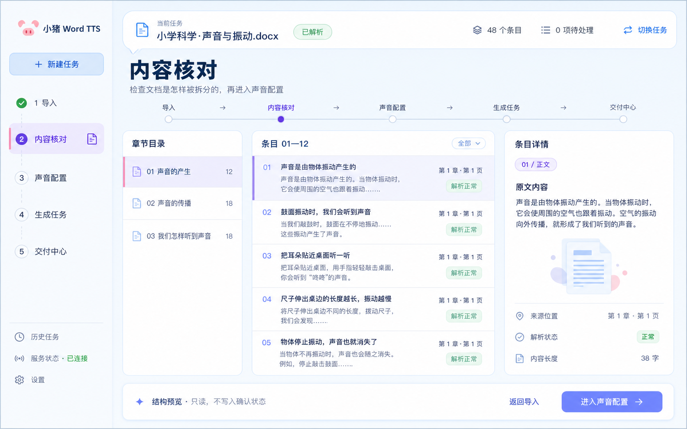

# 小猪 Word TTS 前端 UI 重构方案

**文档状态与当前事实基线（2026-08-30 实施复核版）**：方案与实施审计文档。方案原文保留设计依据，当前工作树已经完成仓库内可验证的实现项；本节合并并取代此前分散的"评审结论/实施审计更正/前端接线补充结论"多段状态（原文见版本历史）；后续修订直接更新本节与正文对应小节，不再追加新的状态段落，避免多层口径互相覆盖。

当前事实基线（以工作树代码、契约和测试为准）：

- v1 的后端事实闭环仍保留：配置持久化与生成前计划固化、服务端安全恢复/干预过期/限量 GC、`READY + verified` 交付闸门、安全失败后换音色新计划、SSE 游标清理与事件流 snapshot 重锚定、终态 rerun、失败条目目标范围重试、确定性 `export-zip`，以及受运行时/真实 Provider 开关控制的安全 retry 派发路径。
- 本批已关闭仓库内可验证的前端缺口：Renderer 的活动候选 hydrate/多任务选择、Store 的有界 workspace 投影、配置 revision 与 `PATCH workspace`、条目正文编辑/跳过、服务端动作驱动的暂停/恢复/取消/对账/重跑、命令协调、`.docx`/`.xlsx`（含 Excel 词汇来源定位）导入反馈、Artifact 流式试听与跨 IPC 背压、可取消的流式下载，以及结果页逐条交付范围明细。
- Renderer 现在只保留新工作台单一入口；workflow 数据与任务记录继续由现有服务端目录持久化，不再维护第二套 Shell 或运行时切换开关。
- 仍保持为有意的安全边界而不是“漏实现”：`AMBIGUOUS/UNRESOLVED` 外部提交不得自动重发；用户主动暂停的任务不得自动恢复；只有服务端 `available_actions`、版本和产物事实允许时才显示动作。
- 仅剩需真实环境采集的验收证据：Provider 登录/过期现场、300MB 可解析 `.docx`、>16MiB 音频、大 ZIP、4GB 设备内存/吞吐/取消，以及 `1280×860`、`1024×768`、`900×600` 的 Electron 截图与指标。执行入口见 `docs/frontend-acceptance-checklist.md`；这些不能由本机单元测试代替。
- 历史评审更正已落实：`WORKFLOW_{ACTION}` 动态事件、独立 `expected_group_state_version`、条目级 `tts-segment` 交付闸门、显式 Provider 状态和长正文详情绑定均已同步到代码/契约/夹具；正式 G0 的产品/QA 签署仍属于发布流程，不是代码可以伪造的结论。

**目标版本**：前端工作台大版本（建议作为 v3 级别规划）

**编写日期**：2026-08-28
**最近复核**：2026-08-30（第四轮）
**适用范围**：Electron Renderer、前端状态层、工作流相关接口投影；方案文本不直接承载代码，但本次实施已同步到当前工作树

**事实级别**：文中“当前实现”指本仓库当前工作树中的实现；“建议、目标、拟新增”不代表已经存在的接口或能力。

**生效口径**：本文件是“UI 方案 + 实施审计附录”的组合文档。第 2.2 节所说的“不包含代码实现”表示方案章节本身不直接承载实现；当前工作树已按本方案补齐可验证代码、契约、夹具和测试。第 16 节同时记录实施前基线与本批收口结果，最终以代码、契约、测试和现场验收证据为准；第 15 节未被显式覆盖的产品决策可按默认路线作为工作假设推进，正式发布仍需 G0/现场证据签署。

## 1. 摘要

产品目标和旧版 UI 已覆盖导入 Word 文档、解析内容、配置角色与声音、生成音频、试听和下载；当前工作树已完成方案范围内可由代码验证的工作台闭环：配置与计划固化、workspace/Store/action 投影、活动任务 hydrate、多任务选择、编辑/跳过、命令协调、导入/试听/下载传输控制、交付范围明细和终态安全收敛均已接入。未关闭的只有安全策略明确禁止的自动重发/自动恢复，以及必须在真实 Provider、目标设备和 Electron 窗口采集的现场证据。

本次重构不建议继续在现有“四步向导 + 大量卡片”的结构上局部修补，而是将前端升级为一个**以生成任务为中心的文档配音工作台**：用户始终知道当前任务、当前阶段、下一步动作和异常如何处理；生成过程可观察，并在服务端能力具备时支持暂停、恢复和取消；最终产物可以按条目检查，而不是只能等待整批任务结束。

核心方向可以概括为：

> **从“填写一组设置并等待结果”，升级为“管理一条可恢复的文档配音任务”。**

底层工作流语义不需要被 UI 复刻成复杂的技术面板。前端要做的是把后端的快照和事件转换成稳定、可理解、可操作的任务界面；暂停、恢复和取消只有在服务端能力已确认且语义可验证时才作为可操作动作开放。

## 2. 方案边界

### 2.1 本方案包含

- 当前前端界面、交互、信息架构和视觉语言的审查结论。
- 新版本的产品定位、设计原则、工作台布局和核心页面方案。
- 工作流状态如何映射为用户可理解的界面状态。
- 前端状态层、组件边界和后端接口配合建议。
- 分阶段实施顺序、风险、验收标准和需要确认的决策。

### 2.2 本方案暂不包含

- Renderer、Preload、主进程或后端接口的实际代码修改。
- 语音供应商、文档解析规则或音频生成算法的重设计。
- 用户体系、云端协作、计费等产品范围扩展。
- 在没有确认视觉方向前直接建立新的品牌资产或插画资产。

### 2.3 建议首版范围与默认路线

当前方案同时描述了“可信的最小闭环”和“完整工作台”的能力。为了避免实现团队在契约未冻结前先做出不可用的按钮，首版默认采用 `MVP-A`；未明确列入 `MVP-A` 的能力只能以明确标注“未支持/待契约”的说明或不可操作控件出现在设计稿或 fixture 中，不得让一个普通禁用按钮单独暗示能力已经交付。

| 能力 | `MVP-A` 默认范围 | 后续或条件交付 |
| --- | --- | --- |
| 状态与恢复 | 五维状态派生、Store 作为工作流视图事实源、当前任务/活动候选的有界 snapshot + workspace hydrate、SSE 缺口/410 重锚定、多任务选择和恢复上下文 | 未决外部调用自动接管/重发、用户主动暂停自动续跑（安全策略明确不做）；后台全量控制仍由服务端能力决定 |
| 内容核对 | workspace 条目正文、类型、Excel 工作表/行号定位、长正文详情引用；生成前支持正文编辑、跳过/恢复并受版本、配置 revision 和首次 attempt 冻结保护 | 服务端未提供契约的持久化“确认”语义、任意条目身份变更；条目角色/声音覆盖保留在已支持的配置层，未伪造未接线控件 |
| 配置与生成 | 配置通过 `PATCH workspace` 持久化并回显 revision/hash；生成只使用已保存配置与 revision，不再接受未校验的 Renderer 覆盖；命令协调层固定幂等键并在冲突/超时后回到最新 workspace | 其他输出格式仍需真实 Provider/格式证据；未知格式保持不可交付 |
| 任务控制 | `PAUSE`/`RESUME`/`CANCEL`/`RETRY`/`RECONCILE`/`RERUN`/`ARCHIVE`/`EXPORT_ZIP` 均由 `available_actions` 和版本条件驱动，pending、冲突、超时和取消收敛有统一反馈 | 未决外部副作用不得自动重试；暂停仍需用户显式恢复 |
| 交付 | 单条试听/下载、成功/失败/跳过/取消/待对账分栏、逐条 ZIP 包含/排除原因、主进程流式下载进度/取消和 `.part` 原子清理 | 真实大文件吞吐、首帧、设备内存和窗口现场指标仍需按 §16.8 实测；不把合成夹具当成支持声明 |

`MVP-A` 不是对产品最终形态的否定，而是进入 P1 页面重构前的契约闸门。产品决策可以在第 15 节覆盖默认路线，但覆盖后必须同步更新本节、接口契约、实施阶段和验收标准。前端 v3 在本文中表示 UI/交互里程碑，不等同于后端 `/api/v1` 的版本号；当前 `app.js` 中仍可见的 v2 注释也不代表本方案已经实现。

本文中的 `configuration_revision` 沿用并需要冻结为 workflow 内的“可生成配置快照版本”，不是当前 `WorkflowSnapshot.draft_revision` 的换名。当前 workspace/后端已经返回并校验该字段；`workflow/repositories.py` 的 `_configuration_revision` 优先读取配置 JSON 中的保留键 `_workflow_configuration_revision`，旧 workflow 的已保存配置中没有该标记时才回退推导为 `max(1, draft_revision + 1)`，该回退规则需在 G1 契约中冻结。`draft_revision` 仍表示现有草稿修订事实。在前端 revision 接线和历史 workflow fixture 完成前，不能把 `draft_revision` 直接当成声音参数、生成范围和输出格式均已保存的配置版本。

还要避免与数据库现有字段混淆：当前 `workflows.configuration_version` 写入的是 workflow definition version，`patch_draft` 也不会随配置修改更新它；它不能直接冒充这里的可变 `configuration_revision`。实现时应沿用现有 configuration revision，并在契约中冻结它与 `configuration_snapshot`、`configuration_hash`、`draft_revision` 的关系，不要再新建一个语义重叠的字段。

### 2.4 `MVP-A` 发布判定规则

`MVP-A` 不是“先把页面做出来、再观察接口是否能支撑”的软目标，而是一个有硬门的发布范围：G1/G2/G3 任一未通过时可以做 fixture 驱动的结构验证，但不能发布真实生成按钮或继续生成承诺。

| 分类 | `MVP-A` 口径 |
| --- | --- |
| 必须交付 | 导入与解析、内容核对及安全范围内的正文编辑/跳过/恢复、声音/角色和生成参数的 workflow 持久化与回显、服务端确认的配置生成、五维状态派生、SSE 缺口/410 的游标清理与事件流快照重锚定、历史任务的状态正确展示；单条试听/下载只有在 Renderer 通过 `READY + verified`、格式/MIME 和资源错误恢复验收后才开放。如果 `MVP-A` 开放现有的失败条目重试或终态 ZIP，必须同时交付其安全范围、产物条件和降级说明。 |
| 明确不交付 | 持久化“已确认”语义、任意范围或未决条目重试、未决外部调用的自动接管/重发、用户暂停任务自动续跑，以及未经真实 Provider/设备证据支持的完整批量性能承诺。有限正文编辑/跳过、交付范围明细和受控流式传输已在当前代码闭环中；没有对应契约时不得用普通禁用按钮暗示能力已支持。 |
| 条件开放 | 暂停、恢复、取消、对账、MP3 交付等动作，只有在 `available_actions`、版本条件、外部调用语义和 fixture/回归测试全部通过后才显示为可操作。 |

若 MP3 的实际字节、Artifact 元数据、文件扩展名或 HTTP MIME 任一项未通过一致性校验，`MVP-A` 应阻止对应交付并显示“格式尚未验证”；不得自动降级为 `.bin` 或其他未知格式来维持“可下载”表象。默认路线的调整必须同时修改本节、§12 和 §13，不能只在产品文案中改口径。

受限终态 ZIP 如果被纳入 `MVP-A`，仍必须随包展示本次实际的 `included_item_ids`、`excluded_item_ids` 和排除原因；本条是受限交付的最小事实反馈，不等同于承诺完整/批量交付中心。若这些范围明细、元数据或大文件传输条件未完成，ZIP 只能保持禁用或“准备交付/待契约”状态。

## 3. 产品与代码现状

### 3.1 产品事实

当前产品是一款本地桌面应用，主要服务于将 Word 教材或文档转换成可试听、可交付的音频。README 和旧版 UI 描述的主要能力包括文档解析、男女声角色配置、音频生成、试听、下载、ZIP 交付、历史记录以及生成过程中的恢复、取消和重试；这些内容代表产品意图或旧链路，不能直接当作当前 v1 workflow API 的端到端事实。当前工作树已完成导入源文件、解析、快照/SSE、配置持久化、workspace/action 投影、活动任务 hydrate、编辑/跳过、试听/下载传输控制、持久化失败条目的目标范围重试、终态确定性 ZIP 和受运行时开关控制的安全 retry 派发路径；未决外部调用不得自动接管/重发，用户主动暂停不得自动续跑，真实 Provider、目标设备和 Electron 窗口指标仍按 §16.8 待现场验收。

输入格式已按本次实施决策冻结为 `.docx` + `.xlsx`：当前 parser 和 Renderer 均接受两种格式，Excel 词汇模板进入 `MVP-A`，并在核对页展示词汇/例句条目及其工作表、行号等来源定位。后续若扩展更多 Excel 结构（合并单元格、角色标记或多工作表规则），必须继续补充对应投影和验收，不能把未识别的单元格默认为可生成内容。

输出格式已按当前实现冻结为 **MP3-only**：Renderer 和 `/api/config` 只开放 MP3，质量选项只代表 MP3 码率；workspace 的 `configuration.effective.format` 缺失时可以显示配置默认值，但 Artifact 交付仍必须以真实字节、Artifact 元数据、扩展名和 MIME 的一致校验为准。缺失或冲突的格式继续保持“格式未确认/不可交付”，不能把内部 `bin` 或默认 MP3 当作编码格式证明；若未来恢复多格式，必须另行冻结并同步代码、契约、说明和现场证据。

当前前端主要入口和后端调用关系如下：

| 区域 | 当前实现 | 方案判断 |
| --- | --- | --- |
| 应用 Shell | 左侧深色导航 + 顶部服务状态 + 主内容区 | 保留“稳定侧栏 + 专注工作区”的骨架，但重新定义导航语义 |
| 主流程 | 导入、配置、生成、结果四步 | 保留阶段概念，改为“任务工作台”的五个逻辑视图 |
| 状态来源 | **实施前基线**：`workflow-store.js` 已消费快照、去重事件、检测缺口并持久化 SSE 游标/序号；当时主要视图仍由局部变量驱动 | 当前已由 Store 保存有界 workspace、由 `app.js` hydrate/订阅并按 workspace/action 渲染；UI 局部变量只保留选择、展开和兼容过渡状态 |
| 声音配置 | 角色卡片、语音浏览器、搜索/筛选、参数设置 | 保留功能，减少嵌套卡片和重复滚动，改为“角色列表 + 目录抽屉 + 右侧详情” |
| 生成过程 | 进度、阶段、日志/时间线 | 保留可诊断能力，但把日志降级为按需展开的诊断抽屉 |
| 结果交付 | **实施前基线**：HTML 存在条件式 ZIP 卡片和音频列表；当时 workspace 的范围与元数据尚未消费 | 当前由 workspace 的条目/Artifact/delivery 投影驱动单条试听、下载、ZIP 包含/排除明细；下载走主进程流式临时文件和可取消传输，未知格式仍不可交付 |
| 历史记录 | **实施前基线**：活动候选已存在但未统一进入任务视图 | 当前刷新历史时读取活动页并做有界 workspace hydrate；多任务不会静默切换，截断有标记，归档与重新运行仍保持不同语义 |

### 3.2 当前 UI 的优点

- 入口和主流程一眼可见，初次使用者不容易完全迷路。
- 深色侧栏与浅色工作区形成了清晰的视觉分区。
- 主要动作使用蓝色强调，品牌识别度和可发现性较好。
- 声音目录已经具备搜索、筛选、预览和参数配置等必要能力。
- 生成阶段已经尝试呈现阶段、进度和事件时间线，说明产品已经从“一次性按钮”迈向“可观察任务”。
- Electron + Preload 的安全边界和现有工作流 API 可以作为重构的基础，不需要先做框架迁移。

### 3.3 实施前主要问题与影响（历史基线）

> 本节保留实施前的风险基线，便于追溯当时为什么需要补齐 P0；其中已修复项不能再作为当前状态结论。当前状态以本文件开头的“当前事实基线”、§16.9、代码、契约和回归报告为准。唯一仍开放的是明确禁止自动化的安全边界，以及真实 Provider/目标设备/Electron 窗口现场证据；不要把本节的“尚未”误读为当前工作树仍未实现。

下列问题条目是本批开始前的审计输入和设计依据；实现后的关闭情况统一记录在 §16.9，避免把历史风险描述重复当成未完成清单。

#### P0：状态与用户看到的状态不一致

当前界面一部分由 `currentStep`、`isGenerating` 等本地变量驱动，另一部分由 Store 快照和 SSE 事件驱动。这样会导致：

- 页面刷新或应用重启后，活动任务无法自然恢复到正确视图。
- 后端处于 `WAITING_USER`、`BLOCKED`、`WAITING_RETRY` 等状态时，用户看不到明确的处理入口。
- “生成中”只能表达大阶段，无法稳定表达暂停请求、恢复中、清理中、部分成功等细节。
- UI 只能被动等待，无法把后端已有的重试、对账和重跑原语，以及仍需前端接线和验收的暂停/恢复/取消语义，稳定转化为操作。

需要特别区分“已有后端原语”和“前端已接通”：`workflow-store.js` 已具备快照消费、SSE 游标持久化和缺口检测；`app.js` 已调用 `prepare/consume` 做帧校验和游标处理，但目前仍只持久化 Renderer 侧游标与序号，尚未通过 Store 订阅把规范化快照作为完整渲染事实源。当前页面仍主要把快照映射到 `currentSession.state_version`、游标和状态文本，事件处理覆盖的类型有限。因此本方案不能把“Store 已存在”写成“Snapshot 驱动已经完成”；这部分仍是明确的前端收口缺口。

此前发现的断线恢复陷阱已经部分修复：出现序号缺口或服务端返回 `CURSOR_EXPIRED`/HTTP 410 时，Renderer 会清除对应 workflow 的持久化游标和 seq，下一次连接不带旧游标并由服务端 snapshot 重新锚定；但当前恢复仍是清游标后直接重连，尚未完成“先 hydrate snapshot/workspace、再重订阅”的统一顺序。完整 workspace hydrate 仍未接入，因此这项能力只能称为“事件流游标重置/快照重锚定已接通”，不是完整任务工作台恢复。

取消反馈的提前终态问题已部分修复：后端在取消命令被受理（状态机转入 `TERMINATING/BLOCKED`）时会发布 `WORKFLOW_CANCEL` 命令事件，Renderer 现有分支据此显示“正在停止生成任务…”，这是“取消已受理”通知而不是终态证据；收到 `WORKFLOW_CANCELLED`（清理收敛时发布）后还会读取权威快照。当前 Renderer 已用 `isTerminalWorkflowSnapshot`（`execution_state=TERMINAL` 或终态 `result_status`）和 `isCancellationSettledSnapshot`（终态，或 `cleanup_state=SUCCEEDED` 且 `control_state=TERMINATING`）做部分判断，但尚未把 `control_state=TERMINATED`、`result_status` 和 workspace 产物条件统一交给 reducer。只有这些事实按交付规则共同收敛后才应进入取消结果视图；后端若收敛为 `PARTIAL_SUCCESS` 也要保留部分成功语义。仍需补全能力投影和更细的取消中 workspace 展示。

这里的事件层次按代码事实澄清（并更正上一轮“WORKFLOW_CANCEL 是死代码”的误判）：取消相关事件分两类。第一类是命令受理事件 `WORKFLOW_CANCEL`：由 `workflow/repositories.py` 的 `command()` 以 `WORKFLOW_{ACTION}` 动态拼接发布（同族还有 `WORKFLOW_PARSE/GENERATE/PAUSE/RESUME`），在取消命令被接受、状态机转入 `TERMINATING` 或 `BLOCKED` 时发出；SSE 事件流不经过滤直接转发该事件，Renderer 中处理它的分支（`app.js`）是活代码，语义正是“取消已受理、正在停止”，Store 接线时应保留并纳入状态投影，而不是移除。第二类是收敛事件：worker 清理收敛且用户请求取消时发布 `WORKFLOW_CANCELLED`，非取消的清理收敛发布 `WORKFLOW_CLEANUP_COMPLETED`。若已有可保留产物，最终结果还可能是 `PARTIAL_SUCCESS`。当前取消分支还没有把 `control_state`、`result_status` 和条目/Artifact 条件统一交给 reducer，不能把任一事件名或单独的 `execution_state=TERMINAL` 当作“纯取消”终态。

已接受的生成任务的失败收敛已由运行时任务包装和 Repository 状态更新覆盖：失败事件会伴随可持久化的 `WAITING_RETRY`、`WAITING_USER` 或终态快照；事件仍不能替代快照，Renderer 会在失败事件后重新读取权威状态。当前正式桌面运行时已接入安全 retry 派发，但只针对 provider-aware、无未决外部副作用的可安全任务；不能把所有 `WAITING_RETRY` 或未决提交写成会自动继续。

同类问题此前也出现在 `TTS_OUTPUT_VERIFIED` 和 `GENERATION_TASK_FAILED`：事件到达时不能直接把页面切成完成或失败。当前 Renderer 会在这些事件后读取权威快照，但结果页仍混用本地统计/产物列表，尚未由统一 workspace 投影判断终态和交付条件。因此 P0 仍必须让关键事件触发“状态待同步”，只有快照、条目状态和产物投影收敛后才进入结果或错误终态。

> 当前实现更正：`TTS_OUTPUT_VERIFIED`、`GENERATION_TASK_FAILED` 和取消事件都会触发权威快照读取，但取消终态校验和结果页投影仍不完整；这不等于 Store 已成为完整 UI 单一事实源，仍需完成 workspace 投影迁移。

迁移期间还要保留一个容易误读的兼容字段：当前 `currentSession.session_id` 实际承载的是 `workflow_id`，不是 SourceImport 的逻辑会话 ID。新状态层应使用明确的 `workflow_id`、`source_import_id` 和 `configuration_revision` 字段；在旧代码尚未拆除前，不得把 `session_id` 当作跨接口的统一主键。

当前 Renderer 尚未把暂停、恢复、对账和解决阻塞等命令完整投影到统一页面；失败条目的安全目标范围重试已经接入，但只接受持久化 `FAILED` 且没有已验证产物的条目，未决条目不能批量重试。已有 API 原语不能直接推导出可点击按钮。所有控制动作必须由 `available_actions` 或已冻结的能力清单投影，并在命令 pending、冲突和超时后回到最新快照。

此外，`list_history_records` 的 `available_files`/`completed`、Renderer 的 `resultFilesFromArtifacts` 以及 Artifact ticket 现在统一要求 `lifecycle_state=READY` 且 `verified=true`；服务端发布和下载边界已把“可读”和“可交付”分开。`export-zip` 已有按需创建/复用路径，workspace/export 响应也已有已生成、失败、跳过、取消、未决的包含/排除字段；当前阻塞在 Renderer 尚未把这些字段用于交付摘要、明细和按钮条件，不能因此推断完整批量交付已完成。

#### 已修复基线：任务配置持久化闭环（当前转为契约收口）

当前生成入口会在接受任务前把声音、角色覆盖、语速/音调/音量、质量、预览范围和生成模式写回 workflow 配置；Engine 从服务端快照组装计划，试听任务只计划前三条，Provider profile 包含质量并由真实旧版音频导出按码率落地。已开始外部提交的原任务仍冻结配置，安全失败且无未决副作用的 `WAITING_RETRY` 才允许换音色形成新计划。

因此，当前已满足“配置持久化 → 服务端确认 → 生成使用同一份配置”的闭环；历史投影读取 workflow 配置，`localStorage` 仍只保存预设、临时表单恢复和 UI 偏好，不能作为当前任务的事实源。终态修改会创建新的 rerun workflow，不会修改旧 run 的事实。

#### P0：Provider 登录态与可用性未形成显式门槛

README 已明确首次真实生成需要在讯飞配音浏览器窗口完成登录，登录状态保存在本机；当前 Renderer 主要展示“正在连接/启动讯飞浏览器”，后端通过 provider-ready 检查决定是否继续，但没有向用户稳定投影“未登录、检测中、已登录、会话失效、浏览器被关闭、需要重新登录”等状态，也没有独立的登录/检测/重新认证/取消流程。不能把浏览器启动或生成请求发出当作登录成功证据。

首版必须将 Provider 可用性作为生成前门槛：能力或 workspace 投影至少返回脱敏的 Provider 状态（建议字段为 `provider.status`，枚举与 workspace schema 一致）、`can_generate` 和用户可见原因；若 UI 需要 `login_required`，由 adapter 根据 `status=LOGIN_REQUIRED/EXPIRED` 派生，避免与状态字段形成重复事实。UI 提供“打开登录/重新检测/重新登录”，会话失效或浏览器关闭时回到可解释的等待/重新认证状态，不自动重复提交可能已有副作用的生成。Provider 未就绪 fixture 和真实讯飞登录/会话过期验收通过前，不能把“开始生成”作为无条件主按钮。

#### P0：内容核对投影缺少正文和稳定定位字段

当前 `WorkflowWorkspace.items` 主要返回身份、顺序、hash、状态、角色/声音、尝试和错误信息，不含 `item_type`、`normalized_content`、`source_locator` 或安全的 `metadata.section`；`GET /workflows/{workflow_id}/items` 才能提供部分正文和类型字段。因而第 8.2 节的章节树、原文和定位不能直接由 workspace 驱动。

G1 必须二选一：扩展 workspace 的只读条目投影，或提供有界/分页的条目详情接口，并明确长正文、定位字段和敏感 metadata 的脱敏规则。在这组数据契约落地前，`MVP-A` 只能把页面称为“结构预览/条目列表”，不能暗示用户已经完成了可核对的原文确认；编辑、跳过的前端闭环和持久化确认仍然是更后面的修订能力。

#### P0：内容核对的编辑/跳过能力尚未接入前端

当前后端的 `patchDraft`/`PATCH /api/v1/workflows/{workflow_id}/workspace` 已提供受 workflow `expected_state_version` 和配置 revision 保护的有限条目覆盖：`role`、`voice_key`、`normalized_content`、`metadata`、`status=PENDING/SKIPPED` 以及 `skip_reason`；对已交付或存在未决 Provider 副作用的条目会拒绝修订，生成计划会排除 `SKIPPED`，现有运行时/API 测试也覆盖了配置 revision、跳过和交付排除。因此“编辑/跳过”已经是后端有限能力，但不是现有的端到端 UI 能力：`WorkflowWorkspace.items` 尚未返回正文、定位和可编辑 metadata 等投影字段，Renderer 也没有接入 `patchWorkspace`、条目级冲突处理和修订反馈；`MVP-A` 仍可按默认路线保持只读。

失败条目的有限“局部重试”已经形成端到端路径：Renderer 只收集持久化 `FAILED` 且没有已验证产物的条目，生成请求携带显式 `item_ids`，Engine 按目标范围组装计划并保留其他条目的既有产物。它不覆盖 `AMBIGUOUS`、未决副作用或任意条目范围，也不等于完整的 `retry_scope`/`available_actions` UI 契约；交付中心仍不能把所有失败状态都泛化成安全的“重试此项”。

实现内容核对页前，应先决定：MVP 采用只读核对，还是把现有有限 `item_overrides` 扩展为完整的前端修订/确认闭环；如果还要记录服务端“已确认”，确认本身也必须有明确契约。若开放编辑/跳过 UI，还应补齐条目级版本校验、修订号/计划哈希、明确的跳过操作和首次 TTS attempt 后的冻结规则；改变条目身份的编辑不能静默复用旧音频，必须标记为 `UNRESOLVED` 或要求重新运行。

#### P0：重启恢复的前端闭环与未决任务处理尚未完成

当前 `WorkflowRuntime.ensure_initialized()` 已在服务端首个 `/api/v1` 请求时惰性调用安全恢复、干预过期和限量 GC（不是进程启动钩子；`server.py` 中旧 JSON 任务引擎与旧 `/api/*` 路由已物理删除，未升级路径统一返回 `410 API_VERSION_RETIRED`，不再存在第二套恢复语义）；正式桌面运行时也已接入 provider-aware 的安全 retry dispatch，并能对 `control_state=RUNNING`、`execution_state` 为 `PREPARING/RUNNING/RECOVERING` 且无未决外部副作用的任务执行有界安全接管。它仍只处理可确认安全的路径，不会接管进行中的外部调用或自动重发不确定提交，也不会自动恢复用户主动暂停的任务。Renderer 仍尚未完成完整活动任务索引和 workspace hydrate。因此可以承诺“恢复事实与上下文”，在运行时启用安全 retry 时可承诺有限的安全任务续接，但不能承诺应用重启后对所有任务自动续跑。

#### P0：错误反馈不够可用

当前导入/解析失败时可能直接展示类似 `workflow request failed: HTTP 500` 的底层错误。对于用户而言，这不能回答三个关键问题：发生了什么、是否安全重试、下一步应该做什么。

版本化工作流路由的受管异常路径会返回包含 `request_id`、`error_code`、`message`、`retryable`、`side_effect_occurred`、`workflow_id`/`step_id`/`attempt_id` 和 `details` 的结构；工作流/条目相关异常会尽量从请求路径或异常详情补齐可定位的关联 ID。外层鉴权中间件和旧版 `/api` 路由仍可能返回不同形状，不能假设整个 API 面已经统一。Renderer 的 `workflow-adapter` 已将这些输入收口为带 `user_message`、`safe_to_retry`、`affected_item_ids`、`recovery_action` 和 `request_id` 的 UI 问题模型；后端原始错误信封未提供的字段仍由适配层根据安全动作和 workspace blocker 显式缺省，不能把缺省当成可重试证明。

#### 当前实现与可承诺能力边界

| 能力 | 当前 v1 事实 | 首版约束 |
| --- | --- | --- |
| 任务配置/预览 | 生成前完整配置会写入 workflow；Engine 从快照固化声音/参数计划，预览在后端限制为前三条，质量进入 provider profile/真实旧版 MP3 导出 | 仍需补最终产物级质量/格式的更强证据；终态修改走新 rerun，不修改旧 run |
| 条目级重试 | Renderer 和 Engine 已支持针对持久化 `FAILED`、且没有已验证产物的显式 `item_ids` 范围重跑，并保留其他条目的既有产物；`AMBIGUOUS`/未决副作用不进入该路径 | `retry_scope`、`available_actions`、目标版本和命令协调已统一投影；只有满足安全条件才显示“重试失败项” |
| ZIP 交付 | `POST /api/v1/workflows/{workflow_id}/export-zip` 已按终态成功/部分成功创建或复用确定性 ZIP，仅纳入已验证的 TTS segment，并返回 ZIP Artifact | 继续要求 `READY + verified`；workspace 已提供包含/排除 ID、原因及文件字段，Renderer 已消费；大文件现场指标和真实格式/时长证据仍待采集 |
| 音频格式 | Engine 使用 provider receipt 的 `output_format`；legacy Xunfei 路径报告 MP3，测试/模拟 Provider 可能报告 `bin`。真实音频字节的现场可解码性、逐条独立编码和下载链路仍未验收 | 继续保持 `READY + verified` 闸门；真实 Provider/设备证据完成前，不扩大格式支持声明，也不把 `bin` 当作编码格式 |
| 重启/断线恢复 | 服务端已接入安全恢复、干预过期和限量 GC（首个 `/api/v1` 请求时惰性触发）；SSE 410/缺口已清除旧游标并由事件流 snapshot 重锚定；正式桌面运行时可对无未决外部副作用的运行执行安全接管，但不会自动重发未决外部调用或恢复用户主动暂停任务；Renderer 已有活动候选索引和 workspace hydrate | 只显示安全恢复上下文；只有候选的 `can_takeover`/`can_resume` 证据齐全时，才显示继续动作 |
| 暂停/取消 | 状态机有控制态；取消是协作式的，路由会设置 `cancel_event`，engine/provider 在若干边界检查并由 cleanup 收敛，但不能保证强制中止进行中的浏览器/网络调用；暂停/恢复已通过 runner 的 `pause_check` 在安全边界协作执行，重启后不会自动恢复用户主动暂停任务；产物发布前已有最终控制态栅栏，相关竞态已有回归覆盖；`ProviderCapabilities.supports_resume` 仍只表示可查询/恢复已有供应商作品，不等于 workflow 支持协作式暂停/恢复 | UI 只展示服务端确认的能力；取消收敛前显示处理中或待对账，发布前必须重新校验控制态和版本；真实 Provider 语义仍需现场确认 |

#### P1：视觉层级过度依赖卡片

现有样式文件规模较大，并存在多轮刷新、重建和桌面可读性补丁。大量白色卡片、圆角、阴影和嵌套面板让内容层级变平，用户需要在多个容器之间寻找真正重要的字段和动作。

#### P1：核心操作的上下文被拆散

- 文档概览、条目数量、角色分配、声音设置和生成入口分布在不同卡片中。
- 生成过程中，状态、进度、异常和日志同时争夺注意力。
- 结果页同时展示整包下载、单条音频、搜索和筛选，但没有明确“交付是否完成”的主线。

#### P1：声音配置的空间效率和选择效率不足

声音浏览器存在多层布局和独立滚动区域。用户需要在角色、声音卡片、搜索筛选和参数面板之间来回移动；当声音数量增加时，比较和回退成本会进一步上升。

#### P0：历史中心的状态投影与恢复动作不安全

历史中心实际上是活动任务的恢复入口。当前实现已经对状态展示做了局部修正，但恢复和交付仍未完全由 workspace/Store 统一驱动：

- 后端普通列表仍返回按更新时间排序且受 `limit` 限制的 `status <> CLOSED` 记录，因此草稿、生成中、阻塞和部分成功任务都会进入同一个列表；服务端已经提供独立的 `/api/v1/workflows/active` 活动任务候选接口，当前 Renderer 已在刷新历史时读取它并在部分恢复提示中使用 `can_resume`、`can_takeover` 和 `requires_reconcile`，但尚未把它接成启动 hydrate、任务选择和 Store 的统一恢复索引，接口本身也没有返回“结果是否被 limit 截断”的标记。
- `historyStatusPresentation` 已使用 `result_status`、`execution_state`、`control_state` 和对账信号派生历史状态，已不再把所有无 Artifact 的活动任务直接当作“文件缺失”；但列表中的可交付数量、待处理数量、按钮禁用条件仍主要来自历史投影的 `available_files`/`completed` 和局部字段，当前历史摘要还用 `total - completed` 推导失败数，没有独立展示 `CANCELLED`/`SKIPPED`，取消条目可能被误计为失败，详情页也尚未成为 workspace 驱动的任务视图。
- 当前每条记录提供“查看状态/查看结果”和“归档”动作；归档只允许终态 workflow，不能作为草稿放弃或真正删除。永久删除和草稿放弃仍没有独立后端语义；HTML 当前已明确“列表最多显示最近 20 条，历史事实不会自动删除”，剩余问题是展示上限仍可能让用户误以为列表等于完整活动集。
- 当前 HTML 的侧栏文案已改为“最近生成的音频任务”，README 也已同步为“最近生成”；遗留旧版产品文案若继续保留，仍不得把历史列表描述成只包含最近完成的任务。

因此，历史状态正确性虽已有局部修复，完整的恢复入口、workspace/action 统一投影和归档/放弃边界仍属于 P0，而不是视觉阶段的 P1：必须先按五维状态和 `available_actions` 映射状态标题、主动作、禁用原因和视图入口；待这条事实链路完成后，再做列表密度和视觉重构。

#### P2：响应式和可访问性需要纳入设计基线

应用允许较小的窗口尺寸，而当前布局在 900×600 等尺寸下容易出现拥挤、嵌套滚动和操作密度过高的问题。键盘焦点、状态提示、颜色之外的状态表达以及减少动效也应在重构初期定义，而不是最后补救。

### 3.4 术语口径

同一对象在 UI、接口和运行时中使用不同名字会让状态映射和验收失真，后续统一采用以下口径：

| 用户/方案用语 | 领域或代码用语 | 约束 |
| --- | --- | --- |
| 任务 | `workflow` / `workflow_id` | 可持久化、可恢复的用户工作单元；不要用临时 `session` 替代它 |
| 生成运行 | run；诊断层可见 `step` / `attempt` | 一次执行及其尝试；不在普通 UI 中暴露内部 ID |
| 条目 | `work item` / `item_id` | 解析后的单个生成目标，拥有独立状态和版本 |
| 任务生命周期 | `WorkflowStatus`：`DRAFT` / `ACTIVE` / `ABANDONED` / `CLOSED` | 不等同于执行或结果状态 |
| 执行状态 | `ExecutionState` | 表达准备、运行、等待、恢复或终止过程 |
| 控制状态 | `ControlState` | 表达暂停/终止请求及其收敛，不提前承诺结果 |
| 清理状态 | `CleanupState` | 只作为辅助进度，不单独决定页面主标题 |
| 结果状态 | `ResultStatus` | 表达成功、部分成功、失败或取消；只有终态确定后才作为完成文案 |
| 归档 | `archive` / `CLOSED` | 从默认列表隐藏但保留事实；当前没有用户侧取消归档接口，也不等于永久删除 |

“内容核对”“交付中心”是用户可见的工作区名称；`review`、`result page` 只作为代码模块或迁移期间的别名，不能再同时作为产品文案。

## 4. 设计目标与原则

### 4.1 设计目标

1. **任务始终可见**：顶部或侧栏始终显示当前文档、任务状态、阶段和关键计数。
2. **每个工作区只有一个主导的下一步动作**：用户不需要从多个同等重量的按钮中猜下一步；取消、返回、帮助和诊断等控制动作作为次级动作，具体是否可用以服务端能力投影为准。
3. **状态可解释、可恢复**：任何非终态都要说明当前发生了什么、预计下一步是什么、用户是否需要介入。
4. **问题可定位到条目**：批量生成失败时，用户能快速找到失败条目；只有目标范围重试契约成立时才局部重跑，否则明确引导创建新的全量运行。
5. **诊断信息分层**：普通用户先看到结论和动作，日志和事件详情作为按需展开的证据层。
6. **减少视觉噪声**：用排版、分组、留白和分隔线建立层级，减少无意义的容器嵌套。
7. **保留产品亲和力**：沿用现有品牌图标，并保留轻微的俏皮感；本次不重新设计小猪标识，也不能让核心任务界面变成装饰性首页。

### 4.2 设计原则

- 先表达任务，再表达技术。
- 先给用户结论，再提供日志证据。
- 先解决当前阻塞，再展示完整配置。
- 默认展示常用设置，高级参数按需展开。
- 状态颜色必须配合文字、图标或结构表达，不能只依赖颜色。
- 破坏性或不可逆动作需要明确对象、影响和恢复方式。
- 只在真正有信息价值的时刻使用动效；支持 `prefers-reduced-motion`。

## 5. 设计契约：新版本的统一方向

这是实施前需要团队共同遵守的设计契约。它不是新增的产品文档，不代表已经完成品牌定稿；正式实现前仍需确认。

### THESIS：一句话主张

**这是一个帮助用户把文档可靠地制作成可交付音频的工作台，而不是一个等待结果的表单。**

### WORLD：视觉世界

**教材排版 × 声音信号**。

- 教材排版提供纸张、章节、目录、页边距和编辑秩序感。
- 声音信号提供波形、播放头、录制状态和时间线节奏。
- 两者结合后，界面既有文档工具的可靠性，也有音频工具的即时反馈。

### STORY：用户故事

用户从一份文档开始，沿着“导入 → 核对内容 → 配置声音 → 生成与处理异常 → 检查并交付”的路径前进。每个阶段都能看到上下文、完成度和下一步；即使中途关闭应用，回来后也能恢复同一项任务的上下文，并在服务端确认已接管运行时后继续执行。

### FIRST VIEWPORT：首屏承诺

首屏不追求展示所有功能，而是回答：

- 我现在在哪个任务里？
- 当前任务进行到哪一步？
- 我现在最应该做什么？
- 是否存在需要我处理的问题？

### FORM：界面形态

采用“固定任务轨道 + 单一主工作区 + 按需侧抽屉”的工作台形态。固定轨道提供方向感，主工作区承载当前决策，抽屉承载声音详情和诊断日志，避免把所有内容永久堆在同一屏。

### FINISH：完成标准

用户完成一次任务后，不仅拿到已明确契约的交付包或单条产物，还能清楚知道：总条目数、已生成/失败/跳过/已取消/待处理数量、可交付数量、失败原因、已交付产物以及下次是否可以从当前任务继续。ZIP 只有在后端实际生成并验证 `export-zip` Artifact 后才作为主交付形式。

## 6. 信息架构与应用 Shell

### 6.1 五个逻辑工作区

底层仍然是一条 workflow，但 UI 拆成五个更符合任务心智的逻辑视图：

| 工作区 | 用户问题 | 主动作 | 典型状态 |
| --- | --- | --- | --- |
| 导入 | 我要处理哪份文档？ | 选择或拖入文档 | 空白、接收中、解析中、可继续、失败 |
| 内容核对 | 文档被正确拆成了哪些条目？ | 检查条目，并对安全范围内的正文编辑、跳过/恢复做显式修订；不写入持久化“已确认”语义 | 待核对、存在问题、可修订、已跳过 |
| 声音配置 | 谁用什么声音说？ | 分配角色、试听和调整参数 | 未配置、部分配置、已配置 |
| 生成任务 | 任务现在进行到哪里？ | 开始、暂停、恢复、取消、重试、处理阻塞（由能力投影决定） | 准备中、生成中、暂停、等待处理、阻塞、终态 |
| 交付中心 | 哪些音频已经可用？ | 试听、下载、满足安全条件的局部重试、下载确定性 ZIP（范围和能力需契约支持） | 部分完成、已完成、无产物、失败 |

历史记录作为跨任务入口保留在侧栏，不作为主流程中的第六步。打开历史任务时，应恢复到该任务最有意义的工作区，而不是固定返回首页。

### 6.1.1 `MVP-A` 页面进入/退出规则

为避免五个工作区变成五次强制跳转，`MVP-A` 采用“独立但可跳过”的内容核对工作区：解析成功后默认进入内容核对，但没有未处理问题时，主动作直接为“进入声音配置”；用户可以通过任务轨道返回前一工作区。当前实现对安全的 `PENDING/SKIPPED` 条目提供有限正文编辑、跳过/恢复，不能把离开页面解释成服务端“已确认”。

| 事实/动作 | 进入工作区 | 退出与主动作 | 约束 |
| --- | --- | --- | --- |
| 解析成功 | 内容核对 | 无问题时“进入声音配置”；发现问题时查看问题或修订条目 | 页面离开不写入“已确认”；显式修订才写入 workspace |
| 配置已保存且未开始 TTS | 声音配置 | “开始生成” | 必须先保存并回显 workflow revision；未保存值不能进入生成请求 |
| 生成已接受 | 生成任务 | “查看问题”或等待终态；不能把事件直接当作终态 | 任务轨道负责跨工作区导航，生成页阶段轨道只负责本次执行阶段 |
| 终态结果已确认 | 交付中心 | “归档”或“重新运行” | 只有 `READY`、`verified=true` 且格式事实一致的 Artifact 才能下载 |
| 历史任务打开 | 由 adapter 按派生用户态选择 | 保留任务上下文并允许安全切换 | 不因打开/切换任务自动发送生成、暂停或取消命令 |

任务选择器与阶段轨道必须分工：任务选择器切换当前 `workflow` 订阅，阶段轨道只切换当前任务内的 `activeView`；两者都不能隐式发送生成、暂停或取消命令。

| 场景 | UI 行为 | 约束 |
| --- | --- | --- |
| 切换任务 | 保存当前视图位置并切换订阅，显示目标任务的 workspace | 不暂停、不恢复、不重新生成；目标 workspace 未同步前不显示可操作命令 |
| 当前任务有未保存配置 | 弹出“保存并切换 / 放弃修改 / 留在当前任务” | 不静默丢弃输入，也不把切换当作保存成功 |
| 生成中切换任务 | 允许切换到其他任务的工作区 | 原任务继续由服务端运行；关闭窗口或离开视图不等于取消 |
| 应用重启 | 先读取活动候选，再按 `can_takeover`/`can_resume` 和 workspace 选择视图 | 没有能力证据时只恢复上下文或问题处理，不显示“继续生成” |

缺少正文/定位投影时的核对出路仍是“返回导入重新处理”：由导入页重新选择/处理文档并创建新任务，旧任务保留为草稿或按归档语义处理，UI 必须明确说明“当前任务不会保留修改”。具备完整 workspace 投影的条目使用条目级编辑/跳过/恢复；这些修订写入服务端并受版本、配置 revision 和首次 attempt 冻结规则保护。

### 6.2 建议的 Shell

#### 左侧任务轨道

- 新 Shell 的目标宽度约 220px，可折叠到 64px；这不是当前 CSS 的既有断点，必须在真实 Electron 窗口中按 §7.1 验收并据此调整。
- 顶部沿用现有产品图标和品牌名称，并提供“新建任务”。
- 中部为五个工作区，当前工作区显示明确的编号/状态，不只使用颜色。
- 工作区旁显示任务级异常计数或完成度，例如“2 项待处理”。
- 底部为历史任务、服务状态、设置和帮助入口。

#### 顶部任务栏

顶部是上下文栏，而不是第二套导航：

- 文档名和可选的任务别名。
- 条目数量、已生成数、失败数等关键计数；可交付数按独立交付闸门另列，已取消/已跳过不并入失败数。
- 当前服务连接状态。
- 当前工作区的辅助动作，例如保存草稿、重新解析、打开诊断。
- 新建任务或切换任务入口。

#### 主工作区

主区域保持稳定的阅读宽度；宽屏时可以使用双栏或三栏，窄屏时将右侧详情折叠为抽屉。所有页面都保留统一的标题、说明、主动作位置和底部反馈区域。

#### 状态提示层

错误、等待用户处理、暂停请求和恢复中的状态使用页面内状态条或局部提示，避免只依赖 Toast。Toast 只用于轻量成功反馈，例如“已复制链接”或“设置已保存”。

## 7. 视觉系统建议

以下是视觉方向的角色定义，色值为实施前可调整的示意 token，不代表最终品牌定稿。

| Token 角色 | 视觉倾向 | 使用场景 |
| --- | --- | --- |
| `canvas` | 日间为明亮浅蓝，夜间为低亮度蓝灰 | 页面背景、空白工作区 |
| `surface` | 日间为白色，夜间为柔和蓝灰紫 | 主内容面、浮层、详情区域 |
| `ink` | 日间为蓝灰，夜间为近白薰衣草灰 | 主文字、重要标题和图标 |
| `signal` | 日间为浅蓝/淡紫，夜间为提亮后的蓝紫 | 主按钮、当前工作区、链接、进度 |
| `recording` | 柔和珊瑚红 | 播放中、生成中、音频活动状态 |
| `success` | 低饱和薄荷绿 | 成功、已交付、可继续 |
| `attention` | 暖琥珀色 | 等待用户处理、可重试、风险提示 |
| `danger` | 清晰但不刺眼的红色 | 失败、取消、破坏性操作 |

视觉上建议由“白色卡片堆叠”转向“纸面分区 + 少量重点容器”：

- 大面积使用背景、分隔线和留白建立层级。
- 重要任务对象可以使用一块主面板，但不要在面板内无限嵌套卡片。
- 圆角统一为少数等级，阴影只用于真正浮起的菜单、抽屉和确认层。
- 主标题、阶段标题和字段标签形成稳定的字号梯度。
- 正文和状态信息保证窄窗口下仍可读，元信息不低于可接受的最小字号。
- 图标承担语义，不作为纯装饰；重要动作同时显示文字。

动效只服务于“状态正在发生”的理解：

- 页面切换使用短距离、低幅度的淡入或位移动效。
- 生成阶段用细微的进度或播放头动效表达活动状态。
- 状态完成使用一次性确认动效，不持续闪烁。
- 用户开启减少动效时，所有循环动效降级为静态状态。

### 7.1 视觉 token 与响应式最低基线

以下数值是可执行的工程基线，不是最终品牌定稿；正式 token 变更时必须同步更新对比度和窗口验收。

| 类别 | 基线 | 说明 |
| --- | --- | --- |
| 间距 | 4 为最小单位，常用 `8/12/16/24/32` | 同一层级不混用近似间距 |
| 圆角 | 控件 8、面板 12、主要工作面最多 16 | 不在面板内无限嵌套圆角容器 |
| 字级 | 正文 14–16px；元信息 12–13px 仅用于非关键内容 | 即使是小字号元信息也必须满足对比度基线；状态、错误和主动作不得只用小字表达 |
| 对比度 | 普通文字至少 4.5:1；大字和图形控件至少 3:1 | 以实际测量为准，不能只凭色板判断 |
| ≥1280px 宽 | 任务轨道 + 主工作区；仅在主区不少于 560px 时启用第三栏 | 第三栏不应挤压条目正文和主动作 |
| 1024–1279px 宽 | 任务轨道 + 主工作区；详情改为抽屉 | 抽屉打开后主动作仍保持可见 |
| 900–1023px 宽 | 任务轨道折叠，主区单栏，详情和问题均进抽屉 | 不出现三栏并行布局 |
| 高度低于 680px | 底部主动作固定在可见区域，日志/列表单独滚动 | 避免页面、面板、列表三层嵌套滚动 |

抽屉打开时焦点进入抽屉的标题或首个控件，关闭后恢复到触发按钮；所有仅 hover 的信息必须有键盘或触摸等价路径。`900×600` 必须按单栏降级规则完成导入、配置、启动和查看错误。

### 7.2 设计风格执行基线（实施时以此为准）

本节把前文的方向收敛成可直接交给 Renderer 实施的视觉规则。它是“教材排版 × 声音信号”的具体解释，不是新增产品功能，也不替代第 9 节的状态和能力契约。

#### 7.2.1 风格定位

新版本采用**轻盈的蓝紫工作台（Airy Blue Studio）**：清爽、友好、精致，以柔和色彩和细腻层次体现亲和感，但不预设用户性别；同时仍然是一款可靠的生产工具，不做幼儿化或装饰性首页。

- “教材排版”只借用目录、章节、页边距、编号、留白和阅读秩序；**不要把它画成纸张纹理、复古书本、报纸、衬线排版或仿 Word 表格**。
- “声音信号”只在声音配置、生成任务、试听和交付中心出现，用于表达试听、播放中、生成中和时间进度；**内容核对页只处理文档结构和文本，不出现音频波形、播放器、角色或声音字段**。
- 日间模式以浅蓝为主空间、淡紫为当前步骤、柔粉为少量品牌和提醒、薄荷绿为成功状态；深蓝灰只用于文字和少量高对比图标。夜间模式使用同一套蓝紫关系的低亮度变体，**不把日间界面简单反相，也不使用纯黑或霓虹深蓝**。
- 视觉层级由字号、留白、分隔线和浅色区域建立，而不是靠大量白色卡片、圆角、阴影和嵌套面板堆叠。

一句话判断标准：**用户打开界面时，应感觉像一间明亮、安静、好用的创作工作室，而不是旧式后台、表单向导或音频播放器。**

#### 7.2.1.1 视觉参考示例



> **参考说明**：上图只用于传达浅蓝与淡紫的色彩关系、页面层级、留白和工作台构图，不是最终视觉稿，也不要求实施时 1:1 还原。实际实现应以本方案的产品逻辑、状态契约、响应式和可访问性要求为准。图中的品牌标识仅作示意，实施时直接使用现有品牌图标。

#### 7.2.2 色彩与材质

以下色值作为首版日间模式的默认 token；夜间模式必须补齐同名语义 token，不能在组件中写死另一套颜色。两种模式都要保持轻盈、柔和和可读，不使用纯黑底或高饱和霓虹色。

| Token | 默认值 | 用途 |
| --- | --- | --- |
| `canvas` | `#F1F8FF` | 应用主背景，保持明亮的浅蓝空气感 |
| `surface` | `#FFFFFF` | 顶部任务栏、详情面板、抽屉和需要聚焦的工作面 |
| `surface-soft` | `#F8FBFF` | 列表 hover、空状态、次级区域 |
| `primary` | `#5668C8` | 主按钮、当前步骤、选中状态、链接；用于文字或实色控件时满足对比度要求 |
| `primary-soft` | `#E4E7FF` | 当前步骤背景、选中行背景、轻量提示 |
| `sky` | `#B9DCFF` | 导入区域、辅助强调和进度轨道 |
| `lavender` | `#D8D3FF` | 阶段标记、抽屉标题、结构分组 |
| `blush` | `#FFB9CA` | 少量提醒点和品牌微装饰；现有品牌图标保持原色 |
| `mint` | `#BFEBD8` | 已解析、解析正常、已保存、已交付 |
| `attention` | `#F3C777` | 等待用户处理、可重试、风险提示 |
| `danger` | `#E88B9D` | 失败、取消和破坏性状态的柔和背景或图形强调；不要直接配白色小字 |
| `danger-strong` | `#A34E62` | 破坏性实色按钮或需要与白字组合的高对比前景 |
| `ink` | `#263552` | 标题、正文、重要状态和主要图标 |
| `ink-on-soft` | `#263552` | 柔和状态背景上的文字；夜间模式使用对应的深色文字 token |
| `ink-muted` | `#62718A` | 说明、来源位置、非关键元信息；仍需满足普通文字对比度 |
| `line` | `#DCE8F5` | 分隔线、输入边界、浅色面板边界 |

材质保持平面、轻薄和有空气感：大多数区域使用背景色和 `1px` 浅色分隔线；阴影只用于浮层、抽屉和确认层，推荐 `0 8px 24px rgba(92, 119, 180, .10)`，不为每个列表行单独加阴影。

对比度配对必须按实际前景/背景验收：`primary #5668C8` 配白色或 `canvas` 均应达到普通文字的 `4.5:1` 基线；`ink-muted #62718A` 配 `canvas` 或白色也应达到该基线；柔和状态色（`danger`、`mint`、`attention`、`lavender`、`sky`）默认只配 `ink-on-soft`，不得直接配白色小字；需要白字的破坏性实色控件使用 `danger-strong`。夜间 token 也必须按同一规则实测，不能以“看起来更亮”代替对比度证据。

#### 7.2.3 Shell 与页面构图

- 应用 Shell 使用“固定任务轨道 + 单一主工作区 + 按需详情抽屉”。侧栏可以是浅蓝白色或极浅的蓝紫色，宽度约 `220–232px`；禁止恢复成深蓝整栏。
- 侧栏必须是全高纵向布局：`display: flex; flex-direction: column; min-height: 100vh`。顶部品牌、创建任务和五个阶段在上方；“历史任务 / 服务状态 / 设置”组成独立的底部 utility group，并使用 `margin-top: auto`，底部内边距约 `24px`。不得让设置项后面出现大块空白。
- 顶部任务栏只表达当前 workflow 的上下文：文档名、任务状态、条目计数、服务状态和切换任务。它不是第二套页面导航，也不承载与当前页面无关的参数。
- 主区采用稳定的阅读宽度和明确的左右关系。宽屏可使用“目录 / 主列表 / 详情”三段式；窄屏把详情变成抽屉，不压缩正文和主动作。
- 每个工作区只能有一个视觉上最重的主动作。返回、帮助、诊断、取消和切换任务都降级为次级动作；不能同时出现两个同等重量的蓝色主按钮。
- 页面底部的主动作区需要固定在可见区域，尤其是窗口高度低于 `680px` 时；列表和日志独立滚动，避免页面、面板、列表三层嵌套滚动。

#### 7.2.4 字体、图标与品牌资源

- 默认使用现代无衬线中文字体：优先 `Noto Sans SC`，其次 `Source Han Sans SC`，再以系统无衬线字体兜底。英文和数字可以使用 `Inter` 或系统无衬线字体。禁止使用古典衬线字体作为标题或正文。
- 页面标题建议 `30–36px / 700`，工作区标题 `24–30px / 700`，正文 `14–16px / 400–500`，元信息 `12–13px / 400`。状态、错误和主动作不能只依靠小号灰字表达。
- 图标使用统一的线性图标系统，笔画约 `1.75–2px`，常用尺寸 `18/20/24px`；图标承担语义，不使用 emoji 代替功能图标，也不把装饰图标铺满页面。
- 品牌图标不在本次重设计范围内：实施时直接使用用户已有的图标资源，不用 AI 重绘、临时拼贴或另造一套“小猪”图形。只允许做必要的尺寸适配、透明边距处理和深浅背景适配，并保持原图标的比例、轮廓、颜色和识别特征。

#### 7.2.5 页面逻辑与视觉内容边界

视觉风格统一不等于所有页面放同一种元素。实施时必须遵守下面的内容边界：

| 工作区 | 允许出现的核心内容 | 明确禁止出现的内容 |
| --- | --- | --- |
| 导入 | 文件拖入/选择、格式说明、接收与解析阶段、错误和恢复动作 | 播放器、声音选择、生成进度、虚假的“已取消”承诺 |
| 内容核对 | 章节目录、条目序号、标题、正文摘要/原文、来源位置、解析状态、受安全边界约束的正文编辑和跳过/恢复 | 音频波形、播放按钮、时长、角色、声音名、生成文件、音频状态、任意条目身份变更或持久化确认 |
| 声音配置 | 角色列表、声音目录、试听、语速/音调/音量、Provider 登录态 | 把解析内容伪装成已确认；未接线的条目级声音覆盖或保存动作 |
| 生成任务 | 阶段进度、当前条目、已生成/失败/待处理计数（必要时单列已取消/已跳过）、暂停/取消/重试等能力动作、问题清单 | 未经服务端确认的“已暂停/已取消”、把事件直接当终态 |
| 交付中心 | 已验证 Artifact、条目试听、下载、ZIP 包含/排除范围、失败项定位 | 从文件扩展名猜格式、未验证产物的下载按钮 |
| 历史任务 | workflow 列表、派生状态、最近动作、继续/查看问题/查看结果 | 把归档当删除、没有能力证据却显示继续生成 |

其中，“内容核对 → 声音配置”是 `MVP-A` 的自然出路；“进入声音配置”是该页唯一主动作，不要在核对页加入试听或音频装饰来制造所谓的丰富度。

#### 7.2.6 组件与状态表达

- 列表优先使用开放行、浅色选中背景和左侧状态线；只有需要形成独立阅读面的详情、抽屉和确认层才使用容器。禁止“卡片里套卡片里再套卡片”。
- 选中使用 `primary-soft + primary`，成功使用 `mint + ink-on-soft`，注意使用 `attention + ink-on-soft`，失败使用 `danger + ink-on-soft`；颜色必须同时配合文字、图标或结构，不能只靠颜色区分状态。
- 主按钮使用 `primary` 实色填充、清晰文字和明确动词；次级动作使用文字按钮或浅色描边按钮。按钮文案要描述真实动作，例如“进入声音配置”“查看问题”“重新检测”，不要使用含糊的“下一步”覆盖不同语义。
- 表单和配置页面默认展示常用设置，高级参数折叠；内容核对页的只读状态不要渲染成可编辑输入框，避免让用户误以为修改会被保存。
- 空状态、错误和等待状态都要回答“发生了什么、是否安全重试、下一步做什么”。Toast 只用于轻量成功反馈，关键状态必须留在页面内。

#### 7.2.7 动效与可访问性

- 动效是状态提示，不是装饰。页面切换、抽屉和按钮反馈控制在约 `160–220ms`；只对生成、播放和同步中的真实活动使用低幅度循环动效。
- `prefers-reduced-motion: reduce` 时移除循环波动、位移和闪烁，只保留静态进度、状态文字和必要的焦点变化。
- 触摸和主要指针操作的命中区至少约 `44×44px`；桌面高密度列表的次要图标可以视觉小于此值，但实际命中区仍不小于 `36×36px`；焦点态使用清晰的 `2px` 外框，且焦点指示器与相邻背景的对比度至少为 `3:1`；抽屉打开后焦点进入标题或首个控件，关闭后回到触发按钮。
- 正文和关键状态满足至少 `4.5:1` 对比度，大号文字和图形控件满足至少 `3:1`；状态颜色之外必须有文本或图标表达。

#### 7.2.8 日间 / 夜间模式

- 日间模式是默认模式，延续浅蓝、白色、淡紫、柔粉和薄荷绿的主视觉；夜间模式是同一设计语言的低亮度版本，不改变页面结构、信息层级、工作区语义或主动作位置。
- Shell 顶部任务栏或设置入口提供明确的主题切换控件，文案使用“日间模式 / 夜间模式”，不能只放一个没有 accessible name 的太阳/月亮图标。图标可以作为辅助，但不能替代文字或可读标签。
- 首次启动默认跟随操作系统偏好；用户主动选择后，以本地 UI 偏好持久化 `light` 或 `dark`，下次启动优先使用用户选择。主题偏好不写入 workflow，不触发解析、生成、暂停、取消或其他服务端命令。
- 所有颜色必须通过语义 token 或 CSS 变量引用。夜间模式建议使用 `canvas #202437`、`surface #2A3047`、`surface-soft #323951`、`ink #F3F5FF`、`ink-on-soft #202437`、`ink-muted #AAB5D0`、`line #454D69`、`primary #B4B9FF`、`primary-soft #414769`、`sky #8FC8FF`、`lavender #A8A2FF`、`blush #F39AB2`、`mint #8AD8B4`、`attention #E6B763`、`danger #D77C91`、`danger-strong #B04F64`；状态浅底配 `ink-on-soft`，`danger-strong` 配 `ink`。这些是实现起点，最终以实际对比度验收为准。
- 夜间模式不使用纯黑背景、刺眼白色大面积文字、强发光边缘或霓虹波形。声音配置、生成和交付页中的波形/播放头降低亮度和饱和度，避免夜间刺眼；内容核对页在两种模式下都保持纯文档内容，不因切换主题加入音频元素。
- 主题切换使用约 `160–220ms` 的颜色过渡；开启 `prefers-reduced-motion` 时直接切换，不做渐变动画。切换后焦点仍停留在主题控件上，并提供可感知的“已切换到夜间模式”状态。
- 日间和夜间都要验收：正文/状态文字对比度、选中行、错误条、禁用按钮、抽屉边界、底部主动作、焦点环和 200% 缩放。不能只验证日间模式后复制颜色。

#### 7.2.9 实施验收清单

实施每个子页面后，至少按以下问题检查一次：

1. 第一眼是否能看出当前任务、当前工作区和唯一主动作？
2. 页面是否只展示这个工作区已经拥有事实依据的内容？尤其是内容核对页是否完全没有音频元素？
3. 是否仍然出现深色整栏、复古纸张、衬线标题、表格堆叠、过多圆角或重复阴影？
4. 侧栏底部 utility group 是否真正贴底，设置项底部是否只保留正常内边距？
5. `1440×900`、`1280` 宽、`1024` 宽和 `900×600` 下，正文、详情和主动作是否都可读、可达、可操作？
6. 是否始终使用现有品牌图标，且没有在页面中混入临时重绘或重复设计的品牌图形？

若视觉稿与本节冲突，以产品逻辑、状态契约和本节的页面边界为准；不要为了“画面更满”加入尚未属于当前工作区的内容。

## 8. 核心页面方案

### 8.1 导入页：从“上传卡片”变成“任务入口”

#### 页面结构

1. 页面标题：`新建配音任务`。
2. 中央导入区：拖拽、选择 `.docx` 或 `.xlsx` 文件、支持格式说明、文件大小/名称反馈；Excel 词汇模板属于 `MVP-A` 的正式输入范围。
3. 下方提供最近使用的配置预设和最近任务入口。
4. 导入后在原地进入三段式状态：接收中 → 解析中 → 可核对。
5. 失败时显示用户可理解的原因、是否可重试和可执行动作。

#### 关键交互

- 拖入文件后立即显示文件名、大小和正在进行的阶段。
- 解析期间只有在服务端解析取消接口、状态转移和收敛 fixture 落地后才显示“取消解析”，并说明是否会保留已创建的草稿任务；当前 v1 没有该接口，Renderer 的 `AbortController` 只会让本地回调失效，并不会中止已发到服务端的解析。若首版不补接口，动作应命名为“停止等待/返回导入”，不能文案承诺服务端已取消。
- 解析失败后，当前 UI 保留 workflow/import 上下文并提供“返回导入/重新选择”；若要把按钮命名为“重试解析”，仍必须由同一任务的服务端状态和幂等结果确认链路支撑，不能让本地重试误创建第二个解析投影。
- 如果检测到已有活动任务，优先提示“继续上次任务”，而不是静默创建重复任务；但只有服务端返回可续跑能力时才提供继续动作，否则显示“恢复上下文/查看问题”。

### 8.2 内容核对页：让用户确认“文档被怎样理解”

这是新版本建议重点增加或明确化的工作区。语音生成的质量首先取决于拆分出的条目是否正确。

#### 页面结构

- 左侧：文档章节/标题树，显示每节条目数和问题数。
- 中间：条目列表，按序号、标题、正文摘要和当前状态展示。
- 右侧：选中条目的检查面板，展示原文、来源定位、解析状态和错误详情；角色与声音字段不在内容核对页出现。
- 顶部：解析结果摘要，例如“共 48 个条目，2 个需要确认”。

章节/标题树依赖解析投影提供稳定的标题、父级和定位字段；当前 workspace 已返回 `item_type`、`normalized_content`、`source_locator` 和有界 `metadata`，长正文通过绑定 `content_ref` 详情接口按 UTF-8 offset 分块读取（单次响应不超过 `64KiB`）。若某条目缺少正文/定位投影，页面必须降级为按序号展示的结构预览，不得由 Renderer 猜测章节结构或把 hash 当作正文摘要。

#### 关键交互

- 点击章节树快速定位条目。
- 当前实现提供受版本和配置 revision 保护的有限修订模式：允许对尚未开始执行的 `PENDING/SKIPPED` 条目编辑正文、跳过或恢复，并明确标记“已跳过”；已开始执行、已交付或存在未决副作用的条目仍只读。持久化“已确认”语义不在当前契约中，不以页面进入下一步冒充确认。
- 若未来需要条目级角色覆盖，应放在声音配置页的独立修订抽屉中，不放在内容核对页，避免与只读核对混用。
- 只有在存在未处理问题时才强调“需要确认”，普通条目不制造额外步骤。
- 缺少正文/定位投影的条目仍使用“返回导入重新处理/查看问题”降级动作；具备完整投影的条目使用修订模式。跳过不会提交给 Provider，也不会进入交付范围；重新运行通过新 workflow 保留旧任务事实。

实现前置条件已满足：当前解析后任务进入 `ACTIVE`，workspace 返回编辑所需的正文/定位字段，Renderer 通过 `patchWorkspace` 携带 `expected_state_version`、`configuration_revision` 和条目覆盖，服务端在首次 TTS attempt、已验证产物、未决副作用和版本冲突处拒绝不安全修订。若产品未来需要持久化“已确认”状态，仍必须新增明确字段或命令，并把它纳入版本校验、SSE 事件和验收 fixture；当前不把导航动作解释为该语义。

### 8.3 声音配置页：从“浏览器”变成“角色编排台”

#### 页面结构

- 左栏：角色列表。每个角色显示名称、性别/类型、当前声音、配置状态和试听入口。
- 中央：角色配置摘要和试听区域，展示当前声音、语速、音调、音量等常用参数。
- 右侧抽屉：声音目录，包含搜索、供应商/语言/性别/风格筛选、最近使用和预览。
- 高级参数默认折叠，只有需要精细调校时才展开。

#### 关键交互

- 先选择角色，再打开声音目录；不要让用户一开始面对所有声音。
- 声音试听使用明确的播放中状态和停止动作，避免多个声音同时播放。
- 切换声音时保留角色的其他参数，除非新声音不支持某参数并明确提示。
- “应用到所有同类角色”作为次级动作，避免误覆盖。
- 在离开页面前，如存在未保存的草稿修改，显示轻量的未保存状态。
- 首次真实生成前显式展示 Provider 登录态：未登录时提供“打开登录/重新检测”，会话失效或浏览器关闭时提供“重新登录”，未获得 provider-ready 证据前不允许提交生成。

### 8.4 生成任务页：从“进度展示”变成“任务控制台”

#### 页面结构

- 顶部：任务标题、总进度、已生成/失败/待处理计数，必要时单列已取消/已跳过；“可交付”按独立交付闸门另行显示。
- 左侧或顶部：阶段轨道，显示导入、解析、准备、生成、校验、交付的状态。
- 中央：当前阶段主面板，展示当前正在处理的目标条目、速度、预计剩余信息（后端有可靠数据时才展示）。
- 右侧或下方：问题清单，按“需要用户处理 / 可重试 / 仅供参考”分组。
- 诊断时间线作为可展开抽屉，默认展示摘要。

#### 主动作规则

- 准备中：`取消任务`；如果取消需要等待外部调用收敛，要明确显示等待原因。
- 生成中：只有服务端能力投影确认可协作暂停时才显示 `暂停生成`；否则显示“等待当前调用完成”或可用的停止/取消动作。当前仅当条目已持久化为 `FAILED`、没有已验证产物且请求携带明确 `item_ids` 时，才显示“重试此项”；`AMBIGUOUS` 或未决副作用必须进入对账/解决路径。
- 暂停后：`继续生成`。
- 等待用户处理：`查看问题`，跳转到具体条目或动作。
- 阻塞：`处理阻塞` 或“发起/查看对账”，并解释执行影响；“对账”不能被文案暗示成已经自动解决问题。
- 部分成功：`查看失败项`、在重试范围契约成立时 `重试失败项`、`下载可交付内容`。
- 已完成：`前往交付中心`。

按钮存在不等于控制已经生效：当前后端的取消是协作式的，外部提交/下载调用无法保证被强制中止；暂停/恢复已接入 runner 的安全边界，但同样不能中断已经进行中的浏览器/网络调用。`complete_tts` 已在发布产物前设置最终控制态栅栏，仍需持续覆盖取消竞态。因此 UI 必须根据服务端确认结果更新文案，不能在点击后立即承诺“已暂停”或“已取消”，后端也必须在发布产物前重新校验控制态和版本。

#### 诊断层级

第一层只回答“现在是什么状态”。第二层显示目标条目、失败原因和建议动作。第三层才展示事件时间线、请求标识和技术细节，便于排查但不打扰普通用户。

### 8.5 交付中心：让“产物是否可交付”一目了然

#### 页面结构

- 顶部交付摘要：按 workspace 显示“48 个条目 · 46 个可交付 · 1 个失败 · 1 个待处理”，必要时另列已取消/已跳过；不要用总数减可交付数直接称为失败。
- 条件主按钮：准备交付或下载 ZIP（取决于 Artifact 是否已就绪）。当前 v1 可在终态成功/部分成功时按需创建或复用确定性 `export-zip` Artifact，但只包含已验证的 TTS segment；workspace/export 响应返回包含/排除 ID、原因和文件字段，Renderer 已将这些事实渲染到交付中心。只有范围明细、元数据和 `READY + verified=true` 的 ZIP Artifact 满足后才显示可用下载动作；大文件吞吐、首帧和设备资源仍按 §16.8 现场验收。
- 中央列表：条目名称、角色、时长/大小（有数据时）、生成状态、试听按钮和更多操作；条目试听/下载只绑定 `item_id` 非空且 `artifact_type=tts-segment` 的已验证 Artifact，`source`/`parse-output` 不能出现在音频列表或播放器中。
- 选中条目后展开右侧播放器/详情，而不是默认把所有播放器同时铺开。
- 失败项在满足持久化 `FAILED`、无已验证产物、目标范围和版本条件时显示可执行的“重试此项”；未决/需对账条目显示“查看问题”或“提交证据”，不显示重试动作。

#### 关键交互

- 播放器包含播放/暂停、进度、当前条目名称和停止其他播放的行为。
- 搜索、筛选服务于定位问题，不能替代总体交付摘要。
- ZIP 下载前显示已知包含范围，例如“将包含 46 个可交付音频”；当前 API 已返回 `included_item_ids`、`excluded_item_ids` 和排除原因，UI 必须逐条消费这些事实，不能只显示一个已生成总数。
- ZIP 的包含规则必须由后端返回并可解释：明确已生成、失败、跳过、取消、未决/待对账条目是否纳入；部分成功包应显示范围和结果状态。
- 下载失败时提供重试和复制诊断信息的入口。

### 8.6 历史页：从记录表变成任务恢复中心

#### 页面结构

- 顶部搜索、状态筛选和时间排序。
- 任务列表显示：文档名、创建/更新时间、条目数、已生成/失败数（必要时单列已取消/已跳过）、当前状态、最近动作。
- 每条记录提供与事实匹配的主动作：未结束且服务端确认可续跑时提供“继续任务”，阻塞/待对账时提供“查看问题”，终态记录提供“查看结果”。
- 终态记录的次级菜单提供归档；草稿的“放弃/关闭”需另有后端语义，不能直接复用归档接口。只有确认存在真实删除能力时才提供删除。

#### 语义要求

- `ACTIVE`、`DRAFT`、`ABANDONED`、`CLOSED` 等后端状态不能直接裸露给用户，要映射成中文状态和可执行动作。
- “归档”表示从默认列表隐藏但保留事实；当前没有用户侧取消归档接口，若要继续处理，应通过受控重跑创建新任务，而不是恢复原记录。“删除”表示真正移除，二者必须分开。
- 打开历史任务后，恢复到任务当前最相关的工作区：执行中进入生成任务页，有阻塞进入问题页，有结果进入交付中心，草稿进入内容核对或声音配置。

## 9. 状态模型与交互契约

### 9.1 单一事实来源

建议把后端 `WorkflowSnapshot` 作为工作流事实来源，把 SSE 作为快照更新和事件通知通道；页面还需要一个独立的 `WorkflowWorkspace` 投影，承载条目、产物、配置、问题和服务端可用动作。前端本地只保存不属于后端业务状态的 UI 状态，例如：

```text
uiState = {
  activeView,
  selectedItemId,
  selectedRoleId,
  openDrawer,
  filters,
  audioPlayerState,
  pendingNavigation
}
```

其中 `activeView`、选择项和播放器状态是 UI 状态；当前任务 ID 即使写入本地，也只能作为启动提示，不能替代服务端恢复结果。任务配置、草稿修订和生成计划必须持久化在后端。不要再用 `currentStep` 推断任务真实状态；视图可以根据快照和 workspace 投影计算，但不能反过来覆盖后端状态。

建议的分层边界是：

- `workflowStore`：保存规范化的快照、事件游标、连接状态和命令 pending；幂等键的生成/传递由 API adapter 或独立 command layer 负责，Store 只负责协调 pending 和结果收敛。
- `workspaceProjection`：由快照、条目、产物、配置和问题聚合而成，负责提供页面所需的数据。
- `uiState`：只保存视图、选择、抽屉、筛选和播放器等临时状态。

### 9.2 后端状态到 UI 状态的映射

后端工作流不是一个可以直接映射到文案的枚举，而是多个正交维度的组合：`WorkflowStatus` 表示生命周期，`ExecutionState` 表示执行进度，`ControlState` 表示暂停/终止控制，`CleanupState` 表示清理进度，`ResultStatus` 表示结果。下面的用户态必须由 adapter 根据组合状态派生：

| 用户态（派生） | 事实条件 | 用户看到的文案/页面表现 | 可用动作 |
| --- | --- | --- | --- |
| 草稿待配置 | `status=DRAFT` 且尚未进入执行 | 草稿，显示缺少的配置项 | 编辑、解析；放弃需另有后端动作 |
| 已放弃 | `status=ABANDONED` | 任务已放弃，只读保留事实 | 查看事实；仅在能力投影允许时创建新运行，不显示继续生成 |
| 已归档 | `status=CLOSED` | 已归档；默认从历史列表隐藏 | 只读查看（若能直接打开）；不把归档当作成功或删除 |
| 等待初始化/输入 | `execution_state=CREATED` 且尚未满足草稿或解析条件 | 等待导入、初始化或补充输入 | 按 `available_actions` 执行下一步 |
| 待核对/待配置 | 解析步骤已完成、尚无 TTS step/attempt，通常为 `execution_state=PREPARING` | 显示解析摘要、内容核对和声音配置 | 修订/确认（以契约为准）、开始生成 |
| 准备/生成 | 已确认配置且已有 TTS step/plan，`execution_state=PREPARING\|RUNNING` 且 `control_state=RUNNING` | 阶段轨道、进度、当前目标和计数 | 取消；仅在后端真正支持时暂停 |
| 正在暂停 | `control_state=PAUSE_REQUESTED` | 请求处理中，禁止重复点击 | 等待服务确认 |
| 已暂停 | `control_state=PAUSED` | 保留进度和上下文 | 继续、取消 |
| 等待重试 | `execution_state=WAITING_RETRY` | 显示可重试目标和原因 | 仅当 `available_actions` 返回安全的目标范围时重试；否则查看详情或创建新运行 |
| 需要用户处理 | `execution_state=WAITING_USER` | 顶部异常条 + 问题清单 | 查看问题、执行指定动作 |
| 正在恢复 | `execution_state=RECOVERING` | 展示恢复阶段和已保留进度 | 等待；仅在后端允许时取消 |
| 阻塞/取消收敛 | `execution_state=BLOCKED`，尤其是取消后同时 `control_state=TERMINATING` | 解释阻塞原因、外部副作用和下一步 | 发起/查看对账、提交解决证据、查看诊断 |
| 已完成 | `execution_state=TERMINAL`、`control_state=TERMINATED`、`result_status=SUCCEEDED` | 进入交付中心，显示完整产物摘要 | 试听、下载、归档 |
| 部分完成 | 终态组合 + `result_status=PARTIAL_SUCCESS` | 满足交付闸门的内容可交付，失败项可定位 | 下载可交付项、按 `retry_scope` 重试失败项 |
| 生成失败 | 终态组合 + `result_status=FAILED` | 显示结论、失败目标和恢复建议 | 按 `retry_scope` 重试或创建新运行、查看诊断 |
| 已取消 | 终态组合 + `result_status=CANCELLED` | 保留取消位置和已有产物 | 查看结果、重新运行（以能力投影为准） |

映射规则：

- `DRAFT/ACTIVE/ABANDONED/CLOSED` 不能与执行态或结果态互相替代；`ABANDONED` 表示放弃，`CLOSED` 表示归档，二者都不等于已成功。
- `SUCCEEDED/PARTIAL_SUCCESS/FAILED/CANCELLED` 属于 `ResultStatus`，不能写入或冒充 `ExecutionState`。只有执行终止、控制终止且结果已确定时，才显示最终结果文案。
- `PAUSE_REQUESTED/PAUSED/TERMINATING/TERMINATED` 属于 `ControlState`；`CleanupState` 只作为清理进度的辅助提示，不应单独决定主标题。
- `DRAFT`、`ABANDONED`、`CLOSED` 先作为生命周期处理；其中 `ABANDONED/CLOSED` 只进入生命周期文案，不进入“已完成/失败/取消”等结果文案。对于仍可执行的 workflow，只有执行态为 `TERMINAL`、控制态为 `TERMINATED` 且结果已确定时才进入终态文案。其余非终态先显示 `TERMINATING/PAUSE_REQUESTED/PAUSED` 控制覆盖层，再按 `RECOVERING > BLOCKED > WAITING_USER > WAITING_RETRY > PREPARING > RUNNING > CREATED` 选择执行主态。`PREPARING` 需要结合解析步骤、TTS 计划和可用动作区分“待配置”和“生成准备中”，不能只按枚举值写文案。
- 发送取消命令后，后端首先可能处于 `control_state=TERMINATING`、`execution_state=BLOCKED`，且 `result_status` 仍为 `IN_PROGRESS`。此时只能显示“正在取消/等待对账”，不能提前显示“已取消”。

### 9.3 事件处理规则

- SSE 事件只触发状态刷新、局部提示或时间线追加，不直接决定长期 UI 状态。
- 当前 Store 的事件消费只更新有界 workflow 标量、游标和序号；关键事件由 `app.js` 合并触发一次 workspace hydrate，条目、产物和交付事实仍以服务端 workspace 为准，避免仅凭事件顺序拼接出不完整状态。
- 事件丢失、断线或版本落后时，使用 `state_version` / `last_event_id` 做补偿刷新；出现序号缺口或 `CURSOR_EXPIRED`/HTTP 410 时，必须丢弃旧游标，先重新拉取快照/workspace，再从新游标重新建立 SSE，而不是继续用同一游标盲目重试。`workflow-proxy`/Preload 已保留结构化 `error_code` 和 HTTP 状态，`workflow-store.js` 的 `resetCursor` 会删除 `wordtts.workflow.last-event.<workflow_id>` 及其 `.seq` 键；Renderer 的重同步流程已按“清游标 → hydrate workspace → 重订阅”执行。
- 按钮在命令发送后进入 pending 状态，服务确认前不能重复发送同一命令。
- 当状态变化导致当前视图不再适用时，保留用户上下文并给出可解释的视图迁移，例如“任务已暂停，仍停留在生成任务页”。

### 9.3.1 事件到 UI 的最小契约矩阵

事件本身不是终态，也不是可点击动作的来源。以下矩阵规定首版收到事件后的最小行为；未列出的事件按“记录诊断 + 拉取最新快照”处理，不能直接改变用户态或打开高风险动作。

| 事件 | 必须刷新 | UI 反馈 | 动作规则 |
| --- | --- | --- | --- |
| `TTS_PLAN_PREPARED` | snapshot、items、workspace | 更新“准备中”和条目总数 | 重新按能力投影计算主动作 |
| `TTS_SUBMISSION_IN_FLIGHT` | snapshot、workspace | “正在提交，结果待确认” | 禁止重发同一提交，不显示安全重试 |
| `TTS_SUBMISSION_AMBIGUOUS`、`RECOVERY_REQUIRES_RECONCILE`、`RECOVERY_REQUIRES_EXTERNAL_RECONCILE` | snapshot、items、artifacts、workspace | “生成结果待核验” + 对账问题 | `requires_reconcile=true` 时只显示查看/提交证据，不显示重试 |
| `TTS_SUBMISSION_REJECTED` | snapshot、items、artifacts、workspace | 显示失败原因和可恢复动作 | 以 `safe_to_retry + retry_scope` 决定重试；不由事件名推断 |
| `GENERATION_TASK_FAILED` | snapshot、items、artifacts、workspace | 显示任务异常，并核对持久化状态是否已经收敛 | 只有 snapshot/workspace 已落到 `WAITING_RETRY`、`WAITING_USER` 或终态时，才按 `safe_to_retry + retry_scope` 提供动作；事件单独不能打开终态失败页 |
| `TTS_OUTPUT_VERIFIED` | snapshot、items、artifacts、delivery | 更新产物摘要 | 只有终态快照确认后才进入交付完成文案 |
| `RETRY_CLAIMED`、`INTERVENTION_EXPIRED` | snapshot、workspace | 更新等待/问题状态 | 不自动发送新命令 |
| `WORKFLOW_CANCEL`（命令受理事件） | snapshot、workspace | 显示“正在停止/等待清理”，对齐 `control_state=TERMINATING/BLOCKED` | 这是“取消已受理”通知而非终态：由 `command()` 按 `WORKFLOW_{ACTION}` 动态发布；pending 期间禁止重复发送取消，只有 `TERMINAL + TERMINATED` 的快照按 `result_status` 派生终态 |
| `WORKFLOW_CLEANUP_COMPLETED` | snapshot、workspace | 非用户取消的清理收敛后按快照重新派生状态 | 不把清理完成解释为成功或失败，以快照 `result_status` 为准 |
| `WORKFLOW_CANCELLED` | snapshot、items、artifacts、workspace、delivery | 只有终态快照确认后才进入“已取消”或“部分完成”文案 | `result_status=CANCELLED` 才显示“已取消”；若为 `PARTIAL_SUCCESS`，显示部分完成并保留成功产物，不能由事件名覆盖结果 |
| `WORKFLOW_ARCHIVED` | workflow 列表、当前 snapshot | 从默认历史列表移除并提示已归档 | 不将归档解释为删除或成功 |

> 事件矩阵更正（2026-08-29 第二轮复核）：此前“后端从未发出 `WORKFLOW_CANCEL`、Renderer 分支是死代码”的判断有误——事件名由 `repositories.command()` 以 `WORKFLOW_{ACTION}` 动态拼接，源码中搜不到字面量，取消命令受理后经 SSE 正常到达 Renderer。上表已恢复该事件为“命令受理”行；Renderer 现有分支应保留并接 Store，但不得当作终态。

### 9.4 异常与降级矩阵

工作流快照不是全部异常事实；导入、命令和产物也可能各自失败。首版至少用下面的矩阵约束页面行为，避免每个视图自行猜测恢复方式：

| 来源/信号 | 典型事实 | 默认 UI 表现 | 恢复规则 |
| --- | --- | --- | --- |
| 服务启动 | 服务未启动、认证失败、依赖未就绪 | 顶部服务条说明原因；新建/命令按钮禁用 | 仅重试连接或修复依赖，不重复提交任务 |
| Provider/登录态 | 首次真实生成需要讯飞浏览器登录；会话失效、浏览器关闭或 provider 未就绪 | 显示登录/检测/重新认证状态；未确认前禁用生成 | 只打开或重新检测登录，不重复提交可能已有副作用的生成；状态恢复后再按能力投影启用生成 |
| 源文件/解析 | 上传取消或过期、解析为空、部分解析 | 保留文件和任务上下文；说明是否可重试以及已保存内容 | 先确认原上传/解析请求已结束，或由服务端状态检查/幂等保证不会重复提交，再重试上传/解析；空结果不能进入生成；部分结果必须标出未解析范围 |
| 命令响应 | `409 STATE_CONFLICT`、超时、幂等重放 | 先拉取最新快照/workspace；超时显示“结果待确认”，不立即再次发送 | 幂等重放优先使用服务端返回结果；未决副作用转入对账 |
| SSE | 序号缺口、`CURSOR_EXPIRED`/HTTP 410、连接断开 | 停止旧流并显示同步中 | 清除对应 workflow 的游标和序号，先拉快照/workspace，再用新游标订阅；禁止带旧游标盲目重试 |
| 配置保存 | 版本冲突、保存失败、离开页面有未保存修改 | 明确“未保存”，保留可恢复的临时输入，不允许伪装成已生效配置 | 重新加载服务端配置后让用户选择合并/覆盖；生成前必须再次回显有效配置 |
| 产物/播放 | Artifact 未就绪、缺失/无效、下载票据过期、播放器失败 | 条目显示不可交付原因；不从文件名或默认格式推断成功 | 重新申请票据或重试下载；产物事实异常时回到问题清单，不直接标记成功 |
| 多任务切换 | 多个未结束任务或当前任务快照过期 | 任务选择器显示每个任务状态和更新时间 | 切换只改变当前订阅和视图，不改变服务端控制状态；命令必须带最新版本，防止切换后重复提交 |

## 10. 后端接口配合建议

当前工作流 API 已经暴露了获取任务、活动任务候选、workspace、列表、条目、产物、草稿 patch、解析、生成、暂停、恢复、取消、重试、对账、重跑、SSE 和产物下载票据等领域原语。配置持久化、SSE 游标清理/事件流 snapshot 重锚定、服务端安全恢复（首个 `/api/v1` 请求时惰性触发）、`READY + verified` 交付、终态 rerun、失败条目目标范围执行、确定性 ZIP、安全 retry dispatch，以及 Renderer 的 workspace/action/配置 revision 接线均已接通；“重试/对账”仍严格区分安全失败重试与未决副作用，未决调用恢复和用户主动暂停自动续跑按安全策略不提供。大文件端到端指标、真实 Provider 和目标设备验收仍按 §16.8 采集。

### 10.1 P0：建议优先确认或补齐

#### A. 活动任务恢复入口

服务端现在已有 `GET /api/v1/workflows/active` 活动任务候选接口，并返回 `can_resume`、`can_takeover`、`resume_reason`、`requires_reconcile` 和截断标记；普通 `GET /api/v1/workflows` 仍是按 `limit` 限制的历史投影，不能代替活动索引。Renderer 已在启动/历史刷新时以活动候选为索引，有界 hydrate 候选的 snapshot/workspace，多个候选保持任务选择，不静默切换；adapter 综合 `status`、`result_status`、`execution_state`、`control_state`、`cleanup_state`、能力和 `requires_reconcile` 决定可处理任务。只有候选能力和 workspace 同时确认安全时才显示继续动作，不能把所有 `ACTIVE` 记录直接当成可续跑任务。

启动流程应是：连接服务 → 获取活动候选 → 有界地拉取每个候选的 snapshot/workspace → 派生可处理任务和视图 → 恢复视图。拉取参数冻结为初始默认值（G0 可覆盖，覆盖须走 §15.1 变更记录）：候选数上限 8、并发拉取 2、单候选拉取超时 5 秒、整体 hydrate 预算 20 秒；超时或失败的候选拉取降级为“无法同步任务状态”并保留记录，不阻塞其余候选。`/workflows/active` 的截断契约冻结为：服务端按有效 `limit + 1` 查询/索引后再裁剪响应，只有存在第 `limit + 1` 条时 `truncated=true`（`limit` clamp 1–200；不能以“返回数等于 limit”推断），分页不在 `MVP-A` 范围；该字段按 §10.1 G 清单第 6 项在 G1 落地，避免把第一页当成完整活动集。单个候选可以自动打开，但仍需依据候选能力和 workspace 判断主动作；多个候选时展示选择器并说明各自状态，不能静默选择“最近的一条”。如果任务处于 `WAITING_USER`、`BLOCKED` 或副作用未对账状态，应恢复到问题处理/对账界面，而不是显示“继续生成”。候选详情拉取失败时保留记录并显示“无法同步任务状态”，不能把它当成无产物或终态失败。

如果首版承诺“自动继续同一运行”，服务端必须在进程启动时完成恢复扫描和运行时任务接管，Renderer 只负责重新建立连接和订阅。当前实现的安全恢复/干预过期/限量 GC 由 `ensure_initialized` 在首个 API 请求时惰性执行（不是进程启动钩子），并已对无未决外部副作用、处于安全执行态的运行提供有限接管，但不会自动重发未决外部调用，也不会自动恢复用户主动暂停任务；惰性初始化意味着“首个请求之前”不存在恢复窗口，G2 若要承诺启动即恢复，需要把初始化显式前置。因此 `MVP-A` 仍至少要返回明确的 `can_takeover`/`can_resume` 能力和禁用原因，前端不能把仅存在数据库中的任务显示成可继续生成。当前运行时还有单生成槽位和有限队列，因此 Shell 不能只有“启动时选一次任务”：任务栏/侧栏还需要显示活动任务列表、每个任务的后台状态和安全切换入口。

#### B. 快照中的操作能力

不要把面向 UI 的字段无条件塞进规范领域快照。建议由快照、条目、产物和问题聚合出 `WorkflowWorkspace` 投影，并返回：

`WorkflowWorkspace` 的 schema、版本号和 fixture 属于 P0 契约闸门；当前服务端已提供 `GET /api/v1/workflows/{workflow_id}/workspace`，前端可以直接以它作为初始化和重同步的权威聚合来源，也应保留按领域接口组合的降级适配。该接口不再是等待后端新增的前置条件；当前 P0 是把它接入 Store、adapter、页面渲染和命令后的收敛流程，不能继续让 `app.js` 只读取零散列表和本地统计。

```ts
type RetryScope = 'NONE' | 'WORKFLOW' | 'ITEMS';
type ActionKind = 'SERVICE' | 'UI';
type ServiceActionType =
  | 'PARSE' | 'SAVE_CONFIGURATION' | 'GENERATE' | 'PAUSE' | 'RESUME'
  | 'CANCEL' | 'RETRY' | 'RECONCILE' | 'RESOLVE' | 'ARCHIVE'
  | 'ABANDON' | 'RERUN' | 'EXPORT_ZIP';
type UiActionType =
  | 'OPEN_VIEW' | 'DOWNLOAD_ARTIFACT' | 'DOWNLOAD_ZIP' | 'RECONNECT';
type WorkspaceActionType = ServiceActionType | UiActionType;

type UiActionTarget =
  | { target_type: 'WORKFLOW'; workflow_id: string }
  | { target_type: 'STEP'; step_id: string }
  | { target_type: 'ITEM'; step_id: string; item_id: string }
  | { target_type: 'WORK_UNIT'; work_unit_id: string }
  | { target_type: 'WORK_UNIT_ATTEMPT'; work_unit_attempt_id: string }
  | { target_type: 'PROVIDER_RECEIPT'; provider_receipt_id: string }
  | { target_type: 'EXTERNAL_OPERATION'; external_operation_id: string }
  | { target_type: 'ARTIFACT'; artifact_id: string }
  | null;

type WorkspaceAction = {
  kind: ActionKind;
  type: WorkspaceActionType;
  enabled: boolean;
  reason: string | null;
  target: UiActionTarget;
  expected_state_version: number | null;
  expected_target_state_version: number | null;
  expected_group_state_version: number | null;
  safe_to_retry: boolean;
  retry_scope: RetryScope;
};

type WorkspaceBlocker = {
  code: string;
  title: string;
  message: string;
  severity: 'INFO' | 'WARNING' | 'ERROR' | 'BLOCKING';
  affected_item_ids: string[];
  retryable: boolean;
  safe_to_retry: boolean;
  retry_scope: RetryScope;
  requires_reconcile: boolean;
  recovery_action: WorkspaceAction | null;
};

type WorkspaceItem = {
  item_id: string;
  item_identity_key: string;
  sequence: number;
  content_hash: string;
  item_type: string | null;
  normalized_content: string | null;
  content_ref: {
    content_id: string;
    size_bytes: number;
    content_hash: string;
    max_response_bytes: number;
  } | null;
  source_locator: string | null;
  metadata: Record<string, unknown>;
  status:
    | 'PENDING' | 'RUNNING' | 'SUCCEEDED' | 'FAILED'
    | 'AMBIGUOUS' | 'CANCELLED' | 'SKIPPED' | 'UNRESOLVED';
  role: string | null;
  voice_key: string | null;
  attempt_count: number;
  error_code: string | null;
  user_message: string | null;
  skip_reason: string | null;
  retry_scope: RetryScope;
  requires_reconcile: boolean;
  artifact_ids: string[];
  updated_at: string;
};

type WorkspaceArtifact = {
  artifact_id: string;
  workflow_id: string;
  item_id: string | null;
  step_id: string | null;
  work_unit_id: string | null;
  artifact_type: string;
  lifecycle_state: 'TEMP' | 'READY' | 'INVALID' | 'DELETED';
  format: string | null;
  extension: string | null;
  mime_type: string | null;
  size_bytes: number | null;
  sha256: string | null;
  verified: boolean;
  filename: string | null;
  duration_ms: number | null;
  producer: string;
  producer_version: string;
  created_at: string;
  updated_at: string;
};

type EffectiveConfiguration = {
  provider: string;
  generation_mode: 'composite_cut' | 'single_segment';
  format: string;
  quality: string | null;
  preview: boolean;
  preview_limit: number | null;
  rate: number | null;
  pitch: number | null;
  volume: number | null;
  default_female_voice: string | null;
  default_male_voice: string | null;
  role_voices: Record<string, string | null>;
  role_configs: Record<string, {
    rate: number | null;
    pitch: number | null;
    volume: number | null;
  }>;
};

type ConfigurationProjection = {
  configuration_revision: number;
  configuration_hash: string;
  effective: EffectiveConfiguration;
  source_priority: Record<string, 'GLOBAL' | 'ROLE' | 'ITEM'>;
  frozen_fields: string[];
};

type WorkflowWorkspace = {
  schema_version: number;
  snapshot: WorkflowSnapshot;
  progress: {
    total: number;
    completed: number;
    failed: number;
    cancelled: number;
    skipped: number;
    pending: number;
    percent: number;
    deliverable_percent: number;
  };
  blockers: WorkspaceBlocker[];
  available_actions: WorkspaceAction[];
  current_target: { item_id: string; label: string; started_at: string } | null;
  items: WorkspaceItem[];
  artifacts: WorkspaceArtifact[];
  configuration: ConfigurationProjection;
  provider: {
    provider: string;
    status: 'UNKNOWN' | 'READY' | 'LOGIN_REQUIRED' | 'EXPIRED' | 'UNAVAILABLE' | 'DISABLED';
    ready: boolean;
    can_generate: boolean;
    reason: string | null;
  };
  delivery: {
    zip_artifact_id: string | null;
    zip_available: boolean;
    included_item_ids: string[];
    excluded_item_ids: string[];
    exclusion_reasons: Record<string, string>;
  };
  sync: {
    state_version: number;
    last_event_id: string | null;
    requires_resync: boolean;
  };
};
```

上例是 G1 的最小可执行轮廓，不要求首版立即新增聚合接口，但所有字段、枚举和空值语义必须在正式 schema 与 fixture 中保持一致。这里将 `configuration_revision` 定义为 workflow 内单调递增的整数，且不等于 `draft_revision`；如果实现改用 opaque string，必须同步修改 schema、生成请求和验收 fixture。`provider` 在 workspace 中始终返回非空对象；检查尚未完成或能力未知时使用 `status=UNKNOWN`、`can_generate=false` 和可解释原因，不能用 `null` 让 Renderer 自行猜测。Provider 只作为经过能力校验的非敏感配置返回，账号凭据和本地路径不得进入 projection。

当前实现与该轮廓的字段级差异如下（依据 `workflow/workspace.py` 当前投影核对）：

| 字段组 | 状态 | 当前事实 |
| --- | --- | --- |
| 顶层 `schema_version`、`snapshot`、`blockers`、`available_actions`（含 `kind=SERVICE/UI`）、`current_target`、`configuration`、`delivery`、`sync` | 已有 | `GET .../workspace` 已返回；`sync` 含 `state_version/last_event_id/requires_resync`，其中 `requires_resync` 当前恒为 `false`（占位字段，前端不能等待服务端提示重同步，需自行按缺口/410 判断） |
| `progress` 的 `total/completed/failed/skipped/pending/percent` | 已有 | 已补 `cancelled` 与 `deliverable_percent`；当前实现按 `items.status` 分离 `CANCELLED`，并由 fixture 断言进度恒等式 |
| `items` 的身份/顺序/hash/状态/角色/`voice_key`/尝试/错误/`retry_scope`/`requires_reconcile`/`artifact_ids`/`updated_at` | 已有 | 已补 `item_type`、`normalized_content`、`content_ref`、`source_locator`、有界 `metadata`、`skip_reason` |
| `artifacts` 的契约字段及 `format/extension/mime_type/size_bytes/sha256/verified/filename/producer` | 已有，部分推导 | `extension/mime_type` 由 `format` 推导；`duration_ms` 恒为 `null`；`filename` 为 projection 生成值 |
| `configuration` 的 `configuration_revision/configuration_hash` 与脱敏 `effective` | 已有 | revision 以服务端保留标记持久化，公共投影只返回数值 |
| `available_actions` 的 workflow/target/group 版本字段 | 已有 | `RERUN` 已使用独立的 `expected_group_state_version`；普通 workflow/target action 继续使用各自的 state version |
| `available_actions` 的资源类型边界 | 已收口 | `DOWNLOAD_ARTIFACT` 仍是受 `READY + verified` 保护的资源动作；交付中心只把带 `item_id` 且 `artifact_type=tts-segment` 的 Artifact 当作条目音频，其他资源不进入音频列表 |
| `items` 的 `item_type/normalized_content/source_locator/metadata/content_ref/skip_reason`、独立 `provider` 投影组、`EXPORT_ZIP` 动作、`progress.cancelled/deliverable_percent` | 已有 | workspace、OpenAPI、生成契约、Store 和 fixtures 已同步；长正文通过绑定详情接口读取，跳过原因从 `_workflow_skip_reason` 投影到顶层 |

为使 G1 成为可执行契约，字段不能停留在 `[...]` 或省略号：

- `available_actions` 必须区分动作来源。建议拆成 `service_actions` 和 `ui_actions`；如果首版仍使用一个数组，至少增加 `kind=SERVICE|UI`。`SERVICE` 才是服务端状态机/能力投影，必须带所需的 workflow/target/group 版本、目标和安全重试语义；`UI` 只表示导航、重连、保存本地输入或申请下载票据等客户端动作，不能被当作 workflow command。`DOWNLOAD_ARTIFACT`/`DOWNLOAD_ZIP` 这类 UI 动作只能在对应 Artifact 已同时满足 `READY + verified` 时派生；其中 `DOWNLOAD_ARTIFACT` 不是“音频下载”别名，交付中心只允许它指向带 `item_id` 的 `tts-segment`，`source`/`parse-output` 若保留下载能力，必须放在显式的诊断/资源入口并携带类型、MIME 和文件名；`POST /export-zip` 会创建或复用 Artifact，应建模为独立的 `SERVICE` action（建议名为 `EXPORT_ZIP`），不能把“准备打包”和“下载已有 ZIP”塞进同一个 UI 动作。
- `WorkflowCommandType` 至少冻结为 `PARSE`、`SAVE_CONFIGURATION`、`GENERATE`、`PAUSE`、`RESUME`、`CANCEL`、`RETRY`、`RECONCILE`、`RESOLVE`、`ARCHIVE`、`ABANDON`、`RERUN`、`EXPORT_ZIP`；`RETRY` 通过 `retry_scope` 区分全量/条目范围，`ABANDON` 仅在产品决定提供草稿放弃语义并冻结其状态转移后启用。`SAVE_CONFIGURATION` 虽然由配置页触发，但会写入服务端，必须归入 `SERVICE`。`EXPORT_ZIP` 只表示服务端准备/复用 ZIP，完成后再派生纯 UI 的 `DOWNLOAD_ZIP`；`UiActionType` 另行冻结为 `OPEN_VIEW`、`DOWNLOAD_ARTIFACT`、`DOWNLOAD_ZIP`、`RECONNECT` 等纯 UI/资源动作，不要把两类动作混成同一个自由枚举。
- `UiActionTarget` 是 UI 投影类型，不得冒充 `contracts/domain.ts` 的 `CommandTarget`。当前领域目标只有 `STEP`、`ITEM`（同时需要 `step_id` 和 `item_id`）、`WORK_UNIT`、`WORK_UNIT_ATTEMPT`、`PROVIDER_RECEIPT`、`EXTERNAL_OPERATION`；UI 的 `WORKFLOW` 目标应只携带 `workflow_id`，普通工作流命令的版本放在 action 的 `expected_state_version`，`ITEM` 映射为 `{ target_type: "ITEM", step_id, item_id }`，`STEP` 映射为 `{ target_type: "STEP", step_id }`，`ATTEMPT` 映射为 `{ target_type: "WORK_UNIT_ATTEMPT", work_unit_attempt_id }`，`ARTIFACT` 则只用于 `artifact_id` 下载票据，不能作为工作流命令 target。`RERUN` 是例外：后端校验的是 workflow group 的 `group_state_version`，必须放在独立的 `expected_group_state_version`，当前兼容投影在修正前不得把它暴露为可执行按钮。无目标时必须为 `null`；诊断/对账所需的 `WORK_UNIT`、`PROVIDER_RECEIPT` 和 `EXTERNAL_OPERATION` 只在对应服务动作中显式出现。
- `RetryScope` 冻结为 `NONE`、`WORKFLOW`、`ITEMS`；`UiIssueSeverity` 冻结为 `INFO`、`WARNING`、`ERROR`、`BLOCKING`。`recovery_action` 使用带 `kind` 的上述动作对象（或 `null`），不要使用无法校验的自由文本；它可以指向同步/导航等 `UI` 动作，也可以指向真正的 `SERVICE` 命令。
- `progress` 的计数必须互斥且覆盖全部条目：`total` 是当前解析 revision 的全部条目（包括 `SKIPPED`）。`completed` 表示已经生成并由服务端确认的条目：按唯一 `item_id` 计数，且该条目必须关联独立 `artifact_type=tts-segment`、`READY + verified` 的 Artifact 与 `READY` 的 backing Blob；复合产物或没有 `item_id` 的 Artifact 不得增加 `completed`。它是生成完成数，不等于可下载数。`deliverable_percent` 则只按满足完整交付闸门的不同 `item_id` 计数：条目状态为 `SUCCEEDED`、Artifact/Blob 均 `READY + verified`，且实际字节、`format`、扩展名、MIME 和服务端元数据一致；同一条目的多个 Artifact 只能计一次。若条目状态与产物事实冲突，或出现未知状态，必须增加 blocker/invalid 标记，并把该条目暂计入 `pending` 等待重新同步，不能静默当成成功。没有冲突时，`SKIPPED` 计入 `skipped`、`FAILED` 计入 `failed`、`CANCELLED` 计入 `cancelled`，其余 `PENDING/RUNNING/AMBIGUOUS/UNRESOLVED` 以及“状态为 `SUCCEEDED` 但没有已确认产物”的条目计入 `pending`。应满足 `completed + failed + cancelled + skipped + pending = total`；`AMBIGUOUS/UNRESOLVED` 仍需通过条目的 `requires_reconcile` 区分待对账，不能因为被记入 `pending` 就显示成普通等待。`percent=floor(100*(completed+failed+cancelled+skipped)/total)` 是“已处理/已收敛”比例，不是成功或可交付比例；`deliverable_percent=floor(100*满足完整交付闸门的不同 item_id 数/total)`，`total=0` 时两者均为 `0`。当前 domain/OpenAPI 的兼容投影仍只有 `failed` 桶时，adapter 也必须从 `items.status` 分离 `CANCELLED`，并在 UI 文案中显示“已取消”，不能把 `percent=100` 写成“全部成功”。
- `items` 至少返回 `item_id`、`item_identity_key`、`sequence`、`content_hash`、`item_type`、`normalized_content`、`content_ref`、`source_locator`、安全且有界的 `metadata`、`status`、`role`、`voice_key`、`attempt_count`、`error_code`、`user_message`、`skip_reason`、`retry_scope`、`requires_reconcile`、`artifact_ids`、`updated_at`；允许为空的字段没有事实时使用 `null`，`attempt_count` 无尝试时使用 `0`，不得用默认值冒充其他事实。`source_locator` 只能是章节/段落/工作表/行列等逻辑定位，不能是绝对路径；`metadata` 只允许经过脱敏的白名单字段，JSON 序列化大小 ≤ 4KB，超限必须产生 blocker，不能静默丢字段。正文最多 `16KB` 时内联；超出上限时 `normalized_content` 必须为 `null`，并返回只含 opaque `content_id`、`size_bytes` 以及服务端绑定校验所需的 `content_hash`/`max_response_bytes` 的 `content_ref`，不得放 URL、token、绝对路径或原文副本。详情接口按 UTF-8 offset 返回单次不超过 `64KiB` 的 chunk，并给出 `offset_bytes`、`next_offset_bytes`、`truncated`；路径、`workflow_id`/`item_id`/`content_id` 绑定、权限/版本校验和分块上限必须在 G1 一并冻结；未提供正文/定位数据时不能把内容核对页当作已完成。
- `artifacts` 至少返回现有 Artifact 契约字段，并为 UI 明确 `item_id`、`artifact_type`、`lifecycle_state`、`format`、`size_bytes`、`sha256`、`verified`；`filename`、`duration_ms`、`mime_type` 若纳入 workspace 必须由后端返回，缺失时为 `null`，前端不得从文件名或默认 MP3 推断。交付中心的条目列表、播放器和单条下载只消费 `artifact_type=tts-segment` 且 `item_id` 非空的 Artifact；`source`、`parse-output` 和没有独立条目标识的复合产物不得显示成音频条目。
- 任何试听、下载或交付计数都必须同时满足 Artifact `lifecycle_state=READY`、`verified=true`，以及其 backing Blob 存在且 `blob.lifecycle_state=READY`；如果不把 Blob 状态暴露给 UI，就必须由服务端在投影/票据/导出查询中强制检查，不能只看 Artifact 行。`READY` 只能表示存储对象可读，不能单独证明内容已通过格式/完整性校验。复合产物不得伪装成条目级可交付音频。
- `configuration` 必须说明 `configuration_revision`、`configuration_hash`、脱敏后的 `effective` 值、来源优先级和已冻结字段；`configuration_revision` 必须是服务端保存的可生成配置快照版本，并与配置 hash/工作流版本绑定，不得直接复用当前仅表示草稿修订的 `draft_revision`；不得把 provider 凭据或本地路径放进 projection。

当前服务端已经提供 `GET /api/v1/workflows/{workflow_id}/workspace`，`contracts/domain.ts` 与生成契约也已有 `WorkflowWorkspace`、活动候选、配置修订、Provider 状态和 `EXPORT_ZIP` 类型；进度与内容核对字段、Store workspace 缓存、adapter/reducer、fixtures 和对应 Node tests 已同步落地。因此本节的前端实现路径已按“workspace 优先、领域接口可降级组合”执行；后续只需在契约扩展时继续同步 OpenAPI、生成契约和 fixture。聚合接口是减少请求的实现基础，Renderer 仍不得绕过服务端动作和版本事实。

有副作用的 `SERVICE` actions 必须由服务端状态机和能力决定，前端只做展示、权限/上下文过滤和 pending 反馈，不在各个页面复制状态机或猜测按钮是否可用。每个服务动作必须能说明目标类型、所需 workflow/target 版本、是否可安全重试以及被禁用的原因；没有安全范围时不生成“重试此项”动作。纯 `UI` actions 可以由 adapter 根据已确认的资源/导航条件派生，但不得借此绕过服务端状态机。

如果现有 API 尚未返回 `available_actions`，adapter 对有副作用的 `SERVICE` 动作只能显示未知/禁用；静态能力清单最多用于补充已确认的能力标签，不能单独把服务命令变成可点击按钮。纯 `UI`/资源动作可以依据已确认的资源条件派生；不能从某个状态枚举自行推导出 workflow 命令。

P0 至少冻结 `items`、`artifacts`、`blockers`、`available_actions`、`configuration` 的字段结构、枚举、空值语义和分页/上限，并提供“待配置、生成中、待对账、部分成功、已完成”等 §13.0 表列的七组主 fixture；另外必须补充“Provider 未登录/会话过期”“全部取消或部分取消”“无正文投影”“无可交付物”等边界 fixture。每组 fixture 都要能驱动 reducer、页面主动作和错误分支测试；后续增加聚合接口时不得改变这些事实语义。

建议在投影中额外提供 `configuration_revision`、`delivery` 和同步信息，例如：

```text
delivery: {
  zip_artifact_id,
  zip_available,
  included_item_ids,
  excluded_item_ids,
  exclusion_reasons
}
sync: { state_version, last_event_id, requires_resync }
```

这样交付范围和断线恢复不会由 Renderer 根据零散字段猜测。

#### C. 统一错误信封

现有 API 错误响应实际接近：

```text
ApiError = {
  request_id,
  error_code,
  message,
  retryable,
  side_effect_occurred,
  workflow_id,
  step_id,
  attempt_id,
  details
}
```

前端应将它适配为目标 UI 投影，而不是假设后端已经返回全部字段：

```text
UiIssue = {
  code,
  title,
  user_message,
  severity,
  recovery_action,
  retry_scope,
  safe_to_retry,
  requires_reconcile,
  affected_item_ids,
  request_id
}
```

`retry_scope` 应显式表示 `NONE`、`WORKFLOW` 或 `ITEMS`，并在目标化重试时携带目标条目、是否创建新 attempt、是否复用成功产物和未决条目的处理方式。`retryable` 不等于 `safe_to_retry`；只要 `side_effect_occurred=true` 或提交结果不确定，就不能盲目重试，应引导对账/解决。Renderer 默认展示用户文案和下一步动作，技术详情放入诊断抽屉；`request_id` 只用于复制诊断，内部细节需脱敏。当前直接展示 `err.message` 和 HTTP 状态的路径应在 adapter 中统一收口。错误信封中的关联 ID 会由工作流异常边界根据请求路径或异常详情尽量补齐，但在外层鉴权、旧版路由或缺少上下文的异常中仍可能为 `null`；UI 必须允许缺失并优先使用 `details` 和 `request_id` 定位。

当前 `reconcile` 路由更接近记录一次对账意图/审计事件，并不会直接查询供应商或把未决状态变成已解决；真正的 `resolve` 还需要明确的证据和决策。因此 UI 动作应写成“发起/查看对账”和“提交解决证据”，不能把“重新对账”当作自动修复。

首版还需要把错误码与用户动作固定下来，避免每个页面自行解释 `err.message`：

| 错误码/场景 | 用户标题与主文案 | 主动作 | 重试/对账规则 |
| --- | --- | --- | --- |
| `STATE_CONFLICT` | 任务状态已变化，请先同步最新状态 | 重新同步 | 同步完成前不自动重发原命令；同步后重新计算 `available_actions` |
| `CURSOR_EXPIRED`（事件流） | 进度连接已过期，正在重新同步 | 重新同步 | 清除旧 cursor/seq，拉 snapshot/workspace 后重新订阅；不得沿用旧游标 |
| `CURSOR_EXPIRED`（Artifact ticket） | 下载凭证已过期 | 重新获取下载凭证 | 只重新申请 ticket，不重复提交生成；由错误来源区分事件流和下载场景 |
| `SUBMISSION_AMBIGUOUS`、`PERSISTENCE_AMBIGUOUS` | 生成结果待核验，不能确认是否已提交 | 查看/发起对账 | `requires_reconcile=true` 或 `side_effect_occurred=true` 时禁止盲目重试，等待 `resolve` 证据 |
| `PROVIDER_RATE_LIMITED`、无副作用的 `RESOURCE_EXHAUSTED` | 服务暂时繁忙 | 按 `Retry-After` 等待后重试 | 只有 `safe_to_retry=true` 且 `retry_scope` 非 `NONE` 才显示重试 |
| `ARTIFACT_INVALID`、`SOURCE_NOT_AVAILABLE` | 文件或产物不可用 | 查看问题/重新同步 | 不从默认扩展名推断成功；必要时创建新运行 |
| `PERSISTENCE_ERROR`、`MIGRATION_ERROR` | 本地工作区暂时不可用 | 重试连接/查看诊断 | 不重复发送可能已产生副作用的命令，保留 `request_id` |

统一 reducer 规则：`requires_reconcile` 或 `side_effect_occurred` 优先级高于 `retryable`；`retryable=true` 只能说明“理论上可再试”，不能单独打开按钮。`safe_to_retry=true`、明确的 `retry_scope` 和目标/版本齐全时，才允许重试；`STATE_CONFLICT` 和事件流 `CURSOR_EXPIRED` 必须先同步再重新评估。该表应作为 G1 fixture 的预期输出，而不是仅作为 UI 文案参考。

#### D. 条目级状态和失败原因

当前 OpenAPI 的 `WorkItemInfo` 要求条目身份、workflow 身份、类型、顺序、规范化内容、内容 hash 和基础状态；角色、声音、尝试次数、失败原因和动作并非全部保证。交付中心和有限局部重试需要 workspace 投影至少提供：条目身份/顺序/内容摘要、角色、`voice_key`、状态、当前阶段、尝试次数、错误码/用户文案、`retryable`、`requires_reconcile`、关联 artifact ID、最后更新时间以及（有数据时）时长/大小。当前后端已经能执行安全的 `FAILED + item_ids` 目标范围重试，但 UI 仍需要正式的 `retry_scope`、版本和能力投影。`ArtifactInfo` 当前不保证文件名和时长，前端不能从未约定的字段推断它们。

还要处理类型边界：当前 `contracts/domain.ts` 的通用 `ArtifactInfo` 已包含可选的 `item_id`、`step_id`、`work_unit_id` 以及 `format`、`size_bytes`、`sha256` 等字段，但仍比 workspace 投影窄，未声明 `extension`、`mime_type`、`filename`、`duration_ms`、`producer` 等交付/展示元数据；而 `openapi.yaml`/`generated.ts` 的 `ArtifactInfo` 又把 `producer`、`producer_version` 声明为 required 且关闭额外属性，与 `domain.ts` 已经漂移，`extension/mime_type/filename/duration_ms` 只出现在 `ExportZipArtifact` 和 workspace 的 `WorkspaceArtifact` 中。G1 必须明确 workspace 使用的正式类型来源（建议以冻结后的 UI projection 为准），不能让 Renderer 复用通用领域类型后再自行补字段。

同样要保持生成请求的类型与约束一致：OpenAPI、`contracts/generated.ts` 和 `contracts/domain.ts` 目前都已声明可选的 `item_ids`，但上限、唯一性、条目状态/版本校验和适配层传递仍需由 G1 fixture 固化，避免目标范围在适配时丢失或被扩大。

局部重试还需要在 workspace 中返回明确的 `retry_scope` 和执行结果语义：当前安全路径只重跑显式 `item_ids`，保留其他条目的已验证产物；仍需明确是否创建新 attempt，以及失败/未决条目如何进入交付包。仅有一个能把条目状态改回 `PENDING` 的命令不足以支撑“重试此项”，但当前实现已经超出单纯状态重置，文档不应再把它概括为“只能改状态”。

#### E. 产物格式与 ZIP 契约

当前 v1 已有 `POST /api/v1/workflows/{workflow_id}/export-zip` 打包路径：对终态成功/部分成功任务按已验证的 TTS segment 生成或复用确定性 `export-zip` Artifact，Renderer 下载前仍检查 `READY + verified=true`。workspace/export 响应返回 `included_item_ids`、`excluded_item_ids`、排除原因以及文件名/MIME/大小等字段，Renderer 已将这些事实接入交付页；其中时长可能为 `null`，真实最终格式/时长和大文件设备指标仍需现场验收。ZIP 准备与已有 ZIP 下载已拆成 `SERVICE EXPORT_ZIP` 和 `UI DOWNLOAD_ZIP` 两个动作，不能因为已有生成路径就扩大为不受范围约束的批量交付承诺。

同时，v1 引擎已改为使用 provider receipt 的 `output_format`：legacy Xunfei 适配器路径报告 MP3，测试/模拟 Provider 可能报告 `bin`；因此不能把任一默认值直接当作真实编码格式。服务端/Preload 已返回真实可用的格式、扩展名、MIME、大小和校验字段，Renderer 对未知格式保持不可交付；真实字节可解码性和现场下载指标仍按 §16.8 验收。

#### F. 解析取消与重复提交契约

当前没有 `/workflows/{workflow_id}/parse` 的取消路由；已有 `/source-imports/{import_id}/abort` 仅用于源文件上传中止。Renderer 的 `AbortController` 只会使本地等待失效，不能撤销已经进入服务端的解析任务。当前实现将此明确作为安全边界：UI 提供“停止等待/返回导入”，并保留 workflow/import 上下文；重新解析前通过服务端状态或幂等结果确认原请求不会继续发布，避免重复创建解析投影。如果未来产品要承诺“取消解析”，仍必须新增明确的取消/终止语义、状态转移、幂等键和发布结果约定，并把源文件上传中止与解析中止分开验收；这不是本批遗漏的功能。

#### G. G1 契约冻结清单与默认裁定（2026-08-29）

下表把 §10.1 B/D、§10.2 和第 16 节标注的“待补/待冻结”收拢为可执行工作单。裁定列是本次评审给出的默认契约结论，G1 落地时按此执行；改动裁定必须走 §15.1 变更记录。“落点”列出主要触达文件，不排除对应的 openapi/generated/测试同步；每项完成即视为 G1 对应条目关闭。

| # | 契约变更 | 落点 | 裁定与验收 |
| --- | --- | --- | --- |
| G1-1 | 新增 `EXPORT_ZIP` 服务动作 | `contracts/domain.ts`/`openapi.yaml`/`generated.ts` 动作枚举；`workflow/workspace.py` `_action` | `EXPORT_ZIP` 为 `SERVICE`（准备/复用确定性 ZIP），`DOWNLOAD_ZIP` 保持纯 `UI`；仅在终态 `SUCCEEDED/PARTIAL_SUCCESS` 且至少有一个可纳入的 `tts-segment` 时 enabled；终态无可交付物、非终态时 disabled；fixture 还要覆盖已有 ZIP 时仅允许下载 |
| G1-2 | RERUN 版本字段拆分 | `workspace.py` RERUN action；action schema 增可空 `expected_group_state_version`（RERUN enabled 时必填） | RERUN 不再把 `group_state_version` 填入 `expected_state_version`；修正落地前 UI 不得暴露 RERUN 按钮（正文已约束） |
| G1-3 | `progress` 补 `cancelled`、`deliverable_percent` | `workspace.py` progress 组装 | `CANCELLED` 不再并入 `failed`；`completed` 表示生成完成数，`deliverable_percent` 只表示满足完整交付闸门的独立 `tts-segment` 比例；恒等式 `completed+failed+cancelled+skipped+pending=total` 进 fixture 断言 |
| G1-4 | items 补正文/定位/类型与跳过原因 | `workspace.py` items 投影 | 增 `item_type/normalized_content/source_locator/metadata/skip_reason`；`metadata` 仅允许脱敏白名单字段，序列化大小 ≤ 4KB，超限产生 blocker 而非静默截断，并过滤 `_workflow_` 保留键；单条正文 ≤ 16KB 内联返回，超出返回 `content_ref` 走详情接口，接口按 UTF-8 offset 分块且单次响应 ≤ 64KiB，返回 `offset_bytes/next_offset_bytes/truncated`，路径、`workflow_id`/`item_id`/`content_id` 绑定、权限/版本校验和分块上限已同步冻结；`skip_reason` 取自保留键 `_workflow_skip_reason` 输出为顶层字段 |
| G1-5 | 新增 `provider` 投影组 | `workspace.py`；provider-ready 检查接入 | 始终返回非空 `{status, can_generate, reason}`；无缓存检查结果时返回 `UNKNOWN/false/原因`，不内嵌凭据或本地路径 |
| G1-6 | `/workflows/active` 增 `truncated` | `repositories.list_active_workflows`、路由响应 | 服务端内部按有效 `limit + 1` 查询/索引再截断；只有实际存在第 `limit + 1` 条时 `truncated=true`，不能用“返回数等于 limit”推断；分页不在 `MVP-A` |
| G1-7 | ArtifactInfo 类型漂移收敛 | `domain.ts` ArtifactInfo；openapi/generated 再生成 | 交付/展示以 `WorkspaceArtifact` 为权威；`domain.ts` ArtifactInfo 增可选 `producer/producer_version` 与 openapi 对齐；`extension/mime_type/filename/duration_ms` 不加入通用类型 |
| G1-8 | 下载票据元数据规范化 | `electron/main.js` artifact-open、`workflow-api.js`、`workflow-proxy.js` | ticket/流式元数据返回 `content_type/content_length/sha256/filename`（服务端已确认时）；Renderer 不再凭扩展名猜 MIME |
| G1-9 | `sync.requires_resync` 语义冻结 | `workspace.py`、schema 注释 | 冻结为占位 `false` 并在 schema 注明；重同步判定由客户端缺口/410 规则负责 |
| G1-10 | configuration revision 关系冻结 | openapi description、`_configuration_revision` | schema 注明：配置保留键 `_workflow_configuration_revision` 优先，回退 `max(1, draft_revision+1)`；与 `configuration_snapshot/hash`、`draft_revision` 的关系写入描述；fixture 含旧 workflow 回退推导用例 |
| G1-11 | 生成覆盖字段收口 | 生成命令接受配置处（`application/workflow_service.py`） | `generation_mode/provider/account_scope` 保留可选，但必须与已保存配置快照一致，不一致返回 `CONFIGURATION_CONFLICT`；fixture 覆盖不一致被拒 |
| G1-12 | 事件枚举登记 | openapi 事件列表、§9.3.1 矩阵 | 登记命令受理事件族 `WORKFLOW_{ACTION}` 与 `WORKFLOW_{ACTION}_TARGETED`，与 §9.3.1 一致，防止再次误判“事件不存在” |
| G1-13 | fixture 文件集落地 | `contracts/fixtures/workflow/` | 按 §13.0 规格表转写 JSON 与预期 projection；reducer、错误适配、页面三端测试消费后才可标记 G1 通过 |

### 10.2 P0：草稿修订与配置持久化契约

当前 `patchDraft` 虽沿用 Draft 命名，但实现已允许解析后 `ACTIVE` 的安全准备态、`WAITING_RETRY` 和 `WAITING_USER` 保存声音参数、角色覆盖和生成配置；Renderer 会在生成前先通过 workspace 修订接口保存，再发起只携带服务端 revision 的生成请求。生成引擎从服务端配置快照组装计划，不依赖 Renderer 内存字段；`generation_mode`、`provider`、`account_scope` 等旧式请求覆盖已从当前 Renderer 主路径移除，服务端仍保留兼容字段并校验与已保存配置一致。生成、取消、对账、归档、重跑和打包统一经过命令协调层，冲突只做一次安全刷新，超时进入结果待确认；配置冲突会保留输入并刷新 workspace。有限 `item_overrides` 已形成前端正文编辑、跳过/恢复、条目级版本校验和修订反馈闭环；持久化“已确认”语义仍未纳入当前契约：

- 将所有必须配置移动到解析前，确认现有接口能持久化完整配置，并把解析后的内容核对限定为只读；或
- 保留解析后的配置页，并沿用现有的 `PATCH /api/v1/workflows/{workflow_id}/workspace` 工作区修订接口，要求携带 `expected_state_version` 和配置修订号；当前实现已支持声音/角色分配、生成参数持久化，以及尚未开始执行条目的正文编辑、跳过/恢复和条目级版本冲突反馈，并返回完整 workspace。

默认推荐第二条路线：当前流程已经是解析后进入 `ACTIVE`，因此保留解析后的配置页并采用“配置字段优先”的 workspace revision，比把全部配置移动到解析前更贴合现有用户路径。当前实现按此路线落地；若产品决策未来选择第一条路线，必须同步修改第 8、12、13 节，不能两条路线并存为隐含实现选项。

配置权威顺序固定为：全局默认 < 角色覆盖 < 条目覆盖；条目层仅在安全修订接口允许时生效。有效配置由后端保存并返回 `configuration_revision`、`configuration_hash` 和经过供应商能力校验后的 `effective` 配置。生成请求只携带期望的 workflow 版本和配置 revision（或等价的完整配置快照），不能接受 Renderer 内存中的未保存值；服务端对保留的兼容覆盖字段校验其与已保存快照一致。这里的 `configuration_revision` 不等于当前 snapshot 中的 `draft_revision`：前者唯一指向一份已保存、可生成的有效配置快照，后者仍是现有草稿修订事实。首次 TTS attempt 开始后，影响条目身份、声音、文本、范围和输出格式的字段冻结；修改这些字段必须使计划哈希失效并创建新 attempt/新运行。

第二条路线下，配置保存必须允许 `ACTIVE` 阶段确认；仅保存已有草稿字段不够，不能承诺重启后恢复声音配置。

前端完整修订闭环还必须冻结：首次 TTS attempt 后哪些字段冻结、修订如何使计划哈希失效、版本冲突如何提示、改变条目身份时如何生成 `UNRESOLVED` 或新运行，以及如何把现有的 `SKIPPED` 语义展示为可解释的跳过结果并从计划中排除。生成前必须让后端持久化并回显完整配置，且 engine/provider 使用同一份配置；仅写入 Renderer 内存或 `localStorage` 不算保存成功。

### 10.3 P0：workspace 聚合接口的前端接线

服务端已经提供下面的面向 UI 聚合接口：

```text
GET /api/v1/workflows/{workflow_id}/workspace
```

该接口只提供面向 UI 的聚合投影，不替代领域接口。当前 Renderer 已在历史详情、结果/取消收敛、启动活动候选和生成前 revision 检查等路径统一调用它；Store 缓存 workspace 并由 adapter/reducer 驱动视图，关键 SSE 事件采用 coalesced refresh，交付页最终校验也回到 workspace。若接口短暂不可用，adapter 可降级组合 `getWorkflow/listItems/listArtifacts`，但不得让两个来源同时独立驱动同一页面或用本地统计覆盖 workspace 事实；降级状态必须明确标记为未同步。

### 10.4 P2：体验增强接口

- 解析阶段的可计算进度和当前章节。
- 生成阶段的可靠 ETA 或最近处理速度；没有可靠数据时不展示假 ETA。
- 产物预览/波形元数据，减少播放器首次加载等待。
- 任务级审计摘要，方便用户复制诊断信息而不暴露内部实现细节。

## 11. 前端架构建议

### 11.1 不立即进行框架迁移

当前项目已经是 Electron + 原生 Renderer 结构。本次重构的主要问题是状态、信息架构和视觉层级，不是缺少 React/Vue。建议第一阶段保留现有技术栈，通过清晰的 Store/Adapter/Views 边界完成结构化；如果采用 ES Module，必须同步把 `index.html` 的 classic script 加载改为明确的 `type="module"`/import 入口并固定加载顺序，否则先保持现有脚本方式逐步拆分。等状态与交互稳定后，再评估是否有必要引入框架。

### 11.2 建议的模块边界

```text
  electron/renderer/
    app-shell.js              # Shell、路由、全局命令和布局
    workflow-store.js         # Snapshot、事件游标、命令 pending、连接状态
    workflow-reducer.js       # 五维状态组合、事件/错误归一化和视图迁移
    workflow-adapter.js       # workflow-api + workspace 投影到 UI ViewModel 的映射
  views/
    import-view.js
    review-view.js
    voice-view.js
    generation-view.js
    delivery-view.js
    history-view.js
  components/
    task-rail.js
    task-header.js
    status-banner.js
    item-list.js
    voice-picker.js
    audio-player.js
    issue-drawer.js
    event-drawer.js
  styles/
    tokens.css
    shell.css
    workflow.css
    components.css
```

以上目录是可渐进采用的目标边界，不是本批未完成清单。当前工作树已落地 `workflow-store.js`、`workflow-reducer.js` 和 `workflow-adapter.js`；Shell、页面和组件仍以 `app.js`、`index.html` 与 `styles.css` 原地协同，以降低迁移风险。后续若继续拆分，必须保持同一 Store/Adapter/Reducer 事实源和可回退的构建边界，不能把模块目录拆分误报为功能缺口。

### 11.3 状态层职责

目标状态层中，`workflow-store` 负责：

- 当前 workflow、规范化 snapshot、workspace 资源缓存和连接状态。
- SSE 连接、断线重连和快照补偿刷新。
- 命令 pending、幂等保护和错误处理。
- 启动时 hydrate 活动任务，并在多个任务时交给任务选择器。

`workflow-adapter` 负责把五维后端状态派生为用户态，并把 API 错误映射为 `UiIssue`；它不能修改后端状态机，也不能把本地表单值当作已保存配置。当前 Renderer 已通过 `workflow-adapter.js`、`workflow-reducer.js` 和 `workflow-store.js` 达到这条边界；`currentStep`、选择项、展开项和兼容缓存只保留为页面 UI 状态。

它不负责：

- 当前选中哪个声音卡片。
- 抽屉是否展开。
- 当前列表的临时筛选文本。

这些属于页面或组件 UI 状态，避免业务状态和视觉状态再次混在一起。

## 12. 实施阶段建议

### 12.0 依赖闸门

实施顺序不能只按页面名排列，必须按事实来源和契约依赖推进：

`产品决策冻结 → OpenAPI/TypeScript 契约与 fixtures → 后端闭环 → adapter/reducer → 旧 UI 接线 → 新 Shell/页面 → 视觉打磨`

| 闸门 | 负责角色 | 必须产出 | 进入下一闸门的条件 |
| --- | --- | --- | --- |
| G0 决策 | 产品 + 前后端代表 | `MVP-A` 范围、术语表、配置权威顺序、暂停/重试/ZIP/恢复承诺 | 第 15 节的阻塞决策已明确，默认路线或覆盖路线已记录（记录见 §15.1，已按默认路线生效；代表签署后闸门正式关闭） |
| G1 契约 | 前后端 + QA | 五维状态 reducer 输入、`WorkflowWorkspace`、`UiIssue`、`available_actions`（含 `SERVICE/UI` 分类）/`retry_scope` 的 OpenAPI/TS 定义、事件/错误映射矩阵和七组可执行 fixture（§13.0 表列） | 字段、枚举、空值、版本条件、事件刷新规则和错误响应有自动校验 |
| G2 后端闭环 | 后端 + 运行时 | 配置持久化、格式/产物事实、SSE 游标清理/事件流快照重锚定、workspace hydrate 所需的恢复事实、恢复接管或明确的上下文恢复、错误上下文、生成异常的持久化收敛、取消发布前的控制态/版本栅栏，以及源文件流式写入与 Artifact 流式读取/下载的服务端配合（§16.1/16.2） | API/Repository/Engine 的回归测试覆盖 G1 fixture；未支持能力返回明确禁用原因 |
| G3 前端收口 | 前端 | Store 订阅、workspace adapter、命令 pending/冲突/超时处理，以及 §16.1–16.5 的导入/试听流式边界、workspace/Store 接线、命令协调与任务控制入口；§16.6/16.7（导入/解析生命周期、结果/媒体收口）为批次内 P1 条目，必须在 G4 前完成 | 页面不再从原始 SSE 事件或 `currentStep` 独立推断 workflow 状态 |
| G4 页面迁移 | 前端 + 设计 + QA | 新 Shell、五个工作区、历史/多任务入口和降级布局 | `MVP-A` 主流程在三种窗口尺寸和关键异常 fixture 下可完成 |
| G5 视觉验收 | 前端 + QA + 发布 | token、焦点、ARIA、减少动效、播放器和交付细节 | 13.4/13.5 的可测验收全部通过，且文档承诺与 README/发布说明同步 |

当前闸门复核（2026-08-30）：G0 默认路线已在 §15.1 记录，正式代表签署仍属于发布流程；G1、G2、G3 的契约、后端和前端代码闭环已由自动化回归与 Electron 冒烟通过；G4 的页面/fixture 实现已完成，但三档真实窗口证据仍待采集；G5 仅剩真实 Provider、媒体、大文件、低端设备、窗口截图和对比度/可用性现场证据，不能用静态检查代替。

没有通过 G1/G2/G3 时，可以先实现 fixture 驱动的结构验证，但不得接入真实按钮或对外承诺未完成的动作。

与第 16 节的关系（合并实施顺序）：第 16 节的传输与接线条目是 G2/G3 的必须产出，不构成独立于闸门的第二条时间线。合并后的主顺序固定为：

`G0 决策 → G1 契约（含 §16 的传输/workspace/动作契约与 fixture）→ G2 后端闭环 ∥ G3 前端收口（= 本章 P0 状态可靠性 ∪ §16.1–16.7：导入/试听传输边界、workspace/Store 接线、命令协调与任务控制、导入/解析生命周期、结果/媒体收口）→ §16.8 传输指标与低端设备基线 → G4 页面迁移 → G5 视觉验收（含完整指标验收）`

G2/G3 批次内部允许并行推进；§16.1–16.7 与本章 P0 全部完成前，不得把“已完成、可暂停、可继续生成、大文件可用”写入用户承诺或接入真实按钮。§16.8 末尾的顺序说明以本段为准。

### P0：状态可靠性与可恢复性

目标是先让现有功能“可信”，顺序上先过契约闸门，再做页面重构：

- 先实现五维状态组合到用户态的单一 reducer，并覆盖取消中的 `BLOCKED/TERMINATING` 与终态结果的区别。
- 让 Renderer 真正订阅 Store，启动时 hydrate workspace；复用现有服务端安全恢复扫描和安全接管，并补齐活动候选消费、`can_takeover`/`can_resume` 能力和 Renderer 的恢复 UI；未决外部调用和用户主动暂停任务不能自动续跑，若只承诺恢复上下文，则必须返回明确的可续跑能力/禁用原因。
- 同批完成第 16 节的 P0 前端条目（§16.1–16.4：导入/试听流式边界、workspace/Store 接线、任务控制入口）与 P1 的命令协调（§16.5）；它们是本阶段 P0 的组成部分，不是后续增强，完成前不得把对应能力写入用户承诺。
- 持久化完整任务配置，验证 engine/provider 使用的是用户确认过的配置，而不是 Renderer 内存或默认值。
- 明确内容编辑/跳过的草稿修订、版本冲突、计划失效和 attempt 后冻结规则；若暂不补齐前端投影和条目级修订契约，内容核对先做只读版。
- 明确解析取消与重复解析语义；在没有服务端取消能力前，UI 只能停止等待，不能把本地 `AbortController` 当作服务端取消。
- 将现有 API 错误适配为用户文案、恢复动作和对账提示，保留可复制的请求标识。
- 基于服务端能力投影完成暂停、恢复、取消、重试、对账等命令的 UI 映射；不为尚未形成完整前端闭环的协作式控制提前展示承诺。
- 先修正历史中心的状态投影：活动任务、草稿、阻塞、部分成功和终态必须显示不同的状态/主动作；对持久化 `FAILED` 且没有已验证产物的条目可以保留目标范围重试，但 `AMBIGUOUS`/未决条目必须改为查看问题或对账。
- 保证 SSE 断线、刷新和版本落后时可以补偿，并验证多任务启动时由用户选择而非静默选中。
- 验证取消命令被服务端接受后（`WORKFLOW_CANCEL` 受理事件 + `TERMINATING` 快照）只显示取消收敛中；收到 `WORKFLOW_CANCELLED` 且终态 snapshot 确认后才显示“已取消”；Renderer 的 `WORKFLOW_CANCEL` 分支不是死代码，应保留并纳入 Store 状态投影。
- 为已接受的生成任务补齐异常收敛：`GENERATION_TASK_FAILED` 必须伴随 `WAITING_RETRY`、`WAITING_USER` 或终态等可恢复的持久化状态；发布 TTS 产物前必须重新校验控制态和版本，避免取消竞态被写成成功。

这一阶段可以暂时保留旧布局，但必须先解决“用户看到的状态不是真实状态”的问题。

### P1：信息架构与页面重构

- 建立新的 Shell、任务轨道和顶部任务栏。
- Renderer 只保留单一工作台入口；旧任务通过 workflow 数据投影与历史中心打开，不通过维护第二套 Shell 或运行时切换开关实现兼容。
- 实现导入入口和活动任务恢复；只有 P0 的状态投影和恢复契约通过后，才把恢复动作接入真实按钮。
- 增加独立但可跳过的只读内容核对工作区；编辑/跳过等修订能力仅在对应契约完成后开放。
- 重构声音配置为角色编排台。
- 重构生成任务页为任务控制台。
- 重构结果页为交付中心。
- 在 P0 状态投影完成后，将历史页改为任务恢复中心。

### P2：视觉与交互打磨

- 整理并收敛现有 tokens，删除或隔离旧 CSS 叠加规则；当前样式已存在基础 token 和 reduced-motion 规则，不要重复建设一套未接线的 token 系统。
- 实现日间/夜间主题 token 与显式切换；日间为默认，夜间使用同一套蓝紫语言的低亮度变体，主题偏好只保存为本地 UI 偏好，不影响 workflow。
- 完善播放器、试听状态、轻量波形或播放头视觉。
- 统一空状态、加载态、错误态和确认弹层。
- 补齐键盘操作、焦点环、ARIA label 和状态播报。
- 检查 1280×860、1024×768、900×600 三个窗口尺寸。
- 检查 macOS 与 Windows 的窗口边缘、字体、滚动条和系统菜单适配。
- 根据减少动效设置降低非必要动画。

## 13. 验收标准

### 13.0 验收方法与测试夹具

验收不能只看“页面最后能否完成”，必须从可重复的状态和故障输入验证派生结果：

- 为 G1 固定下表所列七组 fixture：待配置、生成中、待对账、部分成功、已完成、取消/无可交付物、Provider 未就绪；每组必须包含完整的 `WorkflowStatus`、`ExecutionState`、`ControlState`、`CleanupState`、`ResultStatus` 五维字段、`available_actions` 和配置/产物摘要。
- reducer 测试逐组断言用户态、所在工作区、主动作、次级动作、禁用原因和视图迁移；同一事实输入不能在不同页面产生不同主动作。
- SSE 410/序号缺口测试必须断言清除 `wordtts.workflow.last-event.<workflow_id>` 及其 `.seq` 键，按“拉取快照/workspace → 重新订阅”的顺序恢复，且不会再次使用旧游标。
- 为 `409 STATE_CONFLICT`、幂等重放、命令超时、配置保存失败、票据过期、产物缺失和播放失败各准备一个输入，验证不会重复提交、丢失用户输入或虚假显示成功。
- fixture 仍不得把未决条目自动重试或暂停任务自动续跑做成可操作主流程；编辑/跳过、受限 ZIP、Provider 状态和正文/定位缺失场景已经分别落到主/边界 fixture，并由 adapter/reducer/页面静态回归消费。未决外部副作用和用户主动暂停继续保持明确的人工动作边界。

七组主 fixture 不能只用名称占位：当前已落地到 `contracts/fixtures/workflow/*.json`，并由 `electron/test/workflow-fixtures.test.js` 同时断言预期 projection；另有 paused、partial-cancelled、missing-content-projection、provider-expired 四组边界 fixture。`待配置` 采用解析后的 `ACTIVE/PREPARING` 路径，未解析的 `DRAFT` 仍应单独表达导入/解析场景。

| fixture | 关键事实 | 预期工作区/主动作 |
| --- | --- | --- |
| `待配置` | `ACTIVE` + 解析步骤完成，无 TTS attempt，配置不完整 | 内容核对或声音配置；“保存配置/开始生成”按缺项禁用 |
| `生成中` | `ACTIVE` + `RUNNING`，控制态 `RUNNING`，无未决副作用 | 生成任务；显示当前进度；只展示能力投影允许的取消/暂停 |
| `待对账` | 存在 `AMBIGUOUS` 或 `requires_reconcile=true` | 问题处理/对账；禁止盲目重试 |
| `部分成功` | 终态；部分条目满足完整交付闸门的独立 `tts-segment`，其余有明确失败原因 | 交付中心；可试听/下载已交付条目；只有 `retry_scope=ITEMS` 才显示局部重试 |
| `已完成` | 终态；所有计划条目均有满足完整交付闸门的独立 `tts-segment`，格式事实一致 | 交付中心；试听、单条下载和归档 |
| `取消/无可交付物` | 终态；`result_status=CANCELLED`，或 `delivery.included_item_ids=[]`（若存在 `FAILED` 条目仍保留失败事实） | 显示“已取消”或“无可交付物”；`CANCELLED/SKIPPED` 不并入失败，`FAILED` 仍计为失败；无可交付物时不显示下载/“继续生成”主按钮 |
| `Provider 未就绪` | 生成前 provider 未登录、会话过期或浏览器不可用 | 生成页显示登录/检测/重新认证；禁止提交生成，不自动重发 |

七组主 fixture 的五维规格如下（枚举取值以 `state_machine.py` 与 openapi 为准：`CleanupState ∈ NONE/PENDING/RUNNING/SUCCEEDED/FAILED/DEFERRED`；文件名为 `contracts/fixtures/workflow/` 下的建议文件名，`cleanup_state` 取值以实际收敛路径为准）。每组同时写出预期 projection：`activeView`、主动作、关键禁用及原因：

| fixture 文件 | 五维（status/execution/control/cleanup/result） | 关键事实 | 预期 activeView 与主动作 | 关键禁用 |
| --- | --- | --- | --- | --- |
| `pending-configuration.json` | `ACTIVE / PREPARING / RUNNING / NONE / IN_PROGRESS` | 3 条 `PENDING` 条目、已有 parse step、无 TTS step、无 Artifact、配置缺角色映射 | review/voice；“进入声音配置” | `GENERATE` disabled（配置不完整）；`PAUSE` disabled/隐藏（无 live worker）；`CANCEL` enabled（服务端允许取消准备中的 workflow） |
| `generation-running.json` | `ACTIVE / RUNNING / RUNNING / NONE / IN_PROGRESS` | 1 条 `RUNNING` + 2 条 `SUCCEEDED`（对应 Artifact/Blob 均 `READY` 且 Artifact `verified=true`）；`current_target` 指向运行条目；运行时能力明确返回 `supports_pause=true`；进度至少断言 `completed=2`、`pending=1` | generation；进度、当前目标 | `CANCEL` enabled；`PAUSE` enabled（是否可在外部调用边界暂停由服务端能力投影决定）；`RETRY` 不显示 |
| `reconciliation-required.json` | `ACTIVE / BLOCKED / RUNNING / PENDING / IN_PROGRESS` | 1 条 `AMBIGUOUS` 且 `requires_reconcile=true`，1 个未决副作用 | issues/对账；“查看/发起对账”（`RECONCILE` enabled） | `RETRY` disabled（`safe_to_retry=false`），不显示任何重试 |
| `partial-success.json` | `ACTIVE / TERMINAL / TERMINATED / SUCCEEDED / PARTIAL_SUCCESS` | 2 条满足完整交付闸门的 `SUCCEEDED`+verified 独立 `tts-segment`，1 条 `FAILED` 无产物；`completed=2`、`percent=100`、`deliverable_percent=66`；delivery `zip_available=false`（部分包尚未生成） | delivery；“准备交付”/试听/下载成功条目 | `EXPORT_ZIP` enabled；`DOWNLOAD_ZIP` disabled（ZIP 尚未 READY）；`RETRY`（`retry_scope=ITEMS`）仅对失败条目 enabled；`GENERATE` disabled（终态） |
| `completed.json` | `ACTIVE / TERMINAL / TERMINATED / SUCCEEDED / SUCCEEDED` | 全部条目满足完整交付闸门；已存在 `READY + verified` 的 `export-zip` Artifact 及其 backing Blob；`percent=100`、`deliverable_percent=100` | delivery；“下载 ZIP” | `EXPORT_ZIP` disabled（已有可复用 ZIP）；`RETRY` 不显示 |
| `cancelled-no-deliverables.json` | `ACTIVE / TERMINAL / TERMINATED / SUCCEEDED / CANCELLED` | 全部条目 `CANCELLED`、无 READY Artifact；`completed=0`、`cancelled=3`、`percent=100`、`deliverable_percent=0` | 终态；“重新运行”（`RERUN` enabled，携带独立 `expected_group_state_version`） | 无下载/试听；progress 新口径 `cancelled=3`（旧投影 `failed=3`，两组断言都要写） |
| `provider-not-ready.json` | `ACTIVE / PREPARING / RUNNING / NONE / IN_PROGRESS` | 未开始生成；provider `LOGIN_REQUIRED`、`can_generate=false` | voice/generation；“打开登录” | `GENERATE` disabled（provider 未就绪）；不自动重发 |

边界 fixture 也要明确输入类型和五维事实：`paused.json` 为 `ACTIVE / RUNNING / PAUSED / NONE / IN_PROGRESS`（`RESUME/CANCEL` enabled、`PAUSE` disabled；若进程已重启，另断言 `can_resume` 而不是假设本地 worker 存在）；`partial-cancelled.json` 为 `ACTIVE / TERMINAL / TERMINATED / SUCCEEDED / PARTIAL_SUCCESS`，含满足交付闸门的 `SUCCEEDED`+verified 与 `CANCELLED` 条目，验证 `completed`/`cancelled`/`deliverable_percent` 分桶和交付范围不把取消算失败；`missing-content-projection.json` 是投影缺字段 fixture，不改变 durable snapshot，基于任一已解析 workflow 刻意省略 `normalized_content`/`source_locator`，核对页降级为结构预览文案且不显示编辑；`provider-expired.json` 为 `ACTIVE / PREPARING / RUNNING / NONE / IN_PROGRESS`，provider 为 `EXPIRED`，验证重新登录路径且不重发生成。

每组 fixture 还必须同时断言“生成完成”和“可交付”两个口径，而不是只断言一个百分比：例如 `partial-success.json` 可以是 `percent=100`、`completed=2`、`deliverable_percent=66`，但 UI 仍显示部分完成；`cancelled-no-deliverables.json` 可以是 `percent=100`、`cancelled=3`、`deliverable_percent=0`，但 UI 不能显示“全部成功”。

每个 fixture 至少要同时被 reducer、错误适配和页面测试消费，并写出 `activeView`、主动作、次级动作、禁用原因、`progress` 计数和视图迁移结果；fixture 目录、schema、测试入口落地前，G1/G4 不能标记为通过。

首版还必须具备以下 Given/When/Then 级断言：

- Given 历史列表返回一个 `ACTIVE` 任务且暂时没有 Artifact，When 打开历史页，Then 显示“生成中/查看任务”，不能显示“文件缺失”或直接显示“已完成”。
- Given Provider 未登录、会话过期或浏览器被关闭，When 用户点击开始生成，Then 阻止提交并显示登录/检测/重新认证动作；恢复 provider-ready 证据后才能再次提交，不能自动重发原生成请求。
- Given 用户已发送取消命令且服务端已接受（伴随 `WORKFLOW_CANCEL` 受理事件），snapshot 仍为 `BLOCKED + TERMINATING + IN_PROGRESS`，When 更新页面，Then 显示“正在取消/等待对账”；只有 `execution_state=TERMINAL`、`control_state=TERMINATED` 且 `result_status` 已确定的 snapshot 才显示“已取消/部分完成”。
- Given 收到 `WORKFLOW_CANCELLED` 且终态 snapshot 的 `result_status=PARTIAL_SUCCESS`，When 更新页面，Then 显示“部分完成”并保留已验证产物，不能显示为纯“已取消”。
- Given 收到 `GENERATION_TASK_FAILED` 但 snapshot 仍为 `RUNNING + IN_PROGRESS`，When 更新页面，Then 先显示状态待同步并刷新 workspace，不能直接打开终态失败或重试按钮；最终必须收敛到明确的等待、失败或可恢复状态。
- Given 收到 `TTS_OUTPUT_VERIFIED` 但终态 snapshot 尚未确认，或关联 Artifact 仍是 `READY + verified=false`，When 更新页面，Then 先显示状态/产物待同步，不进入完成交付视图；只有终态快照和每个条目的已验证产物、格式事实都收敛后，才能显示完成、试听或下载。
- Given SSE 返回 410 或 Store 检测到序号缺口，When 执行恢复，Then 保留 `error_code`、清除该 workflow 的 cursor/seq、先拉 snapshot/workspace 再重连，且重连请求不携带旧游标。
- Given 配置保存失败，When 用户点击生成，Then 保留未保存输入、不发送生成命令，并提示重新加载/合并，而不是使用 Renderer 内存值生成。
- Given `retry_scope=NONE` 或仅有状态重置命令，When 用户查看失败项，Then 隐藏或重命名为“沿用设置重新运行（全量）”，请求中不得伪装成条目级重试。
- Given Artifact 为 `READY` 但 `verified=false`，When 进入交付中心，Then 不计入完成数、不开放试听/下载，也不能作为 ZIP 包的可交付依据。
- Given Artifact 元数据、扩展名、MIME 和实际字节不一致，或条目 Artifact 只是复合音频加标记字节，When 进入交付中心，Then 不开放下载并将发布判定置为失败，不降级为 `.bin`。
- Given `source` 或 `parse-output` Artifact 为 `READY + verified`，When 进入交付中心，Then 不把它计入音频完成数、不显示播放器或条目级下载；若产品保留资源下载，必须放到显式的诊断/资源入口并标明 Artifact 类型。
- Given 历史任务包含 2 条已生成、1 条 `CANCELLED` 条目，When 打开历史页，Then 显示已生成 2、已取消 1，不把取消条目计入失败；历史摘要不得继续使用 `total - completed` 作为失败数。

### 13.1 任务与状态

- 应用重启后能够通过有界且可分页（或等价的活动任务索引）的服务端查询找到未结束任务；不能把 history 接口的第一页当成完整活动任务集。只有活动候选返回 `can_takeover`/`can_resume` 且 workspace 已同步时，才显示“继续生成”，否则明确显示“恢复上下文/等待处理”。
- 多个未结束任务同时存在时，显示任务选择器，不静默打开最近任务。
- 任何非终态都有中文状态、当前阶段和下一步动作。
- 五维状态组合的派生结果与状态机一致；取消收敛前不显示“已取消”。
- 暂停、恢复和取消只在服务端能力投影允许且实际语义可验证时提供；命令发送后不会重复触发。
- 失败能够定位到条目；对持久化 `FAILED`、无已验证产物且携带明确 `item_ids` 的条目提供安全范围内的局部重试；`AMBIGUOUS`/未决副作用仍只能进入对账或解决流程。
- 断线或 SSE 事件丢失后，页面最终能通过快照恢复正确状态；遇到游标过期/HTTP 410 时会清除旧游标并完成重新同步，而不是循环重试旧游标。
- 多个活动任务存在时，任务栏/侧栏可以查看后台状态并安全切换，不会因切换任务而重复提交生成。

### 13.2 配置、修订与结果一致性

- 用户确认的声音、角色覆盖、语速/音调/音量等配置会持久化，并能在服务端生成计划和最终产物中被验证。
- 前端已开放有限编辑/跳过时，有明确的配置 revision、条目/工作流版本冲突和首次 attempt 冻结规则；正文修订会重新计算内容事实，改变条目身份不会静默复用旧音频；持久化“已确认”仍不在当前契约中。
- 交付中心只展示契约明确的文件名、时长、大小和产物状态，不从未约定字段推断结果。
- 预览范围、生成模式、质量和供应商参数在 UI、持久化配置、生成计划和最终产物之间保持一致；预览不会只改变前端计数。
- 交付中心使用服务端实际生成并验证的 `READY + verified=true` `export-zip` Artifact；当前 workspace/export 响应返回已验证 segment 的确定性打包结果、`included_item_ids`、`excluded_item_ids`、排除原因和文件字段，Renderer 已消费这些字段并按条目展示。部分 `duration` 仍可能为 `null`，真实大文件首帧、内存和吞吐仍按 §16.8 现场验收，不能从代码测试推导设备指标。
- 音频交付必须同时通过 `READY + verified=true`、实际字节、Artifact `format`/校验元数据、下载文件扩展名和 HTTP `Content-Type` 五项一致性校验；每个条目 Artifact 还必须是独立可解码的实际音频，而不是复合音频加标记字节。任一项不一致都不开放下载，不会把可播放音频交付为 `.bin`/通用二进制。
- 上述校验要明确责任边界：实际字节可解码性、`verified`、`format`/hash 以及是否纳入交付包由服务端在产物发布和下载票据边界校验；HTTP `Content-Type` 由 API/Preload 集成测试断言。当前 `openArtifact`/Preload 已返回规范化的 `content_type`、`content_length`、`sha256` 和 `filename`（可用时），Renderer 不再仅凭扩展名猜测 MIME；真实解码和现场播放指标仍需按 §16.8 验收。

### 13.3 交互与可用性

- 每个工作区存在一个明确的主导下一步动作；取消、返回、帮助和诊断等作为次级动作。
- 用户不需要打开日志才能理解普通错误。
- 生成页面默认展示结论和问题，技术日志按需展开。
- 交付中心能够区分单条试听、单条下载、终态确定性整包下载、失败项处理和归档；只有安全的 `retry_scope=ITEMS` 且目标条件满足时才显示失败项重试，未决条目不进入该动作。
- 历史页的“归档”和“删除”语义与后端行为一致。
- 常见路径不会产生三层以上的嵌套滚动区域。

### 13.4 视觉与可访问性

- 1280×860 为主要设计基准，1024×768 可正常完成任务，900×600 不出现关键动作不可见。
- 状态不只依赖颜色，同时有文字、图标或结构表达。
- 键盘可以完成主流程，焦点位置清晰。
- 播放、暂停、取消、重试等按钮具有明确的 accessible name。
- 章节树/条目列表支持明确的 Tab 或方向键规则；抽屉用 Escape 关闭并把焦点还给触发控件；播放器进度、pending、错误和登录态通过可读的状态文本或 live region 播报。
- 200% 系统缩放和高对比度模式下，主动作、错误详情和焦点指示仍可见且可操作。
- `prefers-reduced-motion` 下不会持续播放必要性之外的动画。
- 日间和夜间模式都通过实际测量对比度；主题切换不改变页面结构、workflow 状态或主动作位置。
- 主题偏好只保存在本地 UI 偏好中，不写入 workflow，也不因切换主题触发解析、生成或其他服务端命令。

### 13.5 工程质量

- 不再由多个独立变量分别推断同一个 workflow 状态。
- 业务状态映射集中在 adapter/store，而不是散落在各个事件处理分支。
- 新旧视图迁移期间不破坏现有 workflow API 和 Preload 安全边界。
- 每个阶段都有可回滚的提交边界和可执行的回归清单。
- 在格式、ZIP、恢复或重试能力发生变化时，同步更新 README、实施状态索引和发布说明；产品说明不得继续承诺当前未由代码与契约证实的能力。

## 14. 风险与应对

| 风险 | 影响 | 应对 |
| --- | --- | --- |
| 后端快照字段不足以表达进度/阻塞 | UI 继续猜状态 | 先定义 UI 投影契约，再补快照字段或聚合接口 |
| 只改样式、不改状态层 | 新界面仍然无法恢复和处理异常 | P0 必须优先于大面积视觉重做 |
| 一次性重写 renderer 大文件 | 回归范围不可控 | 按 Store、Shell、视图、组件分阶段迁移 |
| 为了“现代化”强行引入框架 | 增加构建和迁移成本 | 先用模块边界解决问题，框架迁移另行评估 |
| 日志、进度和提示全部常驻 | 信息噪声增加 | 建立三层诊断信息，默认只展示用户决策所需内容 |
| 小窗口下三栏布局拥挤 | 关键动作不可用 | 以抽屉、折叠和单栏降级作为响应式策略 |
| 重试导致重复生成或重复扣费/消耗 | 数据与资源风险 | 后端明确副作用、幂等键和目标范围；前端仅在无未决副作用且能力投影允许时重试 |
| 用户配置只停留在 Renderer | 页面显示与实际音频不一致 | 生成前持久化并回显配置，增加计划/产物一致性验收 |
| 服务重启后只保留数据库记录 | UI 虚假显示“继续生成”或重复提交 | 复用并验证现有安全接管；未决外部调用或用户主动暂停任务只恢复上下文并引导对账/处理 |
| 状态维度被压扁成单一枚举 | 错误显示终态或提供危险动作 | 使用组合状态 reducer，按状态机和能力投影派生用户态 |
| 内容编辑/跳过复用旧 artifact | 交付错误音频或漏项 | 版本化草稿修订，身份变化标记 `UNRESOLVED` 或创建新运行 |
| 目标化重试范围被错误扩大 | 重复生成、覆盖或重复消耗资源 | 仅允许持久化 `FAILED`、无已验证产物且带版本条件的 `item_ids`；后端保持其他成功产物，未决副作用转入对账 |
| ZIP/音频格式契约与 Renderer 不一致 | 下载按钮不可用，或用户得到 `.bin` 文件 | 服务端与 Renderer 已按包含/排除明细、文件元数据、流式传输和 `READY + verified` 交付闸门接线；未知格式继续保持不可交付，真实 Provider/设备证据由 §16.8 追踪 |
| SSE 游标过期后继续使用旧游标 | 页面反复断线，状态长期落后 | 统一 410/缺口重同步流程，清除旧游标并以最新快照重新订阅 |

上表是风险与应对的基线，不是完整的发布登记。G0 前应为每项风险补充负责人、触发信号、关闭证据、残余风险和 go/no-go 条件，并把对应证据链接到 G1–G5 门槛；没有负责人或关闭证据的“已完成”只能视为推断。

## 15. 需要确认的产品决策

以下决策会影响视觉和交互定稿，建议在开始实现前确认：

为了让团队在决策尚未全部回复时仍有可执行路线，若没有明确覆盖，暂按以下默认值推进：

| 决策主题 | 默认路线 | 对 `MVP-A` 的影响 |
| --- | --- | --- |
| 内容核对 | 独立核对；对安全的 `PENDING/SKIPPED` 条目开放受版本保护的正文编辑、跳过/恢复；“确认”不写入服务端状态 | 编辑/跳过受首次执行、配置 revision 和服务端动作约束，不开放任意条目身份变更或持久化确认按钮 |
| 配置来源 | 采用解析后的 workspace revision；有效值按全局 < 角色 < 条目合并 | 生成前必须保存并回显 revision/hash |
| 重启恢复 | 恢复任务上下文；没有活动候选的 `can_takeover`/`can_resume` 证据就不显示自动续跑 | 不重复提交生成 |
| 暂停/取消 | 只显示服务端 `available_actions` 明确允许的动作；未收敛时显示处理中 | 不虚假显示“已暂停/已取消” |
| 目标重试 | 对持久化 `FAILED`、无已验证产物且有明确 `item_ids` 的条目开放安全范围重试；未决条目仍查看问题/对账 | 不把任意失败或状态重置命令包装成“重试此项” |
| ZIP | 后端已有终态确定性 `export-zip` 生成/复用；是否作为 `MVP-A` 主动作仍取决于包含/排除明细、元数据和大文件流式验收 | 可提供受限的已验证条目整包下载；完整批量交付承诺需等契约补齐 |
| 音频格式 | 当前实现和发布说明已冻结 MP3-only；缺失格式的内部兜底仍不能替代真实编码证明，只有端到端验证 `READY + verified=true`、每个条目的独立可解码音频字节、Artifact 元数据、扩展名和 MIME 一致后才开放交付 | 不从旧版默认值或文件扩展名猜测格式，也不把 `bin` 标记直接当作编码格式；多格式支持需另行冻结并同步代码/说明 |
| 多任务 | 可以列出并让用户选择任务，但后台控制和并发语义需另行验收 | 切换任务不改变服务端运行状态 |
| 输入格式 | 当前 parser/Renderer 接受 `.docx`、`.xlsx`；本次实施明确保留 Excel 词汇模板作为 `MVP-A` 输入 | 核对页必须展示词汇/例句条目及可用的工作表、行号定位；未识别的 Excel 结构不得静默生成 |
| 归档与清理 | 默认只提供终态归档；当前“20 条”只是 Renderer 展示上限，不是超限自动删除 | 需冻结保留期、磁盘占用上限、永久删除/清理入口和是否支持取消归档；未冻结前统一使用“归档”文案，不称为“删除” |
| 主题模式 | 日间模式为默认，提供日间/夜间手动切换；首次启动可跟随系统偏好，用户选择后持久化 UI 偏好 | 不影响 workflow、任务配置或服务端命令；两种模式都必须完成对比度和响应式验收 |

下面只保留会改变产品范围或用户承诺的决策；契约字段、事件矩阵、错误优先级和验收闸门已在前文固定，不再重复提问。若团队没有显式覆盖，默认路线直接生效：

1. 是否接受“文档配音工作台”作为本次版本的核心定位，以及“教材排版 × 声音信号”的视觉方向。
2. `MVP-A` 是否采用独立但可跳过的内容核对；当前默认开放受版本保护的有限正文编辑、跳过/恢复，持久化确认仍延期到后续版本。
3. 声音/角色分配和生成参数是否按解析后的 workflow revision 持久化；默认采用“全局 < 角色 < 条目”的优先级，但首版只开放全局/角色两层。
4. 首版服务重启默认只恢复任务上下文；是否要承诺自动续跑，取决于服务端安全接管、活动候选能力和可续跑证据，未决外部调用与用户主动暂停任务不自动续跑。
5. 是否允许真实暂停/恢复/取消和局部重试；默认只显示能力投影允许的控制动作，并仅对安全 `FAILED + item_ids` 范围提供局部重试，未决项使用查看问题/对账。
6. 首版是否把已有的终态确定性 ZIP 作为主交付动作；默认保留仅含已验证条目的受限 ZIP 作为候选，但 Renderer 完成包含/排除明细、元数据消费以及大文件流式验收后才开放可下载主动作，之前不扩大为完整批量交付承诺。
7. 首版是否继续支持旧任务打开；默认保留只读查看和受控重跑，不能把旧字段推断为可恢复配置。
8. 首版是否正式支持 `.xlsx`；本次实施已明确支持 Excel 词汇模板，并将其独立结构投影与验收纳入本批次。
9. 历史记录是否需要永久删除；默认只提供终态归档，归档不是删除，也没有取消归档承诺；“最近 20 条”只是展示数量，不能代替保留策略。
10. 是否提供日间/夜间模式；默认日间模式为首选，并提供显式主题切换，用户选择只保存为本地 UI 偏好。

在这些问题确认前，本方案中的色值、文案和具体控件尺寸都应视为可调整的设计建议；信息架构、状态单一来源和分阶段顺序则建议作为工程约束保留。

### 15.1 G0 决策记录（2026-08-29，默认路线生效；正式闸门待签署）

按第 15 节规则“若没有明确覆盖，默认路线直接生效”，G0 决策记录建立如下：除注明的保留项外，下表结论自即日起作为默认工作路线，可直接驱动 G1/G2/G3 工作；这不等于产品发布承诺或正式 G0 闸门已关闭。覆盖仍允许，但必须走变更记录——同步更新 §2.3/§2.4、§12、§13 对应小节，并在文档头部基线注明日期与原因。

| # | 决策 | 生效结论 |
| --- | --- | --- |
| 1 | 产品定位与视觉方向 | 接受“文档配音工作台”定位与“教材排版 × 声音信号”方向；色值、文案、控件尺寸维持 §5/§7 的可调建议地位，不随本记录冻结 |
| 2 | 内容核对 | `MVP-A` 采用独立核对；当前实现已开放受版本保护的正文编辑、跳过/恢复，持久化“已确认”语义仍延期到单独契约 |
| 3 | 配置来源 | 解析后 workspace revision 路线；优先级“全局 < 角色 < 条目”，首版只开放全局/角色两层 |
| 4 | 重启恢复 | 只恢复任务上下文；有 `can_takeover`/`can_resume` 证据才显示续跑；未决外部调用与用户主动暂停的任务不自动续跑 |
| 5 | 暂停/取消/局部重试 | 只显示 `available_actions` 允许的控制动作；仅对持久化 `FAILED`、无已验证产物且有明确 `item_ids` 的条目开放安全范围重试 |
| 6 | ZIP | 当前实现提供仅含已验证条目的受限终态 ZIP，并展示包含/排除明细；真实大文件流式、设备指标和发布主动作仍需现场证据，未完成前不扩大为完整批量交付承诺 |
| 7 | 音频格式 | 首版冻结为 MP3-only；只有 `READY + verified=true`、每个条目的独立可解码音频字节、Artifact 元数据、扩展名和 MIME 一致时才开放交付；多格式支持需另行冻结 |
| 8 | 旧任务打开 | 保留只读查看与受控重跑；不把旧字段推断为可恢复配置 |
| 9 | 输入格式 | 首版正式支持 `.docx` 与 `.xlsx`；Excel 词汇模板进入 `MVP-A`，核对页展示词汇/例句与来源定位，其他未覆盖结构明确提示 |
| 10 | 归档与删除 | 只提供终态归档；无永久删除与取消归档；“最近 20 条”仅为展示上限 |
| 11 | 主题模式 | 日间模式为默认，提供日间/夜间显式切换；首次启动可跟随系统偏好，主动选择持久化为本地 UI 偏好；不改变 workflow 或服务端状态 |

保留给代表签署的事项（不阻塞 G1 开工）：本记录的产品侧确认、后端代表对 §10.1 G 清单的认领、QA 对 §13.0 fixture 验收入口的确认。签署完成前，G0 视为“产出已形成、闸门待关闭”，契约与 fixture 工作可以先行。

## 16. 实施后前端补充缺口审计（2026-08-30）

本节只记录前文尚未明确到“当前调用点、传输边界、资源生命周期和可复现故障”这一层的前端缺口，不重新定义第 3、9、10 节已经说明的产品方向。审计对象包括 Renderer、Store、API adapter、Preload、Electron 主进程和本地 HTTP proxy；这些边界共同决定前端是否真的能支撑 300MB 导入、试听、恢复和交付。

本节首先保留实施前的缺口基线，便于追溯每一项为什么进入本批次；下方表格中的“尚未”描述的是审计起点，不是当前工作树的最终结论。当前实现状态以 §16.9、代码、契约和测试为准：本批已把 workspace/Store/动作投影、`.docx` + `.xlsx` 导入（含 Excel 词汇定位）、桌面流式源上传、Artifact 元数据、受控试听流式路径、命令协调与结果交付闸门接通；真实 Electron 大文件、低端设备和三档窗口的现场指标仍保持为待采集证据。

| 优先级 | 审计起点（实施前缺口） | 本批实现事实 | 当前剩余验收 |
| --- | --- | --- | --- |
| P0 | 源文件导入的完整流式/取消体验仍未闭环 | Electron 原生选择路径使用 `selectFileStream`、不透明句柄、Preload `workflow-source-upload` 和主进程流式转发；拖拽路径按约 4MiB 分块暂存；暂存/兼容路径有明确上限；进度、AbortController、source import abort 和清理已接通 | 真实 300MB 文档、低端设备峰值和吞吐待现场实测 |
| P0 | Artifact 试听仍是全量缓冲 | Electron 主路径通过 `workflow-artifact-open` 分块传输，Renderer 用 MediaSource 顺序追加并等待消费确认；仅不支持流式能力的环境使用 ≤16MiB 有界 Blob fallback | 真实大音频首帧、解码和资源释放待现场实测 |
| P0 | workspace/action/configuration revision 未接入统一 Store 渲染链 | `workflow-store.js` 缓存有界 workspace，`app.js` 在启动/历史/关键事件/配置保存/结果收敛时 hydrate；adapter/reducer 派生动作、进度和交付范围；生成只携带服务端 revision | 真实窗口多任务切换和异常恢复现场复核 |
| P0 | 任务控制入口没有完成接线 | 生成页与历史/结果页的暂停、恢复、取消、重试、对账、归档、重跑和 ZIP 动作均按 `available_actions` 渲染；pending/冲突/超时由命令协调层收敛；取消等待终态事实 | Provider 实际暂停/恢复语义和登录/过期现场待验收 |
| P1 | 命令协调和超时收敛没有独立边界 | `workflow-command-coordinator.js` 统一版本校验、幂等键、单飞、一次冲突刷新和超时待确认；`RERUN` 使用独立 group version | 真实网络断开/服务端已受理后 Renderer 超时的现场演练可继续补证据 |
| P1 | 导入/解析没有同一任务的进度、取消和重试生命周期 | 原生/拖拽导入均报告阶段和字节进度；停止等待、source import abort、同一 generation 的状态保留和受控重试已接通 | 真实 300MB 取消收敛和重复字节指标待现场实测 |
| P1 | 流式下载缺少可观察的传输控制 | Artifact/ZIP 使用主进程临时文件、流式背压、进度/取消事件和 `.part` 原子清理；浏览器 fallback 有界并显示限制 | 大 ZIP 限速下载、取消清理和重启残留待现场实测 |
| P1 | 交付结果的最终收敛尚未完全由统一 workspace 驱动 | 结果页从 workspace 的条目、Artifact、delivery 和严格终态条件派生；关键事件只触发一次 hydrate；Store 保存最新 workspace | 真实 Electron 播放/下载窗口现场复核 |
| P1 | 试听仍是全量内存路径，失败重试已补齐但缺少真实媒体验收 | MediaSource 主路径按块播放，失败/切换会取消流并释放资源；≤16MiB 兼容环境走有界 fallback；ticket/媒体错误可重新申请 | 真实大音频首帧、峰值内存、切换释放和第三方解码器待现场实测 |

### 16.1 P0：源文件导入的全链路流式边界与取消体验（代码已实现，现场指标待测）

当前导入路径已按三种环境收口。Electron 原生文件选择路径是：带 `O_NOFOLLOW` 的文件句柄 → IPC 返回不透明 `sourceFileId`、文件名和声明大小 → 主进程固定块流式转发 → 服务端按块接收并校验；Renderer 不接触路径或整份源文件。Electron 拖拽路径通过 `sourceUpload` 以约 4MiB 分块暂存到主进程，再转为一次性句柄；暂存失败或非 Electron 运行环境只允许明确的 `16MiB` 兼容回退。上传进度、AbortController、source import abort、句柄/暂存清理和 `.xlsx` 类型校验均已接线；300MB 现场内存/吞吐/取消指标仍待按清单采集。

原生选择路径不再经过主进程文件 Buffer 或 Renderer `Uint8Array` 聚合，而是由文件句柄和 HTTP 请求流背压传输；拖拽最多保留当前分块并由主进程受控落盘。取消会关闭读取/上传请求并调用 source import abort，失败或过期的暂存文件和句柄都会清理；兼容回退的大小上限在 UI 中明确显示。

按本方案的“安全边界 + 声音信号”方向，建议补成以下边界：

- 原生文件选择只返回安全的文件元数据和一次性 opaque source handle，例如文件名、声明大小、内容类型和句柄 ID；绝对路径、文件内容和可复用路径不能进入 Renderer。句柄必须绑定可信 sender、workflow/source import、generation，并在使用一次或过期后失效。
- 拖拽导入必须保持单分块上限和背压；如果暂存能力不可用或中途失败，面向 300MB 的发布配置不得静默回退到 `file.arrayBuffer()`，应明确提示不支持或受限的大小上限。若产品保留整块回退，只能把它标为兼容路径，并在 UI 中显示上限与风险。
- 主进程持有文件读取流和 HTTP 写入流，使用固定大小 chunk、背压和可中止的 pipeline；writer ticket/grant、实际字节数和 hash 仍由受控链路校验。Renderer 只接收阶段、已传输字节、总字节、速度和可解释错误，不接触原生路径。
- 浏览器 fallback 使用 `File.stream()` 或等价的流式 Request body；不能因为浏览器分支没有 Electron IPC 就回退到 `arrayBuffer()`。不支持流式 body 的运行环境要明确降级上限，而不是默默宣称 300MB 可用。
- 上传进度至少区分“读取文件、上传源文件、等待写入确认、解析中”；取消时同时关闭文件流、HTTP 请求和服务端 source import。重试必须复用同一 import generation 的幂等结果，或明确创建新的 generation 并清理旧的，不得只清空页面文案。
- 以服务端确认的 `size_bytes`/`sha256` 为事实；声明值和实际值不一致时进入问题状态。前端显示的百分比不能代替服务端 READY/校验状态。

首版验收：

- Given 一个至少 300MB 且可被当前 Parser 正常解析的 `.docx` fixture（可通过重复有效段落生成体积，不得用 Parser 无法读取的空洞文件冒充），When 在 Electron 原生选择并导入，Then 生产路径不调用 `readFile`、`arrayBuffer` 或 `toBytes` 聚合整个源文件，内存峰值由固定 chunk 和明确的并发上限决定；Given 一个真实 Excel 词汇模板，When 导入 `.xlsx`，Then 词汇/例句条目、工作表和行号定位保持可核对且不混入未识别行。
- Given 同一 fixture 通过 Electron 拖拽导入，When 暂存能力可用，Then Renderer 每次持有的分块不超过约 4MiB，不能调用 `file.arrayBuffer()` 聚合全文；When 暂存能力不可用或失败，Then 不能静默回退并继续宣称 300MB 支持，而应显示明确的大小限制或不支持原因。
- Given 上传处于中途，When 用户取消或关闭导入，Then UI 显示“正在停止导入”，文件流/HTTP 请求/服务端 generation 最终收敛，重新导入不会复用已中止的 generation。
- Given 网络在上传或写入确认阶段短暂断开，When 用户点击重试，Then 先读取同一 source import 的服务端状态，已完成的写入不会被重复计入，未决结果不会直接创建第二个 workflow。
- Given 声明大小、实际大小或 hash 不一致，When 进入解析页，Then 禁止开始解析并显示可定位问题；不能把部分上传内容当成可解析源文件。

### 16.2 P0：试听、波形和下载必须拆成不同的资源路径（代码已实现，现场指标待测）

当前 Electron 主路径由 Preload 的 `openArtifactStream` 调用主进程 `workflow-artifact-open`：主进程申请一次性 ticket 后分块读取，Renderer 以 `ReadableStream` 消费；每个 IPC 数据块都要等 Renderer 消费后确认，主进程才继续读取，队列保持有界。支持 MIME 的环境由 `MediaSource` 逐块追加到原生 `Audio`，达到可播放条件即可开始；不支持时只对不超过 `16MiB` 的资源走有界 Blob fallback。结果页前两条按需初始化，离开/切换会取消旧流并释放 URL。

Artifact 下载已改为主进程临时文件 + 流式写入，Renderer 接收开始/进度/完成/失败/取消事件，并可中止上游响应；试听与下载不共享全量 Buffer。兼容路径仍受明确的 `16MiB` 上限约束，不把它写成大文件支持。三类资源继续分开：

- 播放路径：使用 ticket 绑定的受控媒体流（按 Electron 能力选择 `MediaSource`、受控本地协议或等价的 stream-backed media source），让原生 Audio 能在未下载完整文件前开始播放。不得把长期 token、原始后端 URL 或 query token 暴露给 Renderer。
- 波形路径：优先读取服务端提供的 duration/peaks/摘要元数据；没有元数据时，只允许明确的有界降级，不得为画一条波形而把整段音频复制到内存。切换条目、离开结果页和筛选重建时要中止未完成的媒体/波形读取。
- 下载路径：沿用主进程临时文件 + 流式写入的安全边界，并增加已接收字节、总大小、取消和失败清理反馈；浏览器不能支持同等能力时要显示降级上限。

票据响应还要通过 Preload 返回规范化的 `content_type`、`content_length`、`sha256` 和 `filename`（若服务端已确认），供媒体和交付层校验；这些字段不能由 Renderer 只凭扩展名猜测。一次性的 Artifact ticket、响应头和流的生命周期要绑定同一个请求，过期或失败后允许重新申请新 ticket。

首版验收：

- Given 一个明显大于 16MiB 的音频 Artifact，When 用户第一次点击试听，Then 不经过 `requestWorkflow`/`collectResponse` 的全量路径，不构造 `Uint8Array(total)` 或完整 Blob，能在达到可播放阈值后开始播放。
- Given 用户切换到另一个条目或离开交付中心，When 旧音频仍在读取，Then 旧流/解码/波形任务被中止，最多保留约定数量的活动媒体资源，不继续后台占用内存。
- Given Artifact ticket 过期或网络短暂失败，When 用户再次点击试听，Then 重新申请 ticket 并重建媒体源；错误不会永久污染该条目的播放状态。
- Given 用户下载大 ZIP，When 传输中途取消或失败，Then 主进程关闭响应、删除 `.part` 临时文件，Renderer 显示可重试状态，目标目录不留下伪成功文件。

### 16.3 P0：把 workspace、动作和配置修订接到同一个 Store 事实源（代码已实现）

API adapter 已提供 `getWorkspace`、活动任务分页、`patchWorkspace` 和长正文详情；`workflow-store.js` 保存有界 workspace、按 workflow 缓存、同步状态和 SSE 游标。`app.js` 在启动/历史候选、配置保存、关键完成/取消事件和结果页统一 hydrate workspace，再由 reducer/adapter 派生视图、动作和交付范围；生成只携带服务端配置 revision，不再把未保存的 Renderer 覆盖值当成事实。

前端收口必须明确以下调用规则：

- Store 增加按 workflow 管理的 `workspace`、hydrate 状态、请求 token、同步原因和资源错误；提供 `hydrate(workflowId)`、`reconcile(workflowId, reason)` 或等价边界。workspace 读取失败时保留旧事实并标记同步错误，不能用空数组覆盖成“没有文件”。
- 启动和历史入口先调用 `listActiveWorkflows` 作为候选索引，再按候选拉取 snapshot/workspace；普通历史列表只负责历史展示。候选的 `can_resume`、`can_takeover`、`resume_reason` 和 `requires_reconcile` 必须成为按钮和文案的输入。
- SSE 事件只触发一次合并刷新，不能由事件分支分别修改 `currentSession`、`generatedFiles`、进度和结果页。关键事件后的顺序固定为“接受事件 → hydrate snapshot/workspace → reducer 派生用户态 → 视图渲染”。
- 配置页保存使用 `PATCH /workspace`（兼容旧接口时也必须走同一 adapter），携带 `expected_state_version` 和当前 `configuration_revision`；服务端回传的新 revision/hash 必须写入 Store。生成命令携带同一 revision，不能继续只发送 Renderer 内存中的 `generation_mode`、`provider`、`account_scope` 覆盖值。
- 结果、历史、失败项重试和交付范围都从 workspace 的 `items`、`artifacts`、`delivery`、`blockers` 和 `available_actions` 派生；`currentStep`、`lastStats`、`generatedFiles` 只能是过渡缓存或纯 UI 状态，不能再决定业务成功。

首版验收：

- Given 应用重启后存在一个活动候选，When 启动完成，Then 先 hydrate 该候选的 workspace，再决定进入生成、问题处理、内容核对或交付视图；不能因没有本地 `currentSession` 就创建新任务。
- Given 配置保存返回新的 revision，When 随后点击生成，Then 请求带该 revision；若服务端返回配置冲突，保留用户未保存输入、刷新 workspace 并要求合并，不能用旧 `lastGenerationConfig` 发起生成。
- Given 收到 `TTS_OUTPUT_VERIFIED`、`GENERATION_TASK_FAILED` 或 `WORKFLOW_CANCELLED`，When workspace 尚未收敛到终态，Then 页面停留在同步/处理中状态；只有 workspace 的终态、条目和 Artifact 条件全部满足时才进入交付中心。

### 16.4 P0：任务控制必须有独立的可见入口（代码已实现，Provider 语义待现场确认）

生成页的取消、暂停、恢复、对账入口，以及历史/交付页的重跑、重试、归档和 ZIP 动作，均从 workspace `available_actions` 读取；按钮 pending 期间单飞，命令响应或超时后回到最新 workspace。取消仍是协作式收敛，`WORKFLOW_CANCEL` 只表示受理，必须等 `TERMINATED` 与终态结果/条目事实后才进入结果视图；试听暂停图标不冒充任务控制。Provider 是否支持实际暂停/恢复仍以现场能力投影为准。

实现时应在生成任务页提供由 `available_actions` 派生的任务控制组：

- `PAUSE`、`RESUME`、`CANCEL` 只能来自 `kind=SERVICE` 的能力投影；现有本地驱动的"停止生成"按钮应迁移到同一投影来源，未提供或被禁用时不显示虚假的可点击按钮，可以显示“当前调用完成后才能操作”等解释。
- 点击后立刻进入 action-specific pending：暂停显示“正在请求暂停”，恢复显示“正在恢复”，取消显示“正在停止/等待清理”；直到新的 workspace 确认才改变控制态，不能按点击事件直接写成 `PAUSED` 或“已取消”。
- “新建任务”仍是生命周期操作，需要单独确认会清理/保留什么；它不能通过隐式 cancel 作为生成页唯一的停止入口。取消失败或超时要回到 workspace 对账，不要让页面恢复成可重复提交的“生成中”。
- 任务栏、历史页和交付页切换任务时只切换订阅与视图，不隐式发送暂停、恢复、取消或生成命令。

首版验收：

- Given workspace 返回 `PAUSE`、`RESUME` 或 `CANCEL`，When 用户进入生成页，Then 显示对应动作、目标和当前 pending 状态；同一动作在 pending 期间不可重复发送。
- Given workspace 不支持暂停，When 任务运行中，Then 不出现“暂停生成”按钮；如果支持取消，则取消仍可独立使用。
- Given 用户点击取消且命令被服务端接受，但尚未收到 `WORKFLOW_CANCELLED` 或终态 workspace，When 更新页面，Then 仍显示取消收敛中；只有 `execution_state=TERMINAL`、`control_state=TERMINATED` 且 `result_status` 与条目/Artifact 事实一致时，才显示已取消/部分完成。

### 16.5 P1：增加命令协调层，统一冲突、超时和幂等结果（代码已实现）

命令调用现在统一经过 `workflow-command-coordinator.js`：读取最新 workspace、校验 action/版本、固定幂等键、单飞 pending、发送命令、刷新 workspace；冲突只做一次安全刷新，超时标记为待确认并禁止盲目第二次副作用操作。`RERUN` 使用独立的 `expected_group_state_version`，不再混用 workflow state version。

每个有副作用命令统一经过：

`读取最新 workspace → 校验 action target/版本 → 生成并固定一次幂等键 → 发送命令 → pending → 以响应或事件 hydrate workspace → 超时则标记结果待确认 → 只在 workspace 明确安全时重试`

协调层为每个有副作用命令记录命令类型、workflow/target ID、期望版本、幂等键、开始时间和可脱敏的 request ID；不保存能力 token、原始路径或完整错误响应。`409`、超时、断线和重复响应回到同一个收敛函数，不由按钮自行决定是否再发一次。

验收至少包括：命令请求已到达服务端但 Renderer 超时、响应已成功但 SSE 断开、版本在发送前变化、用户连续点击两次、以及重连后收到幂等重放响应。所有场景最终都只能有一个确定的 workflow 状态和一个可解释的按钮状态。

### 16.6 P1：补齐导入/解析的任务生命周期和用户反馈（代码已实现，现场指标待测）

`processSourceContent` 会创建 workflow/source import，按阶段显示读取、上传、写入确认和解析；原生句柄、拖拽分块和受限兼容路径均向 UI 报告字节进度。`AbortController` 已贯通主进程文件流、HTTP 上传和 source import abort；停止等待会保留 workflow/import 事实并提示先对账，失败不会把旧 generation 伪装成成功。`.docx` 与 `.xlsx` 的类型和 MIME 由同一条路径校验。

导入/解析 UI 生命周期已按以下规则接通，现场只需补充大文件和低端设备数据：

- 上传和解析拆成可观察阶段，显示已传输/总字节、服务端写入确认、解析条目数和当前阶段；未知总大小使用不确定进度，不显示伪百分比。
- “停止导入”只承诺停止本地等待；服务端 source import abort 单独收敛上传，解析没有假定存在取消接口。页面保留 workflow/import ID 并提示先对账，不能让用户误以为服务端解析已取消。
- 失败重试先读取同一 workflow/import generation 的状态，区分可安全重试、结果待确认和必须新建任务；保留文件名、大小、hash 和错误 request ID，不恢复为默认上传占位文案。

### 16.7 P1：结果页改为 Artifact/条目权威投影，并修复试听重试 bug（代码已实现，现场媒体验收待测）

`resultFilesFromArtifacts`、试听和 ZIP 均只接受关联 `item_id` 的独立 `tts-segment`、`SUCCEEDED` 条目、`READY + verified=true` 以及服务端完整格式/MIME/文件名/大小事实；`tts-output` 等没有独立条目语义的产物不进入条目交付。关键完成/失败/取消事件只触发一次 workspace + Artifact 刷新，严格检查五维终态后才进入结果视图。试听支持 MediaSource 分块播放与失败重试，下载支持主进程流式保存和取消；现场首帧/内存仍需实测。

当前实现按以下交付闸门执行；未通过真实 Provider/设备现场验收的性能事实仍不得写入发布承诺：

- 只接收 workspace 中状态为 `SUCCEEDED`、关联独立 `tts-segment` Artifact 为 `READY + verified=true`、字节/格式/MIME/扩展名校验通过的条目；`SKIPPED`、`FAILED`、`AMBIGUOUS`、`UNRESOLVED` 和 `tts-output`/`tts-composite` 等未明确独立条目语义的父产物不能进入单条交付列表。
- 使用服务端返回的 `filename`、`duration_ms`、`size_bytes`、`mime_type`、`format` 和 `artifact_id`；字段缺失就显示“元数据待同步/不可交付”，不能用数组序号或 MP3 默认值掩盖缺失。
- 已生成数、可交付数、失败数、跳过数、已取消数、待处理数和 ZIP 的 included/excluded 明细全部来自 workspace；只有 delivery 明确 `zip_available` 且 ZIP Artifact 自身满足交付闸门时显示可下载主动作。若下载按钮会触发 `export-zip` 服务动作，先显示“准备交付”而不是把它伪装成已有文件。
- `audioReadyPromise`、媒体流、波形加载和票据在失败/取消时必须清理；失败后下一次播放要重新申请 ticket。波形的 `_waveformFailed` 不能成为无重试入口的永久状态，应提供条目级“重试试听/重试波形”或在可见时自动以退避方式重新加载。

新增回归断言：一次短暂的 401/网络错误后再次点击试听可以成功；一个 `SUCCEEDED` 条目只有 `READY` 但 `verified=false` 时不计入完成数；一个 `FAILED` 条目存在 READY Artifact 时仍不进入交付；服务端文件名不是 `001.mp3` 时页面和下载都使用服务端名字；ZIP 的排除原因能在交付页逐条查看。

### 16.8 P2：低端设备和传输体验的验收不能只看后端测试（代码夹具已补，现场验收待测）

后端和桌面路径已有有界流式存储、试听、上传和下载控制；本批新增了 `tools/measure_stream_transport.mjs`，可重复测量本地背压/取消/块大小，并新增 `docs/frontend-acceptance-checklist.md` 固化真实 Electron、Provider 和三档设备的采集格式。它们不替代真实窗口、媒体资源、磁盘、网络和 Provider 验收；现场指标仍必须带截图/日志/版本信息登记，不能把合成夹具标成设备自动通过。

至少记录以下指标，并在文档和发布说明中区分“测得”与“推断”。设备、样本、采集方式、通过阈值和超限处理已冻结为本节末尾的初始基线（G0 缺省值）：

- 300MB 源文件导入的 Renderer/主进程峰值内存、上传吞吐、取消收敛时间和同一 source import 重试后的服务端有效写入重复字节数。
- 大于 16MiB Artifact 的首次可播放时间、试听峰值内存、切换条目后的资源释放时间和并发媒体/波形数量。
- 大 ZIP 的首个进度反馈时间、写入速度、取消到临时文件删除的时间，以及应用重启后是否残留 `.part` 文件。
- `1280×860`、`1024×768`、`900×600` 下控制组、同步提示、错误恢复和交付范围明细的可见性；这项验收必须在真实 Electron 窗口中完成，不以静态 HTML 截图代替。

初始基线冻结如下（2026-08-29，G0 缺省值；允许实测证据修订，修订须走 §15.1 变更记录）：

| 档位 | 设备/环境 | 冻结指标与初始阈值 | 超限处理 |
| --- | --- | --- | --- |
| A 普通桌面 | 8GB 内存、SSD、本机回环 | 300MB 导入：Renderer 峰值内存增量 ≤ 64MB、主进程流式缓冲 ≤ 32MB；回环上传吞吐 ≥ 20MB/s；无未决外部调用的导入/安全收尾取消收敛 ≤ 3s；同一 source import 重试后服务端有效写入的重复字节 = 0 | 记录证据并进入 G5 阻塞清单 |
| B 4GB 低端 | 4GB 内存、慢速磁盘 | 导入峰值增量 ≤ 96MB；>16MiB Artifact 首次可播放 ≤ 3s（本轮硬阈值；流式改造后 ≤ 1s 仅作优化目标，不作为 G5 通过条件，除非另有实测冻结）；试听峰值内存增量 ≤ 48MB；切换条目资源释放 ≤ 2s；并发媒体 ≤ 2、波形 ≤ 1 | 同上；连续超限时提高 §16.2 流式改造优先级 |
| C 受限传输 | 限速网络（≤ 5MB/s）、慢盘 | 大 ZIP 首个进度反馈 ≤ 1s；写入吞吐 ≥ 2MB/s；取消到 `.part` 删除 ≤ 2s；重启后残留 `.part` = 0 | 同上 |
| 三档通用 | 真实 Electron 窗口 | 三个窗口尺寸的控制可见性与交付明细检查项全部通过 | 同上 |

样本与采集方式冻结：首版 300MB 源文件使用真实且可被当前 Parser 正常解析的 `.docx` fixture（可通过重复有效段落生成体积，不用 Parser 无法读取的空洞文件冒充）；`.xlsx` 使用 `examples/documents/U6单词导入模板.xlsx`，覆盖单词、例句、空行和工作表/行号定位；>16MiB 音频使用真实生成产物或等价合成 MP3；大 ZIP 取 ≥ 100 条已验证条目的终态任务。完整 Electron/Playwright 现场 harness 尚未纳入仓库，按 `docs/frontend-acceptance-checklist.md` 登记手工证据，并区分“测得”与“推断”。

本节条目归入 §12.0 的合并实施顺序，不构成第二条时间线：传输边界（§16.1/16.2）与 workspace/Store 接线（§16.3）在 G2/G3 批次内可并行，随后是命令与任务控制（§16.4/16.5）、导入/解析生命周期与结果/媒体收口（§16.6/16.7），再进入本节传输指标与低端设备验收，最后是新 Shell/视觉迁移（G4/G5）。

§16.1–§16.7 的仓库代码项已完成并由 fixture/回归覆盖；“可继续生成”仍只适用于有 `can_takeover`/`can_resume` 证据的任务，不能泛化为所有重启任务。未决外部调用不自动重发、用户暂停不自动恢复；“大文件可用”和三档窗口通过与否须等 §16.8 现场证据，不以合成夹具替代。

### 16.9 本批实施状态（2026-08-30）

本批按上面的 P0/P1 依赖顺序完成了可由当前仓库验证的部分，且保留未测事实的边界：

- **输入与核对**：Renderer 和原生文件对话框正式接受 `.docx`、`.xlsx`；Excel 词汇解析保留“工作表/行/单词或例句”定位，核对页按条目展示来源，不把未识别单元格默认为可生成内容。
- **传输与取消**：原生选择继续使用不透明文件句柄和主进程固定块流式上传；拖拽使用受控暂存分块，暂存失败只允许在明确大小上限内回退；导入进度、停止等待、source import abort 和暂存清理路径已接通。浏览器兼容回退的 `16MiB` 上限会显式报错，不能伪装成无限流式。
- **workspace 与动作**：Store 现在保存有界 workspace 快照并驱动工作区外壳；Reducer/Adapter 统一派生生命周期、进度、阻塞原因、交付范围和服务端允许动作。暂停、恢复、取消、对账、归档和 `EXPORT_ZIP` 由服务端动作投影授权，Renderer 命令协调层负责单飞、固定幂等键、一次状态冲突刷新重试和超时后只读对账。
- **试听与交付**：Artifact ticket/stream 传递服务端 `content_type/content_length/sha256/filename`；支持 MediaSource 时按块播放并保持顺序与背压，能力不足时只对不超过 `16MiB` 的资源走有界 Blob 回退。只有 `tts-segment`、`item_id`、`READY + verified=true` 且格式事实一致的产物进入试听和下载；取消与缺失项在结果页独立计数，ZIP 显示纳入/排除范围。
- **视觉与可访问性**：完成蓝紫轻量工作台的 Shell、五段流程、日/夜主题、焦点与 live region、响应式断点、导入/错误/等待/取消/空态和 reduced-motion 规则；本轮复审补齐步骤导航/动态筛选器/角色列表的按钮语义、进度条可读标签，并保持设计契约记录在项目根目录 `PRODUCT.md` 与 `DESIGN.md`。
- **单一入口**：Renderer 只从 `index.html` 启动，不再有旧 Shell、运行时切换开关或第二套界面文件；历史任务通过同一工作台读取 workflow 投影。
- **本轮复审修复**：解析歧义提交使用稳定幂等键；Artifact/Blob 读取、MP3 与 ZIP 交付复用同一完整性闸门；Renderer 的 Reducer/Adapter 与服务端一致按同一条目的最新 TTS 产物判定交付，最新无效产物不会被历史旧音频复活；workspace 的空投影不会被原始 Artifact 列表覆盖，且有界 Store 投影不会把大文档总数压缩成当前页行数；历史详情保留服务端显式的零计数，结果页的缺失项与交付阻塞不重复计数；单一 Renderer 入口补齐本地 CSP，原生兼容读文件路径受 16MiB 上限保护；真实 Provider 产物增加 MP3 字节头部校验；旧的部分成功 ZIP 不会在新音频产出后继续冒充当前交付，历史列表和结果页下载也不再从原始 Artifact/旧上下文猜测 ZIP。
- **已验证**：`cd electron && npm test` 为 `121/121` 通过；`python3 -m pytest -q` 为 `432 passed`（另有 23 条既有 warning、18 个 subtest 通过）；OpenAPI lint、生成契约同步和 TypeScript no-emit typecheck 通过；JavaScript 语法检查、Python 编译检查和 `git diff --check` 通过；`tools/measure_stream_transport.mjs` 的 32MiB 完整/8MiB 取消场景通过；`examples/documents/U6单词导入模板.xlsx` 实际提取 80 条并保留工作表/行号定位；单一 Studio 工作台的 `npm run dev -- --smoke-test` 通过。上述结果是仓库代码门槛，不等于真实 Provider 或目标设备验收。
- **仍待现场证据**：真实 Electron 窗口下 300MB `.docx`、>16MiB 音频、大 ZIP 的内存峰值、首帧、吞吐、取消收敛、低端设备表现、Provider 登录/过期行为和 `1280×860 / 1024×768 / 900×600` 现场截图。仓库已有本地合成传输 harness 与执行清单，但没有完整真实 Electron/Playwright 现场 harness；必须按 §16.8 与 `docs/frontend-acceptance-checklist.md` 的设备、样本和阈值采集后再关闭 G5 证据。

## 17. 参考依据

本方案基于当前仓库中的产品说明、Renderer UI、渲染逻辑、工作流 API 和领域契约整理：

- `README.md`：产品能力、平台和用户流程。
- `electron/renderer/index.html`：当前 Shell、五段流程、配置、生成、结果和历史结构。
- `electron/renderer/app.js`：当前页面导航、上传/解析、SSE 事件处理、历史操作和错误展示逻辑。
- `electron/renderer/styles.css`：当前主题、卡片体系、声音浏览器布局、生成页面重建和响应式规则。
- `electron/workflow-api.js`：工作流快照、条目、产物、命令、SSE、重试、对账和重跑能力。
- `contracts/domain.ts`：`WorkflowStatus`、`ExecutionState`、`ControlState`、`CleanupState`、结果状态和快照模型。
- `contracts/generated.ts`：由 OpenAPI 生成的 TypeScript 契约，作为前端类型和 fixture 校验的同步结果。
- `contracts/openapi.yaml`：现有工作流、源文件、解析、生成、控制、事件和产物接口。
- `workflow/state_machine.py`：执行态、控制态和命令转移规则。
- `workflow/repositories.py`：草稿修订限制、解析后生命周期、历史归档和条目/产物事实。
- `workflow/engine.py`、`workflow/providers.py`：生成计划、控制检查和供应商参数传递。
- `workflow/recovery.py`、`api/workflow_routes.py`：恢复能力、启动接线现状、错误响应和 SSE 行为。
- `workflow/artifact_store.py`、`workflow/audio.py`：产物存储、格式标记和音频处理事实。
- `electron/preload.js`、`electron/main.js`、`electron/file-dialogs.js`、`electron/workflow-proxy.js`：Renderer 与主进程之间的文件选择、Artifact 保存、HTTP 缓冲/流式边界和安全 IPC 面。
- `docs/workflow-spec.md`、`docs/implementation-plan.md`：工作流语义与实现状态的补充说明；`implementation-plan.md` 的完成标记只作里程碑记录，不替代代码、契约和测试证据；若与代码冲突，以当前代码和契约为准。
- `electron/renderer/workflow-store.js`：Renderer 侧快照消费、游标持久化、缺口处理和有界 workspace 缓存。
- `electron/test/workflow-api.test.js`、`electron/test/workflow-store.test.js`、`electron/test/workflow-fixtures.test.js`、`electron/test/workflow-command-coordinator.test.js`、`electron/test/workflow-artifact-transport.test.js`、`electron/test/file-dialogs.test.js`、`electron/test/renderer-config.test.js`：传输、游标、workspace/fixture、命令协调、跨 IPC 背压、文件对话框和 Renderer 配置回归证据；真实大文件设备指标、第三方媒体解码和 Provider 登录现场仍由 `docs/frontend-acceptance-checklist.md` 追踪。

当前工作树已补齐项目级 `PRODUCT.md` 与 `DESIGN.md`，并将它们作为产品事实和视觉契约的落点。工作流 API 的配置传递、服务端安全恢复、无未决外部副作用任务的有限安全接管、SSE 游标清理/事件流快照重锚定、`READY + verified` 交付闸门、试听范围、终态 rerun、失败条目安全范围重试、确定性 ZIP、活动任务候选、workspace/action/configuration revision 投影和受运行时/真实 Provider 开关控制的安全 retry dispatch 已形成有限闭环；本批新增了 Renderer 的 Snapshot/workspace/action Store 接线、Excel 词汇核对定位、导入生命周期反馈、Artifact 元数据与流式试听/受限回退、统一命令协调、有限正文编辑/跳过/恢复和终态交付范围展示。任意条目身份变更、持久化“已确认”语义、未决外部调用重发和用户暂停任务自动续跑仍按产品约束不承诺；真实 Electron 媒体首帧、大文件内存/吞吐/取消和低端设备验收仍需现场证据，详见 §16.8 与 §16.9。
